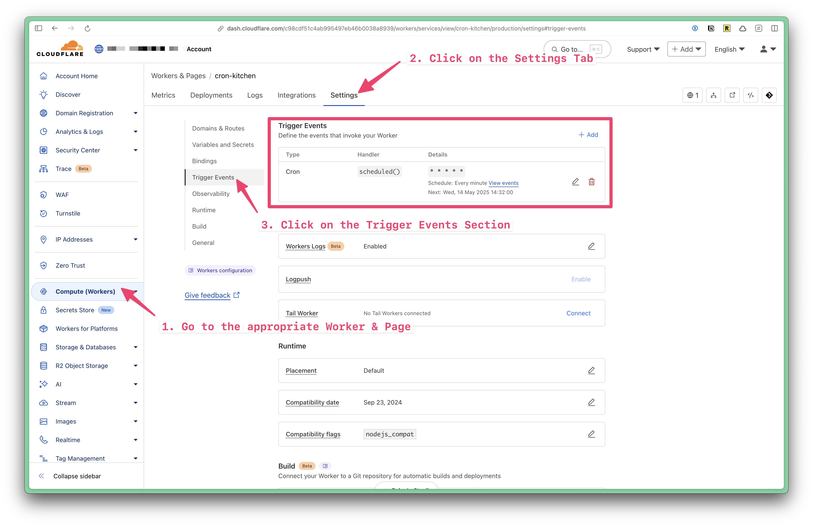
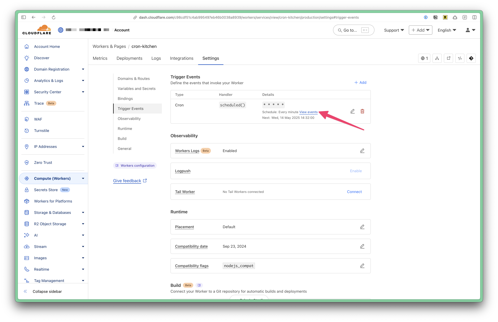
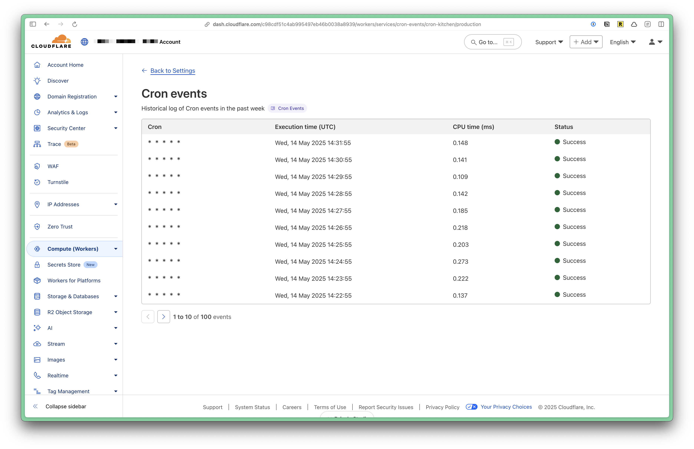

If you want to schedule a background task, [Cloudflare supports Cron Triggers](https://developers.cloudflare.com/workers/configuration/cron-triggers/).

## Setup

Within your `wrangler.jsonc` file, add a new section called `triggers`:

```jsonc title="wrangler.jsonc"
"triggers": {
  "crons": ["* * * * *"]
}
---
Where `crons` includes an array of cron schedules.
---
```

Within your `worker.tsx` file, adjust your `defineApp` function:

```tsx title="src/worker.tsx" showLineNumbers=false
const app = defineApp([
  ...
]);

export default {
  fetch: app.fetch,
  async scheduled(controller: ScheduledController) {
    switch (controller.cron) {
      // Runs every minute
      case "* * * * *":
        console.log("🧹 Clean up Unverified Users");
        break;
    }
    console.log("⏰ cron processed");
  },
} satisfies ExportedHandler<Env>;
```

Notice the `case` matches the cron schedule defined within the `wrangler.jsonc` file.

In the example above, `console.log("🧹 Clean up Unverified Users");` runs every minute. However, you could account for different schedules by adding more triggers to your `wrangler.jsonc` file and more cases to your `switch` statement:

```jsonc title="wrangler.jsonc"
"crons": ["* * * * *", "0 0 * * *"]
```

```tsx title="worker.tsx" showLineNumbers=false
// Runs every hour
case "0 0 * * *":
  console.log("🔄 Update something");
  break;
```

## Cloudflare Cron Triggers

Within the Cloudflare Dashboard UI, you can view all the cron triggers for your worker. Click on the **Settings** tab, and then click on the **Cron Triggers** section.



To view more details about the events, click on the **View Events** link.



You can see a list of all the events that have been triggered for your worker.



## Further Reading

- [Cloudflare Cron Triggers](https://developers.cloudflare.com/workers/configuration/cron-triggers/)

