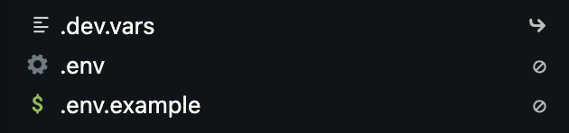
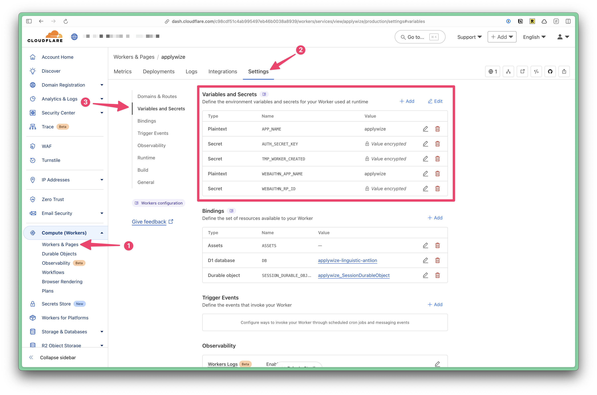

import { Aside } from "@astrojs/starlight/components";

When integrating with external services you typically store your credentials in environment variables. This is done to avoid hardcoding secrets into your codebase.

There are several environments that require different credentials, for example:

- On your local machine: Development
- Secrets on deployed Workers: Staging & Production

## Development

Create a `.env` file in the root of your project.

```ts title=".env"
SECRET_KEY = "value";
API_TOKEN = "ABCDEFGHIJKLMNOPQRSTUVWXYZ";
```

Cloudflare uses `.dev.vars`, however, `.env` is the typical approach. Therefore, when you run `pnpm dev`, RedwoodSDK will automatically create a symlink from `.env` to `.dev.vars`.



### Updating Types

After adding any environment variables, run:

```bash
npx wrangler types
```

This adds the environment variable and associated type to `worker-configuration.d.ts` and avoids unknown types when accessing `env`.

```ts title="worker-configuration.d.ts"
// Generated by Wrangler by running `wrangler types`
// Runtime types generated with ....
declare namespace Cloudflare {
  interface Env {
    SECRET_KEY: string;
    API_TOKEN: string;
  }
}
```

<Aside type="danger">

Simply running `pnpm dev` will not generate these runtime types.

</Aside>

## Production / Secrets on deployed Workers

To add a secret to a deployed worker, run:

```bash
npx wrangler secret put <KEY>
```

Then, the CLI will prompt you to enter the secret value.

These can also be added and managed via the Cloudflare dashboard.

<figure>
  
  <figcaption>
    <ol>
      <li>Expand the Computer (Workers) tab</li>
      <li>Click on Workers and Pages</li>
      <li>Click on the name of the worker</li>
      <li>Click on the "Settings" tab</li>
      <li>Click on the "Variables and Secrets" section</li>
    </ol>
  </figcaption>
</figure>

## Using an Environment Variable

At the top of your file, import `env`:

```tsx
import { env } from "cloudflare:workers";
```

Then, you can access the environment variables through the `env` object.

```ts
const rpID = env.WEBAUTHN_RP_ID ?? new URL(request.url).hostname;
```

## Further Reading

- [Cloudflare Environment Variables](https://developers.cloudflare.com/workers/configuration/secrets/)
