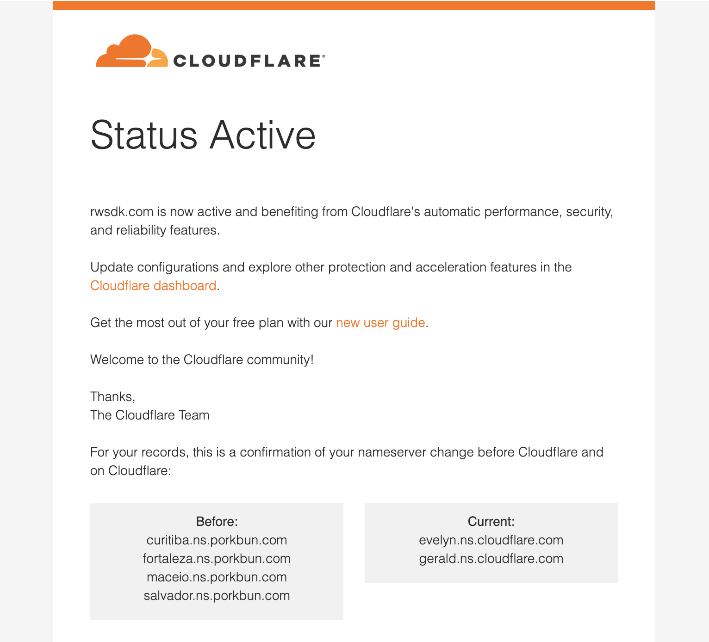

import { Aside, Tabs, TabItem } from "@astrojs/starlight/components";

import { PackageManagers } from "starlight-package-managers";

Cloudflare's Developer Platform provides out-of-the-box access to essential services:

- [Compute](https://developers.cloudflare.com/workers/) (Workers) for serverless functions
- [Database](https://developers.cloudflare.com/d1/) (D1) for data storage
- [Storage](https://developers.cloudflare.com/r2/) (R2) for files and assets
- [Queues](https://developers.cloudflare.com/queues/) for background job processing
- & [so much more!](https://developers.cloudflare.com/)

<Aside type="tip" title="Pick your poison">
  You do not need to use Cloudflare's Developer Platform, you can use any
  bare-metal hosting provider you want, but we recommend using Cloudflare's
  Developer Platform!
</Aside>

Not only does Cloudflare have the world's best network, but they also have the best developer experience. When you code locally you're coding against a real environment that is the same as the production environment. This has huge implications for your workflow and productivity, because often "it just works!"

## Deploy to production

Ship your webapp to Cloudflare with the following command:

<PackageManagers
  type="run"
  args="release"
/>

Within the Terminal, it will ask you: **Do you want to proceed with deployment? (y/N):** Type `y` and press Enter.

Go to your dashboard in Cloudflare, on the left side navigation click on **Workers & Pages**. You should see your application in the list. Then, you can click on the **Visit** link to see your application online.

## Using a Custom Domain Name

You can use a custom domain name with your application.

You can purchase a domain name through Cloudflare, or you can use an existing domain name you already own.

**If you already have a domain name that's active on your Cloudflare account, you can skip right to [Hooking Up your Domain Name to your Project](#hooking-up-your-domain-name-to-your-project). Otherwise, read on!**

### Adding a Domain Name to Cloudflare

To add a domain name to Cloudflare, you have two options:
1. **Purchase a new domain name** through Cloudflare.
2. **Add an existing domain name** to Cloudflare.

#### Purchase a new domain name

If you don't already have a domain name, it's super easy to just buy one through Cloudflare. This is the easiest option, and will let you host your site on your new domain name right away.

To buy a domain name through Cloudflare, go to [Cloudflare's Domain Registrar](https://domains.cloudflare.com/) and search for the domain name you want to buy. If it's available, you can purchase it right here, and it will be automatically added to your Cloudflare account.

#### Add an existing domain name

<Aside type="tip" title="Worried you'll break something?">
  Have a domain name you want to use, but already using it for, say, your email
  address? Don't worry! When you add your domain name to Cloudflare, they'll
  automatically bring in all your existing DNS records, so your email and other
  services will continue to work as expected.
</Aside>

If you already have a domain name, or simply prefer to use a different registrar, you can add your domain to Cloudflare as follows:

Head to your Cloudflare dashboard, and click on the **+ Add a domain** button:

Next, search for the domain name you want to add. You can keep the "Quick scan for DNS records" option checked. Click **Continue**.

Cloudflare will ask you to select a plan for this domain. You can select the **Free** plan, which is perfect for most use cases (and you can always upgrade later, if you need). Click **Select plan**.

Next, you'll be asked to review the DNS records that Cloudflare found for your domain. If you have any existing DNS records, they will be automatically imported here. You can add or remove any records as needed, and you can always come back to this later.

Click **Continue to activation**.

Now's the part where you tell your domain registar to use Cloudflare's nameservers. This is how Cloudflare will be able to manage your domain name.

To do this, you'll need to know how to change your nameservers — every registrary is different, so you'll need to look up the instructions for your specific registrar.

Here are some common registrars and their instructions:
- [Porkbun](https://kb.porkbun.com/article/22-how-to-change-your-nameservers)
- [Namecheap](https://www.namecheap.com/support/knowledgebase/article.aspx/767/10/how-to-change-dns-for-a-domain/)
- [GoDaddy](https://www.godaddy.com/help/edit-my-domain-nameservers-664)

Cloudflare also has a long list of links to instructions for many registrars [here](https://developers.cloudflare.com/dns/nameservers/update-nameservers/#your-domain-uses-a-different-registrar).

Once you've updated your nameservers, go back to Cloudflare and click **Continue**.

It'll now present you with a note that it can take some time to process nameserver changes. From here, you can just wait until Cloudflare emails you, but for the impatiant amongst us, Cloudflare offers a **Check nameservers now** button.

Clicking this will trigger a check to see if your nameservers have been updated.

Once Cloudflare has confirmed that your nameservers have been updated, you'll get an email, and your domain will be added to your Cloudflare account.

### Hooking Up your Domain Name to your Project

To use a domain name that's registered to your Cloudflare account, go to **Workers & Pages** in the left side navigation. Then, click on the name of your project. Click on the **Settings** tab. At the top, you'll see the domains associated with your project.

Click on the **+ Add** button at the top of the **Domains & Routes** table. A side panel will appear:

Click on the **Custom Domain** option. Then, it will ask you enter the domain name you want to use.

And that's it! Your domain name is now connected to your project. You can now visit your project at your custom domain name.

## Deleting Your Project

If for whatever reason, you need to delete your project through Cloudflare, go to **Workers & Pages** in the left side navigation. Then, click on the name of your project. Click on the **Settings** tab, then scroll to the bottom of the page. Click on the **Delete** button.

A confirmation modal will appear, asking you to type the name of your project, then click on the **Delete** button.

