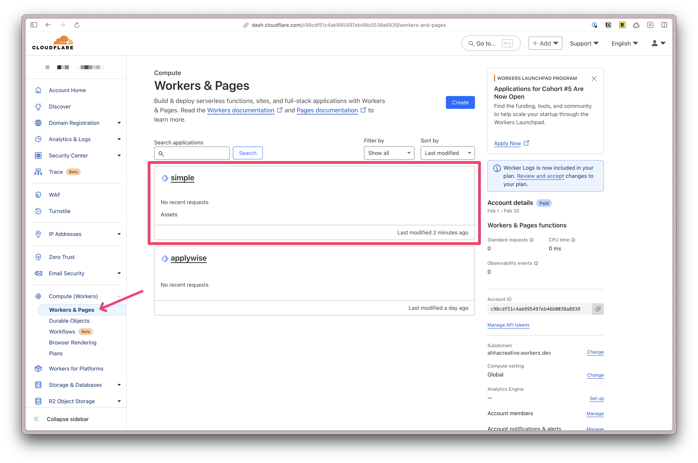

import { Aside } from "@astrojs/starlight/components";
import { Tabs, TabItem } from "@astrojs/starlight/components";

This guide is designed for developers who are already comfortable with JavaScript frameworks and are looking to quickly understand RedwoodSDK's organization and conventions.

If you're new to JavaScript frameworks or prefer a more detailed learning path, we recommend starting with our [First App Tutorial](/tutorials/first-app) or [Full-Stack Tutorial](/tutorials/full-stack) instead.

## Understanding Project Structure

{/* TODO: Make a video for this section */}

After you run the initial [installation command](/getting-started/installation), your project will have the following structure:

```text frame="none"
.
├── package.json
├── src
│   ├── app
│   │   ├── Document.tsx
│   │   ├── pages
│   │   │   └── Home.tsx
│   │   └── shared
│   │       └── links.ts
│   ├── client.tsx
│   └── worker.tsx
├── tsconfig.json
├── types
├── vite.config.mts
├── worker-configuration.d.ts
└── wrangler.jsonc
```

Let's walk through each file and directory to understand their purpose.

- `package.json` - Contains project configuration and dependencies.
- `src/app` - Contains the main application files.
- `src/app/Document.tsx` - The main document component that wraps your application. This includes the header, footer, and other shared components.
- `src/app/pages` - Contains your app's pages.
- `src/app/shared` - Contains shared utilities.
- `src/client.tsx` - The main client-side entry point.
- `src/worker.tsx` - The main worker-side entry point. Redwood SDK is tightly coupled to Cloudflare Workers. This file is used to configure the worker and the routes for your application.
- `tsconfig.json` - The TypeScript configuration file.
- `types` - Contains TypeScript type definitions.
- `vite.config.mts` - The Vite configuration file.
- `worker-configuration.d.ts` - The worker configuration file.
- `wrangler.jsonc` - The Cloudflare Workers configuration file.

## Making Your First Change

{/* TODO: Make a video for this section */}

### Editing Pages

The minimal starter ships with the least amount of code possible. This means, you don't need to delete any files or perform any cleanup to get started.

There's a single `Home` page component in the `src/app/pages` directory that says "Hello World".

### Router

The home page is served by the router definition inside the `src/worker.tsx` file.

```tsx
import { Document } from 'src/Document';
import { Home } from 'src/pages/Home';
import { env } from 'cloudflare:workers';

...

export default defineApp([
  ({ ctx }) => {
    // setup context here
    ctx;
  },
  render(Document, [
    index([
      Home,
    ]),
  ]),
])
```

Here we have a `document` function that takes the `Document` component (imported at the top of the file) and wraps our entire application. This include our basic HTML `head` and `body` tags.

```tsx
export const Document: React.FC<{ children: React.ReactNode }> = ({
  children,
}) => (
  <html lang="en">
    <head>
      <meta charSet="utf-8" />
      <meta name="viewport" content="width=device-width, initial-scale=1" />
      <title>@redwoodjs/starter-minimal</title>
      <script type="module" src="/src/client.tsx"></script>
    </head>
    <body>
      <div id="root">{children}</div>
    </body>
  </html>
);
```

Then, we're using the `index` function to serve the `Home` page component (imported at the top of the file).

You can add additional routes by:

- Creating new page components in the `src/app/pages` directory
- Importing them inside the `src/worker.tsx` file
- Add them to the document array, using the `route` function:

```tsx
import { About } from "src/pages/About";
import { env } from "cloudflare:workers";

export default defineApp([
  ({ ctx }) => {
    // setup context here
    ctx;
  },
  render(Document, [index([Home]), route("/about", About)]),
]);
```

When using the `route` function, the first parameter is the URL path and the second parameter is the response. In this case, we're importing the `About` component and displaying it.

You can find additional information about dynamic routes in our [Routing Guide](/guides/routing/).

### Editing components

There is quite a bit of flexibility in how you organize your pages, documents, and components. For example, you can co-locate page specific files together in the `src/app/pages` directory, or keep all of your components in a `src/app/components` directory (You'll need to create this folder).

By default, all the pages and components in your project are React Server components. If you want to add reactivity, you'll need to use the `"use client"` directive at the top of the file.

```tsx
"use client";

export const HelloWorld = () => {
  return <div>Hello World</div>;
};
```

## Local development

To see your changes, you can run the development server:

<Tabs>
  <TabItem label="pnpm">```bash frame="none" pnpm dev ```</TabItem>
  <TabItem label="npm">```bash frame="none" npm run dev ```</TabItem>
  <TabItem label="yarn">```bash frame="none" yarn dev ```</TabItem>
</Tabs>

To quit the development server, press `Ctrl+C` _twice_.

## Deploying Your Project

{/* TODO: Make a video for this section */}

### Cloudflare setup

{/* TODO: Double check this workflow and make sure it's not more complicated 🤪 */}

The RedwoodSDK is tightly coupled to Cloudflare's services. This means that you'll need to have a [Cloudflare account](https://www.cloudflare.com/plans/) to deploy your project.

Before deploying, check your `wrangler.jsonc` file. At the top of the file is a `name` property. If you haven't changed it, it will be `__change_me__`.

```jsonc title="wrangler.jsonc"
{ "name" = "__change_me__' }
```

Change the `name` property to match your project name. When you get ready to deploy, Cloudflare will use this name to create a `workers.dev` subdomain for your project.

Then, from your Terminal, run:

<Tabs>
  <TabItem label="pnpm">```bash frame="none" pnpm release ```</TabItem>
  <TabItem label="npm">```bash frame="none" npm run release ```</TabItem>
  <TabItem label="yarn">```bash frame="none" yarn release ```</TabItem>
</Tabs>

If this is your first time deploying, you'll be prompted to register a `workers.dev` subdomain.

```bash frame="none"
▲ [WARNING] You need to register a workers.dev subdomain before publishing to workers.dev
? Would you like to register a workers.dev subdomain now? > (Y/n)
? What would you like your workers.dev subdomain to be? It will be accessible at https://<subdomain>.workers.dev >
? Creating a works.dev subdomain for your account at https://<subdomain>.workers.dev. Ok to proceed? > (Y/n)
```

If everything goes through successfully, you should see the following message. Where, `PROJECT_NAME` is the name of your project and `SUBDOMAIN` is the subdomain you chose.

```bash frame="none"
Success! It may take a few minutes for DNS records to update.
Visit https://dash.cloudflare.com/YOUR_ACCOUNT_ID/workers/subdomain to edit your workers.dev subdomain
Deployed PROJECT_NAME triggers (53.51 sec)
  https://PROJECT_NAME.SUBDOMAIN.workers.dev
Current Version ID: VERSION_ID
```

You can now visit your project at `https://PROJECT_NAME.SUBDOMAIN.workers.dev`.

If you need to manage your deployed pages, you can login to your Cloudflare dashboard, expand the _Computer Workers_ section, and select click on **Workers and Pages.**



You can find additional information deploying in our [Deployment Guide](/guides/deployment/cloudflare)

## Further Resources

- [Building Your First Application](/tutorial/first)
- [Building a Full-Stack Application](/tutorial/full-stack)
- [Data fetching guide](/guides/db-data/crud)
