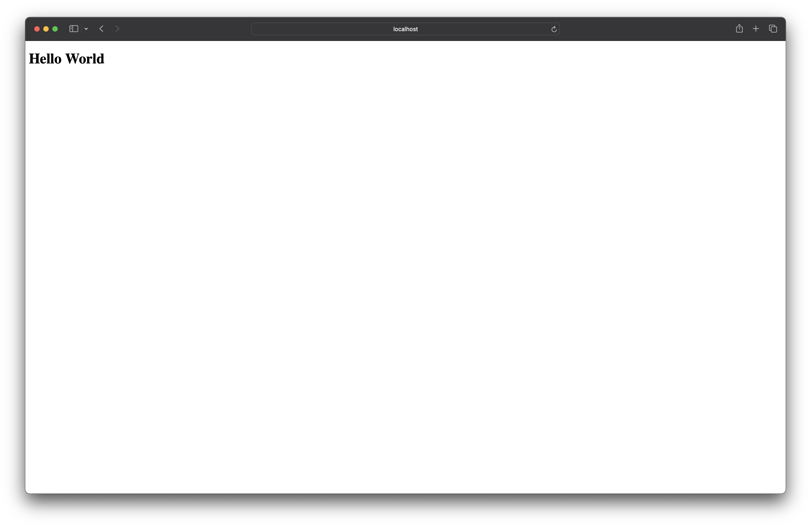

import {
  Aside,
  Tabs,
  TabItem,
  LinkCard,
  Code,
} from "@astrojs/starlight/components";

In this quick start you'll go from zero to request/response in seconds and deploy to production in minutes!

<Aside type="note" title="System requirements">
  - [Node.js](https://nodejs.org/en/download)
</Aside>

Create a new project by running the following command, replacing `<project-name>` with your project name:

```bash showLineNumbers=false
npx degit redwoodjs/sdk/starters/standard <project-name>
```

## Start developing

### Install the dependencies

<Tabs syncKey="package-manager">
  <TabItem label="pnpm">
    ```bash frame="none" showLineNumbers=false
    cd <project-name>
    pnpm install
    ```
  </TabItem>
  <TabItem label="npm">
    ```bash frame="none" showLineNumbers=false  
    cd <project-name>
    npm install
    ```
  </TabItem>
  <TabItem label="yarn">
    ```bash frame="none" showLineNumbers=false
    cd <project-name>
    yarn install
    ```
  </TabItem>
</Tabs>

### Run the development server

RedwoodSDK is just a plugin for Vite, so you can use the same commands to run the development server as you would with any other Vite project.

<Tabs syncKey="package-manager">
  <TabItem label="pnpm">
    ```bash frame="none" showLineNumbers=false

    pnpm dev
    ```

  </TabItem>
  <TabItem label="npm">
    ```bash frame="none" showLineNumbers=false

    npm run dev
    ```

  </TabItem>
  <TabItem label="yarn">
    ```bash frame="none" showLineNumbers=false
    
    yarn dev
    ```
  </TabItem>
</Tabs>

```bash frame="none" showLineNumbers=false
VITE v6.2.0  ready in 500 ms

➜  Local:   http://localhost:5173/
➜  Network: use --host to expose
➜  press h + enter to show help
```

Access the development server in your browser, by default it's available at [http://localhost:5173](http://localhost:5173),
where you should see "Hello World" displayed on the page.



How exciting, your first request/response in RedwoodSDK!

### Your first route

The entry point of your webapp is `src/worker.tsx`, open that file in your favorite editor.

Here you'll see the `defineApp` function, this is the main function that "defines your webapp," where the purpose is to handle requests by returning responses to the client.

```tsx title="src/worker.tsx" showLineNumbers=false "defineApp"
import { defineApp } from "@redwoodjs/sdk/worker";
import { route, render } from "@redwoodjs/sdk/router";

import { Document } from "@/app/Document";
import { Home } from "@/app/pages/Home";

export default defineApp([
  render(Document, [route("/", () => new Response("Hello, World!"))]),
]);
```

You're going to add your own route, insert the `"/ping"` route handler:

```tsx title="src/worker.tsx" ins={7-9} showLineNumbers=false
import { defineApp } from "@redwoodjs/sdk/worker";
import { route } from "@redwoodjs/sdk/router";

export default defineApp([
  render(Document, [
    route("/", () => new Response("Hello, World!")),
    route("/ping", function () {
      return <h1>Pong!</h1>;
    }),
  ]),
]);
```

Now when you navigate to [http://localhost:5173/ping](http://localhost:5173/ping) you should see "Pong!" displayed on the page.

<Aside type="tip">
  You might have noticed that we returned JSX instead of a `Response` object.
  This is because RedwoodSDK has built-in support for React Server Components,
  allowing you to return JSX directly from your routes. The JSX will be rendered
  on the server and sent to the client as HTML.
</Aside>

## Deploy to production

RedwoodSDK is built for the Cloudflare Development Platform. You can deploy your webapp to Cloudflare with a single command:

<Tabs syncKey="package-manager">
  <TabItem label="pnpm">
    ```bash frame="none" showLineNumbers=false
    
    pnpm release
    ```
  </TabItem>
  <TabItem label="npm">
    ```bash frame="none" showLineNumbers=false

    npm run release
    ```

  </TabItem>
  <TabItem label="yarn">
    ```bash frame="none" showLineNumbers=false
    
    yarn release
    ```
  </TabItem>
</Tabs>

<LinkCard
  title="What's next?"
  description="Learn everything you need to know to build webapps with Redwood!"
  href="/core/overview"
/>
