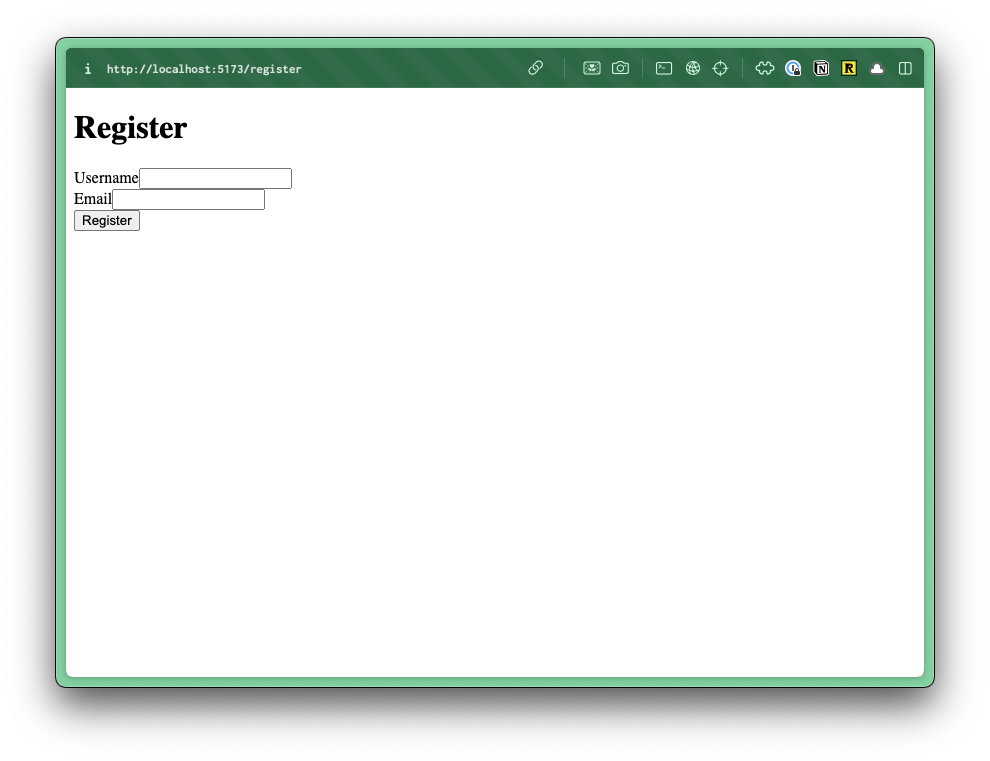
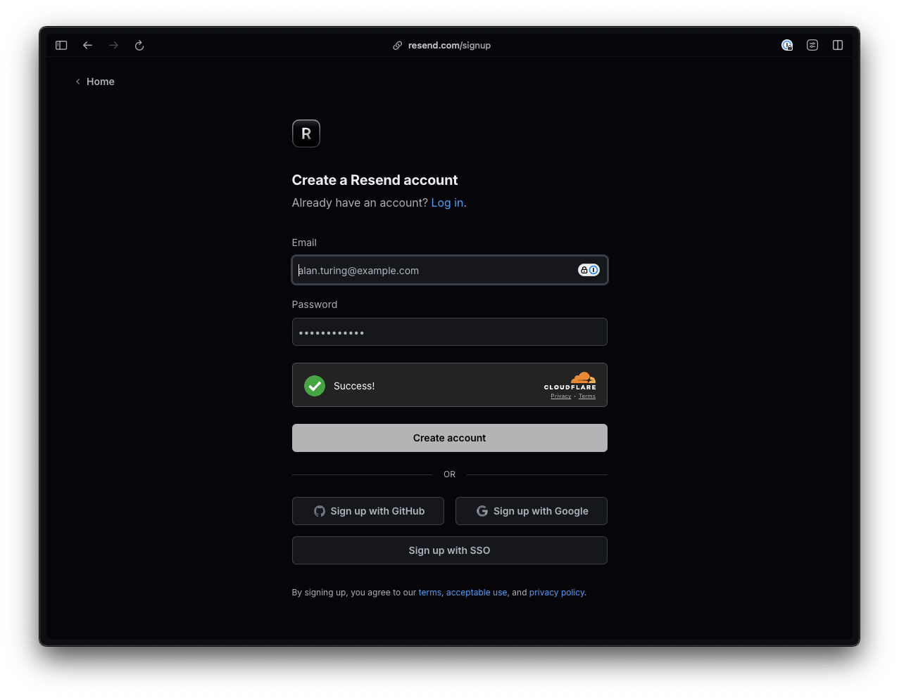
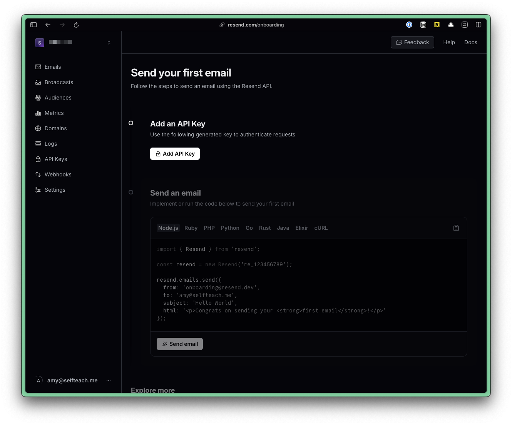
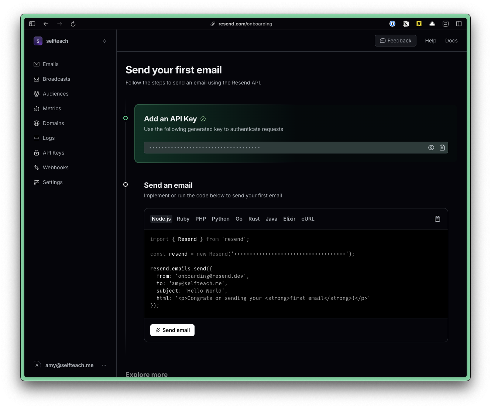

import { Aside, FileTree, Steps } from "@astrojs/starlight/components";

Let's start by setting up the registration page. In the `worker.tsx` file, let's add a new route for the registration page.

```tsx title="src/worker.tsx" showLineNumbers={false}
import { RegisterPage } from "./app/pages/auth/RegisterPage";
...
render(Document, [
  ...
  route("/register", RegisterPage),
]);
```

Now, let's create our page.Inside the `pages` directory, create a new folder called `auth` and inside create a new file called `RegisterPage.tsx`.

<FileTree>
- src/
  - app/
    - pages/
      - auth/
        - RegisterPage.tsx
</FileTree>

Inside the `RegisterPage.tsx` file, add the following code:

```tsx title="src/app/pages/auth/RegisterPage.tsx"
const RegisterPage = () => {
  return (
    <form>
      <h1>Register</h1>
      <div>
        <label htmlFor="username">Username</label>
        <input type="text" name="username" placeholder="Username" />
      </div>
      <div>
        <label htmlFor="email">Email</label>
        <input type="email" name="email" placeholder="Email" />
      </div>
      <button type="submit">Login</button>
    </form>
  )
}
```



No styles. We'll keep this as simple as possible. We have a standard HTML form with 3 inputs and a submit button.

## Registration Flow

Here are the steps for our registration flow:

1. User submits a registration form with a email and username (and any other required information)
2. Server validates the submission
3. Server checks if the username or email address already exist in the database
4. If validation passes, server:
  - generates a token for the magic link
  - stores the user information and token in the database
5. Send an email to the user with the magic link
6. Return a success (or error) response to the client

## Connecting the Form
Within RedwoodSDK, all components are server components by default. Then, you need to specify a client component by adding a `"use client"` directive at the top of the file.

Normally, I like to leave page components as server components, but for this example, we'll make the `RegisterPage` a client component so that we can keep track of the form state.

```tsx title="src/app/pages/auth/RegisterPage.tsx"
"use client"
```

On our `form` tag, let's add an `action` attribute and pass it the `handleSubmit` function.

```tsx title="src/app/pages/auth/RegisterPage.tsx" startLineNumber={18} "action={handleSubmit}"
<form action={handleSubmit}>
```

<Aside type="note" title="Form Actions">
More information on form actions on the [Official React 19 Documentation.](https://react.dev/blog/2024/12/05/react-19#form-actions)
</Aside>

Now, we just need to write the `handleSubmit` function. Above our `return` statement:

```tsx title="src/app/pages/auth/RegisterPage.tsx"  startLineNumber={9}
const handleSubmit = async (formData: FormData) => {
  const result = await handleRegister(formData);
  if (result.error) {
    // display the error
  } else {
    // display a success message
  }
}
---
- The `handleSubmit` function is getting all of our `formData` that we submitted by default. There's nothing that we need to do to pass it in.
- `formData` is a type of `FormData` -- this is part of the standard [Web API](https://developer.mozilla.org/en-US/docs/Web/API/FormData).
- Then, we can send the data off to a server function called `handleRegister`. (we still need to write this)
- We'll `await` for the result from the server, so we need to make this an `async` function.
- We can save the `result` from the server inside a variable called `result`.
- If there's an error, we can display it to the user.
- If everything is successful, we can display a success message to the user.
---
```

Before we setup the `handleRegister` function, let's set up our message state.

At the top of our component, let's `useState` to keep track of our message state.

```tsx title="src/app/pages/auth/RegisterPage.tsx" startLineNumber={7}
const [message, setMessage] = useState<string | null>(null);
```

Of course, we'll also need to import `useState` at the top of our file (below `"use client"`).

```tsx title="src/app/pages/auth/RegisterPage.tsx" startLineNumber={3}
import { useState } from "react";
```

Now, we can update our conditional to update the message state:

```tsx title="src/app/pages/auth/RegisterPage.tsx"  startLineNumber={11}
const handleSubmit = async (formData: FormData) => {
  const result = await handleRegister(formData);
  if (result.error) {
    setMessage(result.error);
  } else {
    setMessage("Success! Please check your email for a magic link.");
  }
}
```

Then, let's display the error state to the user. Right above our `h1` tag, let's add a `p` that displays the error state.

```tsx title="src/app/pages/auth/RegisterPage.tsx"  startLineNumber={19}
{message && <p>{message}</p>}
```

Before we write the `handleRegister` function, let's go ahead and set up [Resend](https://resend.com/) for our email service. Then, we'll be able to use it within our server action.

## Setting Up Resend

<Steps>

1. Go to [Resend](https://resend.com/) and click on **Get Started** to create an account.

    

    

2. Once you’ve created an account, you’ll be redirected to a page with instructions for sending your first email.

    

    Create an API key by clicking on the “Add API Key” button.

    

    Copy the API and go to your .env file. Add a variable called RESEND_API and paste your key:

    ``` title=".env"
    RESEND_API=re_1234567890
    ```

    <Aside type="note" title="Environmental Variables">
    If you don't have an `.env` file, you can duplicate the `.env.example` file and rename it to `.env`.
    </Aside>

    Cloudflare uses a `.dev.vars` file for environment variables. But, the common practice is to use a `.env` file. So, we've created a symlink for you. Anytime you make a change to the `.env` file, it will automatically update the `.dev.vars` file.

    If you're missing the `.dev.vars` file, as soon as you run `pnpm dev`, it will be created for you.

    <Aside type="note" title="Environmental Variables">
      You can find more information about [Environmental Variables here.](http://localhost:4321/core/env-vars)
    </Aside>

4. Install the Resend package. Within the Terminal, run:

    ```bash
    pnpm add resend
    ```

</Steps>

Your setup is complete! 🥳 Now, we can send email.

Now, let's write our `handleRegister` function. Within the `auth` directory, let's add a new file called `actions.ts`.

## Writing the Server Action
```tsx title="src/app/auth/actions.ts" {"1. As a server action, we need to include the use server directive": 1} {"2. Passing in the form data": 8} {"3. Get the content from the form data": 10} {"4. Validate the form": 14} {"5. Check if the email address exists": 19} {"6. Check to see if the username is already taken": 28} {"7. Generate a verification token": 37} {"8. Create a new user": 41} {"9. Send a verification email": 51}
.
"use server"

import { db } from "@/db";
import { Resend } from "resend";
import { env } from "cloudflare:workers";


export async function HandleRegister(formData: FormData) {

  const email = formData.get("email") as string;
  const username = formData.get("username") as string;


  if (!email || !username) {
    return { error: "All fields are required" };
  }


  const emailUser = await db.user.findUnique({
    where: { email },
  });

  if (emailUser) {
    return { error: "Email already exists" };
  }


  const usernameUser = await db.user.findUnique({
    where: { username },
  });

  if (usernameUser) {
    return { error: "Username already exists" };
  }


  const magicLink = crypto.randomUUID().replace(/-/g, "");
  const magicLinkExpiresAt = new Date(Date.now() + 1000 * 60 * 60 * 24); // 1 day


  const newUser = await db.user.create({
    data: {
      email,
      username,
      magicLink,
      magicLinkExpiresAt,
    },
  });


  const resend = new Resend(env.RESEND_API);
  const { data, error } = await resend.emails.send({
    from: "Acme <onboarding@resend.dev>",
    to: email,
    subject: "🪄 Verify your email",
    text: `Verify your email by clicking here: http://localhost:5173/verify?token=${magicLink}`,
  });

  return { success: true };
}
```

When sending email through Resend, you can send `react`, `html`, or `text` emails. here, we're dynamically creating a link that includes the `magicLink` token:

```tsx title="src/app/auth/actions.ts" {6} startLineNumber={52}
const resend = new Resend(env.RESEND_API);
const { data, error } = await resend.emails.send({
  from: "Acme <onboarding@resend.dev>",
  to: email,
  subject: "🪄 Verify your email",
  text: `Verify your email by clicking here: http://localhost:5173/verify?token=${magicLink}`,
});
```

<Aside type="note" title="Sending an Email">
  Until your domain is verified with Resend, there are a couple of limitations:
  - You can only send email to your email address.
  - You can only send email from the `onboarding@resend.dev` email address.
  Additional information can be found [on Resend's official documentation](https://resend.com/docs/dashboard/domains/introduction).
</Aside>

### Using Constants

One thing that I like to do in my applications is store reusable constants in a `constants.ts` file. Then, I can import those constants anywhere in my application. This makes it easier to manage and maintain consistency.

In my `src/app/shared` directory, create a new file called `Constants.ts`.

```tsx title="src/app/shared/Constants.ts"
export const Constants = Object.freeze({
  FROM_EMAIL: "Acme <onboarding@resend.dev>",
  BASE_URL: "http://localhost:5173",
});
```

`Object.freeze` is a built-in JavaScript function used to prevent the constants from being modified.

Now, we can import the constants into our `actions.ts` file and update our Resend `send` function:

```tsx title="src/app/auth/actions.ts" showLineNumbers={false}
import { Constants } from "@/app/shared/Constants";
...
const { data, error } = await resend.emails.send({
  from: Constants.FROM_EMAIL,
  to: email,
  subject: "🪄 Verify your email",
  text: `Verify your email by clicking here: ${Constants.BASE_URL}/verify?token=${magicLink}`,
});
```

Test this functionality within the browser.

One of the things I like about using Resend is you can preview all the emails that have been sent.


