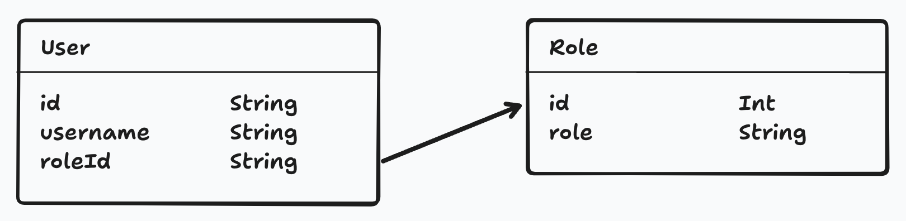
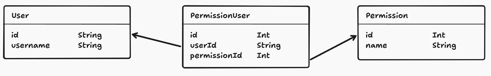

import { Aside } from "@astrojs/starlight/components";

When it comes to securing your application, authentication and authorization are both critical. **Authentication** is the process of verifying a user's identity, typically through credentials like passwords, biometrics, or multi-factor authentication. **Authorization**, in contrast, determines the specific access rights and permissions an authenticated user has within a system. Think of authentication as proving who you are, while authorization defines what you're allowed to do after your identity is confirmed.

**Role-based access control (RBAC) is an authorization method that assigns permissions based on predefined user roles.**

For example, you might have a `user` role and an `admin` role. The `admin` role might have access to certain parts of your application that the `user` role does not.

Or, another example, in a tag-based access control system, you assign tags to users, and then use those tags to determine what they can and cannot do.

From a technical standpoint, both systems are similar. The main difference is the database setup. A role based system, requires a single table with a `role` column, and a `user_id` column.



A tag based system, requires a many-to-many relationship between users and tags.



For the purposes of this guide, we'll focus on a role-based access control system.

## Setup

When you start a new project, using the standard starter, you have a `User` model and a `Credential` model:

```prisma title="prisma/schema.prisma" showLineNumbers=false
model User {
  id          String      @id @default(uuid()) // User ID (UUID-based)
  username    String      @unique
  createdAt   DateTime    @default(now())

  credentials Credential[] // Relationship: One user can have many credentials
}

model Credential {
  id            String   @id @default(uuid()) // Internal DB ID
  userId        String   @unique // Every credential is linked to a specific user
  user          User     @relation(fields: [userId], references: [id])
  createdAt     DateTime @default(now())
  credentialId  String   @unique // WebAuthn credential identifier
  publicKey     Bytes
  counter       Int      @default(0)

  @@index([credentialId])
  @@index([userId])
}
```

Let's add a new `Role` model:

```prisma title="prisma/schema.prisma" showLineNumbers=false
model Role {
  id Int @id @default(autoincrement())
  name String @unique
}
```

Now, we need to link the `User` model to the `Role` model.

```prisma title="prisma/schema.prisma" showLineNumbers=false {"The Implicit Relationship": 4} {"The Foreign Key": 12} {"The Relation Field": 14}
model Role {
  id Int @id @default(autoincrement())
  name String @unique

  users User[]
}

model User {
  id          String      @id @default(uuid()) // User ID (UUID-based)
  username    String      @unique
  createdAt   DateTime    @default(now())

  roleId      Int

  role        Role        @relation(fields: [roleId], references: [id])

  credentials Credential[] // Relationship: One user can have many credentials
}
```

Now, create the migration:

```bash
pnpm migrate:new "Add roles to users"
```

This will create a new migration file in the `api/src/migrations` directory and apply it.

<Aside type="caution" title="If your migration fails">
;tk
</Aside>

## Seeding the Database
;tk

## Creating a Constants File
;tk

## Registering a user
Let's update the `finishPasskeyRegistration` function in the `src/app/pages/user/function.ts` file. On line 91, we're creating a new user:

```tsx title="src/app/pages/user/function.ts" startLineNumber={91} ins={4}
const user = await db.user.create({
  data: {
    username,
    roleId: Constants.ROLES.USER,
  },
});
```

<Aside type="note" title="Using a different authentication strategy?">
If you're using a different authentication strategy, you might not have a `finishPasskeyRegistration` function. -- In which case, you're looking for the section of code where you're creating a new user.
</Aside>

## Middleware