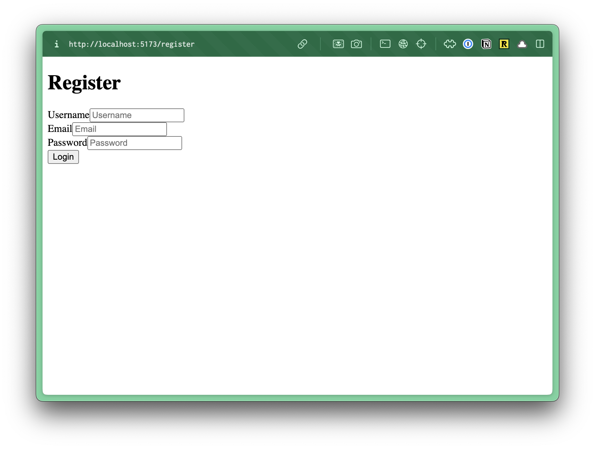

import { Aside, FileTree } from "@astrojs/starlight/components";

Let's start by setting up the registration page. In the `worker.tsx` file, let's add a new route for the registration page.

```tsx title="src/worker.tsx" showLineNumbers={false}
import { RegisterPage } from "./app/pages/auth/RegisterPage";
...
render(Document, [
  ...
  route("/register", RegisterPage),
]);
```

Now, let's create our page.Inside the `pages` directory, create a new folder called `auth` and inside create a new file called `RegisterPage.tsx`.

<FileTree>
- src/
  - app/
    - pages/
      - auth/
        - RegisterPage.tsx
</FileTree>

Inside the `RegisterPage.tsx` file, add the following code:

```tsx title="src/app/pages/auth/RegisterPage.tsx"
const RegisterPage = () => {
  return (
    <form>
      <h1>Register</h1>
      <div>
        <label htmlFor="username">Username</label>
        <input type="text" name="username" placeholder="Username" />
      </div>
      <div>
        <label htmlFor="email">Email</label>
        <input type="email" name="email" placeholder="Email" />
      </div>
      <div>
        <label htmlFor="password">Password</label>
        <input type="password" name="password" placeholder="Password" />
      </div>
      <button type="submit">Login</button>
    </form>
  )
}
```



No styles. We'll keep this as simple as possible. We have a standard HTML form with 3 inputs and a submit button.

## Registration Flow

Here are the steps for our registration flow:

1. User submits a registration form with a email, username, and password (and any other required information)
2. Server validates the submission
3. Server checks if the username or email address already exist in the database
4. If validation passes, server:
  - generates a salt for the password
  - hashes the password with the salt
  - stores the user information and hashed password in the database
5. Optional: send a verification email ([we'll come back to this](/guides/auth/username-password/email))
6. Return a success (or error) response to the client

## Connecting the Form

Within RedwoodSDK, all components are server components by default. Then, you need to specify a client component by adding a `"use client"` directive at the top of the file.

Normally, I like to leave page components as server components, but for this example, we'll make the `RegisterPage` a client component so that we can keep track of the form state.

```tsx title="src/app/pages/auth/RegisterPage.tsx"
"use client"
```

On our `form` tag, let's add an `action` attribute and pass it the `handleSubmit` function.

```tsx title="src/app/pages/auth/RegisterPage.tsx" startLineNumber={18} "action={handleSubmit}"
<form action={handleSubmit}>
```

<Aside type="note" title="Form Actions">
More information on form actions on the [Official React 19 Documentation.](https://react.dev/blog/2024/12/05/react-19#form-actions)
</Aside>

Now, we just need to write the `handleSubmit` function. Above our `return` statement:

```tsx title="src/app/pages/auth/RegisterPage.tsx"  startLineNumber={9}
const handleSubmit = async (formData: FormData) => {
  const result = await handleRegister(formData);
  if (result.error) {
    // display the error
  } else {
    window.location.href = "/login";
  }
}
---
- The `handleSubmit` function is getting all of our `formData` that we submitted by default. There's nothing that we need to do to pass it in.
- `formData` is a type of `FormData` -- this is part of the standard [Web API](https://developer.mozilla.org/en-US/docs/Web/API/FormData).
- Then, we can send the data off to a server function called `handleRegister`. (we still need to write this)
- We'll `await` for the result from the server, so we need to make this an `async` function.
- We can save the `result` from the server inside a variable called `result`.
- If there's an error, we can display it to the user.
- If everything is successful, we can redirect the user to the login page with `window.location.href`.
---
```

Before we setup the `handleRegister` function, let's do something with our error state.

At the top of our component, let's `useState` to keep track of our error state.

```tsx title="src/app/pages/auth/RegisterPage.tsx"  startLineNumber={7}
const [error, setError] = useState<string | null>(null);
```

Of course, we'll also need to import `useState` at the top of the file (below `"use client"`).

```tsx title="src/app/pages/auth/RegisterPage.tsx"  startLineNumber={3}
import { useState } from "react";
```

Now, we can update our conditional to update the error state, if there is one.

```tsx title="src/app/pages/auth/RegisterPage.tsx"  startLineNumber={11}
if (result.error) {
  setError(result.error);
}
```

Then, let's display the error state to the user. Right above our `h1` tag, let's add a `p` that displays the error state.

```tsx title="src/app/pages/auth/RegisterPage.tsx"  startLineNumber={19}
{ error && <p style={{ color: "red" }}>{error}</p> }
---
- We're displaying our error conditionally.
- I also added some basic styling to make the error message red.
---
```

Now, let's write our `handleRegister` function. Within the `auth` directory, let's add a new file called `actions.ts`.

## Writing the Server Action
At the very top of the file add the `"use server"` directive, then:

```tsx title="src/app/auth/actions.ts" {"1. Get all the data from the form": 4} {"2: Ensure the user completed the form": 9} {"3. Check to see if the username or email is already taken": 17} {"4. If you found the username or email, return an error": 27} {"5. Generate a salt for the password": 37} {"6. Hash the password with the salt": 39} {"7. Create a new user": 42} {"8. Return a success message": 51}
"use server"

export const handleRegister = async (formData: FormData) => {

  const username = formData.get("username");
  const email = formData.get("email");
  const password = formData.get("password");


  if (!username || !email || !password) {
    console.log("All fields are required");
    return {
      error: "All fields are required"
    };
  }


  const foundUser = await db.user.findFirst({
    where: {
      OR: [
        { username: username as string },
        { email: email as string }
      ]
    }
  });


  if (foundUser) {
    console.log("Username or email already taken");
    return {
      error: foundUser.username === username
        ? "Username already taken"
        : "Email already taken"
    };
  }


  const salt = await bcrypt.genSalt(16);

  const hashedPassword = await bcrypt.hash(password as string, salt);


  const user = await db.user.create({
    data: {
      username: username as string,
      email: email as string,
      password: hashedPassword
    }
  });


  return {
    success: "User created successfully"
  };
};
```

<Aside type="note" title="What is password salting?">
A salt is a random, unique string of characters that is added to the original password before it is hashed. This makes it significantly more difficult for attackers to crack passwords and ensures that even identical passwords will have different hash values.

#### For example:
1.	Original password: `⁠mypassword`
2.	Generated salt: `⁠x7f1d3k9`
3.	Salted password: `⁠mypasswordx7f1d3k9`
4.	Hashed salted password: `⁠[unique hash value]`

#### Key Characteristics:
- **Unique** - Each user gets a unique salt
- **Storage** - The salt is typically stored alongside the hashed password
- **Length** - The salt is typically a random string of 16-32 characters

You may have noticed that we're not storing the salt in the database, because we're using the `bcrypt` library to hash the password. The salt is already stored as part of the hashed password. When you hash a password with bcrypt, it automatically prepends the salt to the hashed result in a specific format. The `bcrypt.compare()` function knows how to extract and use this salt from the stored hash.
</Aside>

<Aside type="note" title="Hashing the Password">
A hashed password is a fixed-length string of characters that is generated from the original password. This makes it impossible to reverse the hash back to the original password.

#### Key Characteristics:
- **Fixed Length** - The hash is always the same length, regardless of the original password
- **One-Way** - It's impossible to reverse the hash back to the original password
- **Unique** - Slight changes in the original password will produce a completely different hash
- **Deterministic** - The same password will always produce the same hash
</Aside>

Now, if you try to run the app (`pnpm dev`) and go to `localhost:5173/register`, you should be able to create a new user.

You can also try registering a second time with the same username or email, and you should see an error message.
