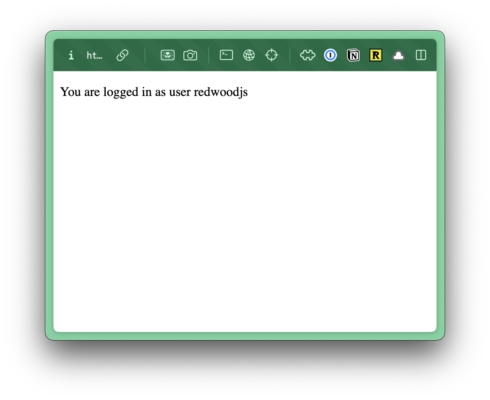

import { Aside, FileTree } from "@astrojs/starlight/components";

Now, that we've registered a user, we still need to be able to login. Let's create a new route on our worker:

```tsx title="src/worker.tsx" showLineNumbers={false}
import { LoginPage } from "./app/pages/auth/LoginPage";
...
render(Document, [
  ...
  route("/login", LoginPage),
]);
```

Now, let's create a new page. Inside the `pages/auth` directory, create a new file called `LoginPage.tsx`.

<FileTree>
- src/
  - app/
    - pages/
      - auth/
        - LoginPage.tsx
</FileTree>

Inside the file, let's add a simple login form.

```tsx title="src/app/pages/auth/LoginPage.tsx"
"use client";

import { useState } from "react";
import { handleLogin } from "./actions";

const LoginPage = () => {
  const [error, setError] = useState<string | null>(null);

  const handleSubmit = async (formData: FormData) => {
    const result = await handleLogin(formData);
    if (result.error) {
      setError(result.error);
    } else {
      window.location.href = "/protected";
    }
  };

  return (
    <form action={handleSubmit}>
      <h1>Login</h1>
      <div>
        <label htmlFor="username">Username</label>
        <input type="text" name="username" placeholder="Username" />
      </div>
      <div>
        <label htmlFor="password">Password</label>
        <input type="password" name="password" placeholder="Password" />
      </div>
      <button type="submit">Login</button>
    </form>
  );
};

export { LoginPage };
```


Again, nice and simple. No styles.

I put a `action="handleSubmit"` on the form tag. Similar to the register page, we're calling the `handleSubmit` function to handle the form submission. It receives the `formData` and sends it to a server action called `handleLogin`. (We haven't written this yet.)

We made this a client component and are tracking the error state with `useState`. If there's a problem logging in, the error messages is displayed to the user via the `error` state. Otherwise, they're redirected to the home page `/protected` page

## Writing the Server Action

Now, let's write the `handleLogin` function. We can add this to our `actions.ts` file:

```tsx title="src/app/pages/auth/actions.ts" {"1. Get the request and headers - we need this for Durable Objects": 2} {"2. Get the username and password from the form data": 4} {"3. Validate the form": 8} {"4. Find the user in the database": 16} {"5. If you can't find the user, return an error": 23} {"6. Check to see if the password is correct": 31} {"7. Create a session for the user using a Durable Object": 40} {"8. Return a success message": 45}
export const handleLogin = async (formData: FormData) => {

  const { request, headers } = requestInfo;

  const username = formData.get("username");
  const password = formData.get("password");


  if (!username || !password) {
    console.log("All fields are required");
    return {
      error: "All fields are required"
    };
  }


  const user = await db.user.findFirst({
    where: {
      username: username as string
    },
  });


  if (!user) {
    console.log("User does not exist");
    return {
      error: "Invalid username or password"
    };
  }


  const isPasswordValid = await bcrypt.compare(password as string, user.password);
  if (!isPasswordValid) {
    console.log("Invalid password");
    return {
      error: "Invalid username or password"
    };
  }


  await sessions.save(headers, {
    userId: user.id
  });


  return {
    success: "User logged in successfully"
  };
};
```

## Durable Objects

<Aside title="What is a Durable Object?" type="tip">
From the Cloudflare Docs:

> A Durable Object is a special kind of Cloudflare Worker which uniquely combines compute with storage. Like a Worker, a Durable Object is automatically provisioned geographically close to where it is first requested, starts up quickly when needed, and shuts down when idle.

Think of it like a digital storage locker that:

- Exists in multiple locations around the world
- Always stays consistent (so everyone sees the same information)
- Can run code and store data
- Automatically handles scaling and performance

Practical examples where you might use a Durable Object:

- Real-time collaborative apps (like a shared whiteboard)
- Chat applications
- Multiplayer game state tracking
- Live tracking systems
- Coordinating distributed AI agents

In our case, this is perfect for storing authentication session information.

#### Further Reading
- [Official Cloudflare Documentation on Durable Objects](https://developers.cloudflare.com/durable-objects/)
</Aside>

**On lines 41-43,** where we're creating the authenticated session in a Durable Object. We're leveraging the Durable Object and Session Store that are part of the [Standard Starter](https://github.com/redwoodjs/sdk/tree/main/starters/standard).

If you look inside the `src/session` folder, you'll find two files:

1. `durable-object.ts` - This is the Durable Object that will store the session data.
2. `store.ts` - This is the Session Store that will store the session data in the Durable Object.

With the `SessionDurableObject` class:
- Maintains session state in Cloudflare's Durable Objects storage
- Each instance represents a single session
- Key methods:
  - `saveSession`: Creates/updates a session with optional userId
  - `getSession`: Retrieves session, checks expiration
  - `revokeSession`: Deletes session data

`store.ts` provides the interface to interact with sessions:
- Uses `defineDurableSession` from Redwood's auth SDK
- Creates a session store that connects to the Durable Object
- Exports sessions for use throughout the app
- `setupSessionStore` initializes the store with environment config

The flow:
- App calls `setupSessionStore` on startup
- When auth needed, sessions methods are called
- These map to the Durable Object's methods
- Durable Object handles storage/retrieval/expiration

Key features:
- Sessions expire after `MAX_SESSION_DURATION`
- Sessions are stored persistently in Cloudflare
- Each session has a userId and creation timestamp
- In-memory caching via `this.session` for performance

Sweet! 😎 Now, if you try to run the app (`pnpm dev`) and go to `localhost:5173/login`, you should be able to login.

If you're able to login successfully, you should be able to go to `localhost:5173/protected` and see the protected page with your username.

