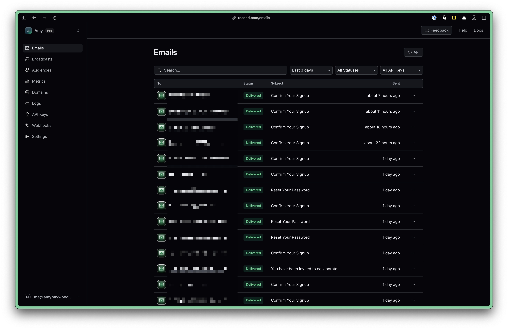
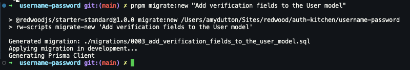
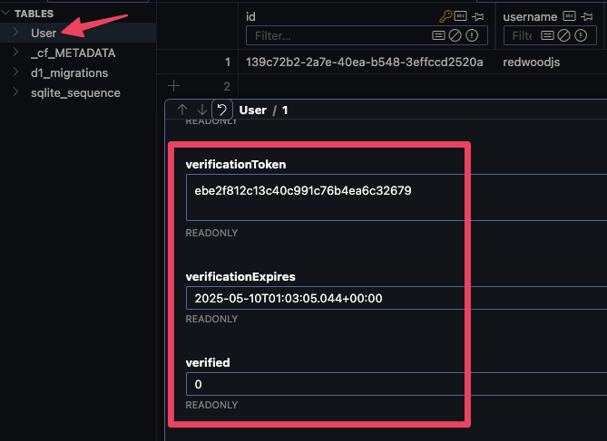

import { Aside, Steps, Tabs, TabItem } from "@astrojs/starlight/components";

Our register / login / logout flow is great, but it could be better. Since we're using email addresses, we should verify them. We also need a way for people to be able to reset their password if they forget it. This will require email.

There are several different services you can use:

- [Resend](https://resend.com/)
- [Postmark](https://postmarkapp.com/)
- [SendGrid](https://sendgrid.com/)
- [Mailgun](https://www.mailgun.com/)

## Setting up Resend
**Resend** is one of the easiest. Plus, they're the creators behind [react email](https://react.email/) which makes it incredibly easy to code emails, using React and Tailwind.

<Steps>
1. Go to [Resend](https://resend.com/) and create an account

    

    

3. Once you've created an account, you'll be redirected to a page with instructions for sending your first email.

    

    Create an API key by clicking on the **"Add API Key"** button.

    

    Copy the API and go to your `.env` file. Add a variable called `RESEND_API` and paste your key:

    ```text title=".env"
    RESEND_API=re_1234567890
    ```

    Cloudflare uses a `.dev.vars` file for environment variables. But, the common practice is to use a `.env` file. So, we've created a symlink for you. Anytime you make a change to the `.env` file, it will automatically update the `.dev.vars` file.

    If you're missing the `.dev.vars` file, as soon as you run `pnpm dev`, it will be created for you.

    <Aside type="note" title="Environmental Variables">
      You can find more information about [Environmental Variables here.](http://localhost:4321/core/env-vars)
    </Aside>

4. Install the Resend package. Within the Terminal, run:

    ```bash
    pnpm add resend
    ```

</Steps>

Your setup is complete! 🥳 Now, let's actually send an email.

## Sending an Email

We want to send an email as soon as the user registers. Within the `src/app/pages/auth/actions.ts` file, inside the `handleRegister` function, right after we've created the user:

```tsx title="src/app/pages/auth/actions.ts" startLineNumber={96} collapse={1-10} {"1. Set up the Resend client": 12} {"2. Send the email": 14} {"3. Handle errors": 22}
// create a new user
const user = await db.user.create({
  data: {
    username: username as string,
    email: email as string,
    password: hashedPassword
  }
});

console.log("User created successfully");


const resend = new Resend(env.RESEND_API);

const { data, error } = await resend.emails.send({
  from: 'Acme <onboarding@resend.dev>',
  to: 'amy@redwoodjs.com',
  subject: "Welcome to our app",
  text: "Welcome to our app."
});


if (error) {
  console.log("📥 Error sending email", error);
  return {
    error: "Error sending email"
  };
}

console.log("📥 Email sent successfully", data);
```

<Aside type="note" title="Sending Emails with Resend">
  Obviously, you'll want to change the `to` address to the user's email address.

  ```tsx "email," startLineNumber={109} {3}
  const { data, error } = await resend.emails.send({
  from: 'Acme <onboarding@resend.dev>',
  to: email,
  subject: "Welcome to our app",
  text: "Welcome to our app."
});
  ```

  However, the domain name you send emails from needs to be verified. ([Official docs](https://resend.com/docs/dashboard/domains/introduction)). Until then, you can _only_ send emails from onboarding@resend.dev and you can _only_ send emails to _your_ account email address.
</Aside>

When sending emails, you can use `text`, `html`, or `react`.

<Tabs>
<TabItem label="Text">
  ```tsx {5} "text"
  const { data, error } = await resend.emails.send({
    from: 'Acme <onboarding@resend.dev>',
    to: 'amy@redwoodjs.com',
    subject: "Welcome to our app",
    text: "Welcome to our app."
  });
  ```
</TabItem>
<TabItem label="HTML">
  ```tsx {5} "html"
  const { data, error } = await resend.emails.send({
    from: 'Acme <onboarding@resend.dev>',
    to: 'amy@redwoodjs.com',
    subject: "Welcome to our app",
    html: "<h1>Welcome to our app.</h1>"
  });
  ```
</TabItem>
<TabItem label="React">
  ```tsx {5} "react"
  const { data, error } = await resend.emails.send({
    from: 'Acme <onboarding@resend.dev>',
    to: 'amy@redwoodjs.com',
    subject: "Welcome to our app",
    react: WelcomeEmail({ firstName: "Amy" })
  });
  ```
</TabItem>
</Tabs>

<Aside type="tip" title="Constants">
  This is personal preference, but I like to put commonly used values in a `Constants.ts` file. This makes it easy to maintain and update.

  ```ts title="src/app/shared/constants.ts"
  export const Constants = Object.freeze({
    FROM_EMAIL: "Acme <onboarding@resend.dev>",
    BASE_URL: "http://localhost:5173",
  });
  ```
</Aside>

Try registering for a new account and check to see if the email was sent. One of my favorite features of Resend is that it will show you all the emails that have been sent, as well as a preview of that email. This makes is faster than waiting for it to hit your inbox (or spam folder), plus it's much easier to debug.



Now that we're able to successfully send an email, let's add a way for users to verify their email address.

## Verifying Email Addresses

First, let's talk how we're going to verify a user's email address and what the flow will look like from the user's perspective:

1. The user registers with their email address.
2. We add the user to the database
3. We send them a verification email with a link unique to them. We can also include a timestamp and expire the link.
4. The user clicks on the link in the email.
5. We have a page route that takes the token and updates the user's data, marking them as verified.

The first two steps are already done. So, let's start by creating the verification link.

### Creating a Verification Token

Within the `actions.ts` file, right before we create the user, let's create a token. We can use the built in `crypto.randomUUID()` function:

```tsx title="src/app/pages/auth/actions.ts" startLineNumber={96} {1-2, 10-11}
 // create a verification token
  const verificationToken = crypto.randomUUID().replace(/-/g, "");

// create a new user
const user = await db.user.create({
  data: {
    username: username as string,
    email: email as string,
    password: hashedPassword,
    verificationToken,
    verificationExpires: new Date(Date.now() + 1000 * 60 * 60 * 24),
  },
});
---
- **On line 97** we created a verification token. `.replace(/-/g, "")` removes the dashes from the UUID.
- **On line 105** we add the verification token to the user's data.
- **On line 106** we set an expiration date for the token, setting it to 24 hours in the future.
---
```

Now, we also need to set these fields up in the database. Inside our `schema.prisma` file, let's add them to the `User` model:

```prisma title="schema.prisma" {5-7, 11}
model User {
  id        String   @id @default(uuid()) // User ID (UUID-based)
  username  String   @unique
  password  String
  verificationToken String? @unique
  verificationExpires DateTime?
  verified Boolean @default(false)
  email     String   @unique
  createdAt DateTime @default(now())

  @@index([username, email, verificationToken])
}
---
- I added a `verificationToken` and `verificationExpires` field to the `User` model. Note, both of these fields are optional. Once the user is verified, we can remove them.
- The `verificationToken` needs to be unique, especially since we want to use it as a unique identifier.
- I also added the `verificationToken` to the `@@index` array. This will help with performance when querying the database.
- I also added a `verified` field to the `User` model. This will be `true` if the user has verified their email address. By default, this is set to `false`.
---
```

Now, we need to create a new migration. Within the Terminal:

```bash
pnpm migrate:new "Add verification fields to the User model"
```



Assuming everything went through successfully, this will create a new migration file in the `prisma/migrations` directory.

Now, let's test this to make sure the verification token is getting created and added to the user's data.

Within the browser, register a new account. Now, check the database to see if the user was created and if the verification token was added.



### Sending the Verification Email

Now, that we know the verification token is getting created, let's include it within the verification email. Let's update the `send` method inside the `handleRegister` function:

```tsx title="src/app/pages/auth/actions.ts" startLineNumber={112}
const { data, error } = await resend.emails.send({
  from: "Acme <onboarding@resend.dev>",
  to: "amy@redwoodjs.com",
  subject: "Welcome to our app",
  text: `Welcome to our app. Please verify your account by clicking the link
    below: https://localhost:5173/verify?token=${verificationToken}`,
});
```

Now, the only problem with this our email content is that we've hardcoded the URL. This works fine for local development, but we'll run into problems when we to go to production.

There are two ways that we can solve this:

1. You can create a new variable within the `.env` file.
This will allow you to use different values for different environments (development and production).

2. Create a `Constants.ts` file and add a constant for the URL.

The Constants file is my personal preference, because the value gets committed to the repository, making it easier to manage.

Inside my `src/app/shared` directory, let's create a new file called `constants.ts`:

```ts title="src/app/shared/constants.ts"
export const Constants = Object.freeze({
  BASE_URL: "http://localhost:5173",
});
---
- `Object.freeze()` is used to prevent the constants from being changed.
- When defining constants, it's best practice to use all caps.
---
```

Now, let's update the `handleRegister` function:

```tsx title="src/app/pages/auth/actions.ts" startLineNumber={113} "${Constants.BASE_URL}"
const { data, error } = await resend.emails.send({
  from: "Acme <onboarding@resend.dev>",
  to: "me@amyhaywood.com",
  subject: "Welcome to our app",
  text: `Welcome to our app. Please verify your account by clicking the link
    below: ${Constants.BASE_URL}/verify?token=${verificationToken}`,
});
```

Then, of course, import the file at the top of your file:

```tsx title="src/app/pages/auth/actions.ts" showLineNumbers={false}
import { Constants } from "@/app/shared/constants";
```

Before we test this, let's set up the `/verify` route.

### Verifying the User

Inside `worker.tsx`:

```tsx title="src/app/pages/auth/worker.tsx" {"1. The request gets passed into the route by default": 1} {"2. Get the URL from the request": 3} {"3. Get the token based on the URL": 5} {"4. If there's no token, redirect to login": 8} {"5. We do this a lot. So, I created a separate function for the redirect": 10} {"6. Verify the token by looking for the user by the token": 14} {"7. If we find the user, we need this data": 16} {"8. If the user is not found, redirect to login": 26} {"9.If the token has expired, redirect to login": 31} {"10. Verify the user by updating the database": 36} {"11. Redirect to login": 46} startLineNumber={78}
.
route("/verify", async ({ request }) => {

  const url = new URL(request.url);

  const token = url.searchParams.get("token");


  if (!token) {

    return gotoLogin();
  }


  const user = await db.user.findUnique({

    select: {
      id: true,
      verificationExpires: true,
    },
    where: {
      verificationToken: token,
    },
  });


  if (!user) {
    return gotoLogin();
  }


  if (!user.verificationExpires || user.verificationExpires > new Date()) {
    return gotoLogin();
  }


  await db.user.update({
    where: { id: user.id },
    data: {
      verified: true,
      verificationToken: null,
      verificationExpires: null,
    },
  });


  return gotoLogin();
}),
```

Here's the `gotoLogin` function that redirects the user to the login page:

```tsx title="src/app/pages/auth/actions.ts" startLineNumber={21}
const gotoLogin = () => {
  return new Response(null, {
    status: 302,
    headers: { Location: "/login" },
  });
};
```

Sweet! Now, let's test this out in the browser:

- Register for a new account.
- You should get an email with a link to verify your account.
- Click the link and you should be redirected to the login page.
- Check the database to see that the user is now verified.

### Updating the Interrupter

Now, let's update our interrupter to check if the user is verified. If they are not, redirect them to the `/login` route.

```tsx title="src/app/auth/worker.tsx" "|| !ctx.user.verified" startLineNumber={62}
route("/protected", [
  ({ ctx }) => {
    if (!ctx.user || !ctx.user.verified) {
      return new Response(null, {
        status: 302,
        headers: { Location: "/login" },
      });
    }
  },
  Home,
]),
```

<Aside type="note" title="Checking if the user is verified">
  We placed the verified check on the interrupter. However, you could also place this check in the `handleLogin` function to prevent the session from being set at all.
</Aside>

<Aside type="tip" title="Additional Functionality">
  In an ideal world, we'd have a separate check to see if the user is verified. If they're not, we could redirect them to a page that explains that they need to verify their email address and include a button to resend the verification email.

  We'd also want to consider creating a cron job to clean up unverified users after a certain period of time.
</Aside>

Perfect! Now, we just need to create a way for users to reset their password.