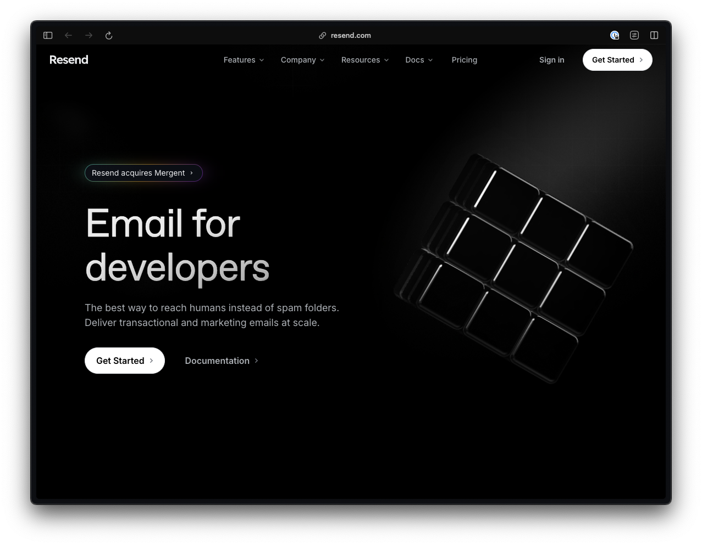
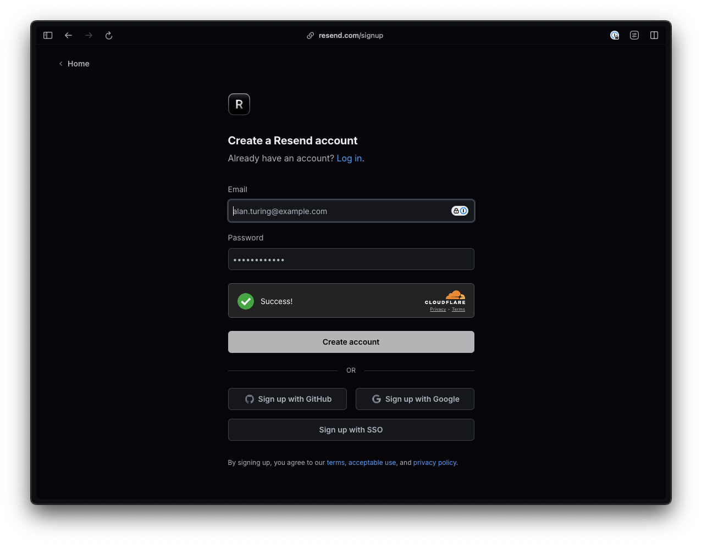
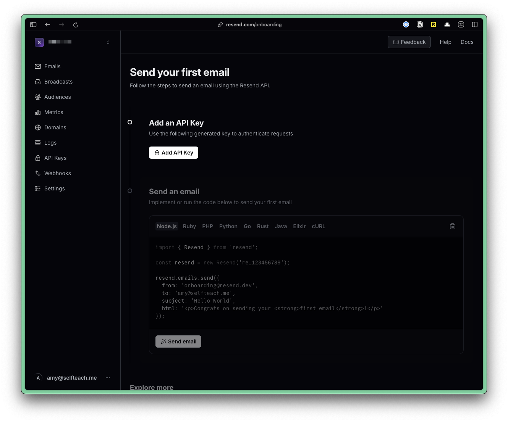
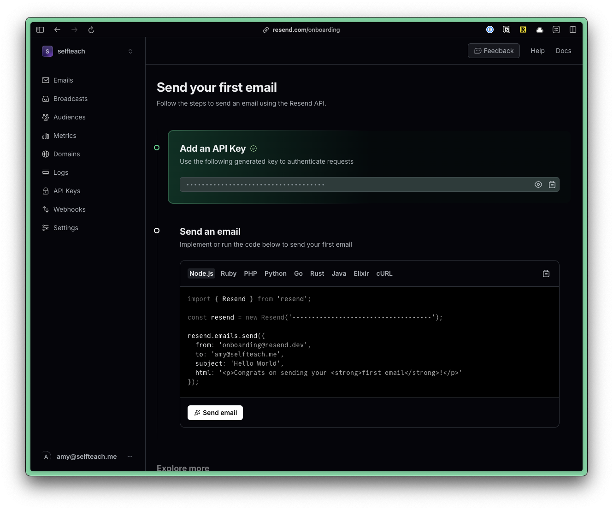

import { Aside, Steps } from "@astrojs/starlight/components";

## Setting Up Resend

<Steps>

1. Go to [Resend](https://resend.com/) and click on **Get Started** to create an account.

    

    

2. Once you’ve created an account, you’ll be redirected to a page with instructions for sending your first email.

    

    Create an API key by clicking on the “Add API Key” button.

    

    Copy the API and go to your .env file. Add a variable called RESEND_API and paste your key:

    ``` title=".env"
    RESEND_API=re_1234567890
    ```

    <Aside type="note" title="Environmental Variables">
    If you don't have an `.env` file, you can duplicate the `.env.example` file and rename it to `.env`.
    </Aside>

    Cloudflare uses a `.dev.vars` file for environment variables. But, the common practice is to use a `.env` file. So, we've created a symlink for you. Anytime you make a change to the `.env` file, it will automatically update the `.dev.vars` file.

    If you're missing the `.dev.vars` file, as soon as you run `pnpm dev`, it will be created for you.

    <Aside type="note" title="Environmental Variables">
      You can find more information about [Environmental Variables here.](http://localhost:4321/core/env-vars)
    </Aside>

4. Install the Resend package. Within the Terminal, run:

    ```bash
    pnpm add resend
    ```

</Steps>

Your setup is complete! 🥳 Now, we can send email.