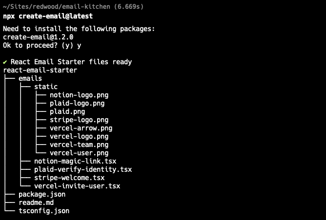
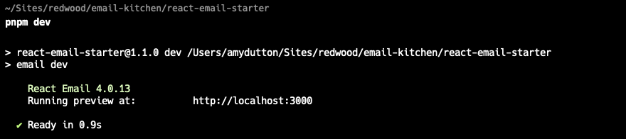
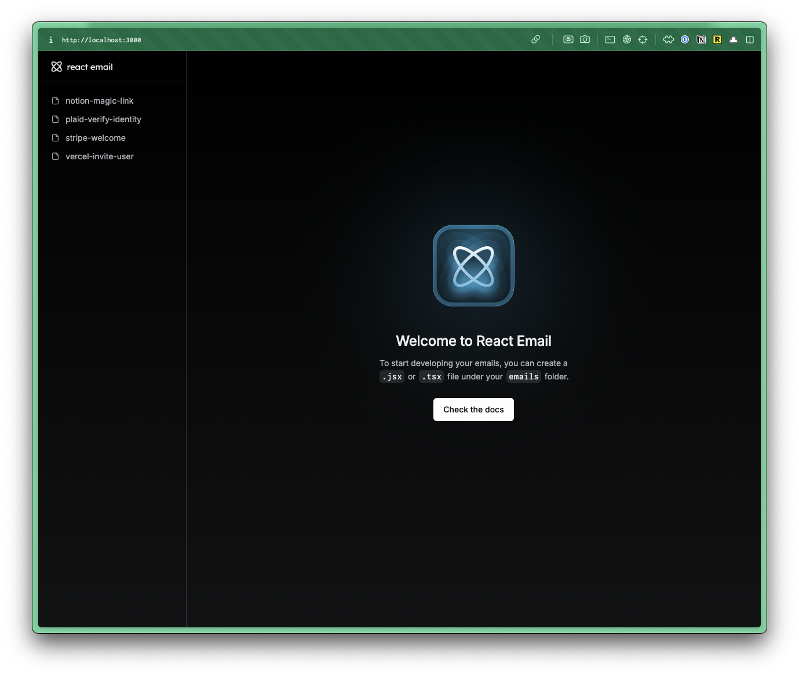
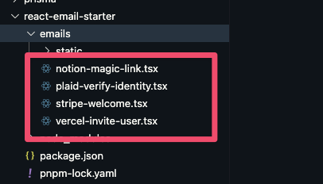
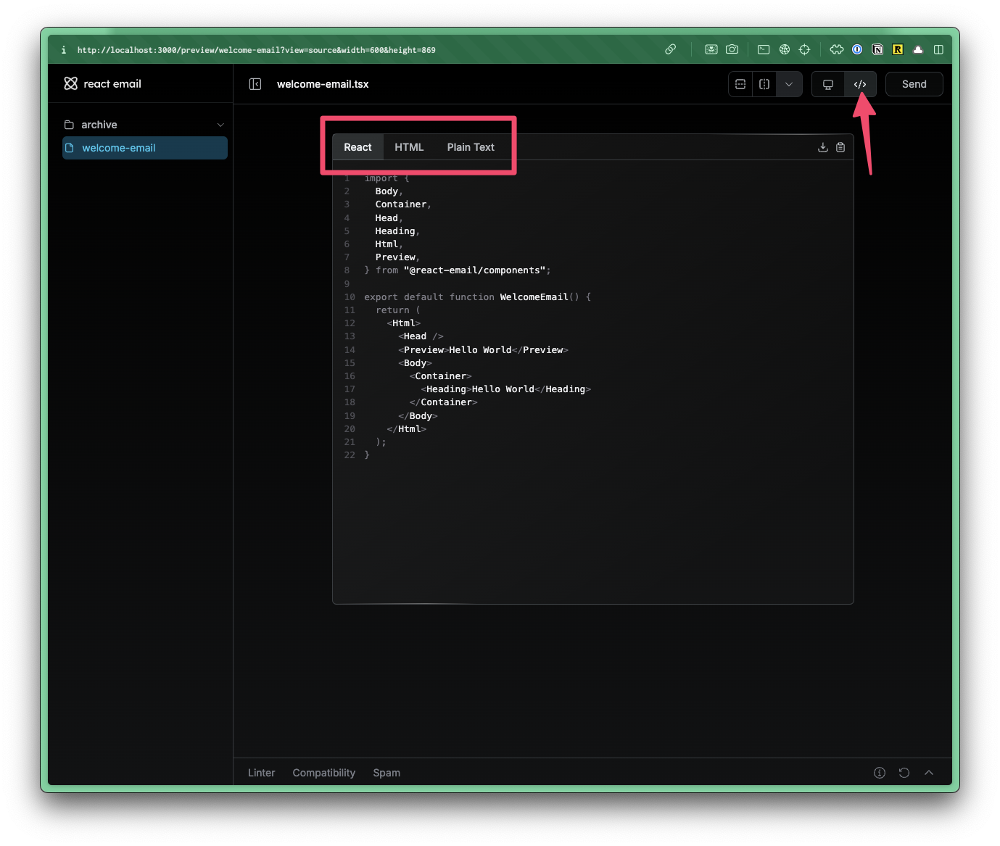

import { Aside, Steps, FileTree } from "@astrojs/starlight/components";

The [React Email](https://react.email/) project makes it easy to create email templates. It includes unstyled components and the Tailwind CSS support.

## Installation

Install the React Email components to your project by running the following command in the Terminal:

```bash
pnpm add @react-email/components
```

This assumes that you've already installed `Resend` to your project. If not, you can install the React Email components and Resend in one go:

```bash
pnpm add @react-email/components resend
```

Then, install the React Email Preview:

```bash
npx create-email@latest
```



This will create a new directory called `react-email-starter`.

```bash
cd react-email-starter
pnpm install
pnpm dev
```



Now, you can open a browser at http://localhost:3000 and see the preview.



In the left sidebar, you'll notice that React Email has 4 email examples you can preview. These correspond with the `.tsx` files inside the `react-email-starter/emails` directory:



All the assets for these example emails are within the `react-email-starter/emails/static` directory.

You can delete all the contents inside the `emails` directory. Or, oftentimes, I'll create a sub directory called `archive` and move the contents there.

## Creating a New Email Template

<Steps>

1. Create a new file in the `emails` directory with a `.tsx` extension.

2. Inside your email file, paste the following code:

    ```tsx title="src/emails/welcome-email.tsx"
    import {
      Body,
      Container,
      Head,
      Heading,
      Html,
      Preview,
    } from "@react-email/components";

    export default function WelcomeEmail() {
      <Html>
        <Head />
        <Preview>Hello World</Preview>
        <Body>
          <Container>
            <Heading>Hello World</Heading>
          </Container>
        </Body>
      </Html>
    );
    ```

    <Aside type="caution" title="Default Export">
    Your React Email component must be a default export in order for the browser preview to pick it up.
    </Aside>

    You'll notice that React Email has several primitives, making it easy to create a new email template.

    You can see a full list of components on the [React Email documentation](https://react.email/docs/introduction).

    React Email also has several [prebuilt components](https://react.email/components) for [galleries](https://react.email/components/gallery), [e-commerce](https://react.email/components/ecommerce), [articles](https://react.email/components/articles), etc.

3. Adjust the template to your liking.

    Keep in mind that you can pass in props, personalizing the template and making it more dynamic.

    ```tsx title="src/emails/welcome-email.tsx" startLineNumber={10}
    interface WelcomeEmailProps {
      name: string;
    }

    export default function WelcomeEmail({ name }: WelcomeEmailProps) {
      <Html>
        <Head />
        <Preview>Hello {name}</Preview>
        <Body>
          <Container>
            <Heading>Hello {name}</Heading>
          </Container>
        </Body>
      </Html>
    );
    ```

4. When you've finished building the email template, you can get the code by clicking on the Code button in the browser preview.

    

    From here, you download or copy and paste the React code, HTML, or Plain Text into your project.

    Create a new folder inside the `src/app` directory called `emails` and paste the React Email code into the new file.

    <FileTree>
    - src/
      - app/
        - emails/
          - WelcomeEmail.tsx
    </FileTree>

5. Updating your Resend Code:

    Now, you can update your Resend code (pulled from the example on [Sending Email page](/guides/email/sending-email)) to use the new email template.

    ```tsx title="src/app/emails/WelcomeEmail.tsx"
    import WelcomeEmail from "@/app/emails/WelcomeEmail";

    const { data, error } = await resend.emails.send({
      from: "Acme <onboarding@resend.dev>",
      to: email,
      subject: "👋 Hello World",
      react: <WelcomeEmail name="Amy" />,
    });
    ```

</Steps>

## Using Tailwind within Email Templates

<Steps>

1. `import` the Tailwind component at the top of your email template:

    ```tsx title="src/emails/WelcomeEmail.tsx"
    import { Tailwind } from "@react-email/components";
    ```

2. Wrap your email template in the `Tailwind` component:

    ```tsx title="src/emails/WelcomeEmail.tsx" showLineNumbers=false
    <Tailwind>
      <Html>
        <Head />
        <Preview>Hello World</Preview>
      </Html>
    </Tailwind>
    ```

    <Aside type="caution" title="Tailwind Version">
    React Email uses the 3.4.10 version of Tailwind CSS.
    </Aside>

3. If you want to use a custom theme, this will need to be defined as a `config` prop, passed into the `Tailwind` component.

    ```tsx title="src/emails/WelcomeEmail.tsx" showLineNumbers=false
    <Tailwind
      config={{
        theme: {
          extend: {
            colors: {
              brand: "#007291",
            },
          },
        },
      }}
    >
    ...
    ```

    If you go this route, we recommend putting the `config` prop in a separate file, importing it into your email template, and passing it into the `Tailwind` component.

    ```tsx title="src/emails/tailwind.config.ts"
    export default {
      theme: {
        extend: {
        }
      }
    }
    ```

    ```tsx title="src/emails/WelcomeEmail.tsx"
    import tailwindConfig from "./tailwind.config";

    <Tailwind config={tailwindConfig} />
    ```

</Steps>

## Further Reading

- [React Email](https://react.email/)
- [React Email Components](https://react.email/docs/components/html)
- [React Email Pre-Built Components](https://react.email/components)
- [React Email and Tailwind CSS Documentation](https://react.email/docs/components/tailwind)