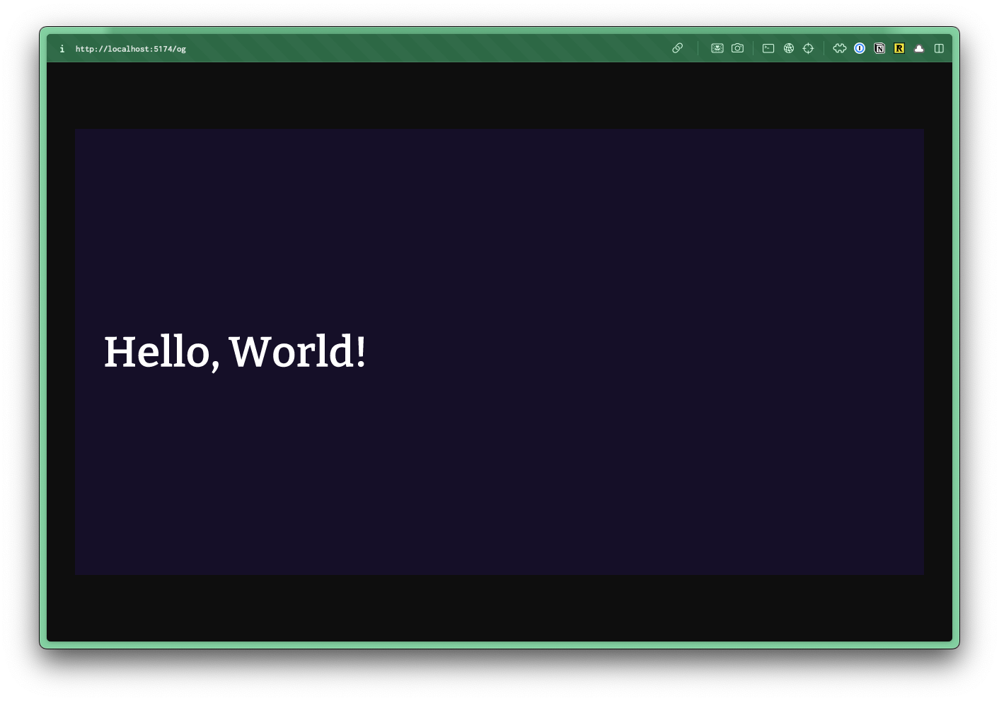
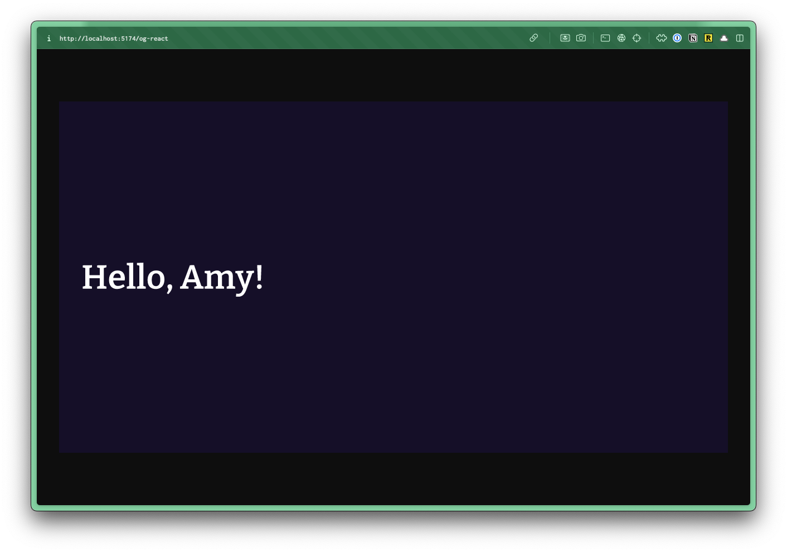
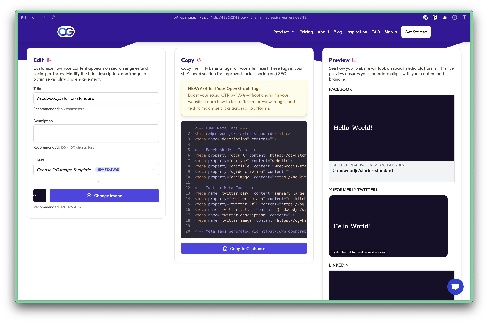

import { Aside, FileTree, Steps } from '@astrojs/starlight/components';

An Open Graph (OG) image is a specific image used when a webpage is shared on social media platforms like Facebook, LinkedIn, and Twitter/X. It serves as a visual preview that appears in link shares, providing a visual representation of the page's content.

These are defined through the page's meta tags:

```html
<!-- Open Graph / Facebook -->
<meta property="og:type" content="article" />
<meta property="og:title" content="page title" />
<meta property="og:description" content="page description" />
<meta property="og:image" content="https://example.com/og-image.png" />
<meta property="article:published_time" content="2025-01-01" />
<meta property="article:author" content="author name" />

<!-- Twitter -->
<meta name="twitter:card" content="summary_large_image" />
<meta name="twitter:title" content="page title" />
<meta name="twitter:description" content="page description" />
<meta name="twitter:image" content="https://example.com/og-image.png" />
```

You can create a default, static OG image for the entire project, however, custom OG images are recommended for a better social sharing experience.

Within React 19, you can include `meta` tags directly within your page components and they'll be rendered in the head. ([More details on the Meta Data documentation](/guides/frontend/metadata/))

---

## Creating Dynamic OG Images

There's a fantastic package called `workers-og` that allows you to create dynamic Open Graph images using Cloudflare Workers. 🙌

First, install the `workers-og` package:

```bash
pnpm install workers-og
```

Now, we have two options. You can use standard HTML and CSS to create your Open Graph image, or you can use a React component.

## Using HTML and CSS

Within the `worker.tsx` file, let's create a new route, called `/og`:

```tsx title="src/worker.tsx" {"1. Defined a Title": 3} {"2. Set up the HTML": 5} {"3. Return the Image": 14}
render(Document, [
  route("/og", () => {

    const title = "Hello, World!";

    const html = `
      <div style="display: flex; flex-direction: column; align-items: center; justify-content: center; height: 100vh; width: 100vw; font-family: sans-serif; background: #160f29">
        <div style="display: flex; width: 100vw; padding: 40px; color: white;">
          <h1 style="font-size: 60px; font-weight: 600; margin: 0; font-family: 'Bitter'; font-weight: 500">${title}</h1>
        </div>
      </div>
    `;


    return new ImageResponse(html, {
      width: 1200,
      height: 630,
    });
  }),
```

In this example, I hard coded the title, `Hello, World!`. However, you can pass parameters through the URL and make database calls to fetch the data you need.

Then, when returning the image, you'll notice I'm passing in the `html` variable and specifying the `width` and `height` of the image.

Within the browser, you can visit the `/og` route to see the image:



## Using React

You can also use a React component, which probably feels more natural, especially for passing around props and parameters.

For this example, I'm going to create a new component inside the `src/app/components` directory, called `Og.tsx`:

```tsx title="src/app/components/Og.tsx"
const Og = ({ title }: { title: string }) => {
  return (
    <div style={{ display: "flex", flexDirection: "column", alignItems: "center", justifyContent: "center", height: "100vh", width: "100vw", fontFamily: "sans-serif", background: "#160f29" }}>
      <div style={{ display: "flex", width: "100vw", padding: 40, color: "white" }}>
        <h1 style={{ fontSize: 60, fontWeight: 600, margin: 0, fontFamily: "Bitter" }}>{title}</h1>
        </div>
      </div>
  )
}

export default Og
```

<Aside title="Using TailwindCSS" type="note">
Even though these examples are using the `style` attribute, if you're using TailwindCSS, you should still have access to your classes. These routes are still wrapped in a `Document` component, where Tailwind is being imported. (For reference see the [Tailwind guide](/guides/frontend/tailwind)).
</Aside>

Now, within your `worker.tsx` file, let's create a new route, called `/og-react`:

```tsx title="src/worker.tsx" {"1. Import the Og Component": 1} {"2. Pass in the Title": 5} {"3. Return the Image": 9}
.
import Og from "@/app/components/Og";
...
route("/og-react", () => {

  const title = "Hello, Amy!";
  const og = <Og title={title} />;


  return new ImageResponse(og, {
    width: 1200,
    height: 630,
  });
}),
```

Within the browser, you can visit the `/og-react` route to see the image:



## Updating the Meta Tags

Now that you have your dynamic OG image, you can update the meta tags in your page component to use the new OG image.

```tsx title="src/app/pages/Home.tsx"
<meta property="og:image" content="/og" />
```

You can test your OG image by visiting the [Open Graph Image Tester](https://www.opengraph.xyz/) and entering your URL (not localhost).



## Further Reading

- [Example Repo](https://github.com/ahaywood/og-kitchen)
- [workers-og](https://github.com/kvnang/workers-og/tree/main)
- [Open Graph Image Tester](https://www.opengraph.xyz/)
