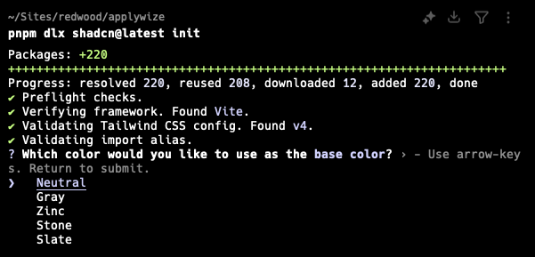

import { Aside, Steps, FileTree } from '@astrojs/starlight/components';

import { PackageManagers } from "starlight-package-managers";

## Installing shadcn/ui

<Steps>
1. [Install TailwindCSS](/guides/frontend/tailwind).

2. Install shadcn/ui
    <PackageManagers
      type="dlx"
      pkg="shadcn@latest"
      args="init"
    />

    It will ask you what theme you want to use.
    

    This command will create a `components.json` file in the root of your project. It contains all the configuration for our shadcn/ui components.

    If you want to match RedwoodSDK conventions, add the following aliases to the `components.json` file:

    ```json title="components.json" startLineNumber={13}
    ...
    "aliases": {
      "components": "@/app/components",
      "utils": "@/app/lib/utils",
      "ui": "@/app/components/ui",
      "lib": "@/app/lib",
      "hooks": "@/app/hooks"
    },
    ...
    ```

    <Aside type="note" title="shadcn/ui Organization">
    In our configuration, the `lib` directory is nested inside the `app` directory. The shadcn/ui command line tool may not honor our setup, creating another `lib` directory in the `src` (or `@`) directory. You'll need to manually move the folder to the `app` directory.

    If you're copying and pasting code from the shadcn/ui website, you'll also need to update the import paths.
    </Aside>

3. Now, you should be able to add components:
    You can add components in bulk by running:
    <PackageManagers
      type="dlx"
      pkg="shadcn@latest"
      args="add"
    />

    Or, you can add a single component by running:
    <PackageManagers
      type="dlx"
      pkg="shadcn@latest"
      args="add <COMPONENT-NAME>"
    />

    Components will be added to the `src/app/components/ui` folder.

    <FileTree>
    - src/
      - app/
        - components/
          - ui/
    </FileTree>
</Steps>

<Aside type="caution" title="React Server Components">
By default, all pages and components within Redwood are server components. However, most of the ShadCN components require reactivity. Therefore, you may need to add `use client` to the top of your component file.
</Aside>

## Further reading

- [ShadCN](https://ui.shadcn.com/)
- [TailwindCSS v4](https://tailwindcss.com/docs/installation/using-vite)
