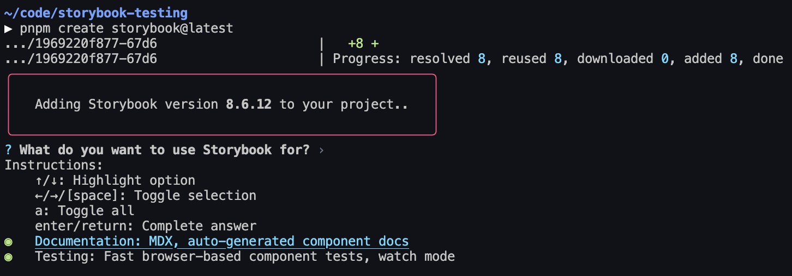
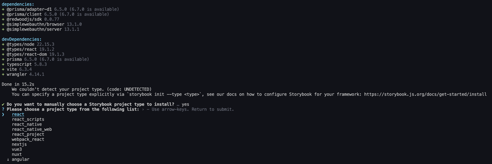
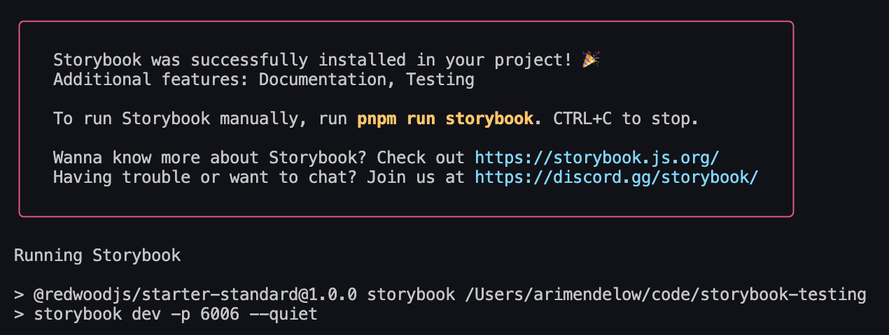
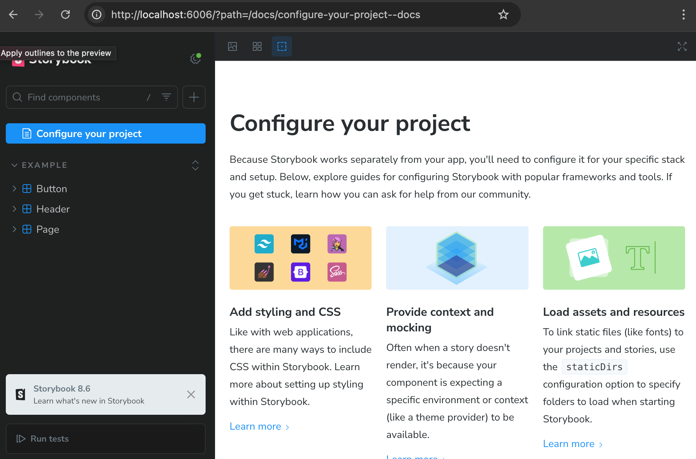
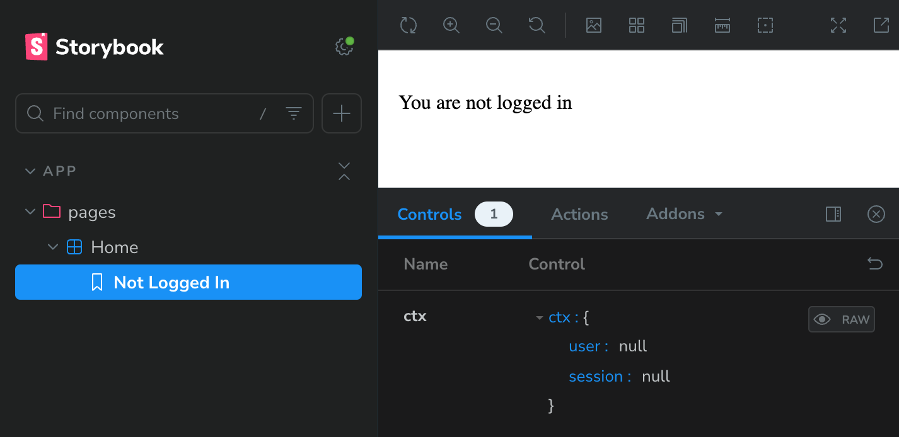
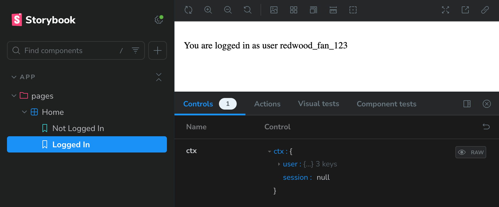
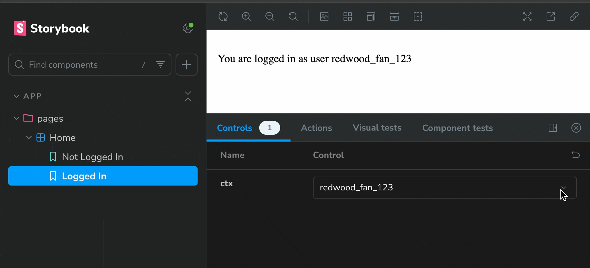
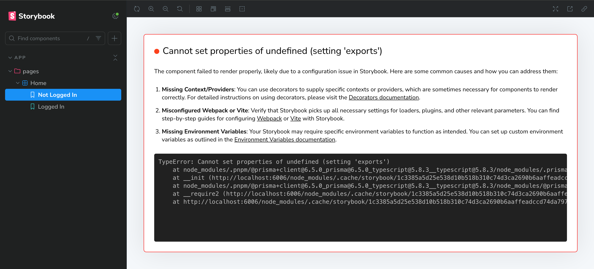
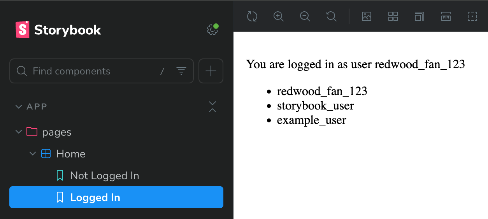
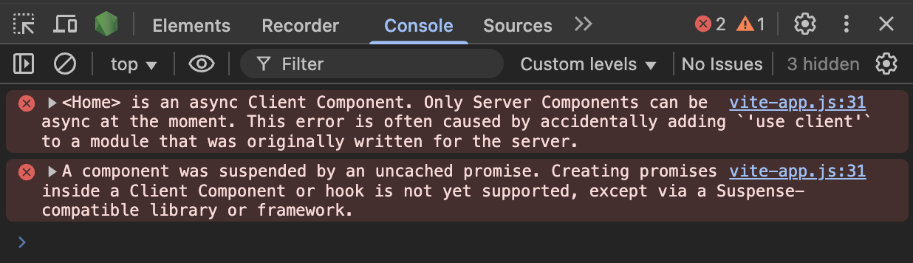

import { Aside, Steps } from '@astrojs/starlight/components';
import { PackageManagers } from "starlight-package-managers";

<Aside type="note" title="What is Storybook?">
  <p>
    Storybook is a tool for developing UI components in isolation. It allows us to create and test components without needing to run our full application. It can also be a great way to document our components.
  </p>
  <p>
    Developing UI in isolation is especially useful if we have a component that relies on network requests or our database — we can mock any dependencies and focus on building the component itself.
  </p>
  <p>
    This guide covers setup and some basics. For full documentation and some demos, see the <a target="_blank" href="https://storybook.js.org">Storybook site</a>.
  </p>
</Aside>

## Installing Storybook

Because the RedwoodSDK is based on React and Vite, we can work through the <a target="_blank" href="https://storybook.js.org/docs/get-started/frameworks/react-vite">"React & Vite" documentation</a>:

<Steps>
1. Install Storybook:
    <PackageManagers
      type="create"
      pkg="storybook@latest"
    />

2. Select what we want to use Storybook for — I selected both Documentation and Testing, though this guide will only cover the documentation part:
    

3. It'll say it can't detect the framework. Select React — it'll automatically detect Vite:
    

4. Storybook will finish installing, and then start our Storybook server:
    

5. It should automatically open our browser to Storybook, and if it doesn't, we can go to `localhost:6006` to see it:
    

7. It also added `storybook` and `storybook-build` scripts to our `package.json` file. We can always run the `storybook` script to start the Storybook server, and `storybook-build` script to build our Storybook site for production:
    ```json
    {
      "scripts": {
        "storybook": "storybook dev -p 6006",
        "storybook-build": "storybook build"
      }
    }
    ```

</Steps>

<Aside type="note" title="Wait, Storybook is showing me some random components!">
  <p>
    Storybook comes with some boilerplate components and stories. We can delete the `src/stories` folder to get rid of them.
  </p>
  <p>
    Still, if you're new to Storybook, I recommend keeping them around for a bit and taking a look at the files it added. They demonstrate how to set up a Storybook component and how to use and customize the Storybook UI.
  </p>
</Aside>

## Adding a Component to Storybook

In writing this guide, we've started by following the [quick start instructions](../../getting-started/quick-start) and set up the standard starter.

The standard starter comes with a very basic `Home` component:

```tsx title="src/app/pages/Home.tsx"
import { RequestInfo } from "rwsdk/worker";

export function Home({ ctx }: RequestInfo) {
  return (
    <div>
      <p>
        {ctx.user?.username
          ? `You are logged in as user ${ctx.user.username}`
          : "You are not logged in"}
      </p>
    </div>
  );
}
```

Given that this is very basic, we'd most likely want to build this out a bit more. Storybook is the perfect place to do that! Let's see what that looks like.

<Steps>
1. Create a new file: `src/app/pages/Home.stories.tsx`
    ```tsx title="src/app/pages/Home.stories.tsx"
    import type { Meta, StoryObj } from "@storybook/react";

    import { Home } from "./Home";

    const meta: Meta<typeof Home> = {
      component: Home,
    };

    export default meta;
    type Story = StoryObj<typeof Home>;

    export const NotLoggedIn: Story = {
      args: {
        ctx: {
          user: null,
          session: null,
        },
      },
    };
    ```
    <Aside type="note" title="What is `args`?">
      <p>
        [`args` is how we tell Storybook what props to pass to our component](https://storybook.js.org/docs/writing-stories/args). We can think of it as the "input" to our component.
      </p>
      <p>
        In this case, we're passing the `ctx` prop to the `Home` component. As always, if we don't give a component its required props, it'll complain about it.
      </p>
    </Aside>
2. Save, and go back to our Storybook site. We should see a new "Home" section in the sidebar:
    

3. Great! What if we want to mock the logged in user? We can do that by adding a new story, this time passing in a user object to the `ctx` prop:
    ```tsx title="src/app/pages/Home.stories.tsx" ins={21-32}
    import type { Meta, StoryObj } from "@storybook/react";

    import { Home } from "./Home";

    const meta: Meta<typeof Home> = {
      component: Home,
    };

    export default meta;
    type Story = StoryObj<typeof Home>;

    export const NotLoggedIn: Story = {
      args: {
        ctx: {
          user: null,
          session: null,
        },
      },
    };

    export const LoggedIn: Story = {
      args: {
        ctx: {
          user: {
            id: "1",
            username: "redwood_fan_123",
            createdAt: new Date(),
          },
          session: null,
        },
      },
    };
    ```

4. Save it, and go back to our Storybook site. We should see a new "Logged In" story:
    
    <Aside type="note" title="What even is a story?">
      <p>
        Given that the tool we're using is called "Storybook," it makes sense that it's made up of "stories."
      </p>
      <p>
        A story captures a single state of a component. It can be thought of as a "use case" for the component.
      </p>
      <p>
        For example, in our case, we have two stories: "Not Logged In" and "Logged In." Each story shows a different state of the `Home` component.
        We can have as many stories as we want for a component. In fact, it's recommended to have a story for each state of the component.
        As we continue building a component, checking back on its stories is also a great way to make sure that we haven't broken anything.
      </p>
      <p>
        Read more about this in the <a target="_blank" href="https://storybook.js.org/docs/get-started/whats-a-story">official Getting Started documentation</a>.
      </p>
    </Aside>

5. Great! But what if we want to be able to play around with the username that's displayed? Sure, we can always click into the
    generated controls and change the username, but it's a little ugly. What if we want to just have a dropdown with some options?<br /><br />
    Thankfully, Storybook lets us override the generated controls via [argTypes](https://storybook.js.org/docs/api/arg-types)!<br /><br />
    Username is nested in our `ctx` prop, and Storybook controls are meant to correspond with a given prop, so we need to create an array
    of all the `ctx` possibilities we want to test out. We can then give them each a pretty name, and Storybook will generate a dropdown for us —
    if we specify a list of options, [Storybook will know to use a dropdown control](https://storybook.js.org/docs/api/arg-types#control).<br /><br />
    Let's do it:

    ```tsx title="src/app/pages/Home.stories.tsx" ins={32-50} collapse={1-20}
    import type { Meta, StoryObj } from "@storybook/react";

    import { Home } from "./Home";

    const meta: Meta<typeof Home> = {
      component: Home,
    };

    export default meta;
    type Story = StoryObj<typeof Home>;

    export const NotLoggedIn: Story = {
      args: {
        ctx: {
          user: null,
          session: null,
        },
      },
    };

    export const LoggedIn: Story = {
      args: {
        ctx: {
          user: {
            id: "1",
            username: "redwood_fan_123",
            createdAt: new Date(),
          },
          session: null,
        },
      },
      argTypes: {
        ctx: {
          options: ["redwood_fan_123", "storybook_user", "example_user"],
          mapping: {
            redwood_fan_123: {
              user: { id: "1", username: "redwood_fan_123", createdAt: new Date() },
              session: null,
            },
            storybook_user: {
              user: { id: "2", username: "storybook_user", createdAt: new Date() },
              session: null,
            },
            example_user: {
              user: { id: "3", username: "example_user", createdAt: new Date() },
              session: null,
            },
          },
        },
      },
    };
    ```

6. Save it, and go back to our Storybook site. we should see a new dropdown for the `ctx` prop — give it a try!
    
</Steps>

You did it! 🎉 <br />
We now have a fully functional Storybook set up with a component that we can play around with.

## Mocking a dependency that's not a prop

In the previous section, we mocked the `ctx` prop. But what if we want to mock a dependency that isn't a prop? For example, let's say we have a component that makes calls to our
database via Prisma.

<Steps>
1. Starting with the standard starter, the only thing in our database schema is a list of users. What's the most obvious thing to do? List out all the users! Add this to our `Home` component:
    ```tsx title="src/app/pages/Home.tsx" ins={2, 13-17} useDiffSyntax={true} ins="async"
    import { RequestInfo } from "rwsdk/worker";
    import { db } from "@/db";

    export async function Home({ ctx }: RequestInfo) {
      const users = await db.user.findMany();
      return (
        <div>
          <p>
            {ctx.user?.username
              ? `You are logged in as user ${ctx.user.username}`
              : "You are not logged in"}
          </p>
          <ul>
            {users.map((user) => (
              <li key={user.id}>{user.username}</li>
            ))}
          </ul>
        </div>
      );
    }
    ```

2. Now, if we go to our Storybook site, we'll see that it throws an intimidating error. Take a closer look, and we'll see that it's coming from the Prisma client:
    

3. We need to mock our Prisma client. There are a few ways to do this, and [Storybook](https://storybook.js.org/docs/writing-stories/mocking-data-and-modules/mocking-modules) and [Prisma](https://www.prisma.io/blog/testing-series-1-8eRB5p0Y8o) both have great documentation on this.
    For the sake of this guide, we're going to do this the most straightforward way. First, we need to create a mocked version of our Prisma client. Create a new file right next to our existing `db.ts` — `src/db.mock.ts`:
    ```ts title="src/db.mock.ts"
    /**
    * First, mock the imported client.
    */
    export let db: unknown;

    /**
    * Then, create a function to set the mock client.
    * We do this so that we can have test-specific mocks,
    * rather than having only one version of the mocked client.
    *
    * @param [dbMock={}] An object to use as the mock client. Be sure to mock any Prisma functions used by the component we're testing.
    */
    export function setupDb(dbMock: unknown = {}) {
      db = dbMock;
    }
    ```
4. Now, we need to tell Storybook to use this mocked version of the Prisma client. We'll do this using [a Vite alias](https://storybook.js.org/docs/writing-stories/mocking-data-and-modules/mocking-modules#builder-aliases).<br />
    (We can instead use [subpath imports](https://storybook.js.org/docs/writing-stories/mocking-data-and-modules/mocking-modules#subpath-imports), but it requires a bit more setup — we'd need to change any existing imports.)<br />

    One of the Storybook config files is [`.storybook/main.ts`](https://storybook.js.org/docs/api/main-config/main-config) — this defines the behavior of our Storybook project. Open it up and add the following:
    ```ts title=".storybook/main.ts" ins={2-3, 7-13, 25-33}
    import type { StorybookConfig } from "@storybook/react-vite";
    import { mergeConfig } from "vite";
    import path from "path";

    const config: StorybookConfig = {
      features: {
        /**
         * `experimentalRSC` is required for rendering async server components in Storybook.
         * It works by wrapping all stories in a Suspense boundary:
         * https://github.com/storybookjs/storybook/blob/14e18d956fd714c594782fbf23c42765a8b599cd/code/renderers/react/src/entry-preview.tsx#L20-L24
         */
        experimentalRSC: true,
      },
      stories: ["../src/**/*.mdx", "../src/**/*.stories.@(js|jsx|mjs|ts|tsx)"],
      addons: [
        "@storybook/addon-essentials",
        "@storybook/addon-onboarding",
        "@chromatic-com/storybook",
        "@storybook/experimental-addon-test",
      ],
      framework: {
        name: "@storybook/react-vite",
        options: {},
      },
      viteFinal: async (config) => {
        return mergeConfig(config, {
          resolve: {
            alias: {
              "@/db": path.resolve(__dirname, "../src/db.mock.ts"),
            },
          },
        });
      },
    };
    export default config;
    ```

5. Every time we edit one of the Storybook configs, we'll need to restart the Storybook server.
    However, if we do this before we finish mocking the Prisma client, [our component will infinitely re-render](https://github.com/storybookjs/storybook/issues/30317).
    Let's finish mocking the Prisma client first. Go back to our story, and add the following:
    ```tsx title="src/app/pages/Home.stories.tsx" ins={3-5, 9-20} collapse={23-66}
    import type { Meta, StoryObj } from "@storybook/react";

    // Must include the `.mock` portion of filename to specify that that's what we want to import
    import { setupDb } from "@/db.mock";

    import { Home } from "./Home";

    const meta: Meta<typeof Home> = {
      // https://storybook.js.org/docs/writing-tests/component-testing#beforeeach
      beforeEach: async () => {
        setupDb({
          user: {
            findMany: () => [
              { id: "1", username: "redwood_fan_123", createdAt: new Date() },
              { id: "2", username: "storybook_user", createdAt: new Date() },
              { id: "3", username: "example_user", createdAt: new Date() },
            ],
          },
        });
      },
      component: Home,
    };

    export default meta;
    type Story = StoryObj<typeof Home>;

    export const NotLoggedIn: Story = {
      args: {
        ctx: {
          user: null,
          session: null,
        },
      },
    };

    export const LoggedIn: Story = {
      args: {
        ctx: {
          user: {
            id: "1",
            username: "redwood_fan_123",
            createdAt: new Date(),
          },
          session: null,
        },
      },
      argTypes: {
        ctx: {
          options: ["redwood_fan_123", "storybook_user", "example_user"],
          mapping: {
            redwood_fan_123: {
              user: { id: "1", username: "redwood_fan_123", createdAt: new Date() },
              session: null,
            },
            storybook_user: {
              user: { id: "2", username: "storybook_user", createdAt: new Date() },
              session: null,
            },
            example_user: {
              user: { id: "3", username: "example_user", createdAt: new Date() },
              session: null,
            },
          },
        },
      },
    };
    ```

6. Now, restart the Storybook server (`CTRL + C` to stop it), and go back to the Storybook site. We should see our mocked list of users:
    <PackageManagers
      title="Start Storybook Server"
      type="run"
      args="storybook"
    />
    

    <Aside type="note" title="What are these errors I'm seeing in the dev tools console?">
      <p>
        If we happen to open the dev tools, we'll see the following:
        
      </p>
      <p>
        Remember that Storybook is rendering our server components by wrapping them in a Suspense boundary?
        This is a known issue with doing things that way, and can be ignored for now.
        See the <a target="_blank" href="https://github.com/storybookjs/storybook/issues/25891#issuecomment-1975916580">GitHub issue</a> for an explanation.
      </p>
    </Aside>
</Steps>

## Continued Learning

You did it! 🚀 We now have a fully functioning Storybook project, and have started to explore the benefits of developing UI in isolation.

We're also well on our way to having a robust, well-documented, and well-tested UI component library for our Redwood SDK project.

Some great resources for next steps are:
- [Testing UIs with Storybook](https://storybook.js.org/docs/writing-tests/)
- [Documenting components with Storybook](https://storybook.js.org/docs/writing-docs/)
- [Publishing your Storybook](https://storybook.js.org/docs/sharing)
