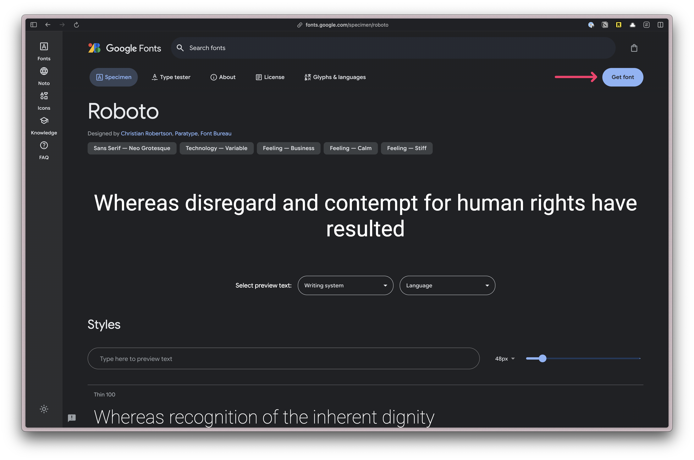
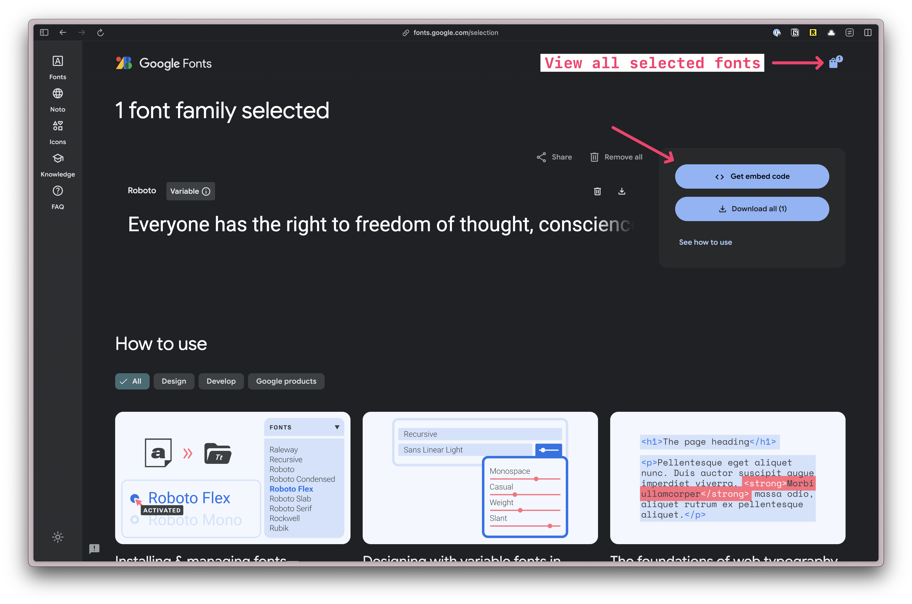
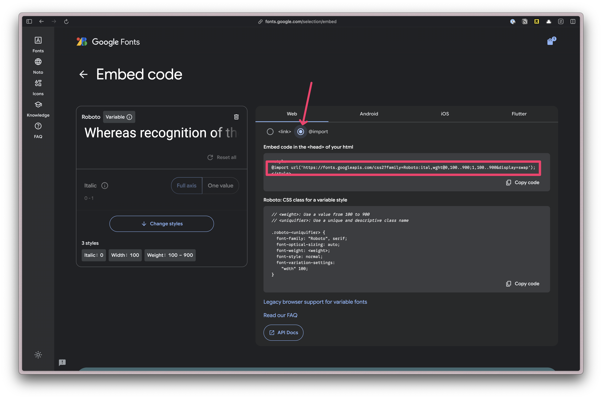
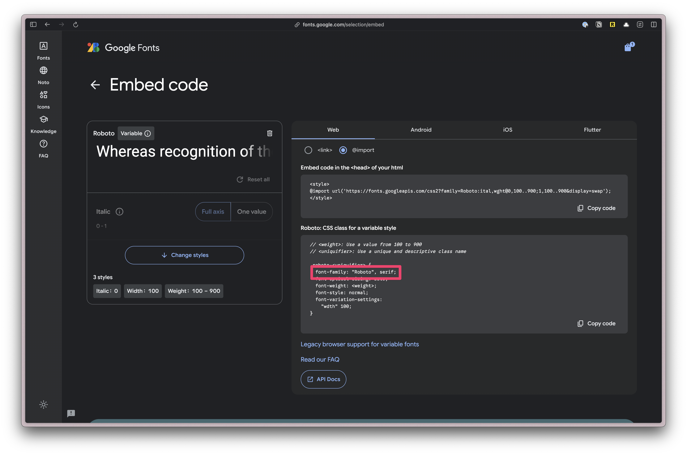

import { Aside } from '@astrojs/starlight/components';
import { Steps } from '@astrojs/starlight/components';

## Installing Tailwind

Since the RedwoodSDK is based on React and Vite, we can work through the ["Using Vite" documentation](https://tailwindcss.com/docs/installation/using-vite).

<Steps>
1. Install Tailwind CSS
    ```bash
    npm install tailwindcss @tailwindcss/vite
    ```

2. Configure the Vite Plugin
    ```ts ins="import tailwindcss from '@tailwindcss/vite'" ins="tailwindcss(),"
    // vite.config.mts
    import { defineConfig } from "vite";
    import tailwindcss from '@tailwindcss/vite'
    import { redwood } from "@redwoodjs/sdk/vite";

    export default defineConfig({
      plugins: [
        redwood(),
        tailwindcss(),
      ],
    });
    ```

3. Import Tailwind CSS
    Create a `src/app/styles.css` file.
    ```css
    @import "tailwindcss";
    ```

4. Now, you can run `pnpm run dev` and the "Hello World" text should look different.
    ```bash
    pnpm run dev
    ```

</Steps>

## Customizing TailwindCSS

With Tailwind v4, there is no longer a `tailwind.config.js` file for customizations. Instead, we use the `styles.css` file.

All of your customizations should be within a `@theme` block.

```css
@import "tailwindcss";
@theme {
  --color-bg: #e4e3d4;
}
```

Now, this custom color can be used:

```tsx
<div className="bg-bg">
  <h1>Hello World</h1>
</div>
```

### Adding Google Fonts

The easiest way to implement custom fonts is through [Google Fonts](https://fonts.google.com/).







Within your `styles.css` file, add the `@import` code:

```css
@import url('https://fonts.googleapis.com/css2?family=Roboto:ital,wght@0,100..900;1,100..900&display=swap');
```

Then, within your `theme` block ;tk

```css
@import url('https://fonts.googleapis.com/css2?family=Roboto:ital,wght@0,100..900;1,100..900&display=swap');
@import tailwindcss;
@theme {
  --font-sans: "Roboto", sans-serif;
}
```



### Adding a Custom Font with `@font-face`

Within the `public` directory, create a `fonts` folder where you can add your custom font files.

```css
@font-face {
  font-family: "CustomFont";
  src: url("/fonts/custom-font.woff2") format("woff2");
}

## Further reading

- [TailwindCSS](https://tailwindcss.com/)
- [VS Code, Tailwind CSS IntelliSense Plugin](https://marketplace.visualstudio.com/items?itemName=bradlc.vscode-tailwindcss)
