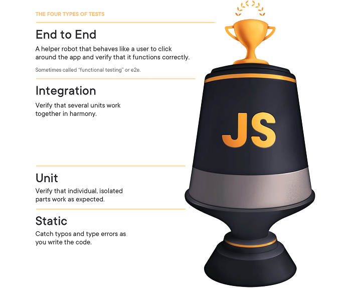

import { Aside } from '@astrojs/starlight/components'

## Why test?

### Confidence in Your Code
Testing provides confidence that your application works as expected. When you make changes or add new features, a good test suite helps ensure you haven't broken existing functionality. This is particularly valuable when:

- Refactoring complex components
- Upgrading dependencies
- Collaborating with team members who may not be familiar with all parts of the codebase

### Documentation through Tests
Well-written tests serve as living documentation that demonstrates how your application should work. They provide clear examples of:

- How components should render under different conditions
- Expected API behaviors and responses
- User flows through your application
- Edge cases and how they're handled

### Faster Development Cycles
While writing tests requires an initial investment of time, they typically pay dividends through:

- Faster debugging when issues arise
- Reduced manual testing burden
- Earlier detection of bugs in the development process
- More focused development with clearly defined expectations

## Four Different Types of Tests

When writing tests, there are four different types of tests:

1. **Static Tests** - These typically include linting, type checking, formatting, and code quality.
2. **Unit Tests** - These test the smallest units of code in isolation.
3. **Integration Tests** - These test the interaction between two units of code, how they're _integrated_.
4. **e2e Tests** - e2e stands for end-to-end and test the entire application from the perspective of the user.

[Kent C. Dodds](https://kentcdodds.com/) coined the term "Testing Trophy." Note, it's not a pyramid. Applied, static tests are at the bottom and lay the foundation, but they aren't the most important. End-to-end tests are the most important because they mirror how the user experiences the application.

Let's walk through each type in more detail:

### Static Tests

Static tests catch potential issues in your code before it's even executed. Unlike the other types of tests, static tests analyze your code without running it, providing immediate feedback during development.

#### Type Checking with TypeScript

TypeScript adds static type checking to JavaScript, helping catch errors before runtime:

- **Type Safety:** Ensures variables and function parameters are used correctly
- **Better Developer Experience:** Provides intelligent code completion and documentation
- **Interface Definitions:** Creates contracts between different parts of your application
- **Refactoring Confidence:** Makes large-scale code changes safer with immediate feedback

In RedwoodSDK, TypeScript is integrated by default, with type definitions for all framework components. TypeScript compiler options are configured in the `tsconfig.json` file.

#### Linting with ESLint

ESLint analyzes your code for potential errors and enforces consistent coding practices:

- **Error Prevention:** Catches common mistakes like undefined variables or unreachable code
- **Code Quality:** Enforces best practices (like avoiding unused variables)
- **Accessibility Checks:** Ensures your UI components follow accessibility guidelines
- **Security Rules:** Identifies potential security vulnerabilities

#### Formatting with Prettier

Prettier ensures consistent code formatting across your project:

- **Consistency:** Guarantees the same formatting style across your entire codebase
- **Automation:** Eliminates debates about formatting preferences
- **Focus on Content:** Lets developers concentrate on logic instead of formatting
- **Integration:** Works seamlessly with ESLint and your code editor

RedwoodSDK comes with a pre-configured Prettier setup that includes recommended rules for React and TypeScript. The Prettier configuration is located in the `.prettierrc` file.

<Aside type="note" title="Static Tests">
We have a specific guide for setting up [Prettier and ESLint](/guides/testing/prettier-eslint).
</Aside>

### Unit Tests

Unit tests allow you to verify individual components and functions work correctly in isolation. You're testing the smallest _unit_ of your application.

These tests:

- Target specific, isolated pieces of functionality
- Run quickly and provide immediate feedback
- Ensure basic building blocks work correctly before they're combined
- Serve as a safety net when refactoring or modifying existing code

With RedwoodSDK, we recommend using [Vitest](https://vitest.dev/) for unit tests, coupled with several packages:

- [@testing-library/react](https://testing-library.com/docs/react-testing-library/intro/): Allows testing React components in a way that simulates user behavior
- [@testing-library/user-event](https://testing-library.com/docs/user-event/intro/): Provides utilities for simulating user interactions like clicks, typing, and keyboard navigation
- [@testing-library/jest-dom](https://testing-library.com/docs/ecosystem-jest-dom/): Provides custom DOM element matchers

<Aside type="note" title="Vitest with RedwoodSDK">
We have a specific guide for setting up [Vitest with RedwoodSDK](/guides/testing/vitest).
</Aside>

### Integration Tests

Integration testing bridges the gap between unit testing and end-to-end testing by verifying that multiple components work together correctly. While unit tests focus on isolated components, integration tests examine how these components interact in more realistic scenarios.

These tests:

- Validate communication between components
- Test data flow across component boundaries
- Verify proper handling of actual DOM events and state changes
- Check interactions with external dependencies (sometimes using real implementations)

<Aside type="note" title="Playwright and Cypress">
[Playwright](/guides/testing/playwright) and [Cypress](/guides/testing/cypress) are two of the most popular tools for integration testing. We have specific guides working with each.
</Aside>

<Aside type="tip" title="Choosing Between Playwright and Cypress">
Both tools are excellent choices for E2E testing in RedwoodSDK applications. Playwright typically offers better performance and cross-browser testing capabilities, while Cypress provides an exceptional developer experience with its unique debugging features.

Playwright is an open source solution, backed by Microsoft.

Cypress is also open source, but Cypress Cloud is a premium, hosted solution that provides more features.

RedwoodSDK supports both, allowing you to choose based on your team's preferences and requirements.
</Aside>

### e2e Tests
End-to-end (E2E) testing represents the most comprehensive layer of your testing strategy, simulating real user interactions with your application from start to finish. Unlike unit or integration tests, E2E tests verify that all components of your application work together correctly in a production-like environment.

These tests:

- Testing the application as users would experience it
- Verifying all layers of the stack work together (frontend, API, database)
- Catching issues that might not be visible at the unit or integration level
- Ensuring critical user journeys function correctly end-to-end
- Validating business requirements from the user's perspective

## What Should I Test?
**Not all tests are created equal.** Some tests are more important than others. For example, there's no need to test the text on a Privacy Policy or a Meet the Team page. These pages generally consist of static text that doesn't change. It would be more beneficial to test the functionality of a shopping cart, that has business logic and financial implications.

**Write tests that mirror the user's experience.** There's no need to test whether a prop is getting passed down correctly. The end user doesn't have any concept of what props are being used or how they're being implemented. It's more important to test the user flow through the application.

**Test your code.** This might sound obvious, but it's tempting to test 3rd party libraries and APIs. Trust that the vendors you're using have their own tests.

## Further Reading

- [Static vs Unit vs Integration vs E2E Testing for Frontend Apps](https://kentcdodds.com/blog/static-vs-unit-vs-integration-vs-e2e-tests)

