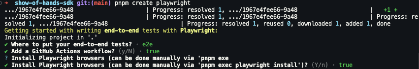
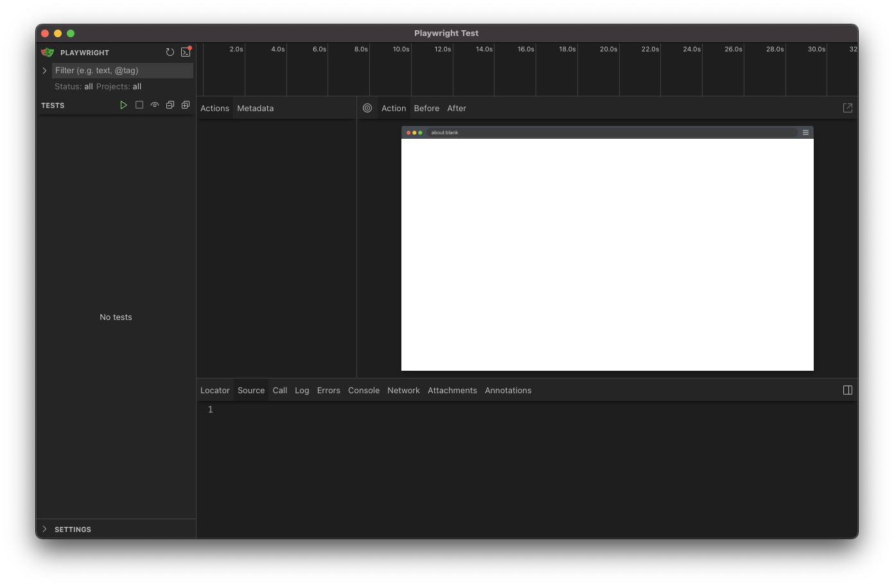
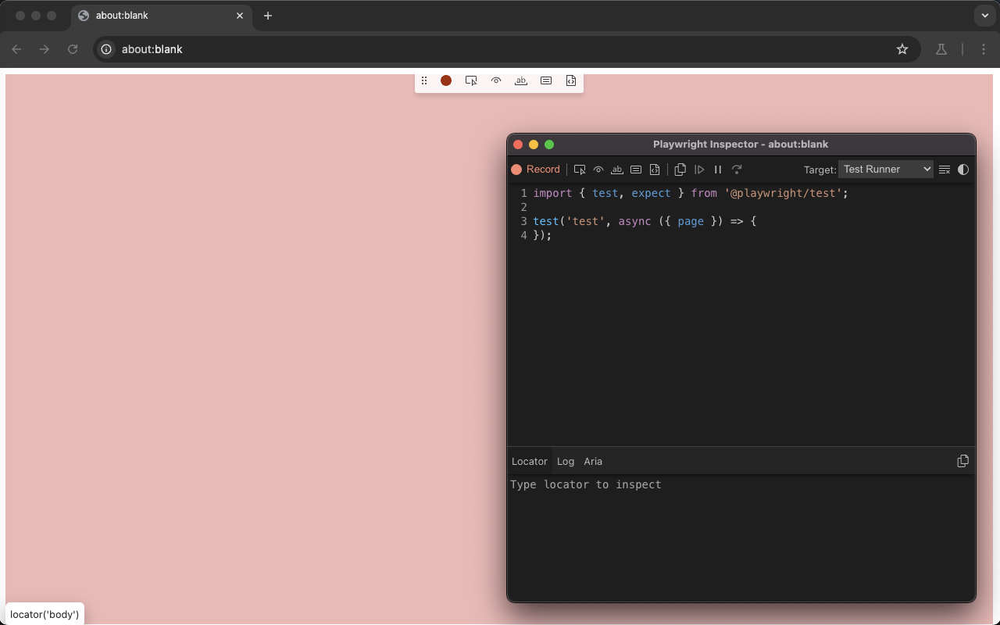

import { FileTree, Steps } from '@astrojs/starlight/components';

## Setup

<Steps>
1. Install Playwright:

    ```bash
    pnpm create playwright
    ```

    This will ask a few questions:

    - **Where to put your end-to-end tests?** If you're already using a **tests** directory for your [vitest unit tests](/guides/testing/vitest), then we recommend playing your Playwright tests within an **e2e** directory in the root of your project.
    - **Add a GitHub Actions workflow**
    - **Install Playwright browsers** You can also do this manually, but it's easier to say yes and have the script install it now.

    

2. Install the Cloudflare plugin for Playwright:

    ```bash
    pnpm i -D @cloudflare/playwright
    ```

3. In your `wrangler.jsonc` file, bind the browser:

    ```jsconc title="wrangler.jsonc"
    "browser": {
      "binding": "MYBROWSER"
    }
    ```

4. Within the `package.json` file, add the following scripts:

    ```json title="package.json"
    "scripts": {
      ...
      "e2e": "playwright test",
      "e2e:ui": "playwright test --ui",
      "e2e:chromium": "playwright test --project chromium",
      "e2e:firefox": "playwright test --project firefox",
      "e2e:webkit": "playwright test --project webkit",
      "e2e:file": "playwright test",
      "e2e:debug": "playwright test --debug",
      "e2e:codegen": "playwright codegen"
    }
    ```

    Below, I'll walk through each of these settings in more depth

</Steps>

## Playwright UI

Playwright UI Mode provides an intuitive visual interface for running, debugging, and authoring end-to-end tests. This interactive experience allows developers to:

- Watch tests execute in real-time with a visual display of each step
- Debug tests with time-travel capabilities to inspect the DOM at any point
- Generate tests by recording interactions with your application
- Trace test execution with screenshots, network requests, and console logs
- Pick locators easily with an interactive element selector tool
- Edit tests directly in the UI with immediate feedback
- Explore your application alongside running tests in a split-view format

To start the Playwright UI, run the following command:

```bash
pnpm e2e:ui
```

As soon as you run the command, a Chromium window will open and you'll be able to see the tests run in real-time.



## Playwright Chromium, Firefox, and webkit

You can run the tests for a specific browser by running one of the following commands:

```bash
pnpm e2e:chromium
pnpm e2e:firefox
pnpm e2e:webkit
```

## Playwright File

You can run tests for a specific file by running the following command:

```bash
pnpm e2e:file <file-name>
```


## Playwright debug

The debug command will open a new browser window and allow you to step through the tests, making it easier to debug your tests.

```bash
pnpm e2e:debug
```


## Playwright Codegen

Playwright Codegen is a tool that allows you to record and generate tests for your application.

To start codegen, run the following command:

```bash
pnpm e2e:codegen
```

This will open a two windows. One window contains your application, where you can start recording your interactions with the application. The other window contains the Playwright Codegen UI, where you can see the recorded interactions.



You can copy the generated code and paste it into your test file.

---

## Further Reading

- [Official Playwright Documentation](https://playwright.dev/)
- [Playwright on the Cloudflare Documentation](https://developers.cloudflare.com/browser-rendering/platform/playwright/)

