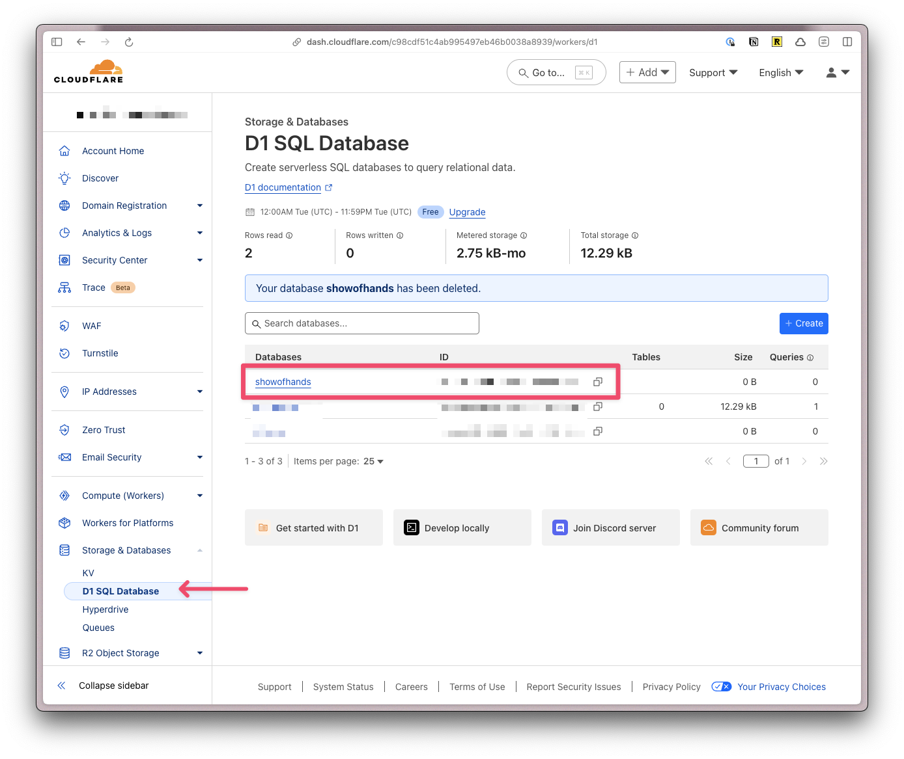

## Set up your Project

Clone the repo

```shell
git clone https://github.com/redwoodjs/sdk.git
```

Run

```shell
pnpm install
```

Go into the `sdk` directory and build the project

```shell
cd sdk
pnpm build
```

Duplicate the `starters/prisma` directory.

Rename the folder and move into the `experiments` directory

Add your new project to the `pnpm-workspace.yaml` file. (_This example assumes your new project is called `showofhands`_)

```yaml "experiments/showofhands"
packages:
  - "sdk"
  - "experiments/billable"
  - "experiments/yt-dos"
  - "experiments/showofhands"
  - "starters/minimal"
  - "starters/prisma"
```

## Download Dependencies

```shell
pnpm install
```
## Update your Project Name

Change the name of your experiment’s `package.json`. For example:

```json "@redwoodjs/starter-prisma"
  "name": "@redwoodjs/starter-prisma",
```

Update the path in this script:

```json "__change-me__"
"__reset:reinstall": "(cd ../../ && rm -rf node_modules && rm -rf sdk/node_modules && rm -rf experiments/__change-me__/node_modules && pnpm install)",
```

Within your experiment’s `wrangler.toml` file, change every instance of `__change_me__`

For example:

```toml "__change_me__"
#:schema node_modules/wrangler/config-schema.json
name = "__change_me__"
main = "src/worker.tsx"
compatibility_date = "2024-09-23"
compatibility_flags = ["nodejs_compat"]
assets = { binding = "ASSETS", directory = "public" }

workers_dev = false
routes = [
  { pattern = "__change_me__", custom_domain = true }
]

[observability]
enabled = true

[[d1_databases]]
binding = "DB"
database_name = "__change_me__"
database_id = "__change_me__"

[[r2_buckets]]
bucket_name = "__change_me__"
binding = "R2"

[[migrations]]
tag = "v1"
new_classes = [ "SessionDO" ]

[vars]
SECRET_KEY = "secret"
APP_URL="https://__change_me__"
```

You’ll need a [Cloudflare account](https://www.cloudflare.com/). We’re using their d1 service to handle the database.

## Generate a New Database

```shell "NAME_OF_DB"
npx wrangler d1 create NAME_OF_DB
```


Copy the `database_id` and paste it into your project’s `database_id` inside `wrangler.toml`:

```toml "__change_me__"
[[d1_databases]]
binding = "DB"
database_name = "__change_me__"
database_id = "__change_me__"
```

If you ever need to find this value, you can log into your Cloudflare account



## Update the Schema

Under `prisma/schema.prisma` we started a user model:

```prisma
model User {
  id                String    @id @default(uuid())
  email             String    @unique
  createdAt         DateTime  @default(now())
  updatedAt         DateTime? @updatedAt
}
```

You can adjust as needed.

## Run the Setup Commands and Migrations

Within the Terminal:

```shell
npx prisma generate
pnpm migrate:dev
pnpm migrate:new "initial migration"
pnpm migrate:dev
pnpm seed
```

- `npx prisma generate` is generating the Prisma Client based on the `schema.prisma` file.
- `pnpm migrate:dev` ensures that your local database is set up.
- `pnpm migrate:new "initial migration"` creates a migration.
- `pnpm migrate:dev` applies the migrations to your local database.
- `pnpm seed` seeds the database with the data in the `seed.ts` file.

Now, you can can run `pnpm dev`. You should see the "Hello World" message with a list of users in your database.

As you make additional changes to your database, your workflow will look like:

- Update your `schema.prisma` file
- Create the migration file: `pnpm migrate:new "MIGRATION MESSAGE"`
- Apply the migration `pnpm migrate:dev`

### Additional Resources

There are a few VS Code Plugins that make working with Prisma and SQLite a bit easier.

- [SQLite Viewer](https://marketplace.cursorapi.com/items?itemName=qwtel.sqlite-viewer)
- [Prisma](https://marketplace.visualstudio.com/items?itemName=Prisma.prisma)

I'm also a big fan of [Bee Keeper Studio](https://www.beekeeperstudio.io/). It's a SQL Editor and Database Manager. (FREE plan available)

## Further Reading

- [Prisma Documentation](https://www.prisma.io/docs)
