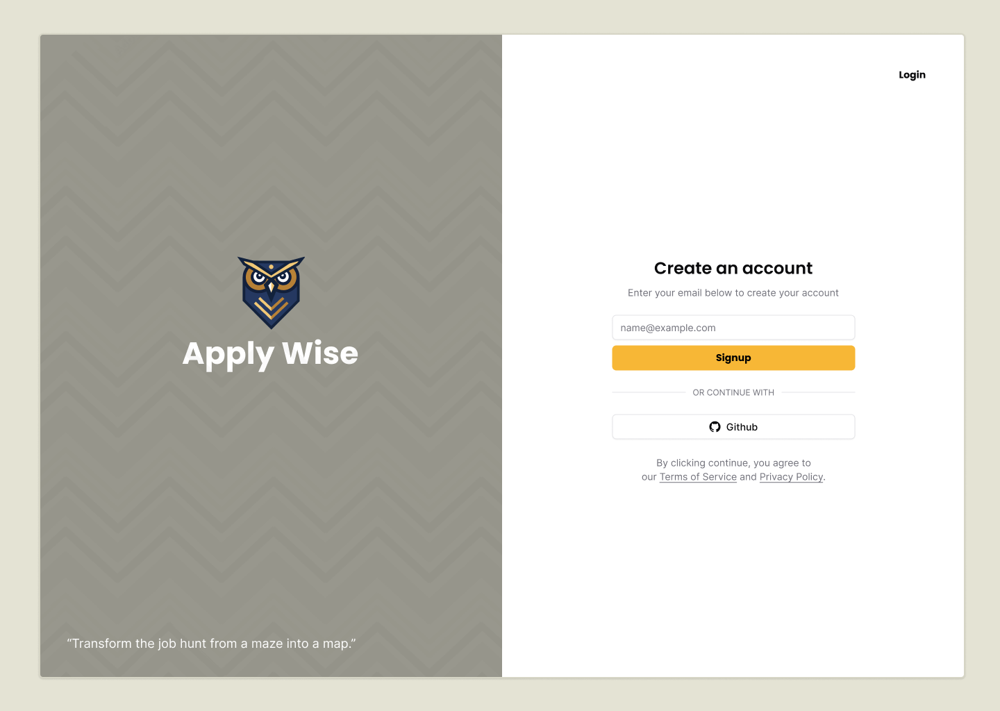
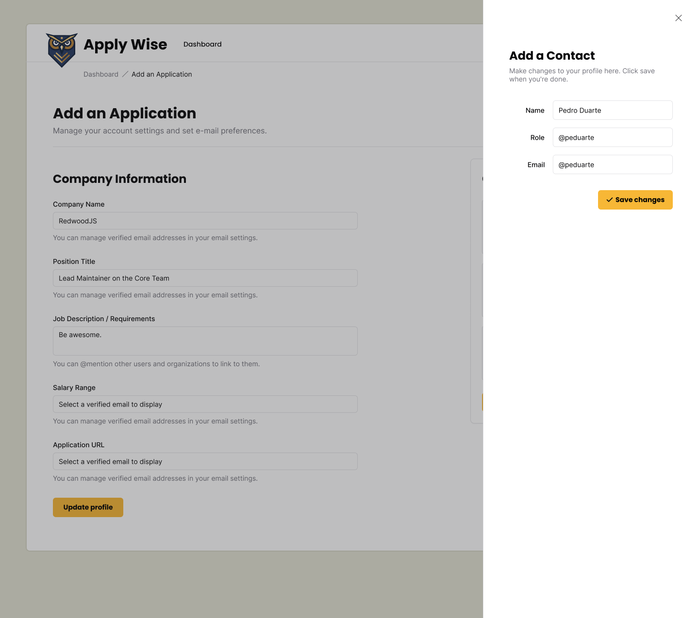

import { Aside } from '@astrojs/starlight/components';

{/* TODO: Create a video for this page */}
{/* TODO: Create a video of the finished product */}

## What We're Building and Why

This tutorial is designed for developers who want to learn how to build modern full-stack web applications using RedwoodSDK. Whether you're a frontend developer looking to expand into backend development, or a full-stack developer exploring new tools, you'll learn how to create a complete application from scratch.

At Redwood, we believe AI will revolutionize how people build applications. Personal software has the power to transform our daily lives. Applywise is a perfect example of this transformation - if you're searching for a new job, you need a tool to help manage all your opportunities.

In this tutorial, we'll walk through building Applywize from the ground up, covering everything from database design to user authentication to deployment. While experience with React and JavaScript is helpful, we'll explain core concepts along the way to ensure you can follow along successfully.

## Final Application Preview

The final application will feature the following:

### Login Page / User Management

- Sign up and create an account
- Log in securely
- Manage your profile
- Private data access

### Job Application Listing

- View all your job applications in a table.

### Add a Job Application

Add new job applications with key details:
- Company name
- Position title
- Job description/requirements
- Salary range (if available)
- Application URL
- Date applied
- Manage the Application Status (New, Applied, Interviewing, Offer, Rejected)
- Related contacts

- View application details
- Edit application details
- Delete applications you no longer want to track

### Contact Management

- Add contacts for each application
- View contact details
- Edit contact information
- Remove contacts

### Design Resources

<iframe style="border: 1px solid rgba(0, 0, 0, 0.1);" width="100%" height="450" src="https://embed.figma.com/design/nqBPIIfe0MO4W8zOfW4oae/Redwood-Reloaded-Tutorial?node-id=1-3&embed-host=share" allowfullscreen></iframe>

All UI designs for Applywize are available in Figma. There, you can view the complete design system, component library, and page layouts. This will help you understand how the final application should look and function before we start building. [Access the Figma design online](https://www.figma.com/design/nqBPIIfe0MO4W8zOfW4oae/Redwood-Reloaded-Tutorial?node-id=1-3&t=9gzbWUrBb2G3qdoa-1) or [download the Figma file](https://github.com/ahaywood/applywize/tree/main/figma).

I've also exported all the images from the Figma file and packaged them together. You can find them [here](https://github.com/redwoodjs/applywize/tree/main/assets).

## Technical Prerequisites

Before we start, you'll need:
- [Cloudflare account](https://www.cloudflare.com/plans/). They have a generous free tier that should include everything you need to follow along.
- [Node.js](https://nodejs.org/en/download/) version 22 or later installed on your machine.
- A Code Editor. [Cursor](https://www.cursor.com/) is currently our favorite.
- A Terminal. A lot of text editors have a terminal built-in. Or if you want a standalone, we like [Warp](https://warp.dev/) and [atuin.sh](https://atuin.sh/).
- Basic knowledge of:
  - JavaScript, TypeScript, and React
  - HTML and CSS
  - Using the command line
  - How databases work (but don't worry, we'll guide you)

### VS Code / Cursor / Windsurf Extensions

- [SQLite Viewer](https://marketplace.visualstudio.com/items?itemName=qwtel.sqlite-viewer)
- [ES7+ React/Redux/React-Native snippets](https://marketplace.visualstudio.com/items?itemName=dsznajder.es7-react-js-snippets)
- [Figma for VS Code](https://marketplace.visualstudio.com/items?itemName=figma.figma-vscode-extension)
- [Prisma](https://marketplace.visualstudio.com/items?itemName=Prisma.prisma)
- [Tailwind CSS IntelliSense](https://marketplace.visualstudio.com/items?itemName=bradlc.vscode-tailwindcss)

<Aside type="tip" title="Code on GitHub">
You can find the final code on [GitHub](https://github.com/redwoodjs/applywize).
</Aside>

## Further Reading

- [Using nvm to install Node.js](https://nodejs.org/en/download)
