import { FileTree, Aside, Steps, Tabs, TabItem } from '@astrojs/starlight/components';

import { PackageManagers } from "starlight-package-managers";

## Project Generation and Structure

The first thing we'll do is set up our project.

<Tabs syncKey="starlight-package-managers-pkg">
  <TabItem label="npm" icon="seti:npm">
  ```shell
  npx create-rwsdk applywize
  cd applywize
  npm install
  npm run dev
  ```
  </TabItem>
  <TabItem label="pnpm" icon="pnpm">
  ```shell
  npx create-rwsdk applywize
  cd applywize
  pnpm install
  pnpm dev
  ```
  </TabItem>
  <TabItem label="yarn" icon="seti:yarn">
  ```shell
  npx create-rwsdk applywize
  cd applywize
  yarn install
  yarn run dev
  ```
  </TabItem>
</Tabs>

Check it out! You're up and running!

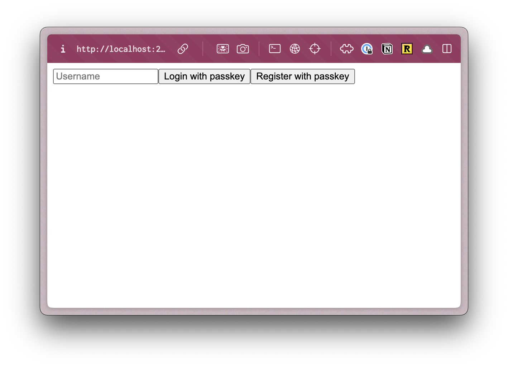

The commands you just ran created a directory called `applywize` with the RedwoodSDK standard starter project structure.


Inside, the `applywize` directory, you should have the following files and folders:

<FileTree>
- .cursor # Cursor rules
- .wrangler # Cloudflare configuration
- migrations # database migrations
  - 0001_init.sql # initial migration
- node_modules # dependencies
- prisma # prisma configuration
  - schema.prisma # database schema
- src
  - app
    - pages
      - Home.tsx # Home page
      - user
        - functions.ts # authentication functions
        - Login.tsx # Login page
        - routes.ts # authentication routes
      - shared
        - links.ts # list of links
    - Document.tsx # Main HTML document
    - headers.ts # Sets up page headers
  - scripts
    - seed.ts # seed the database
  - session # sets up sessions for authentication
    - durableObject.ts # sets up a Cloudflare Durable Object for a session
    - store.ts # sets up a store for working with sessions
  - client.tsx # initializes the client
  - db.ts # database client
  - worker.tsx # Cloudflare worker
- types
  - rw.d.ts # Redwood types
  - vite.d.ts # Vite types
- .dev.vars # environment variables for Cloudflare development
- .env # environment variables
- .env.example # example environment variables
- .gitignore # files to ignore in git
- .prettierrc # prettier configuration
- package.json # lists all the dependencies and scripts
- pnpm-lock.yaml # lock file for pnpm
- README.md # project overview
- tsconfig.json # TypeScript configuration
- vite.config.mts # Vite configuration
- worker-configuration.d.ts # Generated types based on your worker config
- wrangler.jsonc # Cloudflare configuration
</FileTree>

At first glance, this might feel a little overwhelming, but as we build out our project, it will be easy to see how all the pieces fit together.

<Aside type="note" title="Starter Projects">
  For the tutorial, we're starting with the standard starter project. When you start building your own projects, if you use a different starter template, the files and folders may vary slightly.
</Aside>

## Our Database

The first time you run `pnpm dev`, it creates the `.wrangler` directory. This directory is used by Cloudflare's Miniflare (your local Cloudflare environment). It contains your local database, caching information, and configuration data.

## Setting up TailwindCSS and shadcn/ui

Let's start by installing [TailwindCSS](https://tailwindcss.com/) and [shadcn/ui](https://ui.shadcn.com/).

**TailwindCSS** is a utility-first CSS framework that makes it easy to style your components.

**shadcn/ui** components is a library of pre-built components making it easier for us to focus on the functionality of our app, rather than the styling and building of components.

### TailwindCSS

Since the RedwoodSDK is based on React and Vite, we can work through the ["Using Vite" documentation](https://tailwindcss.com/docs/installation/using-vite).

<Steps>
1. Install Tailwind CSS
    <PackageManagers pkg="tailwindcss @tailwindcss/vite" />

2. Configure the Vite Plugin
    ```ts ins="import tailwindcss from '@tailwindcss/vite'" ins="tailwindcss()," title="vite.config.mts" ins={6-8} {2, 11}
    import { defineConfig } from "vite";
    import tailwindcss from '@tailwindcss/vite'
    import { redwood } from "rwsdk/vite";
    import { cloudflare } from "@cloudflare/vite-plugin";

    export default defineConfig({
      environments: {
        ssr: {},
      },
      plugins: [
        cloudflare({
          viteEnvironment: { name: "worker" },
        }),
        redwood(),
        tailwindcss(),
      ],
    });
    ```

    <Aside type="note" title="Environment Configuration">
    Tailwindcss currently uses [the non-deprecated internal `createResolver()` vite API method.](https://github.com/tailwindlabs/tailwindcss/blob/main/packages/%40tailwindcss-vite/src/index.ts#L22) [The code and its docstring indicate that it relies on an `ssr` being present](https://github.com/vitejs/vite/blob/c0e3dba3108e479ab839205cfb046db327bdaf43/packages/vite/src/node/config.ts#L1498).

    This isn't the case for us, since we only have a `worker` environment instead of `ssr`. To prevent builds from getting blocked on this, we stub out the ssr environment here.
    </Aside>

3. Import Tailwind CSS. (You'll need to create the `src/app/styles.css` file.)
    ```css title="src/app/styles.css"
    @import "tailwindcss";
    ```

4. Import the CSS file at the top of your file and include a `link` tag in the `head` of the `Document.tsx` file.
    ```tsx title="src/app/Document.tsx" {3}
    import styles from "./styles.css?url";
    ...
    <head>
      ...
      <link rel="stylesheet" href={styles} />
      ...
    </head>
    ```

5. Now, you can run `pnpm run dev` and go to `http://localhost:5173/user/login`.
    <PackageManagers
      type="run"
      args="dev"
    />

    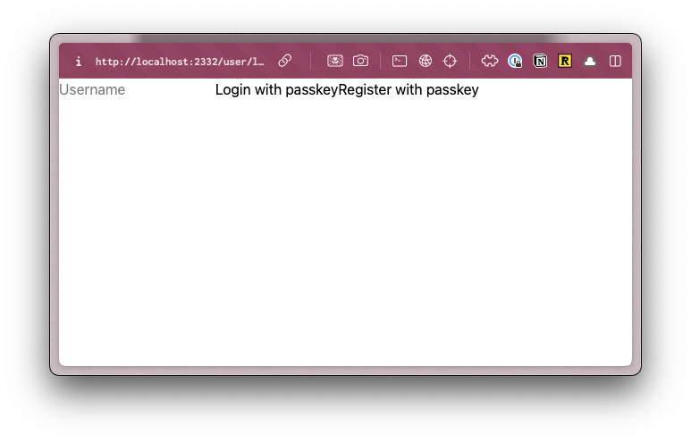
    For reference, before adding TailwindCSS, the login page looked like this:
    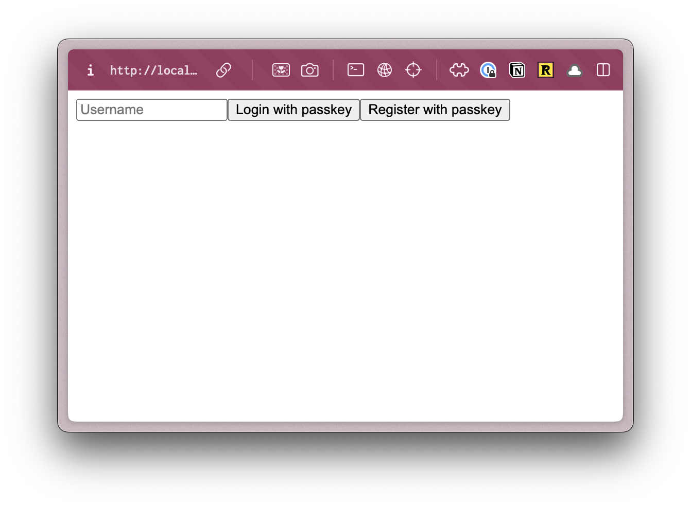
</Steps>

You can test this even further by going to the `src/app/pages/user/Login.tsx` file and adding an `h1` at the top of the return statement:
```tsx title="src/app/pages/user/Login.tsx" startLineNumber={62} collapse={4-17} {3}
return (
  <>
    <h1 className="text-4xl font-bold text-red-500">YOLO</h1>
    <input
      type="text"
      value={username}
      onChange={(e) => setUsername(e.target.value)}
      placeholder="Username"
    />
    <button onClick={handlePerformPasskeyLogin} disabled={isPending}>
      {isPending ? <>...</> : "Login with passkey"}
    </button>
    <button onClick={handlePerformPasskeyRegister} disabled={isPending}>
      {isPending ? <>...</> : "Register with passkey"}
    </button>
    {result && <div>{result}</div>}
  </>
);
```

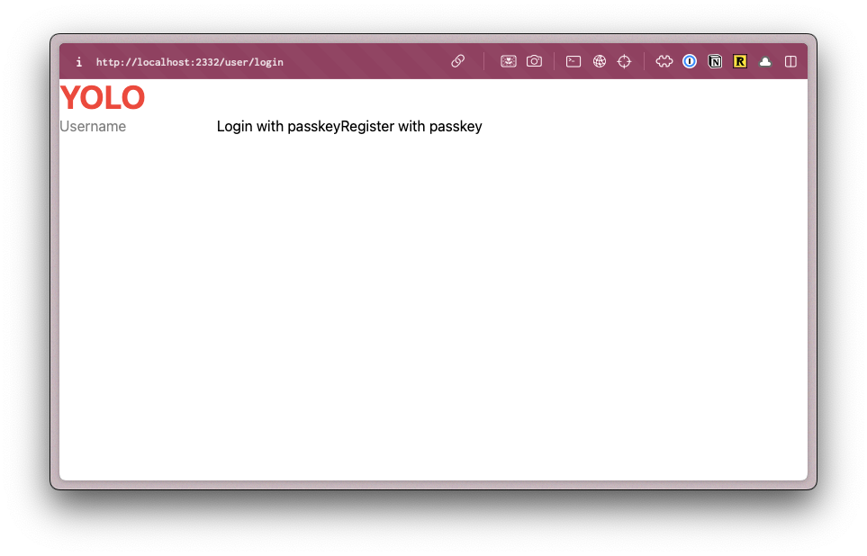

### Setting up Custom Fonts

First, let's add the fonts that we'll need for our project. We're using [Poppins](https://fonts.google.com/specimen/Poppins) and [Inter](https://fonts.google.com/specimen/Inter), both can be found on [Google Fonts](https://fonts.google.com/).

From the font specimen page, click on the **"Get Font"** button.

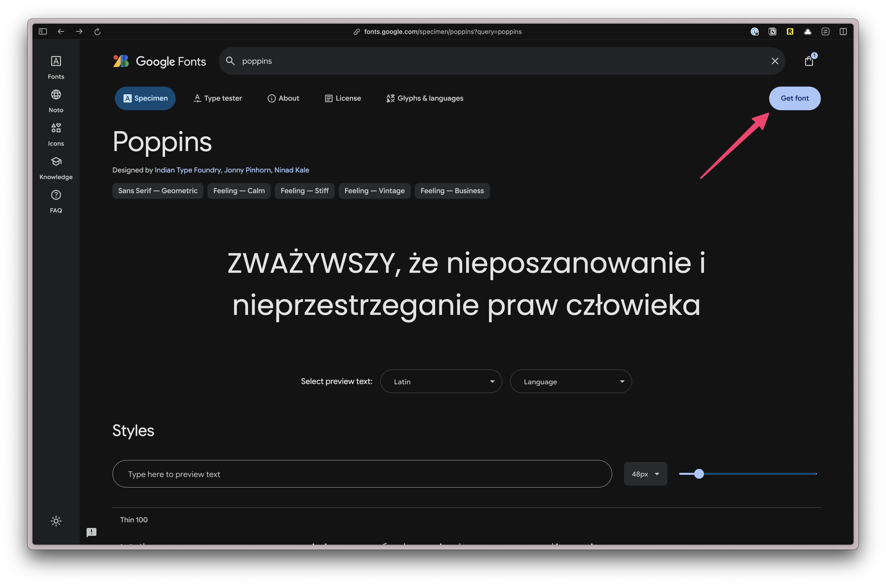

Once both fonts have been added, click on the **"View selected families" button** on the top right. Then, click on the "Get Embed Code" button.

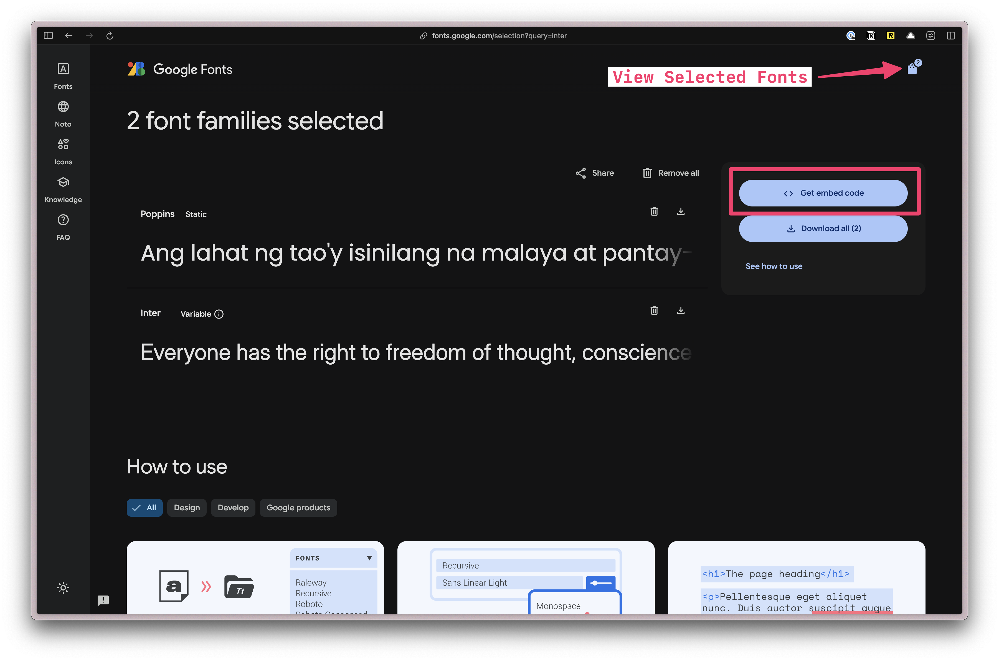

Next, let's only select the font weights that we'll need for our project.

Under **Poppins**, click on the **"Change Styles"** button. Turn everything off except for **"500"** and **"700"**.

Under **Inter**, if you click on the **"Change Styles"** button, you'll see the settings are slightly different. That's because this is variable font. A variable font is a single font file that contains multiple variations of a typeface, allowing for dynamic manipulation of the font. Meaning, nothing to do here.

Next, select the `@import` radio button and copy the code.

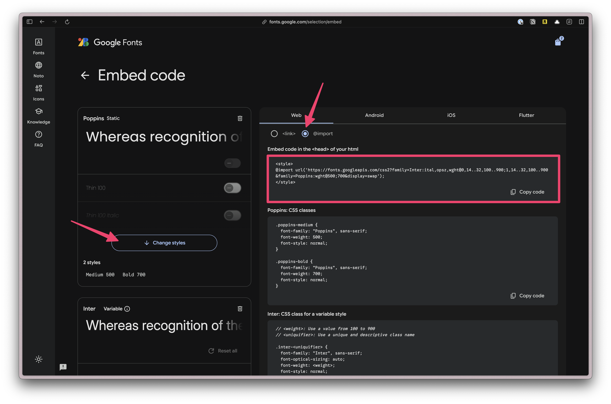

Paste the code at the top of our `styles.css` file. Then, remove the `<style>` tags:

```css title="src/app/styles.css" {1-2}
@import url('https://fonts.googleapis.com/css2?family=Poppins:wght@500;700&display=swap');
@import url('https://fonts.googleapis.com/css2?family=Inter:wght@400;700&display=swap');

@import "tailwindcss";
```

Next, we need to add a custom configuration. In TailwindCSS v4, all customizations happen in the CSS file, _not_ `tailwind.config.js`.

<Aside type="note" title="tailwind.config.js Support">
Technically, you can still use `tailwind.config.js`, but it's not recommended as long-term support is unknown.
</Aside>

Below the `@import "tailwindcss";` line, add the following:

```css title="src/app/styles.css" startLineNumber={6}
@theme {
  --font-display: "Poppins", sans-serif;
  --font-body: "Inter", sans-serif;
}
```

<Aside type="note" title="Theme Variables">
In Tailwind, all theme variables are defined inside the `@theme` directive. These influence which utility classes exist within our project.
You can find more information in the [TailwindCSS Docs.](https://tailwindcss.com/docs/theme)
</Aside>

If you're unsure how the font-family is written, you can find it in the CSS class definition on the Google Fonts page. Here, Poppins and Inter are both in quotes and capitalized.

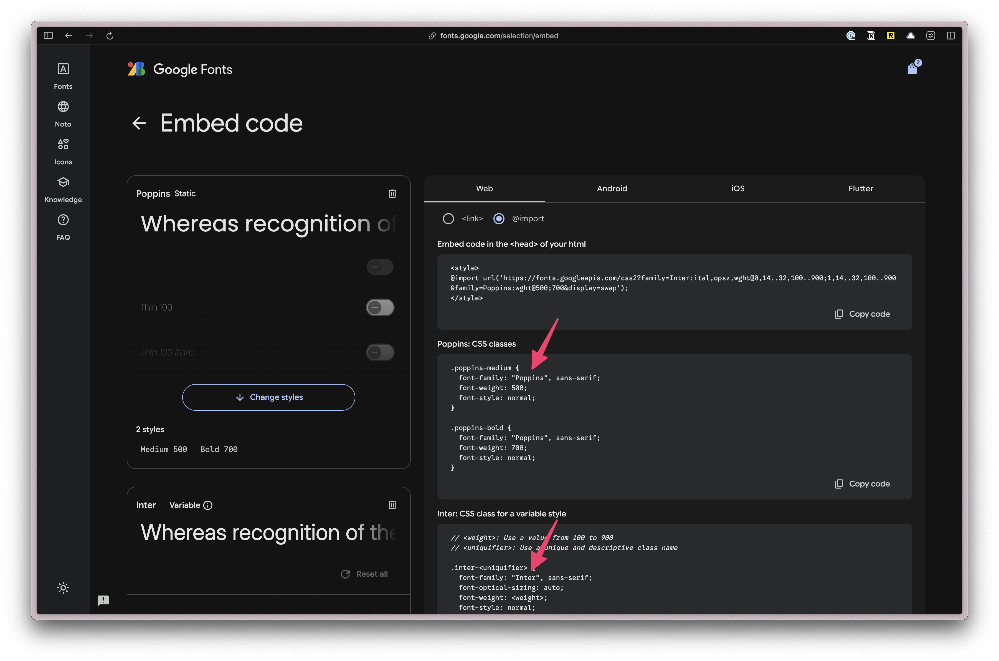

Now, you can use the class `font-display` and `font-body` in your project.

Before this will work in production, we need to update our security headers to allow `googleapis` and `fonts.gstatic`:

```tsx title="src/app/headers.ts" collapse={1-26} {30}
import { RouteMiddleware } from "rwsdk/router";

export const setCommonHeaders =
(): RouteMiddleware =>
({ response, rw: { nonce } }) => {
  if (!import.meta.env.VITE_IS_DEV_SERVER) {
    // Forces browsers to always use HTTPS for a specified time period (2 years)
    response.headers.set(
      "Strict-Transport-Security",
      "max-age=63072000; includeSubDomains; preload"
    );
  }

  // Forces browser to use the declared content-type instead of trying to guess/sniff it
  response.headers.set("X-Content-Type-Options", "nosniff");

  // Stops browsers from sending the referring webpage URL in HTTP headers
  response.headers.set("Referrer-Policy", "no-referrer");

  // Explicitly disables access to specific browser features/APIs
  response.headers.set(
    "Permissions-Policy",
    "geolocation=(), microphone=(), camera=()"
  );

  // Defines trusted sources for content loading and script execution:
  response.headers.set(
    "Content-Security-Policy",
    `default-src 'self'; script-src 'self' 'nonce-${nonce}' https://challenges.cloudflare.com; style-src 'self' 'unsafe-inline' https://fonts.googleapis.com; font-src 'self' https://fonts.gstatic.com; frame-src https://challenges.cloudflare.com; object-src 'none';`
  );
};
```

### Setting up our Custom Color Palette

Defining colors is similar, except we'll prepend each color value with `--color-`.

```css title="src/app/styles.css" showLineNumbers=false {3-14}
@theme {
  ...
  --color-bg: #e4e3d4;
  --color-border: #eeeef0;

  --color-primary: #f7b736;
  --color-secondary: #f1f1e8;
  --color-destructive: #ef533f;

  --color-tag-applied: #b1c7c0;
  --color-tag-interview: #da9b7c;
  --color-tag-new: #db9a9f;
  --color-tag-rejected: #e4e3d4;
  --color-tag-offer: #aae198;
}
---
We're using three different groups of colors:
- semantically named colors: background and border
- buttons: primary, secondary, and destructive
- tag colors: applied, interview, new, rejected, and offer
---
```

Now, we can use these colors for backgrounds (`bg-bg`), borders (`border-border`), and text (`text-destructive`).

<details>
<summary>
Full `styles.css` file
</summary>

```css title="src/app/styles.css"
@import url('https://fonts.googleapis.com/css2?family=Poppins:wght@500;700&display=swap');
@import url('https://fonts.googleapis.com/css2?family=Inter:wght@400;700&display=swap');

@import "tailwindcss";

@theme {
  --font-display: "Poppins", sans-serif;
  --font-body: "Inter", sans-serif;

  --color-bg: #e4e3d4;
  --color-border: #eeeef0;

  --color-primary: #f7b736;
  --color-secondary: #f1f1e8;
  --color-destructive: #ef533f;

  --color-tag-applied: #b1c7c0;
  --color-tag-interview: #da9b7c;
  --color-tag-new: #db9a9f;
  --color-tag-rejected: #e4e3d4;
  --color-tag-offer: #aae198;
}
```
</details>

Let's test to make sure our custom colors are working. On the `Login.tsx` file, let's change the React fragment `<></>` to a `<main>` tag and add a `className` of `bg-bg`:

```tsx title="src/app/pages/user/Login.tsx" collapse={4-18} startLineNumber={62} {3,19}
...
  return (
    <main className="bg-bg">
      <h1 className="text-4xl font-bold text-red-500">YOLO</h1>
      <input
        type="text"
        value={username}
        onChange={(e) => setUsername(e.target.value)}
        placeholder="Username"
      />
      <Button onClick={handlePerformPasskeyLogin} disabled={isPending}>
        {isPending ? <>...</> : "Login with passkey"}
      </Button>
      <Button onClick={handlePerformPasskeyRegister} disabled={isPending}>
        {isPending ? <>...</> : "Register with passkey"}
      </Button>
      {result && <div>{result}</div>}
    </main>
  );
}
```

When you visit http://localhost:5173/user/login, you should see a beige background color:

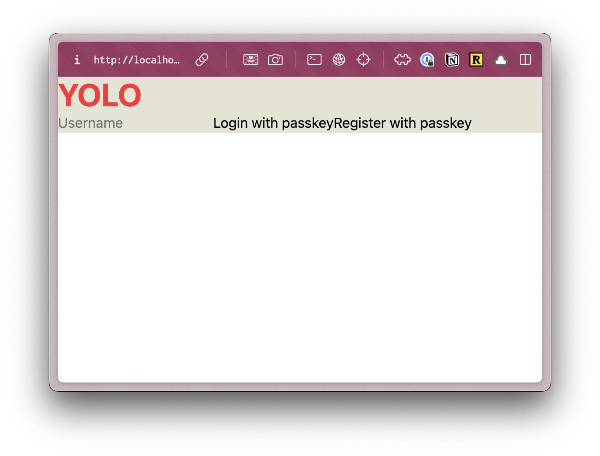

### shadcn/ui UI Components

You can also use the [shadcn/ui Vite Installation instructions](https://ui.shadcn.com/docs/installation/vite).

<Steps>
1. Install shadcn/ui
    <PackageManagers
      type="dlx"
      pkg="shadcn@latest"
      args="init"
    />

    It will ask you what theme you want to use. Let's go with **Neutral**.

    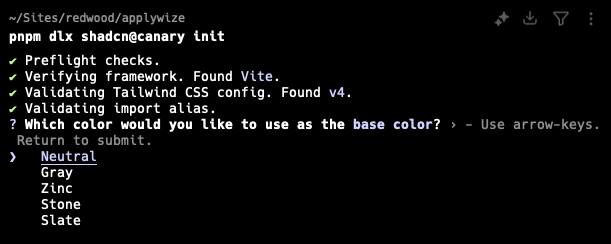

    This command will create a `components.json` file in the root of your project. It contains all the configuration for our shadcn/ui components.

    Let's modify the default paths so that it will put our components in the `src/app/components/ui` folder.

    ```json title="components.json" startLineNumber={12}
    ...
    "aliases": {
      "components": "@/app/components",
      "utils": "@/app/lib/utils",
      "ui": "@/app/components/ui",
      "lib": "@/app/lib",
      "hooks": "@/app/hooks"
    },
    ```

2. You should now be able to add components:
    <PackageManagers
      type="dlx"
      pkg="shadcn@latest"
      args="add"
    />

    Select the following by hitting the `Space` key:
    - Alert
    - Avatar
    - Badge
    - Breadcrumb
    - Button
    - Calendar
    - Dialog
    - Popover
    - Select
    - Sheet
    - Sonner
    - Table

    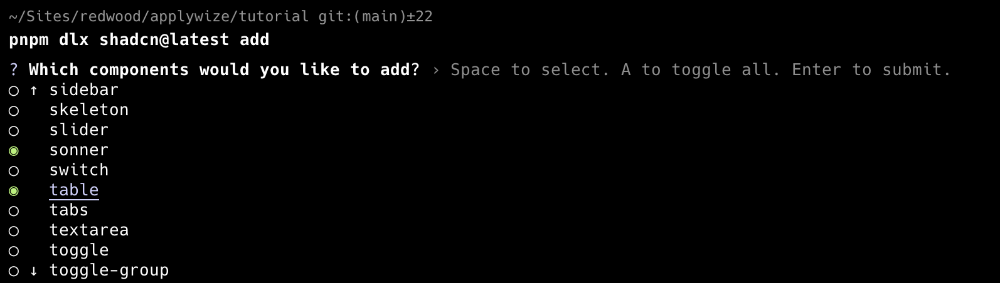

    When you've selected all the components you want to add, hit `Enter`. This will add all the components inside the `src/app/components/ui` folder.

    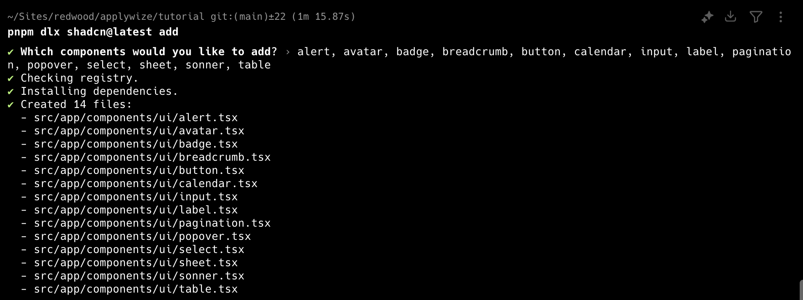

    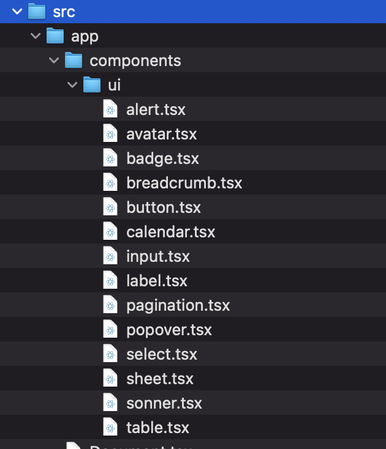

    <Aside type="tip" title="Adding shadcn/ui Components individually">
      Instead of selecting components from a list, you can also add them individually by running `pnpm dlx shadcn@latest add <component-name>`.
    </Aside>

    <Aside type="note" title="shadcn/ui Components">
      You can find a complete list of all the shadcn/ui components on their [official documentation](https://ui.shadcn.com/docs/components).
    </Aside>
</Steps>

<Aside type="caution" title="Restart Dev Server">
  After installing the shadcn/ui, you'll probably need to restart the dev server.

  ```bash
  pnpm dev
  ```
</Aside>

Even though we specified the path to the `lib` directory in the `components.json` file, the script still placed the folder inside the `src` directory. You'll need to move it into the `app` directory.

<FileTree>
- src/
  - app/
    - components/
      - ui/
    - lib/
      - utils.ts
</FileTree>

We also need the date picker component, but it's not available to install using the `pnpm dlx shadcn@latest add` command, probably due to dependencies.

Instead, we'll install it manually. It's built using the `<Popover />` and `<Calendar />` components and we just installed those.

Within the `src/app/components/ui` folder, create a new file called `datepicker.tsx`.

<Aside type="note" title="Component Naming Conventions">
  Normally, I like to capitalize and use Pascal Case for my component file names (`DatePicker.tsx`), but since this code is coming from shadcn/ui, I'll use their naming convention and put it in the `components/ui` folder.

  Any custom components we make, will live in the `components` directory and will use Pascal Case: `CustomComponent.tsx`.

  This helps delineate between our custom components and shadcn/ui components.

  Even though, we're creating the `datepicker.tsx` file manually, the code still originates from shadcn/ui, so it will still live in the `components/ui` folder.
</Aside>

Add the following code to the `datepicker.tsx` file:

```tsx title="src/app/components/ui/datepicker.tsx"
"use client"

import * as React from "react"
import { format } from "date-fns"
import { Calendar as CalendarIcon } from "lucide-react"

import { cn } from "@/app/lib/utils"
import { Button } from "@/app/components/ui/button"
import { Calendar } from "@/app/components/ui/calendar"
import {
  Popover,
  PopoverContent,
  PopoverTrigger,
} from "@/app/components/ui/popover"

export function DatePicker() {
  const [date, setDate] = React.useState<Date>()

  return (
    <Popover>
      <PopoverTrigger asChild>
        <Button
          variant={"outline"}
          className={cn(
            "w-[280px] justify-start text-left font-normal",
            !date && "text-muted-foreground"
          )}
        >
          <CalendarIcon className="mr-2 h-4 w-4" />
          {date ? format(date, "PPP") : <span>Pick a date</span>}
        </Button>
      </PopoverTrigger>
      <PopoverContent className="w-auto p-0">
        <Calendar
          mode="single"
          selected={date}
          onSelect={setDate}
          initialFocus
        />
      </PopoverContent>
    </Popover>
  )
}
```

- [Official Date Picker documentation.](https://ui.shadcn.com/docs/components/date-picker)
- If you copy and paste directly from the shadcn/ui documentation, though, you'll find a few path errors. In the code I provided, I adjusted the paths on some of the `@import` statements.

```diff
- import { cn } from "@/lib/utils"
+ import { cn } from "@/app/lib/utils"
- import { Button } from "@/components/ui/button"
+ import { Button } from "@/app/components/ui/button"
- import { Calendar } from "@/components/ui/calendar"
+ import { Calendar } from "@/app/components/ui/calendar"
- import {
-   Popover,
-   PopoverContent,
-   PopoverTrigger,
- } from "@/components/ui/popover"
+ import {
+   Popover,
+   PopoverContent,
+   PopoverTrigger,
+ } from "@/app/components/ui/popover"
```

- I also changed the component name to `DatePicker`:

```diff title="src/app/components/ui/datepicker.tsx" "DatePicker()" startLineNumber={16}
- export function DatePickerDemo() {
+ export function DatePicker() {
```

If you want to make sure everything is installed correctly, head over to the `src/app/pages/user/Login.tsx` file and let's use our shadcn/ui `Button` component.

Change the `<button>` tag to use a capital `B`. This will reference the `Button` component, instead of the standard HTML button. You'll also need to import the `Button` component at the top of the file.

```tsx title="src/app/pages/user/Login.tsx" collapse={5-12} "Button"
import { Button } from "@/app/components/ui/button";
...
return (
  <>
    <h1 className="text-4xl font-bold text-red-500">YOLO</h1>
    <input
      type="text"
      value={username}
      onChange={(e) => setUsername(e.target.value)}
      placeholder="Username"
    />
    <Button onClick={handlePerformPasskeyLogin} disabled={isPending}>
      {isPending ? <>...</> : "Login with passkey"}
    </Button>
    <Button onClick={handlePerformPasskeyRegister} disabled={isPending}>
      {isPending ? <>...</> : "Register with passkey"}
    </Button>
    {result && <div>{result}</div>}
  </>
);
```

Now, when you visit http://localhost:5173/user/login, you should see styled buttons:

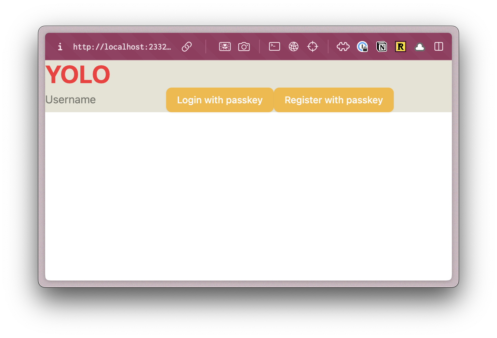

Perfect, now that we have our project setup, and all the frontend components installed, [let's start building the backend.](/tutorial/full-stack-app/database-setup)

<Aside type="tip" title="Code on GitHub">
You can find the final code for this step on [GitHub](https://github.com/redwoodjs/applywize/tree/main/end-of-2).
</Aside>

## Further reading

- [TailwindCSS](https://tailwindcss.com/)
- [shadcn/ui](https://ui.shadcn.com/)

