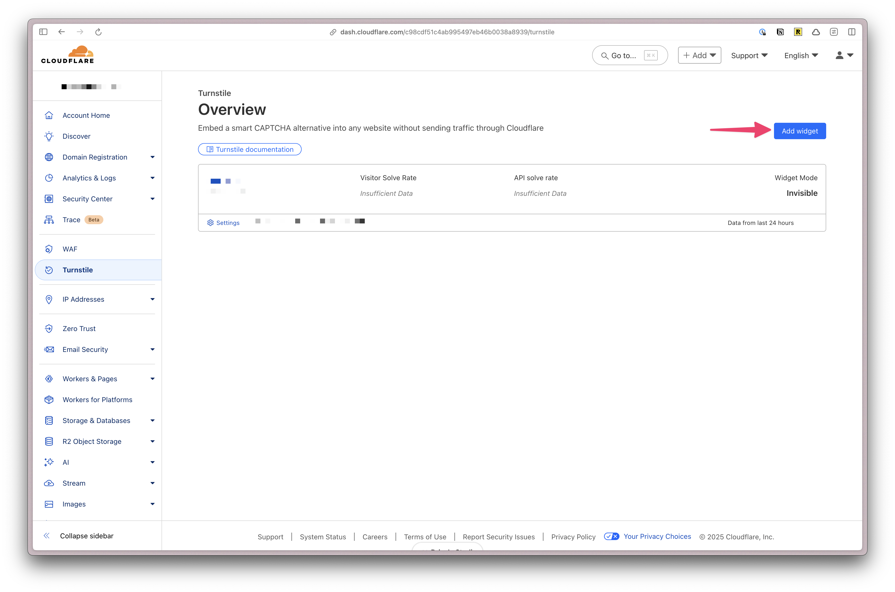
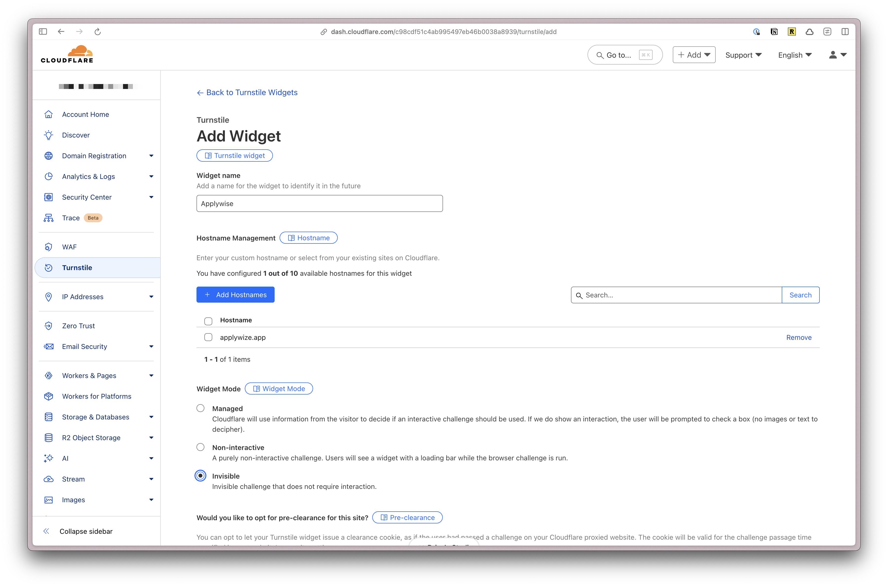
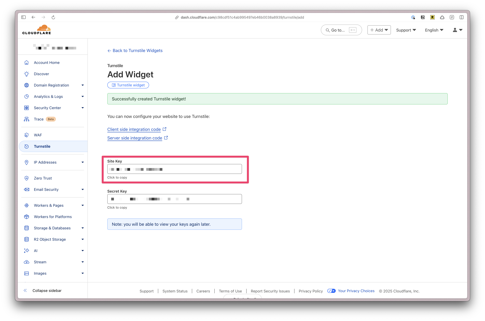
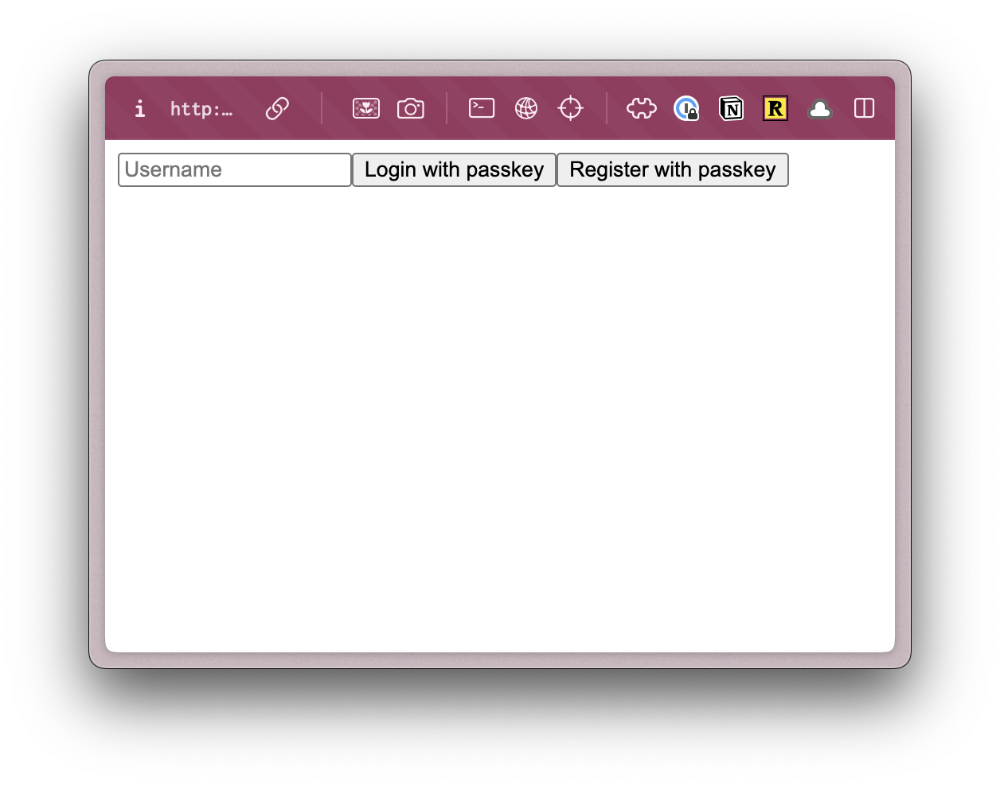

import { FileTree, Aside, Steps, Tabs, TabItem } from '@astrojs/starlight/components';

## Project Generation and Structure

The first thing we'll do is setup our project.

<Tabs>
  <TabItem label="pnpm">
  ```shell
  npx degit redwoodjs/sdk/starters/passkey-auth applywize
  cd applywize
  pnpm install
  ```
  </TabItem>
  <TabItem label="npm">
  ```shell
  npx degit redwoodjs/sdk/starters/passkey-auth applywize
  cd applywize
  npm install
  ```
  </TabItem>
  <TabItem label="yarn">
  ```shell
  npx degit redwoodjs/sdk/starters/passkey-auth applywize
  cd applywize
  yarn install
  ```
  </TabItem>
</Tabs>

This will create a directory called `applywize` with the RedwoodSDK project structure.


Inside, the `applywize` directory, you should have the following files and folders:

<FileTree>
- README.md
- migrations # database migrations
  - 0001_init.sql
- package.json
- pnpm-lock.yaml
- prisma # database schema
  - schema.prisma
- src
  - app
    - Document.tsx # Main HTML document
    - headers.ts # Sets up page headers
    - pages
      - Home.tsx # Home page
      - auth
        - functions.ts # authentication functions
        - LoginPage.tsx # Login page
        - routes.ts # authentication routes
      - shared
        - links.ts # list of links
  - client.tsx
  - db.ts # database client
  - session # sets up sessions for authentication
  - worker.tsx # Cloudflare worker
- tsconfig.json
- types
  - vite.d.ts
- vite.config.mts
- worker-configuration.d.ts
- wrangler.jsonc # Cloudflare configuration
</FileTree>

<Aside type="note" title="Starter Projects">
  For the tutorial, we're starting with the [Pass Key Auth starter project](/reference/starters/passkey-auth/). However, when you start building your own projects, if you use a different starter template, the files and folders may vary slightly.
</Aside>

## Setting up our Database

First, we need to create a new D1 database:

```shell
npx wrangler d1 create applywize
```

Copy the database ID provided and paste it into your project's `wrangler.jsonc` file:

{/* TODO: Add a screenshot of the terminal */}

```jsonc title="wrangler.jsonc"
{
  "d1_databases": [
    {
      "binding": "DB",
      "database_name": "my-project-db",
      "database_id": "your-database-id",
    },
  ],
}
```

While we're in our `wrangler.jsonc` file, let's also update our worker name:
```jsonc title="wrangler.jsonc" startLineNumber={6}
"name": "applywize",
```

### Generating Secret Keys
Next, we need to generate a strong `SECRET_KEY` for signing session IDs. You can generate a secure random key using OpenSSL. This command will generate a 32-byte random key and encode it as a base64 string.

```shell
openssl rand -base64 32
```

Then set this key as a Cloudflare secret, where `SECRET_KEY` is the name of the key. It will prompt us for the random string we generated.

```shell
wrangler secret put SECRET_KEY
```

<Aside type="caution" title="Secrets">
  Never use the same secret key for development and production environments, and avoid committing your secret keys to version control.
</Aside>

For production, set your domain as the `RP_ID` via Cloudflare secrets:

```shell
wrangler secret put RP_ID
```

When prompted, enter your production domain (e.g., my-app.example.com).

<Aside type="caution" title="RP_ID">
The RP_ID must be a valid domain that matches your application's origin. For security reasons, WebAuthn will not work if these don't match.
</Aside>

### Setting up Cloudflare Turnstile
Next, let's set up Cloudflare Turnstile for bot protection.

<Steps>
1. Visit [Cloudflare Turnstile Dashboard](https://dash.cloudflare.com/?to=/:account/turnstile).
    
2. Create a new Turnstile widget:
    - Set Widget Mode to **Invisible**. This will prevent users from having to solve a challenge or see the widget loading bar.
    - Add your application's hostname to Allowed hostnames, e.g., my-project-name.example.com
    
    - Mark "Would you like to opt for pre-clearance for this site?" as **No**.
3. After you click the **Create** button, you'll be redirected to the confirmation screen with your **Site Key** and **Secret Key**.
    
4. Copy your Site Key and paste it into your application's `LoginPage.tsx`. This is defined on line 18.
    ```tsx title="src/app/pages/auth/LoginPage.tsx" startLineNumber={18}
    const TURNSTILE_SITE_KEY = "<YOUR_SITE_KEY>";
    ```
5. Set your Turnstile Secret Key via Cloudflare secrets for production:
    ```shell
    wrangler secret put TURNSTILE_SECRET_KEY
    ```
    When prompted, enter your Turnstile Secret Key.
6. Our starter kit already has a couple of tables set up, to support the authentication process. This will set up Prisma and `migrate:dev` will create a `.wrangler` file within our project and setup the Cloudflare d1 database locally. (More on Prisma, migrations, and databases later.)
    ```shell
    npx prisma generate
    pnpm migrate:dev
    ```
7. Let's make sure everything is working. Run the following command to start the development server:
    ```shell
    pnpm dev
    ```
    This should launch within your browser:
    
</Steps>

<Aside type="caution" title="Troubleshooting">
If you get an error message the first time you run `pnpm dev`, you  might have some stale cookies. Inside your developer tools, delete any existing cookies and try again.

If you're using a Chrome based browser, click on the **Application** tab, then **Cookies**. Right click on the cookie and select **Delete** for each cookie.

</Aside>

## Setting up TailwindCSS and ShadCN

Now, let's install [TailwindCSS](https://tailwindcss.com/) and [ShadCN](https://ui.shadcn.com/).

**TailwindCSS** is a utility-first CSS framework that makes it easy to style your components.

**ShadCN** components is a library of pre-built components making it easier for us to focus on the functionality of our app, rather than the styling and building of components.

### TailwindCSS

Since the RedwoodSDK is based on React and Vite, we can work through the ["Using Vite" documentation](https://tailwindcss.com/docs/installation/using-vite).

<Steps>
1. Install Tailwind CSS
    <Tabs>
    <TabItem label="pnpm">
    ```bash
    pnpm install tailwindcss @tailwindcss/vite
    ```
    </TabItem>
    <TabItem label="npm">
    ```bash
    npm install tailwindcss @tailwindcss/vite
    ```
    </TabItem>
    <TabItem label="yarn">
    ```bash
    yarn install tailwindcss @tailwindcss/vite
    ```
    </TabItem>
    </Tabs>

2. Configure the Vite Plugin
    ```ts ins="import tailwindcss from '@tailwindcss/vite'" ins="tailwindcss()," title="vite.config.mts"
    import { defineConfig } from "vite";
    import tailwindcss from '@tailwindcss/vite'
    import { redwood } from "@redwoodjs/sdk/vite";

    export default defineConfig({
      plugins: [
        redwood(),
        tailwindcss(),
      ],
    });
    ```

3. Import Tailwind CSS. (You'll need to create the `src/app/styles.css` file.)
    ```css title="src/app/styles.css"
    @import "tailwindcss";
    ```

4. Add the Tailwind CSS inside the `head` tag in the `Document.tsx` file.
    ```tsx title="src/app/Document.tsx" {3}
    <head>
      ...
      <link rel="stylesheet" href="/src/app/styles.css" />
      ...
    </head>
    ```

5. Now, you can run `pnpm run dev` and the "Hello World" text should look different.
    ```bash
    pnpm run dev
    ```
</Steps>

You can test to make sure this is working by going to the `src/app/pages/auth/LoginPage.tsx` file and adding an `h1` at the top of the return statement:
```tsx title="src/app/pages/auth/LoginPage.tsx" collapse={4-17} {3}
return (
  <>
    <h1 className="text-4xl font-bold text-red-500">YOLO</h1>
    <div ref={turnstile.ref} />
    <input
      type="text"
      value={username}
      onChange={(e) => setUsername(e.target.value)}
      placeholder="Username"
    />
    <button onClick={handlePerformPasskeyLogin} disabled={isPending}>
      {isPending ? <>...</> : "Login with passkey"}
    </button>
    <button onClick={handlePerformPasskeyRegister} disabled={isPending}>
      {isPending ? <>...</> : "Register with passkey"}
    </button>
    {result && <div>{result}</div>}
  </>
);
```


### Setting up Custom Fonts

First, let's add the fonts that we'll need for our project. We're using [Poppins](https://fonts.google.com/specimen/Poppins) and [Inter](https://fonts.google.com/specimen/Inter), both can be found on [Google Fonts](https://fonts.google.com/).

From the font specimen page, click on the **"Get Font"** button.


Once both fonts have been added, click on the **"View selected families" button** on the top right. Then, click on the "Get Embed Code" button.


Next, let's only select the font weights that we'll need for our project.

Under **Poppins**, click on the **"Change Styles"** button. Turn everything off except for **"500"** and **"700"**.

Under **Inter**, if you click on the **"Change Styles"** button, you'll see the settings are slightly different. That's because this is variable font. A variable font is a single font file that contains multiple variations of a typeface, allowing for dynamic manipulation of the font. Meaning, nothing to do here.

Next, select the `@import` radio button and copy the code.


Paste the code at the top of our `styles.css` file. Then, remove the `<style>` tags:

```css title="src/app/styles.css" {1-2}
@import url('https://fonts.googleapis.com/css2?family=Poppins:wght@500;700&display=swap');
@import url('https://fonts.googleapis.com/css2?family=Inter:wght@400;700&display=swap');

@import "tailwindcss";
```

Next, we need to add a custom configuration. In TailwindCSS v4, all customizations happen in the CSS file, _not_ `tailwind.config.js`.

<Aside type="note" title="tailwind.config.js Support">
Technically, you can still use `tailwind.config.js`, but it's not recommended as long-term support is unknown.
</Aside>

Below the `@import "tailwindcss";` line, add the following:

```css title="src/app/styles.css"
@theme {
  --font-display: "Poppins", sans-serif;
  --font-body: "Inter", sans-serif;
}
```

<Aside type="note" title="Theme Variables">
In Tailwind, all theme variables are defined inside the `@theme` directive. These influence which utility classes exist within our project.
You can find more information in the [TailwindCSS Docs.](https://tailwindcss.com/docs/theme)
</Aside>

If you're unsure how the font-family is written, you can find it in the CSS class definition on the Google Fonts page. Here, Poppins and Inter are both in quotes and capitalized.


Now, you can use the class `font-display` and `font-body` in your project.

### Setting up our Custom Color Palette

Defining colors is similar, except we'll prepend each color value with `--color-`.

```css title="src/app/styles.css" {3-14}
@theme {
  ...
  --color-bg: #e4e3d4;
  --color-border: #eeeef0;

  --color-primary: #f7b736;
  --color-secondary: #f1f1e8;
  --color-destructive: #ef533f;

  --color-tag-applied: #b1c7c0;
  --color-tag-interview: #da9b7c;
  --color-tag-new: #db9a9f;
  --color-tag-rejected: #e4e3d4;
  --color-tag-offer: #aae198;
}
---
We're using three different groups of colors:
- semantically named colors: background and border
- buttons: primary, secondary, and destructive
- tag colors: applied, interview, new, rejected, and offer
---
```

Now, we can use these colors for backgrounds (`bg-bg`), borders (`border-border`), and text (`text-destructive`).

Your `styles.css` file should look like this:

```css title="src/app/styles.css"
@import url('https://fonts.googleapis.com/css2?family=Poppins:wght@500;700&display=swap');
@import url('https://fonts.googleapis.com/css2?family=Inter:wght@400;700&display=swap');

@import "tailwindcss";

@theme {
  --font-display: "Poppins", sans-serif;
  --font-body: "Inter", sans-serif;

  --color-bg: #e4e3d4;
  --color-border: #eeeef0;

  --color-primary: #f7b736;
  --color-secondary: #f1f1e8;
  --color-destructive: #ef533f;

  --color-tag-applied: #b1c7c0;
  --color-tag-interview: #da9b7c;
  --color-tag-new: #db9a9f;
  --color-tag-rejected: #e4e3d4;
  --color-tag-offer: #aae198;
}
```

Let's test to make sure this is working. On the `LoginPage.tsx` file, let's change the React fragment `<></>` to a `<main>` tag and add a `className` of `bg-bg`:

```tsx title="src/app/pages/auth/LoginPage.tsx" collapse={4-18} startLineNumber={63} {3,19}
...
  return (
    <main className="bg-bg">
      <h1 className="text-4xl font-bold text-red-500">YOLO</h1>
      <div ref={turnstile.ref} />
      <input
        type="text"
        value={username}
        onChange={(e) => setUsername(e.target.value)}
        placeholder="Username"
      />
      <Button onClick={handlePerformPasskeyLogin} disabled={isPending}>
        {isPending ? <>...</> : "Login with passkey"}
      </Button>
      <Button onClick={handlePerformPasskeyRegister} disabled={isPending}>
        {isPending ? <>...</> : "Register with passkey"}
      </Button>
      {result && <div>{result}</div>}
    </main>
  );
}
```

When you visit https://localhost:4321/user/login, you should see a beige background color:


### ShadCN UI Components

You can also use the [ShadCN Vite Installation instructions](https://ui.shadcn.com/docs/installation/vite).

<Steps>
1. Install ShadCN
    ```bash
    pnpm dlx shadcn@canary init
    ```

    It will ask you what theme you want to use. Let's go with **Neutral**.

    

    This command will create a `components.json` file in the root of your project. It contains all the configuration for our ShadCN components.

    Let's modify the default paths so that it will put our components in the `src/app/components/ui` folder.

    ```json title="components.json"
    ...
    "aliases": {
      "components": "@/app/components",
      "utils": "@/app/lib/utils",
      "ui": "@/app/components/ui",
      "lib": "@/app/lib",
      "hooks": "@/app/hooks"
    },
    ```

2. Add path aliases to `tsconfig.json`:
    ```diff title="tsconfig.json"
    {
      "compilerOptions": {
    +   "baseUrl": ".",
        "paths": {
          "@/*": ["./src/*"]
        }
      }
    }
    ```
4. Install `@types/node`
    ```bash
    pnpm add -D @types/node
    ```
5. Add resolve alias config to `vite.config.ts`:
    ```diff title="vite.config.ts"
    +import path from "path"
    import tailwindcss from "@tailwindcss/vite"
    +import react from "@vitejs/plugin-react"
    import { defineConfig } from "vite"

    export default defineConfig({
      plugins: [react(), tailwindcss()],
    + resolve: {
    +   alias: {
    +     "@": path.resolve(__dirname, "./src"),
    +   },
    + },
    )
    ```
6. You should now be able to add components:
    ```bash
    pnpm dlx shadcn@canary add
    ```

    Select the following by hitting the `Space` key:
    - Alert
    - Avatar
    - Badge
    - Breadcrumb
    - Button
    - Calendar
    - Input
    - Label
    - Pagination
    - Popover
    - Select
    - Sheet
    - Sonner
    - Table

    When you've selected all the components you want to add, hit `Enter`. This will add all the components inside the `src/app/components/ui` folder.

    This will install all of our components into the `src/app/components/ui` folder.

    <Aside type="tip" title="Adding ShadCN Components individually">
      Instead of selecting components from a list, you can also add them individually by running `pnpm dlx shadcn@canary add <component-name>`.
    </Aside>

    <Aside type="note" title="ShadCN Components">
      You can find a list of all the components [here](https://ui.shadcn.com/docs/components).
    </Aside>
</Steps>

We'll also need the date picker component, but it can't be installed using the `pnpm dlx shadcn@canary add` command.

Instead, we'll need to install it manually. It's built using the `<Popover />` and `<Calendar />` components and we just installed those!

Within the `src/app/components/ui` folder, create a new file called `DatePicker.tsx` and add the following code:

```tsx title="src/app/components/ui/DatePicker.tsx"
"use client"

import * as React from "react"
import { format } from "date-fns"
import { Calendar as CalendarIcon } from "lucide-react"

import { cn } from "@/lib/utils"
import { Button } from "@/components/ui/button"
import { Calendar } from "@/components/ui/calendar"
import {
  Popover,
  PopoverContent,
  PopoverTrigger,
} from "@/components/ui/popover"

export function DatePickerDemo() {
  const [date, setDate] = React.useState<Date>()

  return (
    <Popover>
      <PopoverTrigger asChild>
        <Button
          variant={"outline"}
          className={cn(
            "w-[280px] justify-start text-left font-normal",
            !date && "text-muted-foreground"
          )}
        >
          <CalendarIcon className="mr-2 h-4 w-4" />
          {date ? format(date, "PPP") : <span>Pick a date</span>}
        </Button>
      </PopoverTrigger>
      <PopoverContent className="w-auto p-0">
        <Calendar
          mode="single"
          selected={date}
          onSelect={setDate}
          initialFocus
        />
      </PopoverContent>
    </Popover>
  )
}
---
[Official Date Picker documentation.](https://ui.shadcn.com/docs/components/date-picker)
---
```

If you want to make sure everything is installed correctly, head over to the `src/app/pages/auth/LoginPage.tsx` file and let's use our `Button` component.

Change the `<button>` tag to use a capital `B`. This will reference the `Button` component, instead of the standard HTML button. You'll also need to import the `Button` component at the top of the file.

```tsx title="src/app/pages/auth/LoginPage.tsx" collapse={5-12}
import { Button } from "@/app/components/ui/button";
...
return (
  <>
    <h1 className="text-4xl font-bold text-red-500">YOLO</h1>
    <div ref={turnstile.ref} />
    <input
      type="text"
      value={username}
      onChange={(e) => setUsername(e.target.value)}
      placeholder="Username"
    />
    <Button onClick={handlePerformPasskeyLogin} disabled={isPending}>
      {isPending ? <>...</> : "Login with passkey"}
    </Button>
    <Button onClick={handlePerformPasskeyRegister} disabled={isPending}>
      {isPending ? <>...</> : "Register with passkey"}
    </Button>
    {result && <div>{result}</div>}
  </>
);
```

Now, when you visit https://localhost:4321/user/login, you should see buttons with our custom primary color:


Perfect, now that we have our project setup, and all the frontend components installed, [let's start building the backend.](/tutorial/full-stack-app/database-setup)

<Aside type="tip" title="Code on GitHub">
You can find the final code for this step on [GitHub](https://github.com/redwoodjs/applywize).
</Aside>

## Further reading

- [TailwindCSS](https://tailwindcss.com/)
- [ShadCN](https://ui.shadcn.com/)

