{/* TODO: Claude made some recommendations for making the content better: https://claude.ai/share/e52d53ca-f49f-4f36-9bc4-30da1f345945 */}

import { Aside, FileTree } from '@astrojs/starlight/components';

import { PackageManagers } from "starlight-package-managers";

## Setting up our Database Tables or Models

For this project, we'll use [Prisma](https://www.prisma.io/) as our ORM (Object Relational Mapper). This makes it easy to define our database and generate migrations.

<Aside type="note" title="What's a migration?">
  A migration is a change to the database schema. It's a way to keep track of the changes we make to the database.

  One of the great things about using Prisma is that it generates the migrations and SQL code so we don't need to. We simply update the schema, and it handles the rest.
</Aside>

I like to start by going through the [application design files](https://www.figma.com/design/nqBPIIfe0MO4W8zOfW4oae/Redwood-Reloaded-Tutorial?node-id=1-3&t=9gzbWUrBb2G3qdoa-1) and making a list of all the tables (models) and fields we need.

Each model represents the type of data that will be stored in the database.

We need models for:

1. Users
2. Job Applications

**The "trick" with database design is to prevent duplication.** For example, we want to store the company information for each job application. There's a chance we'll have multiple job applications for the same company. If we store the company information directly in the `Application` model, we'll have duplicate entries. This could create all kinds of problems. For example, is it `RedwoodSDK`, `redwoodsdk`, `redwood-sdk`, or `RedwoodSdk`?

Instead, we can store the company information in a separate model, with a single entry for each company, and link it to the relevant job application.

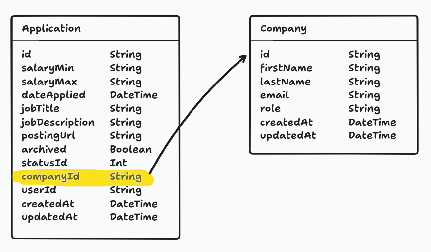

The same applies to Contacts. We can create a separate model and create a relationship between the contact and the related company.

3. Companies
4. Contacts

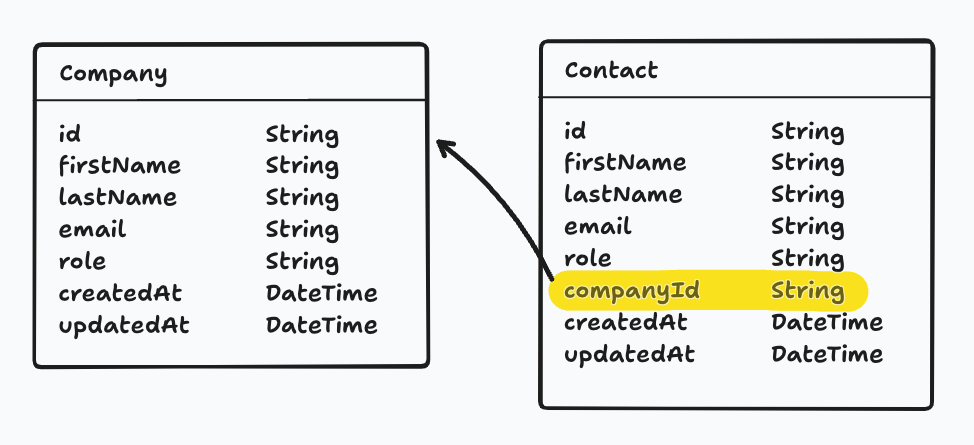

Application Statuses are a little different, but the same principle applies. To avoid duplication, we will give statuses their own model. We will have a set of fixed status options (New, Applied, Interviewing, Offer, and Rejected).

5. Application Statuses

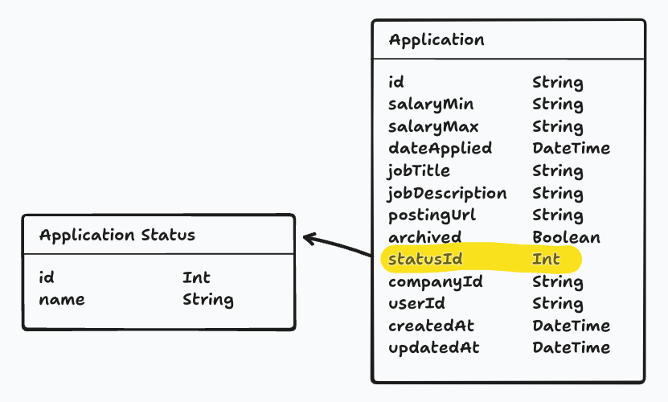

## Columns

Now, that we know what our models are, we need to create the columns. What are the pieces of data we need to store for each model?

We've already alluded to the data that we'll need within the relationship diagrams, but let's take a closer look.

Most tables I create include an `id`, `createdAt`, and `updatedAt` field.
- `id` - We need a way to uniquely identify each record or row in the database.
- `createdAt` - We need to know when the record was created.
- `updatedAt` - We need to know when the record was last updated.

<Aside type="tip" title="Soft Deleting">
  In the future, if you're going to "soft delete" a record, you'll probably want a `deletedAt` column for tracking when the record was deleted.

  "Soft deleting" a record means that instead of removing the record from the database, we'll set a column (i.e. `deleted`) to `true` to indicate that the record has been deleted. The entry won't be shown to the user, but it gives you a way to recover the data. This is also useful for auditing purposes.
</Aside>

### Data Types

As you're making a list of all the data we need to store, you'll also need to think about the **data type** of each column.

In Prisma, there are 9 different data types:

| **Prisma Type** |	**Description** |
| --- | --- |
| `String` | A UTF-8 encoded string |
| `Boolean` | A true or false value |
| `Int` | A 32-bit signed integer |
| `BigInt` | A 64-bit signed integer (for large numbers) |
| `Float` | A floating-point number |
| `Decimal` | A high-precision decimal number |
| `DateTime` | An ISO 8601 timestamp |
| `Json` | Arbitrary JSON data |
| `Bytes` | Binary data (Base64-encoded) |

### IDs

When it comes to `id`s, there are 2 different types: `String` and `Int`.

- `String` - A UUID (Universally Unique Identifier) is a unique string of characters. For example: `2b22ee49-d788-4bf0-bacd-380b351ca1e0`
- `Int` - An auto-incrementing integer.

When you use an integer, the first entry is usually 1. The next entry is 2, then 3, etc. This makes it easy to tell how many entries are in the database. It's also easy to sort the entries by the order they were created. However, this can also create a security risk. It's easy to guess the next entry in the sequence.

For example, if the URL for my job application is `https://applywize.app/applications/1`, I could assume the URL for the next application is: `https://applywize.app/applications/2`.

This is where a UUID comes in handy. A UUID is a unique, random string of characters. It's almost impossible to guess an entry's ID. The URL `https://applywize.app/applications/2b22ee49-d788-4bf0-bacd-380b351ca1e0` isn't quite as user friendly, but it's security by obscurity.

Which is better? It depends. My general rule of thumb is if the user is going to see the ID (like our example, in the URL), use a UUID (string). If the ID is an internal identifier, use an integer.

## Application Model

Let's start with the `Application` model.

I need the following data:

| **Field** | **Type** | **Notes** |
| --- | --- | --- |
| `id` | `String` | A UUID |
| `salaryMin` | `String` | _Optional._ The minimum salary for the job. |
| `salaryMax` | `String` | _Optional._ The maximum salary for the job. |
| `dateApplied` | `DateTime` | _Optional._ The date the application was submitted. |
| `jobTitle` | `String` | _Optional._ The job title |
| `jobDescription` | `String` | _Optional._ The job description. |
| `postingUrl` | `String` | _Optional._ The URL to the job posting. |
| `archived` | `Boolean` | False by default. Whether the application has been archived |
| `createdAt` | `DateTime` | The date the application was created. |
| `updatedAt` | `DateTime` | The date the application was last updated. |

<Aside type="note" title="Working with Money">
You may have noticed that I'm using a `String` for the `salaryMin` and `salaryMax` fields. Alternatively, we could make this a number, so we can standardize the display or sort the applications by salary.

However, there's a few reasons why I'm using a `String`:
- Working with money is complicated. It's not just a number. There's currency symbols, commas, and decimal points.
- Prisma doesn't have a native `Currency` data type for SQLite
- If you are going to use a number, it's best to use a `integer` to avoid potential floating-point accuracy problems and store the values as cents.

For now, I'm going to hit the easy button, and use a `String`.
</Aside>

Now, we need to translate all this information into a Prisma model. Prisma has it's own syntax for defining models. You'll notice that it looks similar to an object definition:

```prisma title="prisma/schema.prisma"
model Application {
  id             String            @id @default(uuid())
  salaryMin      String?
  salaryMax      String?
  dateApplied    DateTime?
  jobTitle       String?
  jobDescription String?
  postingUrl     String?
  archived       Boolean           @default(false)
  createdAt      DateTime          @default(now())
  updatedAt      DateTime?         @updatedAt
}
```

A few things worth noting:

- The `?` means that that field is optional.
- Some fields are followed by a Prisma directive. For example, `@id` means that the field is the primary key.
- We can specify a default value with the `@default()` directive.
  - The `@default(uuid())` means that the field will be assigned a UUID
  - The `@default(false)` means that the field will be `false` by default
  - The `@default(now())` means that the field will be the current date and time
- The `@updatedAt` directive is a special directive that tells Prisma to update the field with the current date and time whenever the record is updated.

We can do the same for the remaining models (I didn't make any changes to the provided `User` and `Credential` models, but included them here for reference).

```prisma  title="prisma/schema.prisma"
...

model ApplicationStatus {
  id           Int           @id @default(autoincrement())
  status       String
}

model Company {
  id           String        @id @default(uuid())
  name         String
  createdAt    DateTime      @default(now())
  updatedAt    DateTime?     @updatedAt
}

model Contact {
  id        String    @id @default(uuid())
  firstName String
  lastName  String
  email     String?
  role      String?
  createdAt DateTime  @default(now())
  updatedAt DateTime? @updatedAt
}

model Credential {
  id           String   @id @default(uuid()) // Internal DB ID
  userId       String   @unique // Each user has one discoverable credential
  user         User     @relation(fields: [userId], references: [id])
  createdAt    DateTime @default(now())
  credentialId String   @unique // WebAuthn credential identifier
  publicKey    Bytes
  counter      Int      @default(0)

  @@index([credentialId])
  @@index([userId])
}

model User {
  id           String        @id @default(uuid()) // User ID (UUID-based)
  username     String        @unique
  createdAt    DateTime      @default(now())
  updatedAt    DateTime?     @updatedAt

  credentials Credential[] // Relationship: One user can have many credentials
}
```

<Aside type="note" title="@@index">
  You may have noticed that the provided `Credential` model includes the `@@index` directive. This is used to create an index on the field. This can improve performance when querying the database.

  All the database calls we make use the `id` field, which is already indexed.
</Aside>

<Aside type="tip" title="Naming Conventions">
  When working with Prisma, there a couple of naming conventions you should follow:
  - Use singular names for your models. For example, `Application` not `Applications`.
  - The model name should start with an uppercase letter, in PascalCase.
    - For example:  ✅ `ApplicationStatus` not ❌ `applicationStatus` or ❌ `Application_Status`.
  - The field names should start with a lowercase letter, in camelCase.
    - For example, ✅ `jobTitle` not ❌ `JobTitle` or ❌ `job_title`.
  - Avoid underscores (_) in names.
</Aside>

This looks good, but we haven't defined any of the relationships between the models (Other than the preexisting relationship between `User` and `Credential` models, defined in the starter).

## Relationships

There are several different types of relationships:

### **One-to-one**
A one-to-one relationship is a relationship where a record in one table is associated with exactly one record in another table.

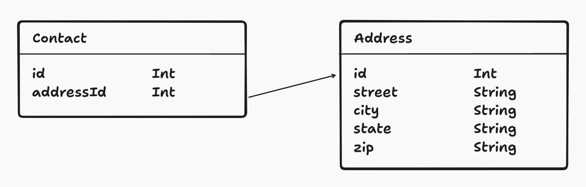

### **One-to-many**

A one-to-many relationship is a relationship where a record in one table is associated with one or more records in another table.

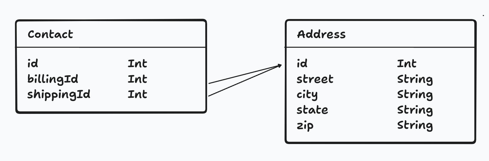

### **Many-to-many**

A many-to-many relationship is a relationship where multiple records in one table are associated with multiple records in another table.

In order to establish this relationship, we need a **junction table**. This table will store the relationship between the two tables.

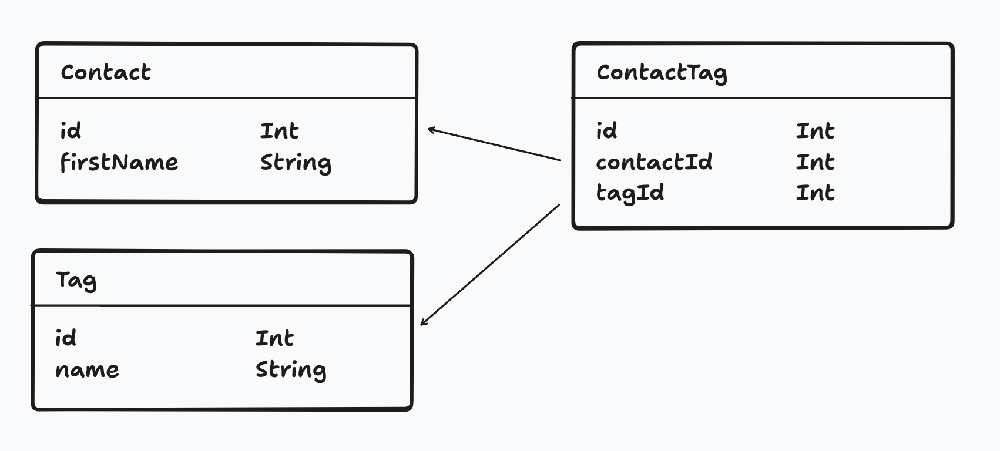

<Aside type="note" title="Naming Conventions">
  When creating junction tables, I name them based on the two tables they connect. For example, if I have a `User` and `Application` model, I'll name the junction table `ApplicationUser`. Notice the models are listed in alphabetical order.
</Aside>

<Aside type="note" title="IDs in Junction Tables">
  Technically, you don't need an `id` field in the junction table, because the combination of the two IDs (`contactId` and `tagId`) together will be unique. However, I still like to include an `id` field for good measure.
</Aside>

## All the Tables for our Database

Here's a diagram of all the models and their relationships for this project.

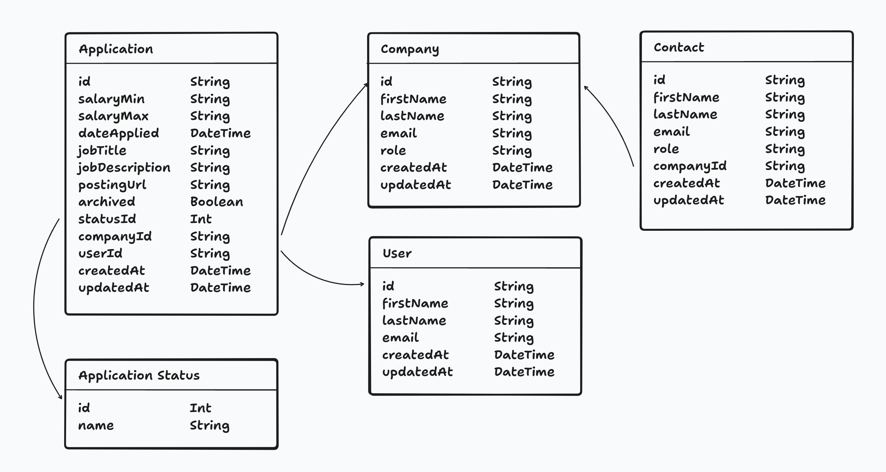

Coincidentally, all the relationships in our project are one-to-one or one-to-many.

<Aside type="note" title="Crendential Table">
  Most of the tables in our database are self explanatory. However, the `Credential` table might not be as obvious. This model is included within the standard starter kit and will hold all the details for our passkeys.
</Aside>

<Aside type="tip" title="Database Diagram">
  I always find it helpful to have a visual representation of the database.

  I created these diagrams with [tldraw](https://tldraw.com/). But, [Whimsical](https://whimsical.com/) and [Figma](https://www.figma.com/) are also great tools.

  [prisma-dbml-generator](https://github.com/notiz-dev/prisma-dbml-generator) is an interesting project. It's built on top of [dbdiagram.io](https://dbdiagram.io/) and can take a Prisma Schema and generate a diagram.
</Aside>

## Relationships within Prisma
When establishing a relationship within your schema, there are 3 parts.

1. **Foreign Key Column** This stores the ID for the related record.
2. **Relation Field.** This defines the relationship between the two models. It allows you to access the related records and uses a `@relation` directive to specify the connection details.
3. **Implicit Relationship Field** Allows you to access related records from the other side of the relationship

<Aside type="note" title="What's a foreign key?">
  A foreign key is a column (or set of columns) in a table that refers to the primary key of another table, establishing a link between two tables in a relational database.

  It's called a "foreign key" because it references the primary key of the "foreign" table.
</Aside>

<Aside type="note" title="What can you see within the database?">
  Within the database, the only column that you'll be able to see if the foreign key column that stores the ID of the related record.

  The **relationship field** and **implicit relationship field** are only used within the context of Prisma.
</Aside>

Let's look at this in practice. On the `Company` and `Contact` models:

```prisma {"3. The Implicit Relationship Field": 4-5} {"1. The Foreign Key": 16-17} {"2. The Relation Field": 18-19} title="prisma/schema.prisma"
model Company {
  id           String        @id @default(uuid())
  name         String

  contacts     Contact[]
  createdAt    DateTime      @default(now())
  updatedAt    DateTime?     @updatedAt
}

model Contact {
  id        String    @id @default(uuid())
  firstName String
  lastName  String
  email     String?
  role      String?

  companyId String

  company   Company   @relation(fields: [companyId], references: [id])
  createdAt DateTime  @default(now())
  updatedAt DateTime? @updatedAt
}
```

1. On the `Contact` model, we added a `companyId` field. This stores the ID of the related `Company` record. Because the `id` field on the `Company` model is a string, our `companyId` field is also a string.
2. On the `Contact` model, we also added a `company` field. This describes the Contact↔Company relationship for Prisma.
    - You can read this as: "A contact belongs to a company."
    - It is connected to the `Company` model. You can also think of this as having a type of `Company`.
    - It uses the `companyId` field on the `Contact` model to connect the two models.
    - It references the `id` field on the `Company` model.
3. On the `Company` model, we added a `contacts` field. This describes the Company↔Contact relationship to Prisma.
    - You can read this as: "A company has many contacts."
    - The type of content will be an array `[]` of `Contact` records.

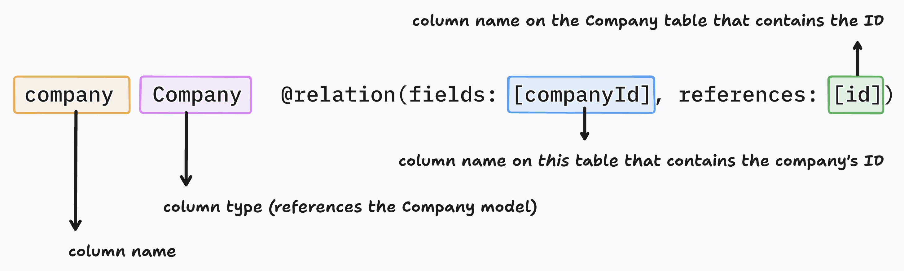

<Aside type="note" title="Relationships in Prisma">
  When you look a the columns in your database that Prisma generates, you won't find a relation or implicit relationship field, only the foreign key. However, these properties are necessary for Prisma to understand the relationship between the two models.
</Aside>

In some cases, you might need to give the relationship a name. This is particularly useful when you have multiple relationships between the same models.

As an example, I've named the relationship `CompanyContacts`. Notice this is defined on both the relation field and the implicit relationship field.

```prisma ins="CompanyContacts" title="prisma/schema.prisma"
model Company {
  id           String        @id @default(uuid())
  contacts     Contact[]     @relation("CompanyContacts")
  ...
}

model Contact {
  id        String    @id @default(uuid())
  companyId String
  company   Company   @relation("CompanyContacts", fields: [companyId], references: [id])
}
```

You can find more information about naming relationships in the [Prisma documentation](https://www.prisma.io/docs/orm/prisma-schema/data-model/relations#disambiguating-relations).

Now, we need to create the remaining relationships. Here's my final `schema.prisma` file.

```prisma showLineNumbers=true title="prisma/schema.prisma" {26-29, 39-40, 46, 52-53, 64-65, 88}
// This is your Prisma schema file,
// learn more about it in the docs: https://pris.ly/d/prisma-schema

// Looking for ways to speed up your queries, or scale easily with your serverless or edge functions?
// Try Prisma Accelerate: https://pris.ly/cli/accelerate-init

generator client {
  provider = "prisma-client"

  runtime                = "workerd"
  moduleFormat           = "esm"
  generatedFileExtension = "ts"
  importFileExtension    = "ts"

  output          = "../generated/prisma"
  previewFeatures = ["queryCompiler", "driverAdapters"]
}

datasource db {
  provider = "sqlite"
  url      = env("DATABASE_URL")
}

model Application {
  id             String            @id @default(uuid())
  userId         String
  user           User              @relation(fields: [userId], references: [id])
  status         ApplicationStatus @relation(fields: [statusId], references: [id])
  statusId       Int               @default(1)
  salaryMin      String?
  salaryMax      String?
  dateApplied    DateTime?
  jobTitle       String?
  jobDescription String?
  postingUrl     String?
  createdAt      DateTime          @default(now())
  updatedAt      DateTime?         @updatedAt
  archived       Boolean           @default(false)
  companyId      String
  company        Company           @relation(fields: [companyId], references: [id])
}

model ApplicationStatus {
  id           Int           @id @default(autoincrement())
  status       String
  applications Application[]
}

model Company {
  id           String        @id @default(uuid())
  name         String
  applications Application[]
  contacts     Contact[]
  createdAt    DateTime      @default(now())
  updatedAt    DateTime?     @updatedAt
}

model Contact {
  id        String    @id @default(uuid())
  firstName String
  lastName  String
  email     String?
  role      String?
  companyId String?
  company   Company?  @relation(fields: [companyId], references: [id])
  createdAt DateTime  @default(now())
  updatedAt DateTime? @updatedAt
}

model Credential {
  id            String   @id @default(uuid()) // Internal DB ID
  userId        String   @unique // Each user has one discoverable credential
  user          User     @relation(fields: [userId], references: [id])
  createdAt     DateTime @default(now())
  credentialId  String   @unique // WebAuthn credential identifier
  publicKey     Bytes
  counter       Int      @default(0)
  
  @@index([credentialId])
  @@index([userId])
}

model User {
  id                 String        @id @default(uuid())
  username           String        @unique
  createdAt          DateTime      @default(now())
  updatedAt          DateTime?     @updatedAt
  applications       Application[]
  credentials        Credential[]
}
```

<Aside type="tip" title="Models in Alphabetical Order">
This is personal preference, but I like to put my models in alphabetical order. It makes it easier to find what you're looking for, especially on larger projects.
</Aside>

## Running Migrations

A migration is a change to the database schema. It's a way to keep track of the changes we make to the database.

When we create the migration, Prisma will look at our `schema.prisma` file and determine what has changed since our last migration. Then, it will generate a SQL file that will update our database with the changes.

Let's create the migration by running `migrate:new` and give our migration a name. Since this is our first migration, we'll say: `setup all database models`.

<PackageManagers
  type="run"
  pkg='migrate:new "setup all database models"'
/>

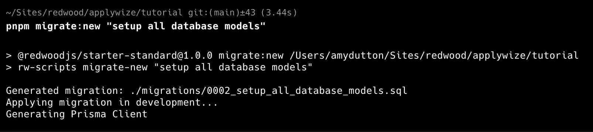

<Aside type="note" title="New Migration">
  When you run `pnpm migrate:new`, it will create a new migration file _and_ apply it. There's no need to run `pnpm migrate:dev` (unless of course the migration failed).
</Aside>

<Aside type="note" title="Troubleshooting a Migration">
  Occasionally, you may run into an error where there are multiple sqlite files in the `.wrangler > state > v3 > d1 > miniflare-D1DatabaseObject` folder.

  If this happens, you can delete the `.wrangler` folder and rerun `dev` to regenerate it.

  Then, try running `migrate:dev` to apply the migration.
</Aside>

Our generated `sql` file will be in the `migrations` folder.

<figure>
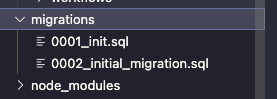
<figcaption>
- `0001_init.sql` was generated the first time we ran `pnpm dev`.
- `0002_setup_all_database_models.sql` was generated when we ran `pnpm migrate:new "setup all database models"`.
</figcaption>
</figure>


<Aside type="tip" title="The Number of Migrations">
  Worried about the number of migrations in your project? Don't. It really doesn't have any effect on your project.
</Aside>

<Aside type="note" title="Working with other people">
  An added benefit of migrations is that it makes it easier to work with other people.

  Migration files get committed to the repository and placed in version control.

  Database changes can be tied to a branch and a specific feature or bug fix.

  Keeping another team member's database in sync is as simple as running the migration: `npm migrate:dev`
</Aside>

<Aside type="note" title="If the Migration Didn't Run">
If the migration didn't run, there are a few things you can check:
- How many SQLlite files are in the `.wrangler > state > v3 > d1 > miniflare-D1DatabaseObject` folder? There should be one. You can always delete the `.wrangler` folder and rerun `pnpm dev` to regenerate it.
- Try running `pnpm migrate:dev`. This will apply any new migrations.
- Try running `pnpm dev`. This will also apply any new migrations.
- Ensure that the `database_id` within the `wrangler.jsonc` file matches the database id in your Cloudflare account.
</Aside>

<Aside type="note" title="Migration Commands">
  There are 3 different migration commands:
  1. `migrate:dev`: runs the migration on your local database
  2. `migrate:prd`: runs the migration on your production database
  3. `migrate:new`: creates a new migration
</Aside>

## Previewing the Migration

If you want to preview the database, there are a couple of different options.

### Prisma Studio (Recommended)

Prisma Studio ships with Prisma, so there’s nothing extra to install.

Let's start by opening the `schema.prisma` file.

```tsx title="prisma/schema.prisma" {3}
datasource db {
  provider = "sqlite"
  url      = env("DATABASE_URL")
}
```

You'll notice the `url` is referencing the `DATABASE_URL` environment variable.

We need this to set this up in the `.env` file so Prisma Studio can connect to the database.

First, let's go to our `d1` database. This is inside the `.wrangler/state/v3/d1/miniflare-D1DatabaseObject` directory.

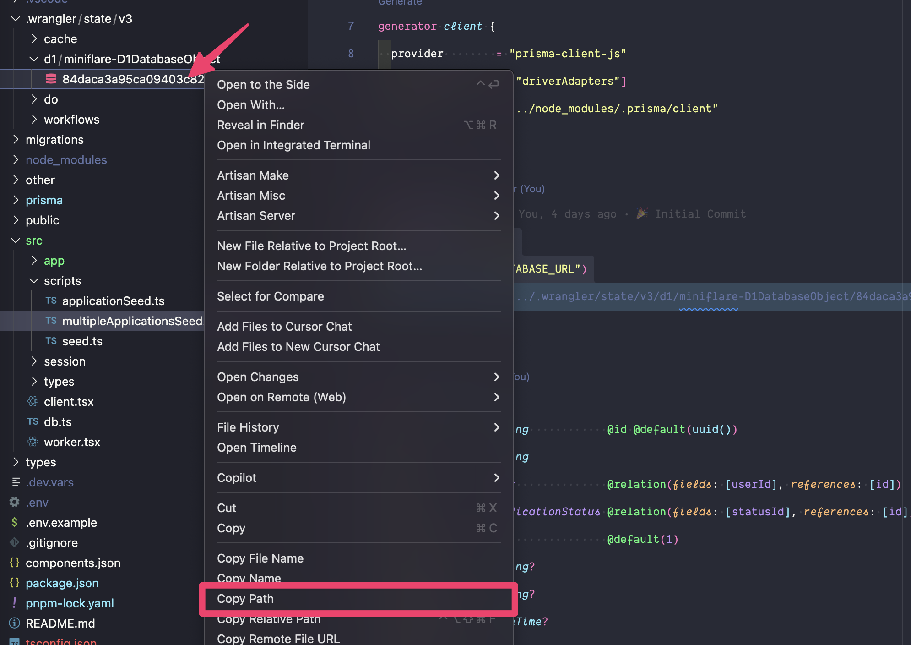

Right click on the sqlite file and click `Copy Relative Path`.

Inside your `.env` file, create a `DATABASE_URL` variable. We need to specify that this is a file:

```
DATABASE_URL="file:../"
```

Then, paste in the database path:

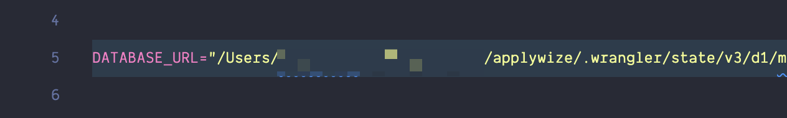


Now, within the Terminal, run:

```shell
npx prisma studio
```

This will open a new tab in your default browser at `http://localhost:5555`.

{/* ./images/prisma-studio.png - this is a screenshot of a seeded database */}
<figure>
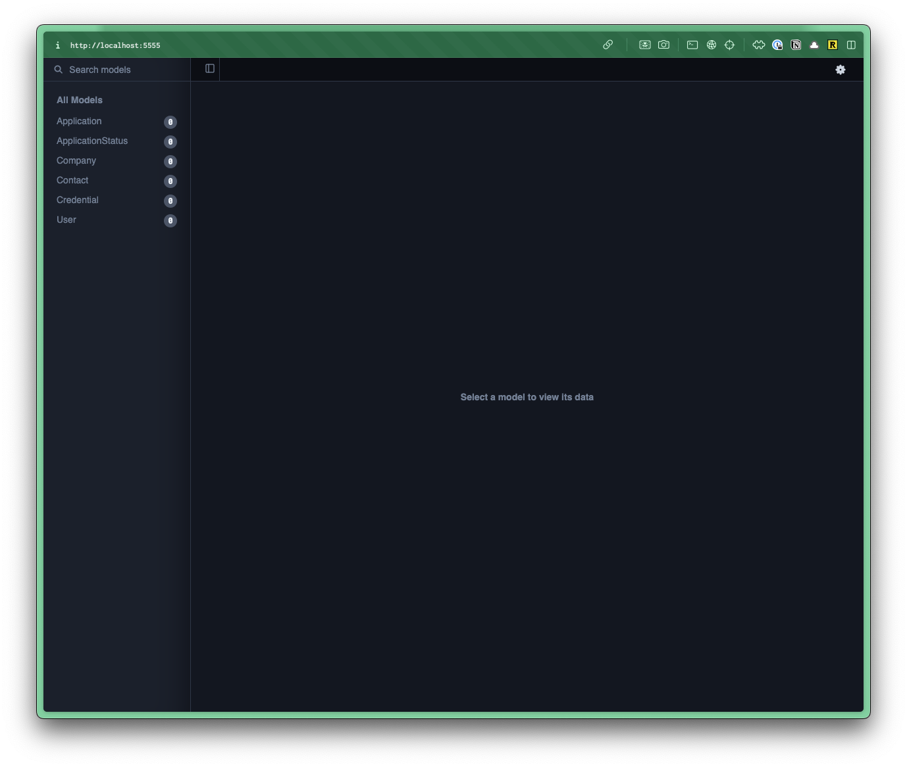
<figcaption>
- Within Prisma Studio, you can see a list of all your tables/models on the left.
- If you click on one, it will load the table/model on the right.
</figcaption>
</figure>

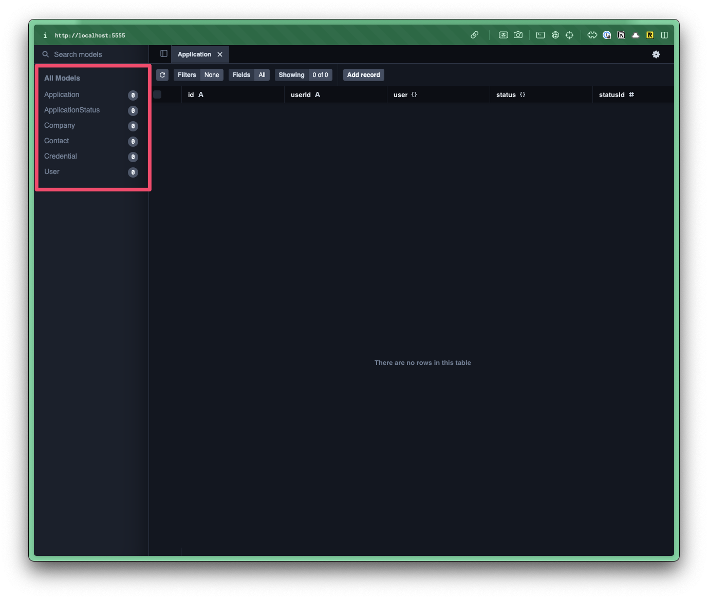

Right now, we don't have any data in our table, but at least we can tell that our migration ran successfully.

<Aside type="caution" title="Deleting the .wrangler folder">
  If you ever delete the `.wrangler` folder, it will automatically generate a new one the next time you run `pnpm dev`. However, you'll need to update the path within your `.env` file, as the hash will change.
</Aside>

### SQLite Viewer

The [VS Code extension, SQLite Viewer](https://marketplace.visualstudio.com/items?itemName=qwtel.sqlite-viewer) is perfect for previewing your SQLite database directly within VS Code.

Within the file explorer, navigate to your D1 database. You can find it in the `.wrangler > state > v3 > d1 > miniflare-D1DatabaseObject` folder.

<FileTree>
- .wrangler
  - state
    - v3
      - d1
        - miniflare-D1DatabaseObject/
          - 005cb3d3133217f352562272facf516778925ea1151d9c310bcb4e13614995c1.sqlite
</FileTree>

The file name of your sqlite database will vary.

Click on the sqlite file and a preview should open within VSCode.


The viewer will only let you preview the database. If you want to create, update, or delete, you'll need a pro (premium) account.

## Seed the database

We can manually add data to the database through Prisma Studio.

Instead of manually adding data to the database, we can create a **seed file** to programmatically add data for us. This is particularly helpful if you need to reset the database during development and don't want to manually enter test data (again and again).

Within the `src > scripts` directory, you'll find a `seed.ts`

<FileTree>
- src/
  - scripts/
    - seed.ts
</FileTree>

This contains the basic structure for our seed file.

```ts title="src/scripts/seed.ts"
import { defineScript } from "rwsdk/worker";
import { db, setupDb } from "@/db";

export default defineScript(async ({ env }) => {
  setupDb(env);

  await db.$executeRawUnsafe(`\
    DELETE FROM User;
    DELETE FROM sqlite_sequence;
  `);

  await db.user.create({
    data: {
      id: "1",
      username: "testuser",
    },
  });

  console.log("🌱 Finished seeding");
});
---
If you want to start fresh with your own seed file, you could delete lines 7-17, but we'll use this as a starting point.
---
```

<Aside type="tip" title="Seed File Structure">
  In order for our seed file to run properly, we have to run our script inside a Cloudflare worker.

  Why? Since we're using a Cloudflare D1 database, we need a worker to access it.
</Aside>

You can copy and paste the following code to your project:

```ts title="src/scripts/seed.ts"
import { defineScript } from "rwsdk/worker";
import { db, setupDb } from "../db";

export default defineScript(async ({ env }) => {
  setupDb(env);

  await db.$executeRawUnsafe(`\
    DELETE FROM Application;
    DELETE FROM ApplicationStatus;
    DELETE FROM Contact;
    DELETE FROM Company;
    DELETE FROM Credential;
    DELETE FROM User;
    DELETE FROM sqlite_sequence;
  `);

  await db.applicationStatus.createMany({
    data: [
      { id: 1, status: "New" },
      { id: 2, status: "Applied" },
      { id: 3, status: "Interview" },
      { id: 4, status: "Rejected" },
      { id: 5, status: "Offer" },
    ],
  });

  console.log("🌱 Finished seeding");
});
```

Let's make sure we understand what's happening:
* **On lines 1 and 2** are importing our dependencies. We need our Cloudflare worker and database connection.
* **On line 4**, we're setting up our Cloudflare worker environment.
* **On line 5**, we're setting up our database connection.
* **On line 7-15**, we're using raw SQL to delete all the existing data from the database. This will allow us to start fresh when seeding the database.
* **On line 16-25**, we're adding all the job application statuses to the database. You'll notice this is a standard Prisma `createMany` function.
* **On line 27**, we're logging a message to the console saying the seeding is complete.

<Aside type="caution" title="Troubleshooting">
Are you getting an error that says: `"Property 'applicationStatus' does not exist on type 'PrismaClient<PrismaClientOptions, never, DefaultArgs>'"`

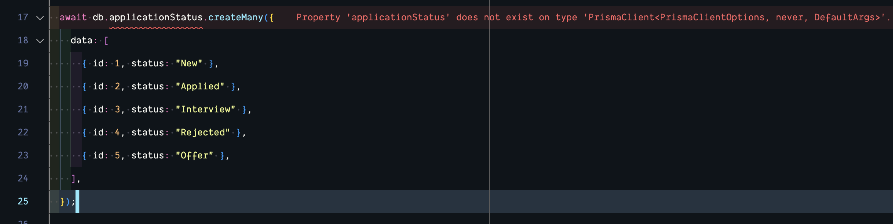

This means that the Prisma types haven't been generated for your model. Within the Terminal, run:

```shell
pnpm prisma generate
```

That should resolve your problem. Otherwise, ensure the `ApplicationStatus` table exists in your database.
</Aside>

To seed the database, run the following command:

<PackageManagers
  type="run"
  pkg="seed"
/>

Within the Terminal, you should see something like this:

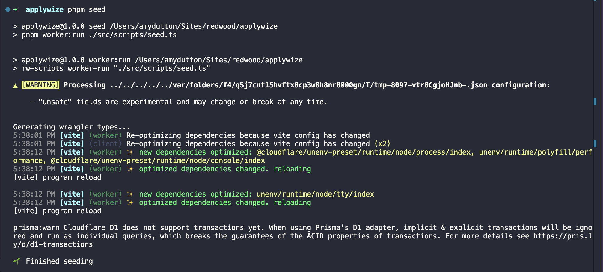

Now, when you preview the database and look at the `ApplicationStatus` table, you should see:

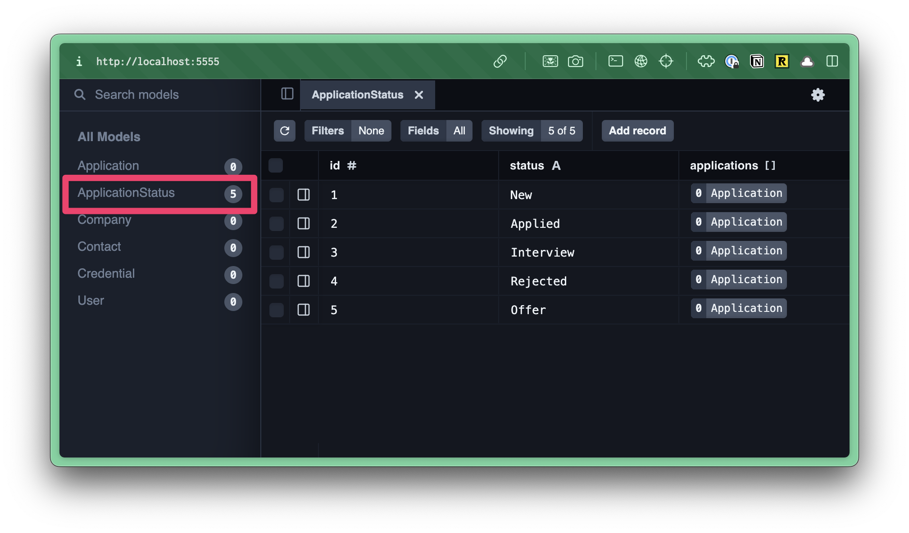

<Aside type="note" title="Multiple Seed Files">
Sometimes, I'll create multiple seed files for different purposes.

The seed file we just created is perfect for a brand new database, whether we're in development or in production. We've provided all the application statuses that we need. These won't change.

Typically, I'll also create seed files to test the application with various sets of data. This is much easier (and faster) than manually adding data again and again.

You can also leverage libraries, like [Faker](https://fakerjs.dev/) and [Snaplet](https://snaplet-seed.netlify.app/seed/getting-started/overview), to make it easier to create realistic data sets.
</Aside>


<Aside type="tip" title="Code on GitHub">
You can find the final code for this step on [GitHub](https://github.com/redwoodjs/applywize/tree/main/end-of-3).
</Aside>

## Further reading

- [Prisma Documentation](https://www.prisma.io/docs)
- [VS Code Prisma Extension](https://marketplace.visualstudio.com/items?itemName=Prisma.prisma)
