import { Aside, FileTree } from '@astrojs/starlight/components';

## Existing Authentication Code
Since we're using the [standard starter kit](https://github.com/redwoodjs/sdk/tree/main/starters/standard), it already has passkey authentication set up.

<Aside type="note" title="Passkey Authentication">
### What is Passkey Authentication?
Passkey authentication is a passwordless authentication method that uses a biometric or device authentication to verify the user's identity.

**How it Works**:
1. A user creates a passkey during the registration process.
2. A unique public-private key pair is generated.
3. The private key remains securely stored on the user's device or [in a password manager](https://developer.apple.com/passkeys/).
4. The public key is shared with the service.
5. When the user logs in, they have to "prove" they have access to the private key.
6. The service verifies the user's identity using the public key.

### Why Passkey Authentication?
Passkey authentication offers several key advantages:

- **Enhanced Security**: Passkeys are unique, resistant to guessing, and eliminate vulnerabilities associated with traditional passwords. They use biometric authentication like fingerprints, making them much harder to compromise.
- **User-Friendly**: Users can log in quickly using biometric data or device authentication, removing the need to remember complex passwords. This creates a frictionless access experience across different platforms.
- **Phishing Resistance**: Passkeys are tied to specific websites, making them immune to phishing attacks that typically trick users into entering credentials on fake sites.
</Aside>

Let's start by taking a look at the `worker.tsx` file. This file sets up our Cloudflare worker, but it also handles all the routing, middleware, and interrupters.

```tsx title="src/worker.tsx" collapse={1-12}
import { defineApp, ErrorResponse } from "rwsdk/worker";
import { route, render, prefix } from "rwsdk/router";
import { Document } from "@/app/Document";
import { Home } from "@/app/pages/Home";
import { setCommonHeaders } from "@/app/headers";
import { userRoutes } from "@/app/pages/user/routes";
import { sessions, setupSessionStore } from "./session/store";
import { Session } from "./session/durableObject";
import { db, setupDb } from "./db";
import type { User } from "@prisma/client";
import { env } from "cloudflare:workers";
export { SessionDurableObject } from "./session/durableObject";

export type AppContext = {
  session: Session | null;
  user: User | null;
};

export default defineApp([
  setCommonHeaders(),
  async ({ ctx, request, headers }) => {
    await setupDb(env);
    setupSessionStore(env);

    try {
      ctx.session = await sessions.load(request);
    } catch (error) {
      if (error instanceof ErrorResponse && error.code === 401) {
        await sessions.remove(request, headers);
        headers.set("Location", "/user/login");

        return new Response(null, {
          status: 302,
          headers,
        });
      }

      throw error;
    }

    if (ctx.session?.userId) {
      ctx.user = await db.user.findUnique({
        where: {
          id: ctx.session.userId,
        },
      });
    }
  },
  render(Document, [
    route("/", () => new Response("Hello, World!")),
    route("/protected", [
      ({ ctx }) => {
        if (!ctx.user) {
          return new Response(null, {
            status: 302,
            headers: { Location: "/user/login" },
          });
        }
      },
      Home,
    ]),
    prefix("/user", userRoutes),
  ]),
]);
```

Let's break it down, chunk by chunk:

```tsx title="src/worker.tsx" startLineNumber=14
export type AppContext = {
  session: Session | null;
  user: User | null;
};
```
- On **lines 14-17**, we're setting up the types for our application's context object. Specifically, we're defining the `session` and `user` properties.
  - The `Session` type is defined in `src/session/durableObject.ts`. (Imported on line 8.) It contains a `userId`, `challenge`, and `createdAt`.
  - The `User` type comes from our `@prisma/client`. (Imported on line 10.) That's right! When Prisma generates our migration files, it also generates types.

```tsx title="src/worker.tsx" startLineNumber=20
setCommonHeaders(),
```
- On **line 20** we're setting up our common headers. This is a function inside of `app/src/headers.ts`. (Imported on line 5.) It creates the Security Policies, Transport Policy, Referrer Policy, and Permissions Policy. [You can find additional documentation here.](/core/security/#-security-headers)

```tsx title="src/worker.tsx" startLineNumber=21
async ({ ctx, request, headers }) => {
  await setupDb(env);
  setupSessionStore(env);

  try {
    ctx.session = await sessions.load(request);
  } catch (error) {
    if (error instanceof ErrorResponse && error.code === 401) {
      await sessions.remove(request, headers);
      headers.set("Location", "/user/login");

      return new Response(null, {
        status: 302,
        headers,
      });
    }

    throw error;
  }

  if (ctx.session?.userId) {
    ctx.user = await db.user.findUnique({
      where: {
        id: ctx.session.userId,
      },
    });
  }
},
```
- On **lines 21-48**, we're setting up our middleware. This will run between every request and response cycle.
  - First, we're setting up the database `setupDb(env);` We'll use this later, on line 42, to find the logged in user.
  - Then, we're setting up the session store `setupSessionStore(env);`. We're using Cloudflare's Durable Objects to store our session data and loading it. `sessions.load(request)`
  - On **lines 27-36**, we're catching unauthorized errors. If there's an error and the status code is 401, we remove the session and redirect the user to the login page.
  - On **lines 41-47**, we check the `ctx` for the `session` object. If it has a `userId`, we connect to the database and get all the user data. The result gets saved into the `ctx.user` object.

```tsx title="src/worker.tsx" startLineNumber=49
render(Document, [
```
- On **line 49**, we're setting up our document. This document is referencing our `src/app/Document.tsx` file. It contains our `html`, `head`, and `body` tags and wraps _all_ of our pages.
  - One of the powerful yet simple features of RedwoodSDK is that it supports per-route documents. Read more about this [on our blog](https://rwsdk.com/blog/redwoodsdk-multiple-documents).

```tsx title="src/worker.tsx" startLineNumber=49
render(Document, [
  route("/", () => new Response("Hello, World!")),
```
- On **line 50**, we're setting up our home page route. Here, we're just returning a standard response.

The router highlights the request-response lifecycle. The first parameter is the route we're requesting and the second parameter is the response. This can be a standard response, or it can be a React component. On line 50, we're returning a standard response that says `Hello World!`.

We can change that to return the `Home` component by changing the second parameter:

```tsx title="src/worker.tsx" startLineNumber=50
route("/", Home),
```

We can also change the home page route to use the `index` method:

```tsx title="src/worker.tsx" showLineNumbers={false}
import { index, route, render, prefix } from "rwsdk/router";
...
index([Home]);
```

The `index` method is similar to the `route` method, but instead of taking two parameters, it only takes one, the response.

If we move further down our `render` method, the next route is a protected route at `/protected`.

```tsx title="src/worker.tsx" startLineNumber=51
route("/protected", [
  ({ ctx }) => {
    if (!ctx.user) {
      return new Response(null, {
        status: 302,
        headers: { Location: "/user/login" },
      });
    }
  },
  Home,
]),
```

Here, we're using an **interrupter** to see if the user is logged in. This is a function that takes our `ctx` object and checks to see if the `user` object exists on it. If it doesn't, we redirect the user to the login page (lines 54-57). Otherwise, we return the `Home` component (line 60).

<Aside type="note" title="Middleware vs Interrupters">
#### Middleware

Middleware is a function that runs _in the middle_, between your request to the server and its response.

It allows you to:

- Modify or inspect requests before they reach the main application logic
- Perform operations like authentication, logging, error handling
- Transform or validate data
- Add headers or perform other preprocessing tasks

#### Interrupters

Interrupters will _interrupt_ the flow. Before, the server returns a response, the interrupter runs.

#### These sound similar, what's the difference?

- Middleware will run before _every single route_.
- Interrupters will only run _on specific routes._

In our code, we're using middleware to attach the user session to our context object *on every request*. But, we're only checking to see if the user is logged in *on the home page*.
</Aside>

```tsx title="src/worker.tsx" startLineNumber=62
prefix("/user", userRoutes),
```
- On **line 62**, we're prefixing all of our auth routes with `/user`. Meaning, our `login` route will be `/user/login` and our `logout` route will be `/user/logout`.
  - `login` and `logout` are defined within the `userRoutes` file, imported on line 6. One of the cool things about the RedwoodSDK router is that the response parameter can be an array. This means we can define our route information in a separate file and then import it into our `worker.tsx` file.

We're co-locating the file that defines our auth routes with our auth pages.

Let's take a look at `userRoutes`. This is coming from `src/app/pages/user/routes.ts`.

```tsx title="src/app/pages/user/routes.ts"
import { route } from "rwsdk/router";
import { Login } from "./Login";
import { sessions } from "@/session/store";

export const userRoutes = [
  route("/login", [Login]),
  route("/logout", async function ({ request }) {
    const headers = new Headers();
    await sessions.remove(request, headers);
    headers.set("Location", "/");

    return new Response(null, {
      status: 302,
      headers,
    });
  }),
];
```

We're defining 2 routes:
- `/login` - This is displaying our login page (on line 6).
- `/logout` - This is our logout route (on line 7), but instead of returning JSX, we're removing the session (line 9) and redirecting the user to the home page (line 10). Then, we return the response (line 12-15). The [302 status code](https://developer.mozilla.org/en-US/docs/Web/HTTP/Reference/Status/302) means we're redirecting to the `Location` header.

<Aside type="note" title="Prefixed Routes">
Remember, even though these routes are defined as `/login` and `/logout`, we've prefixed them in our `worker.tsx` file with `/user` So, in order to access them, you'll go to `/user/login` and `/user/logout`.
</Aside>

## Setting up the Signup Page
Let's create a third route for registering a new user, giving sign up a dedicated page.

Inside, our `src/app/pages/user` directory, create a new file called `Signup.tsx`. Let's stub out a simple function, just to make sure it's working:

```tsx title="src/app/pages/user/Signup.tsx"
export const Signup = () => {
  return <div>Signup</div>;
}
```

Now, we need to add this route to our `userRoutes` array (inside of `src/app/pages/user/routes.ts`):

```tsx title="src/app/pages/user/routes.ts" {3,8}
import { route } from "rwsdk/router";
import { Login } from "./Login";
import { Signup } from "./Signup";
import { sessions } from "@/session/store";

export const userRoutes = [
  route("/login", [Login]),
  route("/signup", [Signup]),
  route("/logout", async function ({ request }) {
    const headers = new Headers();
    await sessions.remove(request, headers);
    headers.set("Location", "/");

    return new Response(null, {
      status: 302,
      headers,
    });
  }),
];
```

Within our browser, let's go to http://localhost:5173/user/signup and you should see:

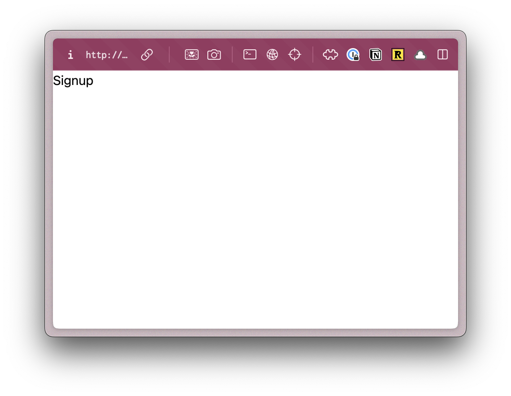

Now, let's move over some of the functionality from our `Login.tsx` to our `Signup.tsx`. But first, let's make sure we understand what's happening in our `Login.tsx`.

Let's break it down, chunk by chunk:

```tsx title="src/app/pages/user/Login.tsx"
"use client";
---
- **On line 1,** we have a `use client` directive. By default, all components within RedwoodSDK are server components. Here, we're explicitly telling React to render this component on the client side (in the browser). Anytime you want there to be interactivity (clicking on buttons or managing state), you'll need to use a client component.
---
```

```tsx title="src/app/pages/user/Login.tsx" startLineNumber=17
const [username, setUsername] = useState("");
const [result, setResult] = useState("");
---
- We're setting a couple pieces of state.
  - `username` is tied to our username input value.
  - `result` contains our result message.
---
```

```tsx title="src/app/pages/user/Login.tsx" startLineNumber=19
const [isPending, startTransition] = useTransition();
---
- We're using React's `useTransition` hook to manage our loading state. (More on this later, but you can also find more within [the official React documentation](https://react.dev/reference/react/useTransition).)
---
```

```tsx title="src/app/pages/user/Login.tsx" startLineNumber=21
const passkeyLogin = async () => {
  // 1. Get a challenge from the worker
  const options = await startPasskeyLogin();

  // 2. Ask the browser to sign the challenge
  const login = await startAuthentication({ optionsJSON: options });

  // 3. Give the signed challenge to the worker to finish the login process
  const success = await finishPasskeyLogin(login);

  if (!success) {
    setResult("Login failed");
  } else {
    setResult("Login successful!");
  }
};
---
- **On line 21**, we're defining our `passkeyLogin` function.
- The functions `startPasskeyLogin`, `startAuthentication`, and `finishPasskeyLogin` are all defined in the `src/app/pages/user/functions.ts` file. You can find more information about these functions in the [Authentication docs](/core/authentication).
- We start the Passkey login authentication `startPasskeyLogin()`, and then determine whether it was successful or not.
- If it wasn't successful, we set the result message to "Login failed".
- Otherwise, we set the result message to "Login successful!".
---
```

```tsx title="src/app/pages/user/Login.tsx" startLineNumber=38
  const passkeyRegister = async () => {
    // 1. Get a challenge from the worker
    const options = await startPasskeyRegistration(username);

    // 2. Ask the browser to sign the challenge
    const registration = await startRegistration({ optionsJSON: options });

    // 3. Give the signed challenge to the worker to finish the registration process
    const success = await finishPasskeyRegistration(username, registration);

    if (!success) {
      setResult("Registration failed");
    } else {
      setResult("Registration successful!");
    }
  };
---
- Here, we're defining our `passkeyRegister` function. This is similar the `passkeyLogin` function, but this handles the registration process.
  - The functions `startPasskeyRegistration`, `startRegistration`, and `finishPasskeyRegistration` are all defined in the `src/app/pages/user/functions.ts` file. You can find more information about these functions in the [Passkey Authentication docs](/docs/auth/passkeys).
  - If the registration isn't successful, we set the result message to "Registration failed".
  - Otherwise, we set the result message to "Registration successful!".
---
```

```tsx title="src/app/pages/user/Login.tsx" startLineNumber=55
const handlePerformPasskeyLogin = () => {
  startTransition(() => void passkeyLogin());
};
---
- The`handlePerformPasskeyLogin` function handles the transition and calls the `passkeyLogin` function.
---
```

```tsx title="src/app/pages/user/Login.tsx" startLineNumber=59
const handlePerformPasskeyRegister = () => {
  startTransition(() => void passkeyRegister());
};
---
- The`handlePerformPasskeyRegister` function handles the transition and calls the `passkeyRegister` function.
---
```

```tsx title="src/app/pages/user/Login.tsx" startLineNumber=66
<input
  type="text"
  value={username}
  onChange={(e) => setUsername(e.target.value)}
  placeholder="Username"
/>
---
- We're rendering an input field. This is tied to our `username` state (line 17).
---
```

<Aside type="note" title="Usernames vs Email Addresses">
We're intentionally using usernames instead of emails. This decision prevents enumeration attacks and avoids requiring valid email addresses for registration.
</Aside>

```tsx title="src/app/pages/user/Login.tsx" startLineNumber=72
<Button onClick={handlePerformPasskeyLogin} disabled={isPending}>
  {isPending ? <>...</> : "Login with passkey"}
</Button>
<Button onClick={handlePerformPasskeyRegister} disabled={isPending}>
  {isPending ? <>...</> : "Register with passkey"}
</Button>
---
- We're rendering two buttons. These buttons are tied to our `handlePerformPasskeyLogin` and `handlePerformPasskeyRegister` functions.
---
```

```tsx title="src/app/pages/user/Login.tsx" startLineNumber=76
{result && <div>{result}</div>}
---
- We're rendering the result message.
---
```

---

Let's start by copying all the contents from our `Login.tsx` and pasting it into our `Signup.tsx`. Be sure that the component is still named `Signup`.

```tsx title="src/app/pages/user/Signup.tsx" startLineNumber=20
export function Signup() {
```

Let's remove all the pieces that aren't related to registering.
- We don't need the `passkeyLogin` function (lines 21-36)
- You can delete the `handlePerformPasskeyLogin` function (originally lines 55-57)
- Let's also remove the "Login with passkey" button (originally lines 72-74)

Now, we need to clean up our unused imports. Within our IDE, these should be grayed out:

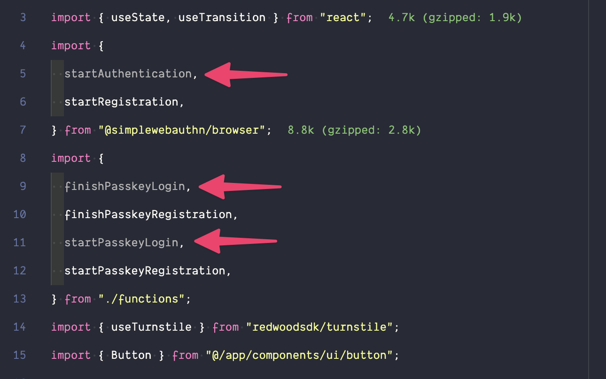

<details>
<summary>Cleaned up `Signup.tsx` code</summary>

```tsx title="src/app/pages/user/Signup.tsx"
"use client";

import { useState, useTransition } from "react";
import { startRegistration } from "@simplewebauthn/browser";
import {
  finishPasskeyRegistration,
  startPasskeyRegistration,
} from "./functions";
import { Button } from "@/app/components/ui/button";

export function Signup() {
  const [username, setUsername] = useState("");
  const [result, setResult] = useState("");
  const [isPending, startTransition] = useTransition();

  const passkeyRegister = async () => {
    // 1. Get a challenge from the worker
    const options = await startPasskeyRegistration(username);

    // 2. Ask the browser to sign the challenge
    const registration = await startRegistration({ optionsJSON: options });

    // 3. Give the signed challenge to the worker to finish the registration process
    const success = await finishPasskeyRegistration(username, registration);

    if (!success) {
      setResult("Registration failed");
    } else {
      setResult("Registration successful!");
    }
  };

  const handlePerformPasskeyRegister = () => {
    startTransition(() => void passkeyRegister());
  };

  return (
    <main className="bg-bg">
      <h1 className="text-4xl font-bold text-red-500">YOLO</h1>
      <input
        type="text"
        value={username}
        onChange={(e) => setUsername(e.target.value)}
        placeholder="Username"
      />
      <Button onClick={handlePerformPasskeyRegister} disabled={isPending}>
        {isPending ? <>...</> : "Register with passkey"}
      </Button>
      {result && <div>{result}</div>}
    </main>
  );
}
```

</details>


Now, let's do the opposite for our `Login.tsx`.

- We can remove the `passkeyRegister` function (lines 38-53)
- and the `handlePerformPasskeyRegister` function (originally lines 59-61)
- We don't need the `Register with passkey` button (originally lines 75-77)

Don't forget to clean up your unused imports, too.

<details>
<summary>Cleaned up `Login.tsx` code</summary>

```tsx title="src/app/pages/user/Login.tsx"
"use client";

import { useState, useTransition } from "react";
import { startAuthentication } from "@simplewebauthn/browser";
import { finishPasskeyLogin, startPasskeyLogin } from "./functions";
import { Button } from "@/app/components/ui/button";

export function Login() {
  const [username, setUsername] = useState("");
  const [result, setResult] = useState("");
  const [isPending, startTransition] = useTransition();

  const passkeyLogin = async () => {
    // 1. Get a challenge from the worker
    const options = await startPasskeyLogin();

    // 2. Ask the browser to sign the challenge
    const login = await startAuthentication({ optionsJSON: options });

    // 3. Give the signed challenge to the worker to finish the login process
    const success = await finishPasskeyLogin(login);

    if (!success) {
      setResult("Login failed");
    } else {
      setResult("Login successful!");
    }
  };

  const handlePerformPasskeyLogin = () => {
    startTransition(() => void passkeyLogin());
  };

  return (
    <main className="bg-bg">
      <h1 className="text-4xl font-bold text-red-500">YOLO</h1>
      <input
        type="text"
        value={username}
        onChange={(e) => setUsername(e.target.value)}
        placeholder="Username"
      />
      <Button onClick={handlePerformPasskeyLogin} disabled={isPending}>
        {isPending ? <>...</> : "Login with passkey"}
      </Button>
      {result && <div>{result}</div>}
    </main>
  );
}
```
</details>

Now, let's test our code:

```shell
pnpm run dev
```

Within the browser, go to http://localhost:5173/user/signup.

Add a `username` and click "Register with passkey".

If you're using a Password Manager, like [1Password](https://1password.com/product/passkeys), it's easy to create and manage your passkeys. Of course, there are other tools to choose from. [Apple even has their own native solution](https://developer.apple.com/passkeys/).

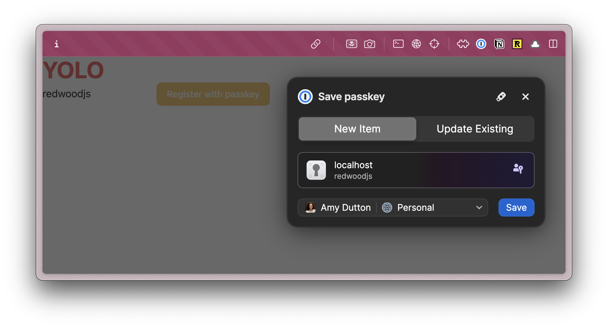

Once you've successfully logged in our `result` message displayed at the bottom of the form.

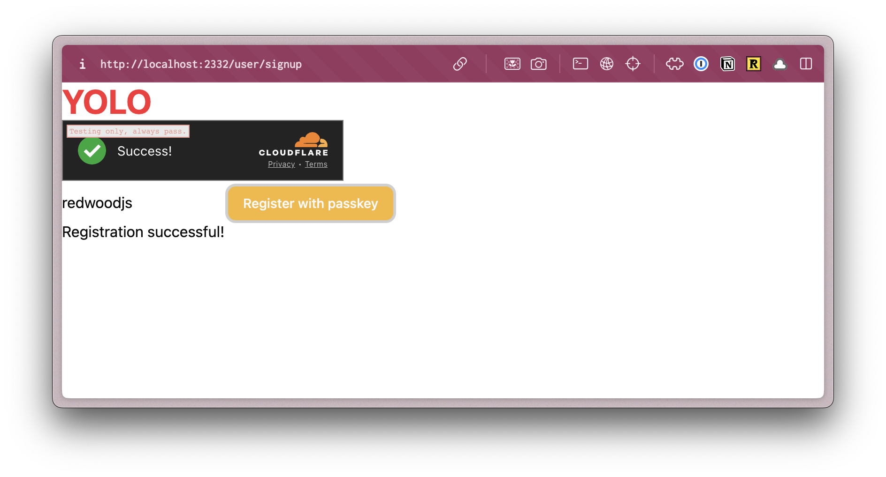

You should also be able to see the new user in the database:

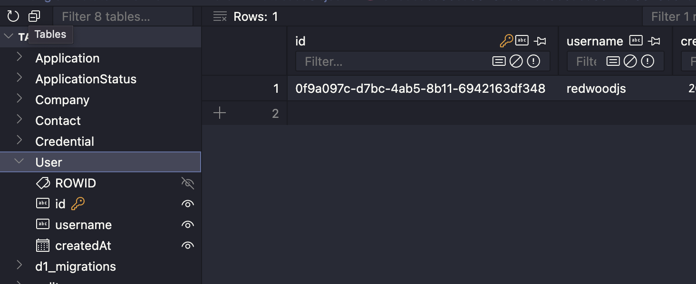

And the related entry in the `Credential` table:

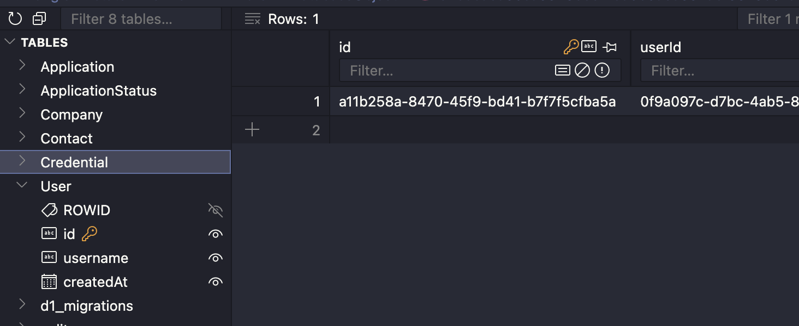

Before we move on to the Login page, let's adjust the success conditional. If the user is able to successfully register, we want to redirect them to the Login page:

```tsx title="src/app/pages/Signup.tsx" startLineNumber=30
if (!success) {
  setResult("Registration failed");
} else {
  window.location.href = link("/user/login");
}
```

Now, let's try logging in. Go to http://localhost:5173/user/login, enter your username and click on the **Login with passkey** button. Then, you should be prompted for the passkey.

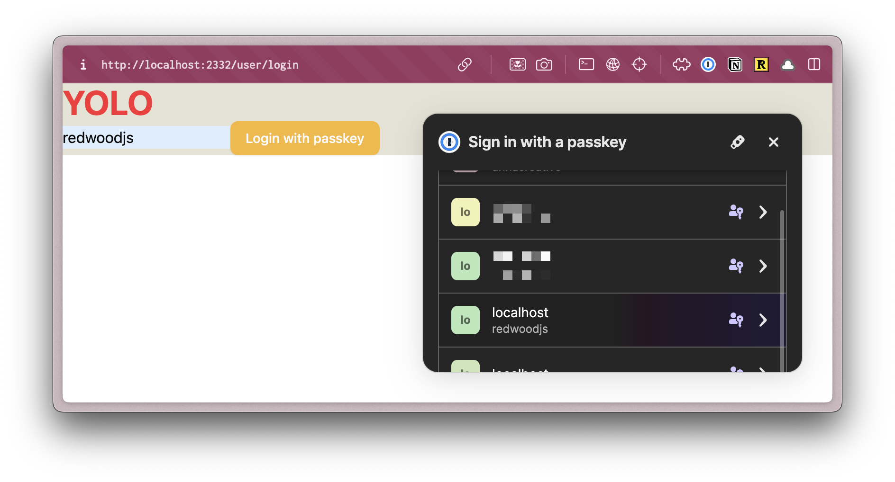

Once you've successfully logged in, you should see a successful `result` message displayed below the form.

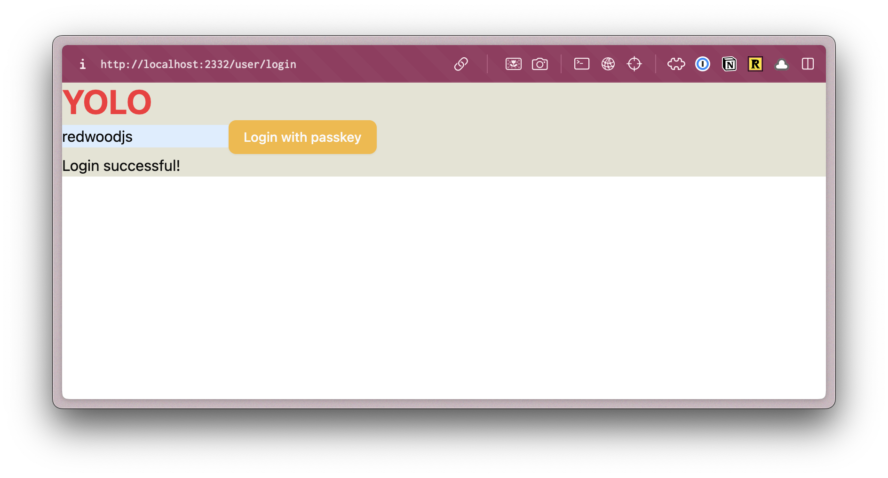

Now, navigate to http://localhost:5173/protected. You should see a message that you're logged in as the user you just created.

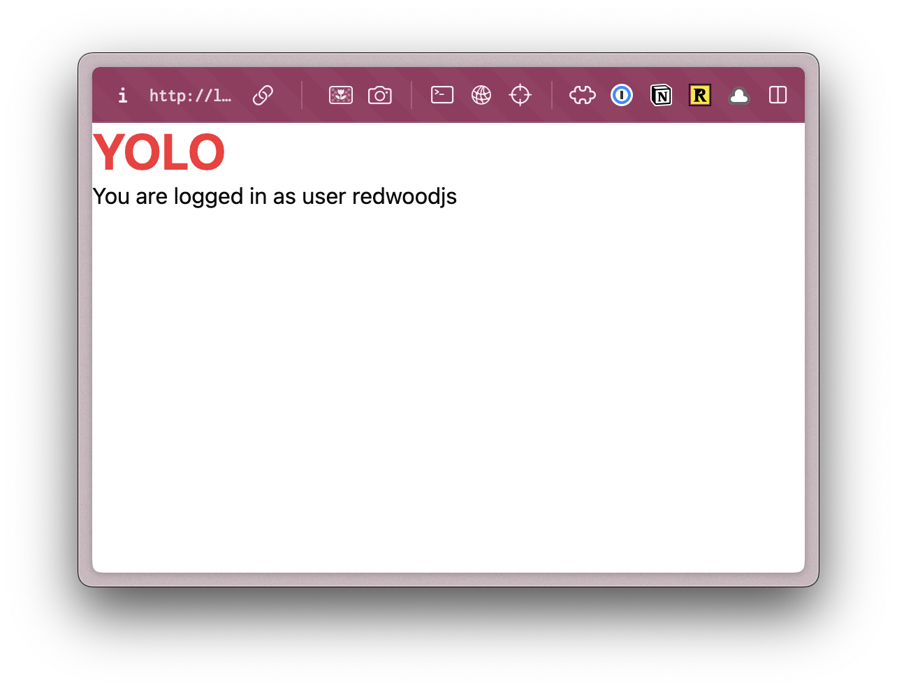

Did you realize we haven't been able to access the `/protected` route before because it was protected by an interrupter?

```tsx title="src/worker.tsx" startLineNumber=34 {3-7}
route("/protected", [
  ({ ctx }) => {
    if (!ctx.user) {
      return new Response(null, {
        status: 302,
        headers: { Location: "/user/login" },
      });
    }
  },
  Home,
]),
---
**On line 36**, we're checking to see if the `user` object exists on the `ctx` object. If it doesn't, we redirect the user to the `/user/login` page.
---
```

Try logging out, by going to http://localhost:5173/user/logout. You should be redirected to the login page.

Now, try going to the protected route again: http://localhost:5173/protected. You should be redirected to the login page.

Login and then you can visit the protected route again.

😎 Cool, right?

## Styling the Login Page
Now that we know our authentication code is working, let's add some styles and make it look good.

If we take a look at [the final design within Figma](https://www.figma.com/design/nqBPIIfe0MO4W8zOfW4oae/RedwoodSDK-%2F-Applywize?node-id=239-604&t=AzaW01lRe7c80zl2-1), this is what we're aiming for:


This is similar to the final sign up page. The only difference is the content on the right side.

Let's create a layout component, that we can use in both places.

### Creating a Layout Component

When we installed shadcn/ui, it added a lot of variables to the bottom of our `styles.css` file. In CSS, order matters. So, let's move our `@theme` definition to the bottom of the file, but above the `@layer base` definition so that it reads as more important and will override any shadcn/ui default values.

<details>
<summary>Updated `styles.css` file</summary>

```css title="src/app/styles.css"
@import url('https://fonts.googleapis.com/css2?family=Poppins:wght@500;700&display=swap');
@import url('https://fonts.googleapis.com/css2?family=Inter:wght@400;700&display=swap');

@import "tailwindcss";

@import "tw-animate-css";

@custom-variant dark (&:is(.dark *));

body {
  font-family: var(--font-body);
}

:root {
  --radius: 0.625rem;
  --background: oklch(1 0 0);
  --foreground: oklch(0.145 0 0);
  --card: oklch(1 0 0);
  --card-foreground: oklch(0.145 0 0);
  --popover: oklch(1 0 0);
  --popover-foreground: oklch(0.145 0 0);
  --primary: oklch(0.205 0 0);
  --primary-foreground: oklch(0.985 0 0);
  --secondary: oklch(0.97 0 0);
  --secondary-foreground: oklch(0.205 0 0);
  --muted: oklch(0.97 0 0);
  --muted-foreground: oklch(0.556 0 0);
  --accent: oklch(0.97 0 0);
  --accent-foreground: oklch(0.205 0 0);
  --destructive: oklch(0.577 0.245 27.325);
  --border: oklch(0.922 0 0);
  --input: oklch(0.922 0 0);
  --ring: oklch(0.708 0 0);
  --chart-1: oklch(0.646 0.222 41.116);
  --chart-2: oklch(0.6 0.118 184.704);
  --chart-3: oklch(0.398 0.07 227.392);
  --chart-4: oklch(0.828 0.189 84.429);
  --chart-5: oklch(0.769 0.188 70.08);
  --sidebar: oklch(0.985 0 0);
  --sidebar-foreground: oklch(0.145 0 0);
  --sidebar-primary: oklch(0.205 0 0);
  --sidebar-primary-foreground: oklch(0.985 0 0);
  --sidebar-accent: oklch(0.97 0 0);
  --sidebar-accent-foreground: oklch(0.205 0 0);
  --sidebar-border: oklch(0.922 0 0);
  --sidebar-ring: oklch(0.708 0 0);
}

.dark {
  --background: oklch(0.145 0 0);
  --foreground: oklch(0.985 0 0);
  --card: oklch(0.205 0 0);
  --card-foreground: oklch(0.985 0 0);
  --popover: oklch(0.205 0 0);
  --popover-foreground: oklch(0.985 0 0);
  --primary: oklch(0.922 0 0);
  --primary-foreground: oklch(0.205 0 0);
  --secondary: oklch(0.269 0 0);
  --secondary-foreground: oklch(0.985 0 0);
  --muted: oklch(0.269 0 0);
  --muted-foreground: oklch(0.708 0 0);
  --accent: oklch(0.269 0 0);
  --accent-foreground: oklch(0.985 0 0);
  --destructive: oklch(0.704 0.191 22.216);
  --border: oklch(1 0 0 / 10%);
  --input: oklch(1 0 0 / 15%);
  --ring: oklch(0.556 0 0);
  --chart-1: oklch(0.488 0.243 264.376);
  --chart-2: oklch(0.696 0.17 162.48);
  --chart-3: oklch(0.769 0.188 70.08);
  --chart-4: oklch(0.627 0.265 303.9);
  --chart-5: oklch(0.645 0.246 16.439);
  --sidebar: oklch(0.205 0 0);
  --sidebar-foreground: oklch(0.985 0 0);
  --sidebar-primary: oklch(0.488 0.243 264.376);
  --sidebar-primary-foreground: oklch(0.985 0 0);
  --sidebar-accent: oklch(0.269 0 0);
  --sidebar-accent-foreground: oklch(0.985 0 0);
  --sidebar-border: oklch(1 0 0 / 10%);
  --sidebar-ring: oklch(0.556 0 0);
}

@theme inline {
  --radius-sm: calc(var(--radius) - 4px);
  --radius-md: calc(var(--radius) - 2px);
  --radius-lg: var(--radius);
  --radius-xl: calc(var(--radius) + 4px);
  --color-background: var(--background);
  --color-foreground: var(--foreground);
  --color-card: var(--card);
  --color-card-foreground: var(--card-foreground);
  --color-popover: var(--popover);
  --color-popover-foreground: var(--popover-foreground);
  --color-primary: var(--primary);
  --color-primary-foreground: var(--primary-foreground);
  --color-secondary: var(--secondary);
  --color-secondary-foreground: var(--secondary-foreground);
  --color-muted: var(--muted);
  --color-muted-foreground: var(--muted-foreground);
  --color-accent: var(--accent);
  --color-accent-foreground: var(--accent-foreground);
  --color-destructive: var(--destructive);
  --color-border: var(--border);
  --color-input: var(--input);
  --color-ring: var(--ring);
  --color-chart-1: var(--chart-1);
  --color-chart-2: var(--chart-2);
  --color-chart-3: var(--chart-3);
  --color-chart-4: var(--chart-4);
  --color-chart-5: var(--chart-5);
  --color-sidebar: var(--sidebar);
  --color-sidebar-foreground: var(--sidebar-foreground);
  --color-sidebar-primary: var(--sidebar-primary);
  --color-sidebar-primary-foreground: var(--sidebar-primary-foreground);
  --color-sidebar-accent: var(--sidebar-accent);
  --color-sidebar-accent-foreground: var(--sidebar-accent-foreground);
  --color-sidebar-border: var(--sidebar-border);
  --color-sidebar-ring: var(--sidebar-ring);
}

@theme {
  --font-display: "Poppins", sans-serif;
  --font-body: "Inter", sans-serif;

  --color-bg: #e4e3d4;
  --color-border: #eeeef0;

  --color-primary: #f7b736;
  --color-secondary: #f1f1e8;
  --color-destructive: #ef533f;

  --color-tag-applied: #b1c7c0;
  --color-tag-interview: #da9b7c;
  --color-tag-new: #db9a9f;
  --color-tag-rejected: #e4e3d4;
  --color-tag-offer: #aae198;
}

@layer base {
  * {
    @apply border-border outline-ring/50;
  }
  body {
    @apply bg-background text-foreground;
  }
}
```
</details>

If you take a look in the browser, by changing the position of the `@theme` block, it also changed the button's background color to yellow, our primary color. Perfect.

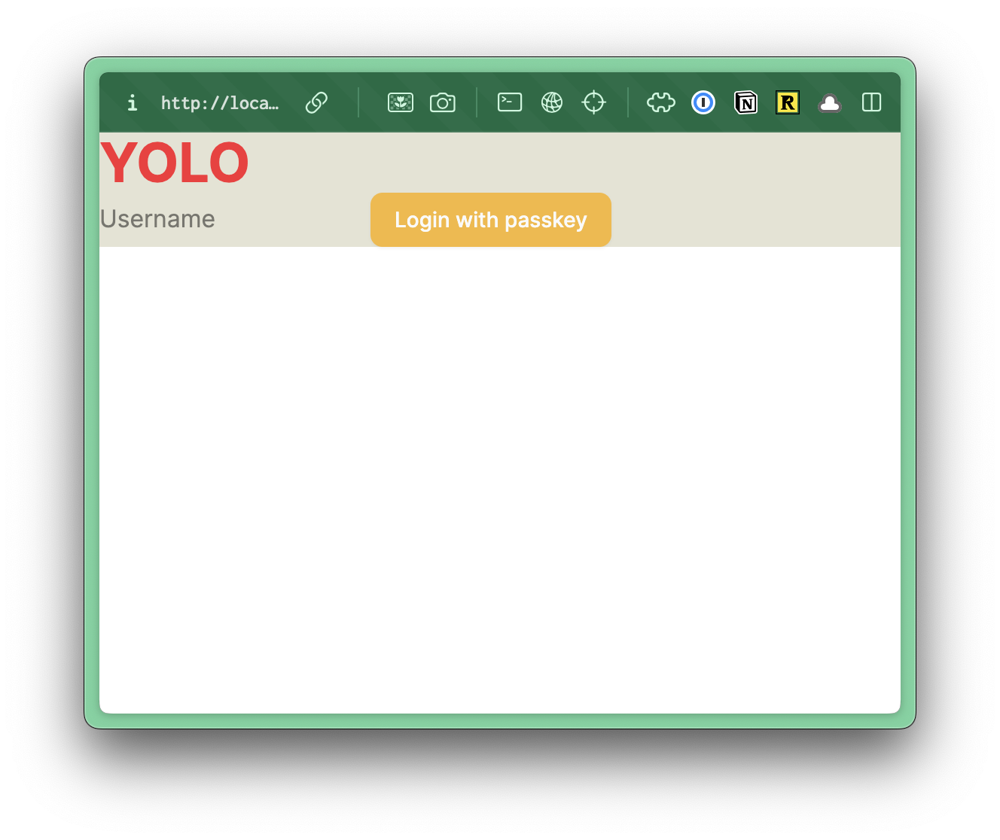

Now, let's start on our layout component. Inside our `app` directory, create a new folder called `layouts`. Then, a new file called `AuthLayout.tsx`:

<FileTree>
- src
  - app
    - layouts
      - AuthLayout.tsx
</FileTree>

Let's start by stubbing out our component:

```tsx title="src/app/layouts/AuthLayout.tsx"
const AuthLayout = ({ children }) => {
  return (
    <div className="bg-bg min-h-screen min-w-screen p-12">
      {children}
    </div>
  )
}

export { AuthLayout }
---
On our wrapping `div`, I've added a few Tailwind styles.
- `bg-bg` uses the custom background color we set up previously.
- `min-h-screen` and `min-w-screen` ensures that the background color will take up the full screen.
- `p-12` adds `48px` of padding around the entire screen.
---
```

As we continue to make adjustments, we want to be able to see the changes we're making within the browser.

Inside our `Login` component let's replace our `main` tag with our `AuthLayout` component.

```tsx title="src/app/pages/user/Login.tsx" {2,15} startLineNumber=37
return (
  <AuthLayout>
  <h1 className="text-4xl font-bold text-red-500">YOLO</h1>
    <input
      type="text"
      value={username}
      onChange={(e) => setUsername(e.target.value)}
      placeholder="Username"
    />
    <Button onClick={handlePerformPasskeyLogin} disabled={isPending}>
      {isPending ? <>...</> : "Login with passkey"}
    </Button>
    {result && <div>{result}</div>}
  </AuthLayout>
)
```

If we head over to the browser, we should see something like this:

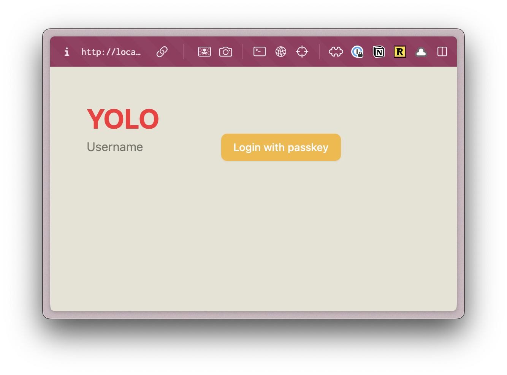

For reference, this was before our `AuthLayout` component:

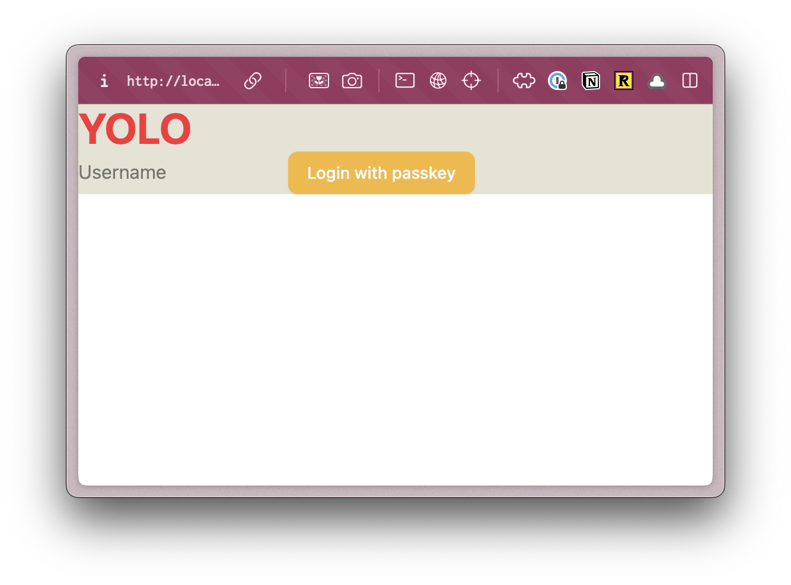

Sweet! Let's keep going.

Inside our wrapping `div`, let's set up our two column grid:

```tsx title="src/app/layouts/AuthLayout.tsx" {2, 4} startLineNumber=3
<div className="bg-bg min-h-screen min-w-screen p-12">
  <div className="grid grid-cols-2 min-h-[calc(100vh-96px)] rounded-xl border-2 border-[#D6D5C5]">
    {children}
  </div>
</div>
---
- `grid` sets the display to `grid`, then we can specify that there are two columns with `grid-cols-2`
- We want the grid to take up the full height of the screen. If we use `min-h-screen`, it will set the minimum height to `100vh`, but it will also introduce a scrollbar because we gave the wrapping `div` padding of `p-12`. There's no way to know exactly what the height of the screen is, but we can have the browser calculate it for us with `calc(100vh-96px)`. `p-12` puts `48px` of padding on the top and bottom or `96px` total. You could also use `6rem` if you want to avoid using `px` units.
- `rounded-xl` adds rounded corners
- `border-2 border-[#D6D5C5]` adds a `2px` solid border to our container. The border color we're using is darker than the content border color we established in the `styles.css` file earlier. Since we're only using this color once, it's not worth creating a CSS property for it. We can set it as an arbitrary value with `[]`.
---
```

Inside our `grid`, we need two `div`s for our two columns. Our `{children}` will go in the second column, on the right side.

For the column on the left, we have a repeating background image. You can export this image from Figma yourself, or [grab all the image assets for this project here](https://github.com/ahaywood/applywize/tree/main/assets).

Inside the root of our project, create a new folder called `public`. Inside, I'm going to create another folder called `images` and drop the image inside.

<FileTree>
- public/
  - images/
    - bg.png
    - logo.svg
- src/
</FileTree>

While we're here, let's also grab the logo. I'm only going to grab the owl. We can use "Apply Wize" text and style it with CSS. This will give us a little more control over the display (horizontal or stacked) without having to use two separate images. You can export the owl as an SVG (or [download it directly](https://github.com/ahaywood/applywize/tree/main/assets)).

For our left column `div`:

```tsx title="src/app/layouts/AuthLayout.tsx" {3-8} startLineNumber=3
<div className="bg-bg min-h-screen min-w-screen p-12">
  <div className="grid grid-cols-2 min-h-[calc(100vh-96px)] rounded-xl border-2 border-[#D6D5C5]">
    <div className="bg-[url('/images/bg.png')] bg-repeat rounded-l-xl">
      
      <div>
        Apply Wize
      </div>
    </div>
    <div>
      {children}
    </div>
  </div>
</div>
---
- This is the only place we're using our background image, so let's reach for an another arbitrary class, using `[]`. Since we've put our images inside the `public/images` directory, this will be available from the root and we can access it with an absolute path: `/images/bg.png`.
- We want the background to repeat in the x and y directions with `bg-repeat`.
- `rounded-l-xl` adds rounded corners to the left side.
- I also used a standard `img` tag to display the logo and added the `Apply Wize` text with a wrapping `div`
---
```

Let's check our progress in the browser:

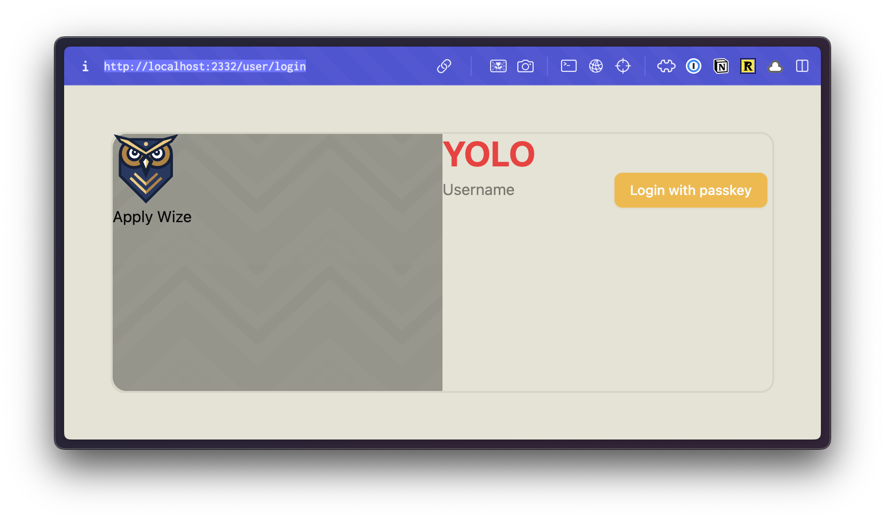

Cool. 😎 We're almost there, we just need to tighten up a few more things.

I want the content to be centered vertically and horizontally. You can do this by adding a class of `flex` and `items-center` and `justify-center`. But, I do this a lot. So, let's turn this into a utility function that we can reuse.

Inside our `styles.css` file, let's add a new utility function. Below our `@theme` definition, add:

```css title="src/styles.css" showLineNumbers=false
@utility center {
  @apply flex items-center justify-center;
}
---
Within Tailwind v4, you can add custom utility functions with the `@utility` directive. _NOTE:_ `center` does not have a `.` in front, like a class would.
---
```

Now, we can use this on both of our columns:

```tsx title="src/app/layouts/AuthLayout.tsx" "center" startLineNumber=3
<div className="bg-bg min-h-screen min-w-screen p-12">
  <div className="grid grid-cols-2 min-h-[calc(100vh-96px)] rounded-xl border-2 border-[#D6D5C5]">
    <div className="center bg-[url('/images/bg.png')] bg-repeat rounded-l-xl">
      
      <div>
        Apply Wize
      </div>
    </div>
    <div className="center">
      {children}
    </div>
  </div>
</div>
```

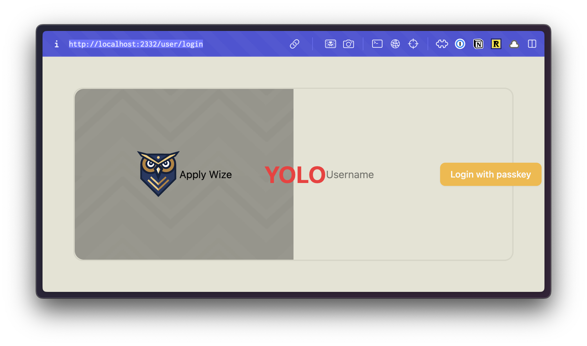

It's centering our content, but it's also horizontally aligning everything. Let's wrap our column content with another `div`.

```tsx title="src/app/layouts/AuthLayout.tsx" {5,11,14} startLineNumber=3
<div className="bg-bg min-h-screen min-w-screen p-12">
  <div className="grid grid-cols-2 min-h-[calc(100vh-96px)] rounded-xl border-2 border-[#D6D5C5]">
    <div className="center bg-[url('/images/bg.png')] bg-repeat rounded-l-xl">
      <div className="center">
        <div>
          
          <div className="text-5xl text-white font-bold">
            Apply Wize
          </div>
        </div>
      </div>
    </div>
    <div className="center">
      <div>{children}</div>
    </div>
  </div>
</div>
```

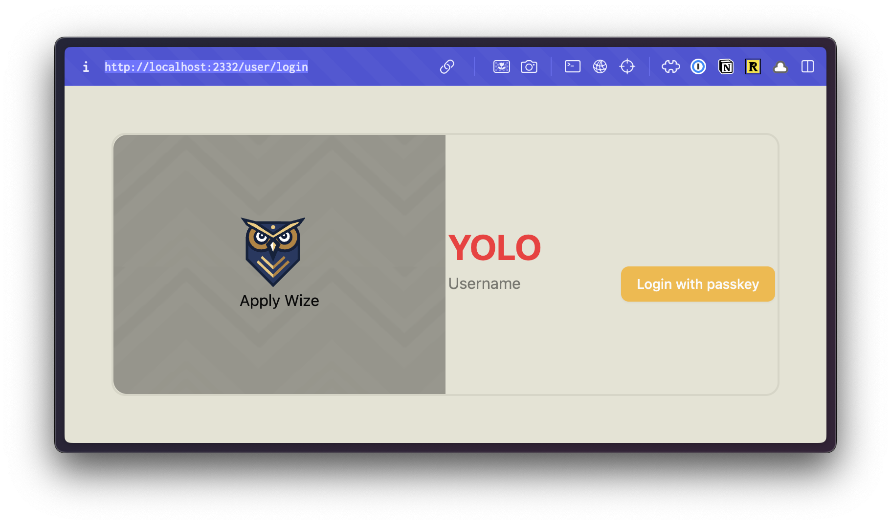

To center the owl, we can use the `mx-auto` class. This will set the left and right margins to `auto`.

```tsx title="src/app/layouts/AuthLayout.tsx" startLineNumber=7 "className="mx-auto""

```

Now, let's style the Apply Wize text.

```tsx title="src/app/layouts/AuthLayout.tsx" {1} startLineNumber=8 "className="text-5xl text-white font-bold""
<div className="text-5xl text-white font-bold">
  Apply Wize
</div>
---
- We'll set the font size `48px` with `text-5xl`
- The color to white with `text-white`
- The font weight to bold with `font-bold`
---
```

In our mock-up, we also had a quote in the bottom left corner:

> “Transform the job hunt from a maze into a map.”


We want this to be fixed to the bottom of the left column. So, this needs to be inside our left column `div`, but outside of the `div` containing our logo.

```tsx title="src/app/layouts/AuthLayout.tsx" {8} startLineNumber=5
<div className="center bg-[url('/images/bg.png')] bg-repeat rounded-l-xl">
  <div>
    
    <div className="text-5xl text-white font-bold">
      Apply Wize
    </div>
  </div>
  <div>“Transform the job hunt from a maze into a map.”</div>
</div>
```

To style the text:

```tsx title="src/app/layouts/AuthLayout.tsx" startLineNumber=12 {1}
<div className="text-white text-sm absolute bottom-0 left-0 right-0 p-10">
  “Transform the job hunt from a maze into a map.”
</div>
---
- We want to it to be white, `text-white` and small (`14px`) `text-sm`
- Then, we can position it absolutely to the bottom left corner with `absolute bottom-0 left-0`
- We want to add a little bit of spacing from the edge with `p-10` which is `40px` of padding
---
```

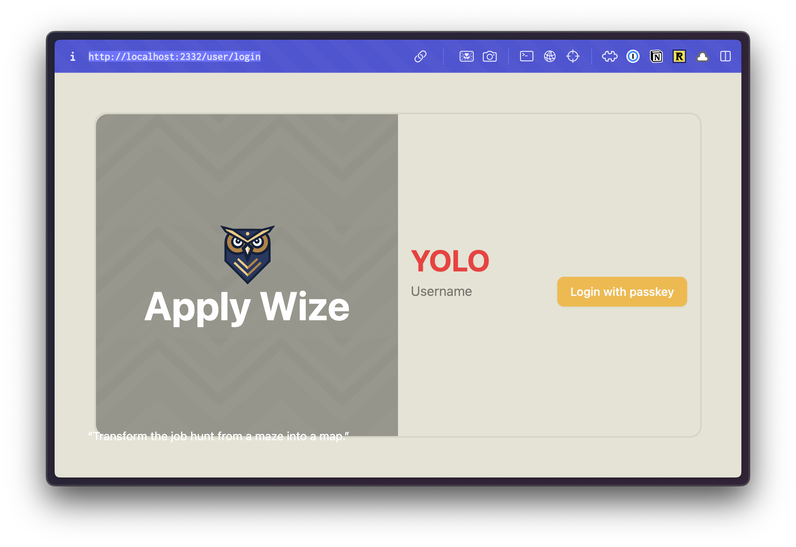

This looks good-ish. The text is styled correctly, but the placement is off. We could adjust our our `top` and `left` values, but that's not the real problem. In CSS, positioning is relative. Meaning, it takes the parent container and it's positioning into consideration.

Our parent `div` doesn't have any positioning applied (by default it's `static`). Therefore, it looks to the page. And, yes, our quote is positioned to the bottom left corner of the page, with `40px` of padding.

If we add a class of `relative` to our parent `div`, then it will position our quote _relative_ to the parent container.

```tsx title="src/app/layouts/AuthLayout.tsx" "relative" startLineNumber=5
<div className="relative center bg-[url('/images/bg.png')] bg-repeat rounded-l-xl">
```

If you take a look inside the browser:

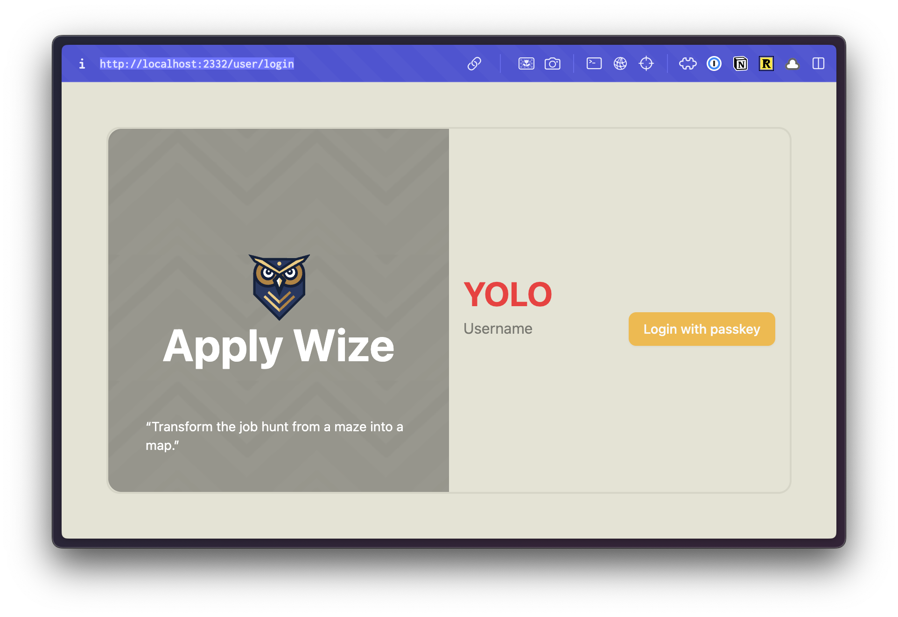

Notice, this also allows our quote to "live" inside the container and wrap appropriately.

It's tempting to call the styling for the left side done, but with the quote it looks bottom heavy. Even though the logo is programmatically centered, it's not optically centered. We can shift it up:

```tsx title="src/app/layouts/AuthLayout.tsx" {1} startLineNumber=6
<div className="-top-[100px] relative">
  
  <div className="text-5xl text-white font-bold">
    Apply Wize
  </div>
</div>
---
- We moved the logo up `100px` with `-top-[100px]`
- In order for `top` to work, we need also need to add a position of `relative`, so that the browser knows we're moving it _relative_ to it's current position.
---
```

If we take a look in the browser:

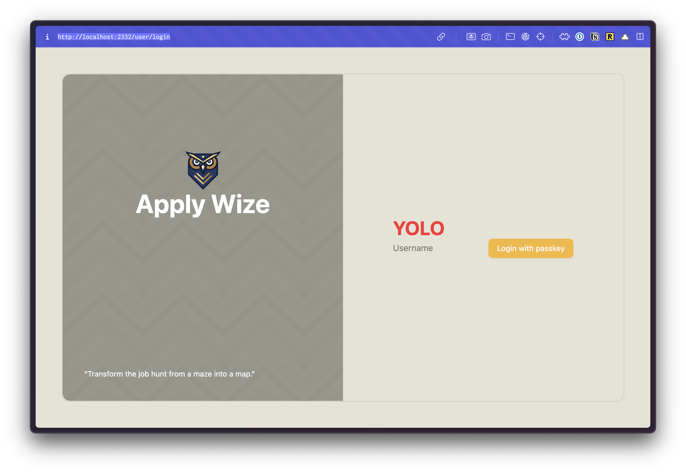

The left side is finished! 🎉

Now, let's style the right side. This is easy!

```tsx title="src/app/layouts/AuthLayout.tsx" {1} startLineNumber=16
<div className="center bg-white rounded-r-xl">
  <div className="w-full">{children}</div>
</div>
---
- We want all the content to be centered, with our custom utility `center`
- The background should be white: `bg-white`
- And the corners on the right should be rounded, `rounded-r-xl`
- For the `div` that wraps `{children}`, we want it to take the full width of it's container with `w-full`
---
```


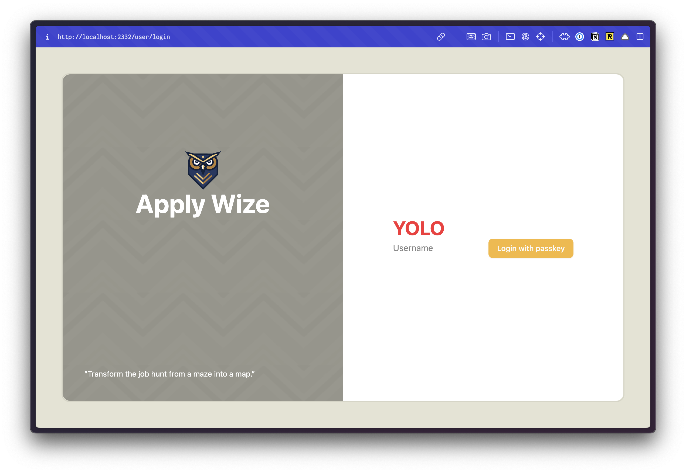

The styling for auth layout component is complete, but there's still one thing bothering me. (And maybe it's been bothering you too.)

We have a TypeScript error on `{children}`. It doesn't know what the type of `children` is.

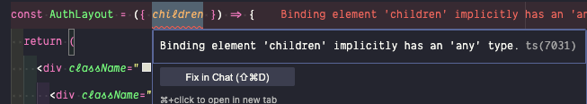

This is easy enough to fix. We just need to tell what it what to expect:

```tsx title="src/app/layouts/AuthLayout.tsx" ": { children: React.ReactNode }"
const AuthLayout = ({ children }: { children: React.ReactNode }) => {
```

<Aside type="tip" title="React.ReactNode vs React.ReactElement vs JSX.Element">
When setting the type for `children` within React, you'll see `React.ReactNode`, `React.ReactElement`, and `JSX.Element`, almost interchangeably. Which is right?

[There's an article on Total TypeScript](https://www.totaltypescript.com/jsx-element-vs-react-reactnode) that's my go to reference for this:

> - `JSX.Element` and `React.ReactElement` are functionally the same type. They can be used interchangeably. They represent the thing that a JSX expression creates.
> - They can't be used to represent all the things that React can render, like strings and numbers. For that, use `React.ReactNode.`
> - In everyday use, you should use `React.ReactNode`. You rarely need to use the more specific type of `JSX.Element`.
</Aside>

<details>
<summary>Final `src/app/layouts/AuthLayout.tsx` code </summary>

```tsx title="src/app/layouts/AuthLayout.tsx"
const AuthLayout = ({ children }: { children: React.ReactNode }) => {
  return (
    <div className="bg-bg min-h-screen min-w-screen p-12">
      <div className="grid grid-cols-2 min-h-[calc(100vh-96px)] rounded-xl border-2 border-[#D6D5C5]">
        <div className="relative center bg-[url('/images/bg.png')] bg-repeat rounded-l-xl">
          <div className="-top-[100px] relative">
            
            <div className="text-5xl text-white font-bold">Apply Wize</div>
          </div>
          <div className="text-white text-sm absolute bottom-0 left-0 right-0 p-10">
            “Transform the job hunt from a maze into a map.”
          </div>
        </div>
        <div className="center bg-white rounded-r-xl">
          <div className="w-full">{children}</div>
        </div>
      </div>
    </div>
  );
};

export { AuthLayout };
```
</details>

### Styling the Login Content

Now, we can jump over to our `Login` component and style it.

First we can delete our `h1`, **YOLO** text. Now, let's just work from top to bottom.

In the top, right corner, we have a link to the signup page. This is similar to our the quote in our layout component, except this time we want it positioned to the top, right corner.

```tsx title="src/app/pages/user/Login.tsx" {3-7} startLineNumber=48
return (
  <AuthLayout>
    <div className="absolute top-0 right-0 p-10">
      <a href="#" className="font-display font-bold text-black text-sm underline underline-offset-8 hover:decoration-primary">
        Register
      </a>
    </div>
    ...
  </AuthLayout>
)
---
- We're positioning the link with `absolute` to the top right, `top-0 right-0` and adding `p-10` or `40px` of padding
- For the Register link, we want to use the font Poppins or `font-display`, make it bold `font-bold`, black `text-black`, and small `text-sm`
- I want to make sure this looks like a link. Let's add a class of `underline` and offset with `underline-offset-8` to give it some space from the text. Then, when we hover, let's just change the underline color with `hover:decoration-primary`
---
```

Now, we have the same positioning "problem" that we had with our quote. We need the link to be positioned relative to the container. Let's go back to the `AuthLayout` component and add a class of `relative`:

```tsx title="src/app/layouts/AuthLayout.tsx" "relative" startLineNumber=16
<div className="center bg-white rounded-r-xl relative">
  <div className="w-full">{children}</div>
</div>
```

Next up, let's wrap all of our form content with a `div` and add the text at the top of our form:

```tsx title="src/app/pages/user/Login.tsx" {1-3, 16} startLineNumber=50
<div className="max-w-[400px] w-full mx-auto px-10">
  <h1 className="text-center">Login</h1>
  <p className="py-6">Enter your username below to sign-in.</p>

  <input
    type="text"
    value={username}
    onChange={(e) => setUsername(e.target.value)}
    placeholder="Username"
  />
  <Button onClick={handlePerformPasskeyLogin} disabled={isPending}>
    {isPending ? <>...</> : "Login with Passkey"}
  </Button>
  {result && <div>{result}</div>}
</div>
---
- On our wrapping `div` I don't want the content to be more than `400px` wide with `max-w-[400px]`. But, I want it to take up as much space as possible with `w-full`.
- I want it to be centered with `mx-auto`.
- On smaller screens, I want to ensure there's some horizontal padding with `px-10`
- Our `h1` should be centered with `text-center`
- I also want to add some vertical spacing with `py-6`
---
```

Let's also add some text below our form:

```tsx title="src/app/pages/user/Login.tsx" startLineNumber=68 {5}
<Button onClick={handlePerformPasskeyLogin} disabled={isPending} className="font-display w-full mb-6">
    {isPending ? <>...</> : "Login with passkey"}
  </Button>
  {result && <div>{result}</div>}
  <p>By clicking continue, you agree to our <a href="#">Terms of Service</a> and <a href="#">Privacy Policy</a>.</p>
```

I want to add some more styling, but I want to be able to reuse these styles on our Signup page, so let's stick these updates inside our `styles.css` file.

In CSS order matters. The [`@layer` CSS at-rule](https://developer.mozilla.org/en-US/docs/Web/CSS/@layer) makes it easy to declare a _layer_ and set the order of preference.

I like to order my CSS:
1. **Base styles** are at the top. These are for styling generic HTML elements. No classes, just tags.
2. **Component styles.** These are for styling classes that get used across multiple components and pages.
3. **Page specific styles.** These are for styling elements on a specific page.

Based on this ordering, we get more specific as we move down the file.

let's start by setting up `@layer` for each grouping.

At the very bottom of our `styles.css` file, we already have a `@layer base` that shadcn/ui created.

```css title="src/styles.css" startLineNumber=139
@layer base, components, page;

@layer base {
  * {
    @apply border-border outline-ring/50;
  }
  body {
    @apply bg-background text-foreground;
  }
}

@layer components {}

@layer page {}
```

<Aside type="tip" title="CSS Layers">
Do these `@layer` names give you déjà vu? Feels similar to Tailwind v3? It's the exact same concept! Since these layers [are no longer established in Tailwind v4](https://tailwindcss.com/docs/upgrade-guide#removed-tailwind-directives), we have to define the order ourselves: `@layer base, components, page;`

Technically, we could list our layers in any order we want:
```css showLineNumbers=false
@layer page {}
@layer components {}
@layer base {}
```

It will still be applied in the correct order, because we explicitly defined the order:
```css showLineNumbers=false
@layer base, components, page;
```
</Aside>

For all our headings (`h1, h2, h3, etc.`), we want to use the font Poppins, `font-display`, and make it bold `font-bold`. Let's stick this inside our base layer:

```css title="src/styles.css" showLineNumbers=false
@layer base {
  ...
  h1,
  h2,
  h3 {
    @apply font-display font-bold;
  }
}
```

Then, let's also add some more specific styles for our `h1` since it's a page title:

```css title="src/styles.css" showLineNumbers=false
@layer components {
  .page-title {
    @apply text-3xl
  }
}
---
- We're setting the font size to `30px` with `text-3xl`
---
```

Back in our `Login` component, let's add the class of `page-title` to our `h1`:

```tsx title="src/app/pages/user/Login.tsx" "page-title" startLineNumber=46
<h1 className="page-title text-center">Login</h1>
```

We have a couple of paragraphs of text, but I only want these classes to be applied to our auth forms. Let's add a class of `auth-form` to our wrapping `div`:

```tsx title="src/app/pages/user/Login.tsx" "auth-form" startLineNumber=45
<div className="auth-form max-w-[400px] w-full mx-auto px-10">
  <h1 className="text-center page-title">Login</h1>
  <p className="py-6">Enter your username below to sign-in.</p>
  <input
    type="text"
    value={username}
    onChange={(e) => setUsername(e.target.value)}
    placeholder="Username"
  />
  <Button onClick={handlePerformPasskeyLogin} disabled={isPending}>
    {isPending ? <>...</> : "Login with passkey"}
  </Button>
  {result && <div>{result}</div>}
  <p>
    By clicking continue, you agree to our{" "}
    <a href="#">Terms of Service</a> and <a href="#">Privacy Policy</a>.
  </p>
</div>
```

In our `styles.css` file, let's target the `auth-form` class:

```css title="src/styles.css" showLineNumbers=false
@layer page {
  /* login page */
  .auth-form {
    p { @apply text-sm text-zinc-500 text-center;
      a { @apply text-zinc-500 hover:text-black underline whitespace-nowrap; }
    }
  }
}
---
- You'll notice I'm using CSS nesting to target the `p` and `a` tags inside the `auth-form` class. This gets rendered as `.auth-form p` and `.auth-form p a`.
- For the paragraph, I want the text to be small `text-sm`, gray `text-zinc-500` (this is a Tailwind color), and centered `text-center`.
- For a link inside our paragraph, the color should be gray `text-zinc-500`, but when we hover over it, it should be black `hover:text-black`.
- Let's `underline` the link so that we it's obvious it's a link.
- I'm also going to add a class of `whitespace-nowrap` to prevent the link from wrapping to a new line. Meaning, "Terms of Service" or "Privacy Policy" will fit on a single line.
---
```


If we take a look in the browser, this looks great. The only thing we lack is the input field and button styles. Let's head back to our `styles.css` file:

```css title="src/styles.css" showLineNumbers=false
@layer base {
  ...
  /* form elements */
  input[type="text"] {
    @apply border-border border-1 rounded-md px-3 h-9 block w-full mb-2 text-base;
  }
}
---
- Let's target an `input` with a `type` of `text` with `input[type="text"]`. Since, we're styling a base tag, we can stick this in the `base` layer.
- We want to add a border with a color of border `border-border` and a width of `1px` with `border-1`.
- Let's round the corners with `rounded-md`
- Add some horizontal padding `px-3`
- Set the height to `36px` with `h-9`
- Give our input a `display` of `block`. This ensure that the `input` has it's own line.
- It should span the entire width of its container `w-full`.
- Let's add some spacing to the bottom with `mb-2` (`8px`)
- Set the font size to `16px` with `text-base`
---
```

For the button, we're using the shadcn/ui button component. Let's crack it open:

```tsx title="src/components/ui/button.tsx" collapse={8-29} startLineNumber=9 "buttonVariants" "default:" "font-bold" del="font-medium"
const buttonVariants = cva(
  "font-bold inline-flex items-center justify-center gap-2 whitespace-nowrap rounded-md text-sm font-medium transition-all disabled:pointer-events-none disabled:opacity-50 [&_svg]:pointer-events-none [&_svg:not([class*='size-'])]:size-4 shrink-0 [&_svg]:shrink-0 outline-none focus-visible:border-ring focus-visible:ring-ring/50 focus-visible:ring-[3px] aria-invalid:ring-destructive/20 dark:aria-invalid:ring-destructive/40 aria-invalid:border-destructive",
  {
    variants: {
      variant: {
        default:
          "bg-primary text-primary-foreground shadow-xs hover:bg-primary/90",
        destructive:
          "bg-destructive text-white shadow-xs hover:bg-destructive/90 focus-visible:ring-destructive/20 dark:focus-visible:ring-destructive/40 dark:bg-destructive/60",
        outline:
          "border bg-background shadow-xs hover:bg-accent hover:text-accent-foreground dark:bg-input/30 dark:border-input dark:hover:bg-input/50",
        secondary:
          "bg-secondary text-secondary-foreground shadow-xs hover:bg-secondary/80",
        ghost:
          "hover:bg-accent hover:text-accent-foreground dark:hover:bg-accent/50",
        link: "text-primary underline-offset-4 hover:underline",
      },
      size: {
        default: "h-9 px-4 py-2 has-[>svg]:px-3",
        sm: "h-8 rounded-md gap-1.5 px-3 has-[>svg]:px-2.5",
        lg: "h-10 rounded-md px-6 has-[>svg]:px-4",
        icon: "size-9",
      },
    },
    defaultVariants: {
      variant: "default",
      size: "default",
    },
  }
)
---
- Near the top of the file, there's a variable called `buttonVariants` that contains all the Tailwind styling.
- Let's make the button text bold by adding a class of `font-bold` within the first list of classes. This ensures that all button variants will be bold. You'll also need to remove `font-medium` from the list. Otherwise, the two classes will conflict.
- The first variant is the `default` variant and has a class of `bg-primary`. This is why our button is using our yellow, primary color. We've already set `--color-primary` within our `styles.css` file.
---
```

The button text is appearing white because of the `text-primary-foreground` class. If you do a quick search within the `styles.css` file, you can find the `--primary-foreground` definition nested inside the `:root` and `.dark` blocks.

We can override this by adding a class of `--color-primary-foreground` within our `@theme` block:

```css title="src/styles.css" showLineNumbers=false
@theme {
  ...
  --color-primary-foreground: #000;
```

Let's also add a few specific classes just for login button. I don't want this to get applied by default to every button we use, so I'm going to apply these to the `Button` component on the Login page.

```tsx title="src/app/pages/user/Login.tsx" startLineNumber=56 "className="font-display w-full mb-6""
<Button onClick={handlePerformPasskeyLogin} disabled={isPending} className="font-display w-full mb-6">
  {isPending ? <>...</> : "Login with Passkey"}
</Button>
---
- At the end of our `Button` component, let's add classes to use the font Poppins, `font-display`, make the button span the full width of its container `w-full`, and add some spacing to the bottom with `mb-6`
---
```

Let's take a look at the final result within the browser:

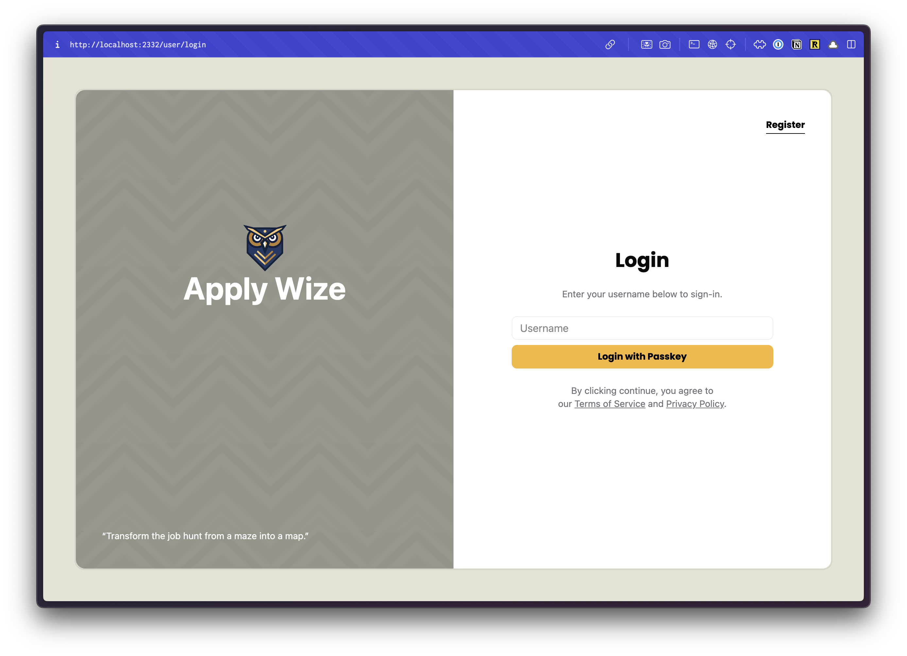

👏 Well done!

But, there's one more thing. Let's move the `result` message above the form and below our text:

```tsx title="src/app/pages/user/Login.tsx" startLineNumber=45 "{result && <div>{result}</div>}"
<div className="auth-form max-w-[400px] w-full mx-auto px-10">
  <h1 className="page-title text-center">Login</h1>
  <p className="py-6">Enter your username below to sign-in.</p>
  {result && <div>{result}</div>}
  ...
```

We can also style this, using an `<Alert />` shadcn/ui component. We just need to import our component at the top and wrap our `{result}`.

```tsx title="src/app/pages/user/Login.tsx" showLineNumbers=false
import { Alert, AlertTitle } from "@/app/components/ui/alert";
import { AlertCircle } from "lucide-react";
...
{result && (
  <Alert variant="destructive" className="mb-5">
    <AlertCircle className="h-4 w-4"/>
    <AlertTitle>{result}</AlertTitle>
  </Alert>
)}
---
- `Alert`, `AlertCircle`, and `AlertTitle` are all from the shadcn/ui `Alert` component. [You can find the full documentation here.](https://ui.shadcn.com/docs/components/alert)
- Let's set the `variant` to `destructive`
- and add some margin to the bottom with `mb-5`
---
```

You'll need to login (successfully or unsuccessfully) to see the alert.

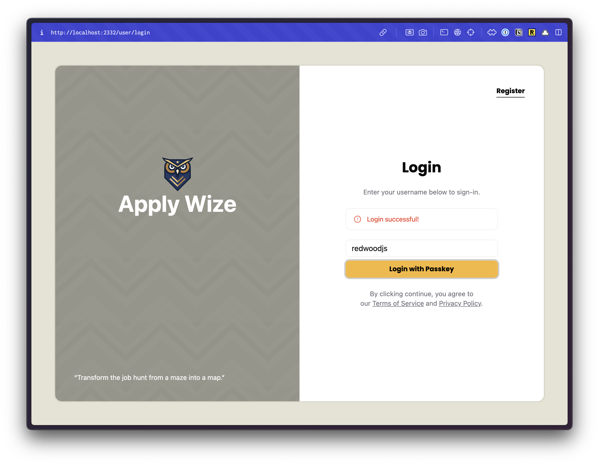

I know, it feels strange to see a red alert message when we were able to successfully login. But, really, if we were able to login successfully, we want to be redirected to the homepage. We can update the `passkeyLogin` function (starts on line 16):

```tsx title="src/app/pages/user/Login.tsx" {14} collapse={2-10} startLineNumber=16
const passkeyLogin = async () => {
  // 1. Get a challenge from the worker
  const options = await startPasskeyLogin();

  // 2. Ask the browser to sign the challenge
  const login = await startAuthentication({ optionsJSON: options });

  // 3. Give the signed challenge to the worker to finish the login process
  const success = await finishPasskeyLogin(login);

  if (!success) {
    setResult("Login failed");
  } else {
    window.location.href = "/";
  }
};
---
- If we weren't successful, it will still set the result message to "Login failed."
- If we were successful, it will redirect us to the homepage.
---
```

🥳 Excellent!

But, there's one more thing (there's always one more thing). We need to add links to our Register, Terms of Service, and Privacy Policy pages.

### Linking between the Login and Signup Pages

We could make our links "simple" and use something like this:

```tsx showLineNumbers=false
<a href="/register">Register</a>
```

This will definitely get us where we want to go. The only problem is, it's not type safe and prone to typos.

Within our `src/app/shared` folder, there's a file inside called `links.ts`.

```tsx title="src/app/shared/links.ts"
import { defineLinks } from "rwsdk/router";

export const link = defineLinks(["/", "/user/login", "/user/logout"]);
---
At first glance, this file is a little sparse.
- **On line 1**, we're importing the `defineLinks` from the RedwoodSDK.
- **On line 3**, we're defining an array of all our links or routes. Right now, there's are three:
  1. Our home page, at `"/"`
  2. Our login page, at `/user/login`
  3. Our logout page, at `/user/logout`
---
```

Let's add reference links for our other pages:

```tsx title="src/app/shared/links.ts" {4, 6-7} startLineNumber=3
export const link = defineLinks([
  "/",
  "/user/login",
  "/user/signup",
  "/user/logout",
  "/legal/privacy",
  "/legal/terms",
]);
```

<Aside type="note" title="Protected Page Route">
  I didn't add the `/protected` route to our `links.ts` file because it's a temporary route. We'll eventually remove it from our application.
</Aside>

Now, let's go back to our `Login` component and update our **Register** link.

```tsx title="src/app/pages/user/Login.tsx" showLineNumbers=false
import { link } from "@/app/shared/links";
...
<a href={link('/user/signup')} className="font-display font-bold text-black text-sm underline underline-offset-8 hover:decoration-primary">
  Register
</a>
---
- At the top of our file, let's import our `link` function.
- Then, within our Register `a` tag, let's set the `href` to `link('/user/signup')`.
---
```

As you type, you should see VS Code make recommendations based on the contents of our `links.ts` file.

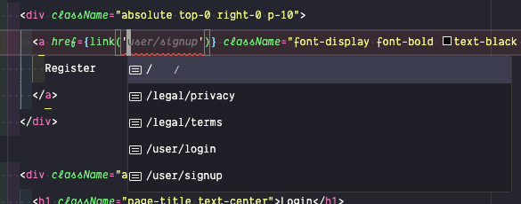

We can make similar changes to our **Terms of Service** and **Privacy Policy** links:

```tsx title="src/app/pages/user/Login.tsx" "{link("/legal/terms")}" "link("/legal/privacy")" startLineNumber=70
<p>By clicking continue, you agree to our <a href={link("/legal/terms")}>Terms of Service</a> and <a href={link("/legal/privacy")}>Privacy Policy</a>.</p>
```

If you check your work in the browser, the register link works great, but our Terms of Service and Privacy Policy links go to a Not Found page. Let's fix that.

We'll do a quick "duct tape" solution for now, but we'll eventually circle back around.

Within our `src/worker.tsx` file, we're exporting `defineApp`. Remember, this includes definitions for all our middleware and routes.

```tsx title="src/worker.tsx" collapse={2-30} startLineNumber=19 {45-46}
export default defineApp([
  setCommonHeaders(),
  async ({ ctx, request, headers }) => {
    await setupDb(env);
    setupSessionStore(env);

    try {
      ctx.session = await sessions.load(request);
    } catch (error) {
      if (error instanceof ErrorResponse && error.code === 401) {
        await sessions.remove(request, headers);
        headers.set("Location", "/user/login");

        return new Response(null, {
          status: 302,
          headers,
        });
      }

      throw error;
    }

    if (ctx.session?.userId) {
      ctx.user = await db.user.findUnique({
        where: {
          id: ctx.session.userId,
        },
      });
    }
  },
  render(Document, [
    route("/", Home),
    route("/protected", [
      ({ ctx }) => {
        if (!ctx.user) {
          return new Response(null, {
            status: 302,
            headers: { Location: "/user/login" },
          });
        }
      },
      Home,
    ]),
    prefix("/user", userRoutes),
    route("/legal/privacy", () => <h1>Privacy Policy</h1>),
    route("/legal/terms", () => <h1>Terms of Service</h1>),
  ]),
]);
---
- **On line 63**, let's add a new `route` definition to our array for our privacy policy page. The `route` function takes two parameters. The first parameter is the path or the URL. The second parameter is the response. This could be [a standard HTML response object](https://developer.mozilla.org/en-US/docs/Web/API/Response) or JSX/TSX. For our quick solution, we're inlining JSX.
- **On line 64**, we're doing the exact same thing for our Terms page.
---
```

You'll also need to update the `import` statement at the top of your file:

```tsx title="src/worker.tsx" "route " startLineNumber=2
import { index, layout, prefix, route } from "rwsdk/router";
```

Now, if you check your work in the browser, you should see the Terms of Service and Privacy Policy links working.

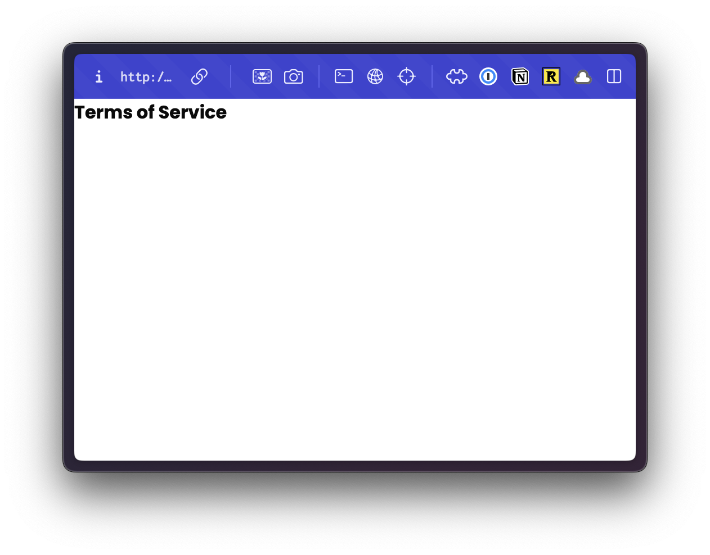

<Aside type="note" title="Alternate way of displaying our legal routes">
  When we listed our legal routes, we listed them individually:
  ```tsx title="src/worker.tsx" startLineNumber=18 {46}
  route("/legal/privacy", () => <h1>Privacy Policy</h1>),
  route("/legal/terms", () => <h1>Terms of Service</h1>),
  ```
  But, we could also group them together, with a `prefix` (similar to our `/user` routes, but a little different):
  ```tsx title="src/worker.tsx" startLineNumber=18
  prefix("/legal", [
    route("/privacy", () => <h1>Privacy Policy</h1>),
    route("/terms", () => <h1>Terms of Service</h1>),
  ]),
  ```
</Aside>

## Styling the Signup Page

😅 Don't worry, we've already done all the heavy lifting. This will be a breeze.

```tsx title="src/app/pages/user/Signup.tsx" del={4, 7} ins={1,5,8} showLineNumbers=false
import { AuthLayout } from "@/app/layouts/AuthLayout";
...
return (
  <main className="bg-bg">
  <AuthLayout>
  ...
  </main>
  </AuthLayout>
)
---
- Let's import our `AuthLayout` at the top of our file.
- Then, we'll replace our `main` tag with our `AuthLayout` component.
---
```

Right inside our `AuthLayout` component, let's add our Login link:

```tsx title="src/app/pages/user/Signup.tsx" showLineNumbers=false "/user/login" "Login" ins={1, 4-8}
import { link } from "@/app/shared/links";
...
<AuthLayout>
  <div className="absolute top-0 right-0 p-10">
    <a href={link('/user/login')} className="font-display font-bold text-black text-sm underline underline-offset-8 hover:decoration-primary">
      Login
    </a>
  </div>
  ...
</AuthLayout>
---
- Our Login link is using the exact same styles as the Register link on the Login page. The only difference is we changed the link to point to our `/user/login` route and the label is `Login`.
---
```

Next, let's wrap all of our form content with a `div`:

```tsx title="src/app/pages/user/Signup.tsx" startLineNumber=56 "auth-form max-w-[400px] px-10" ins={2,9}
<AuthLayout>
  <div className="auth-form max-w-[400px] w-full mx-auto px-10">
    <div className="absolute top-0 right-0 p-10">
      <a href={link('/user/login')} className="font-display font-bold text-black text-sm underline underline-offset-8 hover:decoration-primary">
        Login
      </a>
    </div>
    ...
  </div>
</AuthLayout>
---
- We're using the same styles as our login page.
- We have a class `auth-form` that will style our `p` and `a` tags.
- We've set the maximum width of our form to `400px`, but we want it to take up as much space as possible `min-w-full`.
- Center it on the page `mx-auto`.
- Added `40px` padding to the left and right with `px-10`.
---
```

We can get rid of our red YOLO heading at the top and replace it with:
```tsx title="src/app/pages/user/Signup.tsx" startLineNumber=63
<h1 className="page-title text-center">Create an Account</h1>
<p className="py-6">Enter a username to setup an account.</p>
```

Let's move our `result` message to appear below our heading:

```tsx title="src/app/pages/user/Signup.tsx" showLineNumbers=false ins={1-2, 6-11} del={13}
import { Alert, AlertTitle } from "@/app/components/ui/alert";
import { AlertCircle } from "lucide-react";
...
<h1 className="page-title text-center">Create an Account</h1>
<p className="py-6">Enter a username to setup an account.</p>
{result && (
  <Alert variant="destructive" className="mb-5">
    <AlertCircle className="h-4 w-4"/>
    <AlertTitle>{result}</AlertTitle>
  </Alert>
)}
...
{result && <div>{result}</div>}
```

Jumping down a little bit, on our `Button` component, let's add a few classes to the end:

```tsx title="src/app/pages/user/Signup.tsx" ins="className="font-display w-full mb-6"" startLineNumber=83
<Button onClick={handlePerformPasskeyRegister} disabled={isPending} className="font-display w-full mb-6">
  {isPending ? <>...</> : "Register with Passkey"}
</Button>
---
- We want to use the font Poppins, `font-display`.
- Make the button span the entire width of the container, `w-full`.
- Add some spacing to the bottom, `mb-6`.
---
```

Then, right below the button, we can add our legal statement:

```tsx title="src/app/pages/user/Signup.tsx" startLineNumber=87
<p>By clicking continue, you agree to our <a href={link('/legal/terms')}>Terms of Service</a> and <a href={link('/legal/privacy')}>Privacy Policy</a>.</p>
```

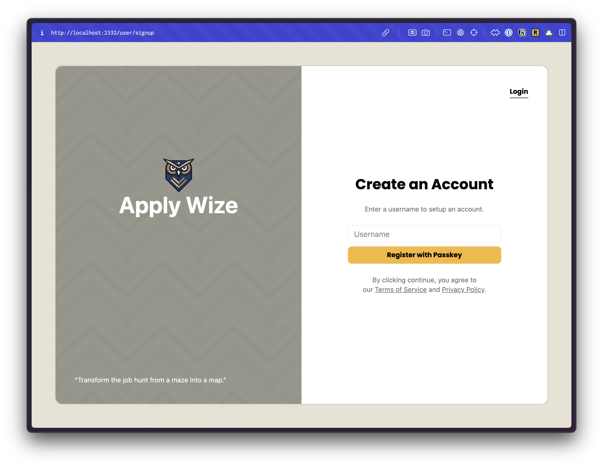

See, I told you! Easy peasy. 🍋

<Aside type="tip" title="Code on GitHub">
You can find the final code for this step on [GitHub](https://github.com/redwoodjs/applywize/tree/main/end-of-4).
</Aside>

## Further reading

- An even more [detailed guide to how Authentication works and the reasoning behind some of the decisions we made](/core/authentication)

