import { Aside, FileTree } from '@astrojs/starlight/components';

import { PackageManagers } from "starlight-package-managers";

The jobs application list page lists all the jobs that we've applied for. For this tutorial, it will also serve as the Dashboard.

The finished page will look like this:

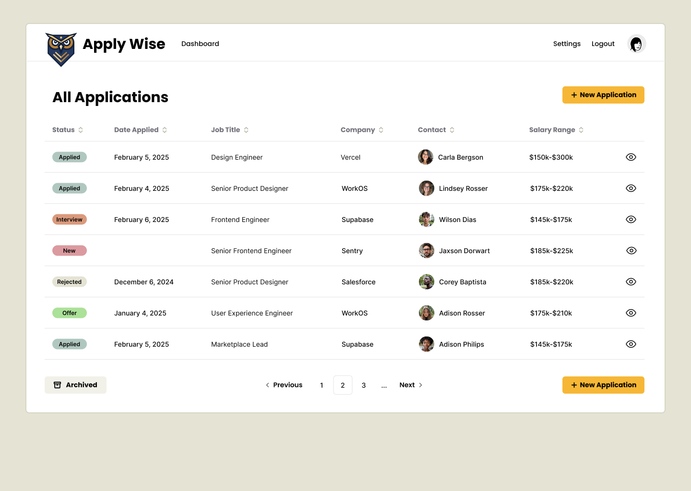

Let's start with the backend code and then make it look good.

But, first, we need a page and a route.

In the `src > app > pages` directory, create a new folder called `applications`. Inside, create a file called `List.tsx`.

<FileTree>
- src/
  - app/
    - pages/
      - applications/
        - List.tsx
      - user/
      - Home.tsx
</FileTree>

We can stub out a basic page, just to make sure it's loading correctly.

```tsx title="src/app/pages/applications/List.tsx"
const List = () => {
  return (
    <div>List</div>
  )
}

export { List }
```

Now, within our `worker.tsx` file, we can add a route for our new page.

```tsx title="src/worker.tsx" showLineNumbers=false
import { List } from "./app/pages/applications/List";
...
prefix("/applications", [
  route("/", List),
])
---
- We'll group all of our application routes (List, New, Detail, Update) under the `/applications` prefix.
- When the user visits `/applications`, they'll see our `List` component.
---
```

Let's test this out in the browser. Go to `http://localhost:5173/applications` and you should see our stubbed out page.

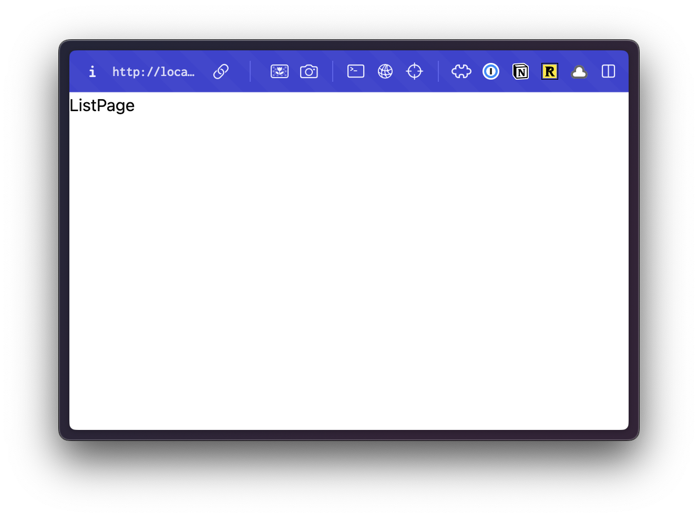

Since we've already set up authentication, we can also protect this route.

```tsx title="src/worker.tsx" startLineNumber=66
prefix("/applications", [
  route("/", [
    ({ ctx }) => {
      if (!ctx.user) {
        return new Response(null, {
          status: 302,
          headers: { Location: "/user/login" },
        });
      }
    }, List]),
])
```

This would get cumbersome (and annoying) if we have to do this for every.single.route we wanted to protect. Let's abstract this code into a reusable function.

```tsx title="src/worker.tsx" startLineNumber=20
const isAuthenticated = ({ ctx }: { ctx: AppContext}) => {
  if (!ctx.user) {
    return new Response(null, {
      status: 302,
      headers: { Location: "/user/login" },
    });
  }
}
---
We're passing in the `ctx` that we get with each request. Then, we're checking to see if the `user` exists on the context object. If it doesn't, we're returning a response that redirects the user to the login page.
---
```

Then, we can update our `/applications` route to use `isAuthenticated`:

```tsx title="src/worker.tsx" startLineNumber=75
prefix("/applications", [
  route("/", [isAuthenticated, List]),
])
```

Now, we can also update our protected page route to use the `isAuthenticated` function, too:

```tsx title="src/worker.tsx" startLineNumber=61
route("/protected", [ isAuthenticated, Home ]),
```

Actually, let's refactor this. The `protected` route was meant as an example. We don't need `/protected`, but we do want to protect our home page: `route("/", Home),`. Let's change `/protected` to `/`, and then delete `route("/", Home),`.

```tsx title="src/worker.tsx" showLineNumbers=false del={1-2} ins={3}
route("/", () => new Response("Hello, World!")),
route("/protected", [isAuthenticated, Home]),
route("/", [isAuthenticated, Home]),
```

I want to take this a step further, though, and show you another option. With the homepage route, you can also use the `index` function. This works very similar to the `route` function, but it already knows the path is `/`, so it only takes one argument: the response.

```tsx title="src/worker.tsx" showLineNumbers=false del={1} ins={2}
route("/", [isAuthenticated, Home]),
index([ isAuthenticated, Home ]),
```

Be sure to import `index` at the top of the file:

```tsx startLineNumber=2 "index"
import { route, render, prefix, index } from "rwsdk/router";
```

Test it out. 👨‍🍳 Chef's kiss! If you're logged in, you should see the "List" text. If you're not logged in, you'll be redirected to the login page.

<Aside type="tip" title="Using multiple layers of Middleware">
  You can use multiple layers of middleware, by continuing to write functions and adding them to the array. They'll run in the order they're listed. For example:
  ```tsx
  prefix("/applications", [
    route("/", [isAuthenticated, isAdmin, List]),
  ])
  ```
</Aside>

Now, let's get some data into the database.

We can do this one of two ways:

### Option 1: Create a Seed File
[Earlier, I mentioned that sometimes I'll create multiple seed files with various purposes.](/tutorial/full-stack-app/database-setup#seed-the-database). This is a perfect opportunity to create a separate file just for adding job applications to our database.

Inside the `src/scripts` directory, create a new file called `applicationSeed.ts`.

Let's stub it out:

```tsx title="src/scripts/applicationSeed.ts"
import { defineScript } from "rwsdk/worker";
import { db, setupDb } from "@/db";

export default defineScript(async ({ env }) => {
  setupDb(env);

  console.log("🌱 Finished seeding");
});
---
- **On line 4**, we're setting up the Cloudflare Worker environment to run our script. By default, we get the `env` object.
- **On line 5**, we're setting up our database.
- **On line 7**, we're logging a message to the console to indicate that the script has finished running.
---
```

Inside our function, we can reach for a standard Prisma `create` function:

```tsx title="src/scripts/applicationSeed.ts" startLineNumber=7
const createApplication = async () => {
  await db.application.create({
    data: {
      salaryMin: "100000",
      salaryMax: "120000",
      jobTitle: "Software Engineer",
      jobDescription: "Software Engineer",
      postingUrl: "https://redwoodjs.com",
      dateApplied: new Date(),
    }
  })
};

await createApplication();
---
- **On line 8,** we're referencing the `application` table. Then, using the Prisma `create` function to add all the data in our database object. You'll notice that these values match the columns we defined in `schema.prisma` file.
---
```

You'll probably see a few linting errors.


If you run the script now, you'll hit a few errors because it's also looking for related `user`, `status`, and `company` entries. For the `user` and `status` connections, we already have entries within the database we can reference.

Let's start with the `user` connection. If you look at the `user` table, you'll see that their ID is `0f9a097c-d7bc-4ab5-8b11-6942163df348`. (Obviously, yours will be slightly different.) Copy that value.

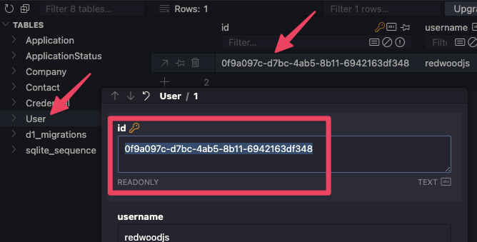

Now, we can connect the entries, by setting `user` to an object with a `connect` key. Inside, we'll specify the `id` of the user we want to connect to.

```tsx title="src/scripts/applicationSeed.ts" {7-11} startLineNumber=4
export default defineScript(async ({ env }) => {
  setupDb(env);

  const createApplication = async () => {
    await db.application.create({
      data: {
        user: {
          connect: {
            id: "0f9a097c-d7bc-4ab5-8b11-6942163df348",
          },
        },
        ...
```

We want to do something similar for the `status`. If we look at the `ApplicationStatus` table, you'll notice that an `id` of `1` is associated with a New application.

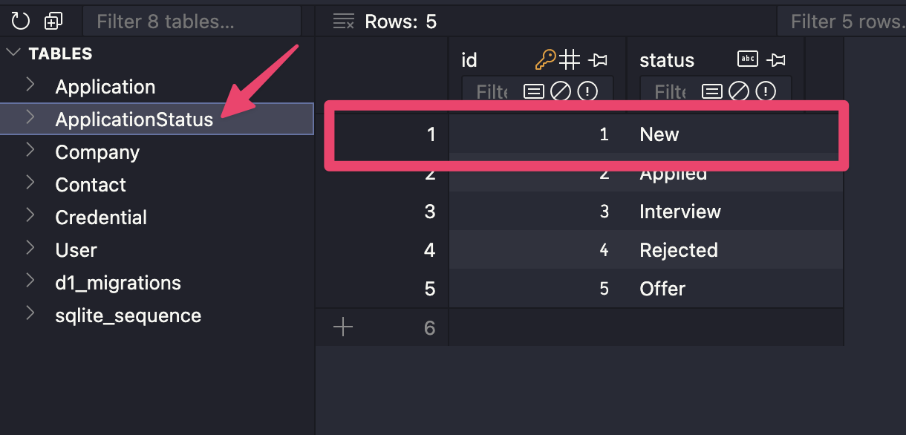

We can connect the application record to the status record, by referencing an object with a `connect` key that contains an object with an `id` of `1`.

```tsx title="src/scripts/applicationSeed.ts" {8-12} startLineNumber=4
export default defineScript(async ({ env }) => {
  setupDb(env);

  const createApplication = async () => {
    await db.application.create({
      data: {
        ...
        status: {
          connect: {
            id: 1,
          },
        },
        ...
```

The company field is a little different because we haven't created any company records yet. However, we can create _and_ connect a company record at the same time:

```tsx title="src/scripts/applicationSeed.ts" {8-20} startLineNumber=4
export default defineScript(async ({ env }) => {
  setupDb(env);

  const createApplication = async () => {
    await db.application.create({
      data: {
        ...
        company: {
          create: {
            name: "RedwoodSDK",
            contacts: {
              create: {
                firstName: "John",
                lastName: "Doe",
                email: "john.doe@example.com",
                role: "Hiring Manager",
              },
            },
          },
        },
        ...
```

This time instead of using an object with a `connect` key, we'll use a `create` key inside. Then, we can list an object with all the company's data.

<details>
<summary>Complete applicationSeed.ts file</summary>

```tsx title="src/scripts/applicationSeed.ts"
import { defineScript } from "rwsdk/worker";
import { db, setupDb } from "@/db";

export default defineScript(async ({ env }) => {
  setupDb(env);

  const createApplication = async () => {
    await db.application.create({
      data: {
        salaryMin: "100000",
        salaryMax: "120000",
        jobTitle: "Software Engineer",
        jobDescription: "Software Engineer",
        postingUrl: "https://redwoodjs.com",
        dateApplied: new Date(),
        user: {
          connect: {
            id: "d7bfbc91-e869-4041-9980-88da4a749c99",
          },
        },
        status: {
          connect: {
            id: 1,
          },
        },
        company: {
          create: {
            name: "RedwoodSDK",
            contacts: {
              create: {
                firstName: "John",
                lastName: "Doe",
                email: "john.doe@example.com",
                role: "Hiring Manager",
              },
            },
          },
        },
      },
    });
  };

  createApplication();

  console.log("🌱 Finished seeding");
});
```

</details>

<Aside type="tip" title="Prisma createMany">
Prisma also has a `createMany` function where you can create multiple entries at the same time. In fact, we used it in the `seed.ts` file, when adding application statuses:

```tsx title="src/scripts/seed.ts" startLineNumber=17
  await db.applicationStatus.createMany({
    data: [
      { id: 1, status: "New" },
      { id: 2, status: "Applied" },
      { id: 3, status: "Interview" },
      { id: 4, status: "Rejected" },
      { id: 5, status: "Offer" },
    ],
  });
```

However, there are a few limitations:

- It does not return the created records, only the count of inserted rows, which can be problematic for certain use cases.
- There's limited support for complex relational constraints and upsert operations.

For reference: [`createMany` on Prisma's Documentation](https://www.prisma.io/docs/orm/prisma-client/queries/crud#create-multiple-records)
</Aside>

<Aside type="note" title="`skipDuplicates` is not supported">
Since our database is a sqlite database, `skipDuplicates` is not supported.
</Aside>


To run the seed file, within the Terminal:

<PackageManagers
  type="run"
  args="worker:run ./src/scripts/applicationSeed.ts"
/>

If this feels hard to remember, you can create a script in your `package.json` file. Inside the `scripts` block:

```json title="package.json" showLineNumbers=false
...
  "scripts": {
    ...
    "seed": "pnpm worker:run ./src/scripts/seed.ts",
    "seed:applications": "pnpm worker:run ./src/scripts/applicationSeed.ts",
    ...
  },
```

Now, you can run the seed file by saying:

<PackageManagers
  type="run"
  args="seed:applications"
/>

😅 Much more straight forward!

When you're creating custom seed files, this does take more time on the frontend to set up. _But,_ it makes it much easier in the long run. Now, anytime you need a fresh set of data, you can run the seed file.

### Option 2: Prisma Studio

Another option is to use Prisma Studio. This option is easier, but requires manual entry and can take more time in the long run. ([We already set up Prisma Studio, here.](/tutorial/full-stack-app/database-setup#prisma-studio-recommended))

```shell
npx prisma studio
```

Prisma Studio should now be available at `http://localhost:5555`. From here, you can create, read, update, and delete records.

<Aside type="caution" title="Data Types within Prisma">
I've run into issues with data types within Prisma Studio. In this example, the `redwoodjs` was added through the Register page, but the `amydutton` user was added through Prisma Studio. It looks like the dates adhere to the same formatting:

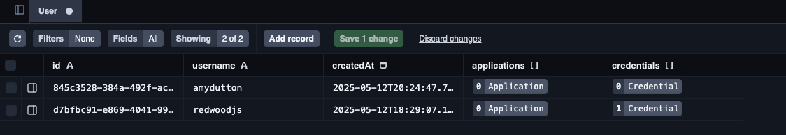

However, if you look at the same data within the Sqlite Viewer extension, you'll see the difference:

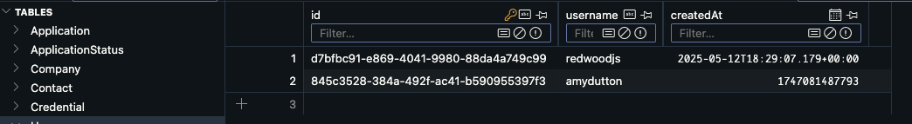

</Aside>

## Displaying the Job Application Data

Once you've added some data, let's go back to our application and display the data on the page.

On the Applications list page, let's `import` the `db` at the top of the file. Then, inside the `List` function, let's use the `findMany` function to get all the applications:

```tsx title="src/app/pages/applications/List.tsx" "async" {4, 8}
import { db } from "src/db";

const List = async () => {
  const applications = await db.application.findMany();

  return (
    <div>
      <pre>{JSON.stringify(applications, null, 2)}</pre>
    </div>
  )
}

export { List }
---
Notice, we also made our `List` function an `async` function. We need to `await` the database call before rendering the page.
---
```

<Aside type="note" title="Using `db`">
Note, it's `db` then the name of the table. In this case, `application`. But, this could just as easily be `company`, `contact`, `status`, or `user`.
</Aside>

All the data from the database is returned as an array and saved in a variable called `applications`. Then, we can display all the data by using the `JSON.stringify` function. Wrapping our code in `pre` tags, it makes it easier to read.

<Aside type="note" title="`JSON.stringify`">
`JSON.stringify` takes 3 arguments.
- The first is the object or value that we want to convert to a string. In our case the `applications` array.
- `null` means that there is no special replacement or filtering applied.
- `2` specifies the number of spaces to use for indentation.

[For reference: JSON.Stringify on MDN](https://developer.mozilla.org/en-US/docs/Web/JavaScript/Reference/Global_Objects/JSON/stringify)
</Aside>

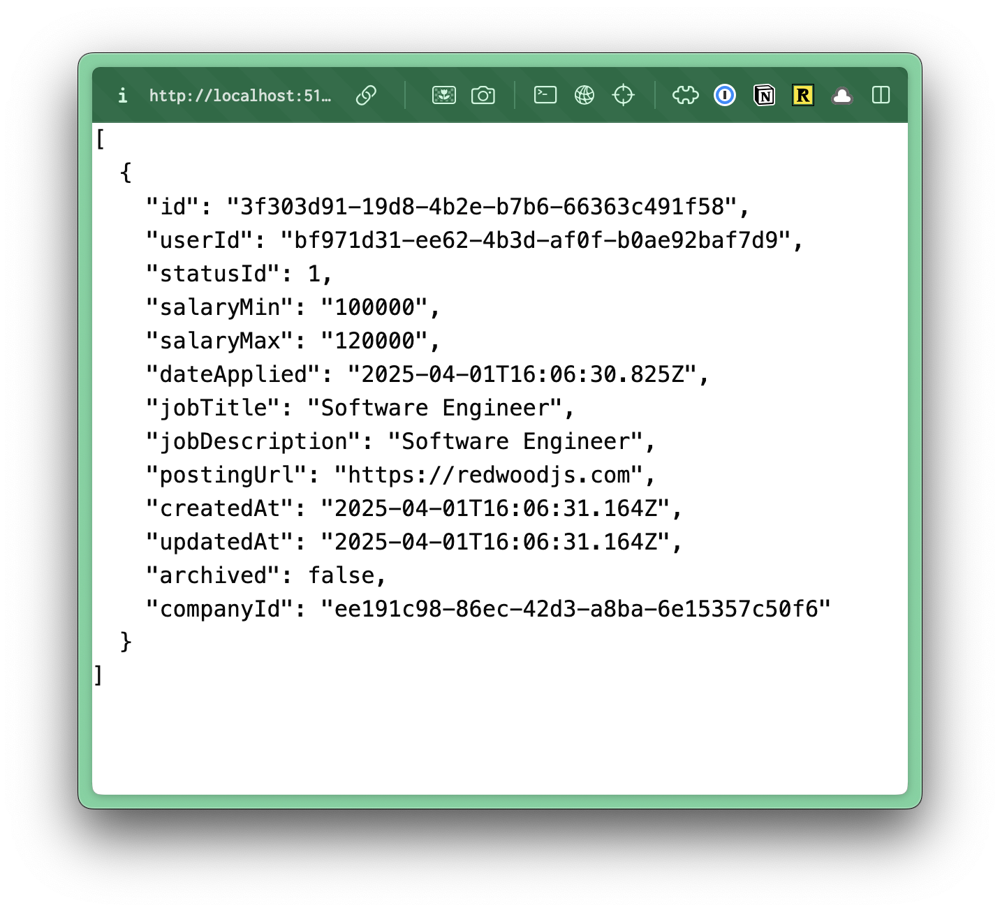

Easy, right?! Since we're using React Server Components, this code runs on the server. We're able to make database calls directly from the page and don't need to worry about creating API routes. 🎉

Also, if you right click on the page and select **View Source**, you'll see that the data is being rendered directly on the page.

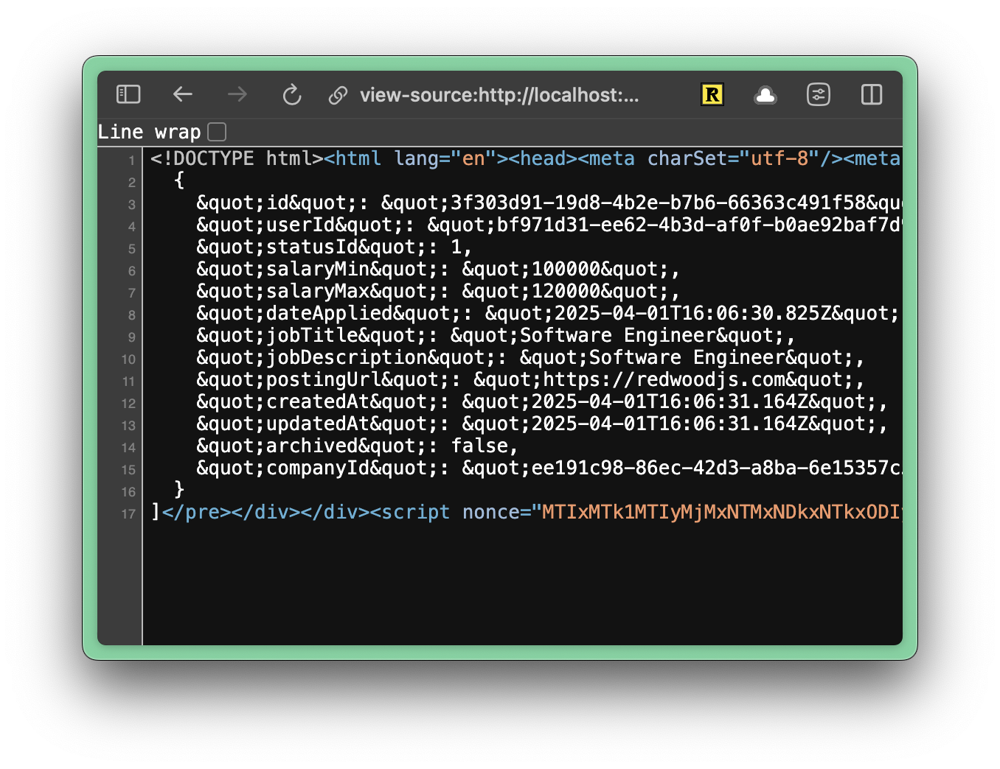

In comparison, if you were you were working with a traditional SPA (Single Page Application), all the data would be rendered on the client side with JavaScript and the View Source might look like this:

```html
<div id="app"></div>
```

Now that we know the content from our database is getting on the page, let's style it.

## Styling the Job Applications List Page

Similar to the auth pages, let's start by creating a layout that will wrap all of our interior pages.

### Creating an Interior Page Layout

Inside our `layouts` folder, let's create a new file called `InteriorLayout.tsx`.

<FileTree>
- src/
  - app/
    - layouts/
      - AuthLayout.tsx
      - InteriorLayout.tsx
</FileTree>

Inside, we need should use some of the same styles that we used within our `AuthLayout.tsx` file. As a quick reminder, let's take a look at the `AuthLayout.tsx` file:

```tsx title="src/app/layouts/AuthLayout.tsx"
const AuthLayout = ({ children }: { children: React.ReactNode }) => {
  return (
    <div className="bg-bg min-h-screen min-w-screen p-12">
      <div className="grid grid-cols-2 min-h-[calc(100vh-96px)] rounded-xl border-2 border-[#D6D5C5]">
      ...
---
- The wrapping `div` sets the background color, the minimum height and width of the page, and adds some padding.
- The child `div` sets up the grid, applies rounded corners, and adds a border.
---
```

We don't need to set up a grid, but we can abstract the styles and reuse them within our interior layout.

From the `AuthLayout.tsx` file, I'm going to copy the `bg-bg min-h-screen min-w-screen p-12` styles and create a class inside our `styles.css` file, inside the `@layer components` block:

```css title="src/styles.css" startLineNumber=167
.page-wrapper {
  @apply bg-bg min-h-screen min-w-screen p-12;
}
```

Then, let's do something similar with the child `div` from our `AuthLayout.tsx`. We don't need the `grid`, but we can grab everything else: `min-h-[calc(100vh-96px)] rounded-xl border-2 border-[#D6D5C5]`

```css title="src/styles.css" startLineNumber=250
.page {
  @apply min-h-[calc(100vh-96px)] rounded-xl border-2 border-[#D6D5C5];
}
```

Let's also add our route to our `links.ts` file for type hinting:

```tsx title="src/app/shared/links.ts" collapse={4-9}
import { defineLinks } from "rwsdk/router";

export const link = defineLinks([
  "/",
  "/user/login",
  "/user/signup",
  "/user/logout",
  "/legal/privacy",
  "/legal/terms",
  "/applications",
]);
```

Now, let's update the class list within our `AuthLayout.tsx` file:

```tsx title="src/app/layouts/AuthLayout.tsx" "page-wrapper" "page"
const AuthLayout = ({ children }: { children: React.ReactNode }) => {
  return (
    <div className="page-wrapper">
      <div className="grid grid-cols-2 page">
      ...
```

Now, let's jump over to our `InteriorLayout.tsx` file and use these classes there as well:

```tsx title="src/app/layouts/InteriorLayout.tsx" "page-wrapper" "page bg-white"
const InteriorLayout = ({ children }: { children: React.ReactNode}) => {
  return (
    <div className="page-wrapper">
      <main className="page bg-white">
        {children}
      </main>
    </div>
  )
}

export { InteriorLayout }
---
You'll also notice I added a background of white with `bg-white`
---
```

To see how this looks, we need to add this to our `List.tsx`:

```tsx title="src/app/pages/applications/List.tsx" startLineNumber=7
return (
  <InteriorLayout>
    <pre>{JSON.stringify(applications, null, 2)}</pre>
  </InteriorLayout>
)
```

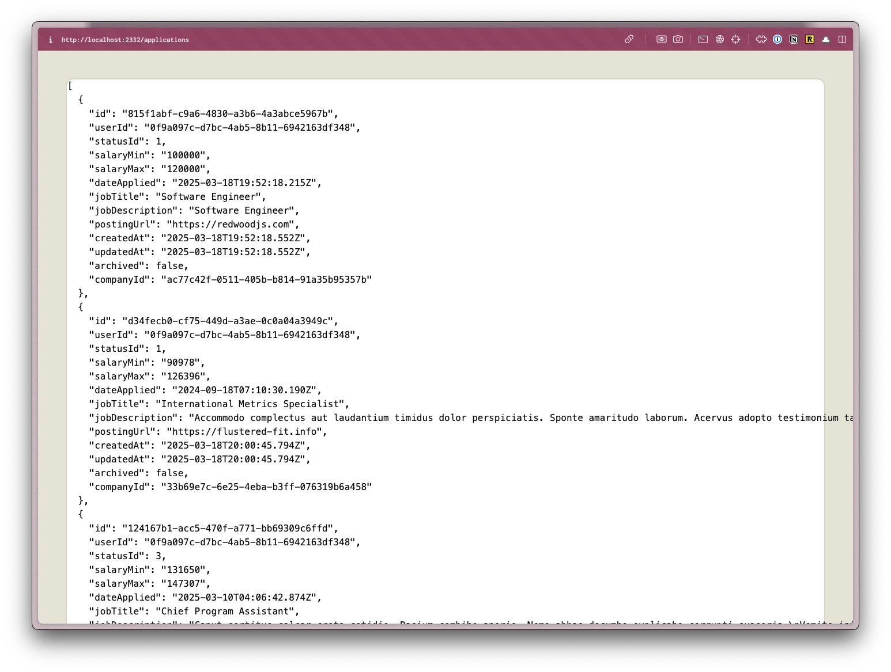

It's coming together! Across the top, let's add the logo and navigation. We may need to reuse this component in the future, so let's make it it's own component. Inside the `components` folder, let's create a new file called `Header.tsx`.

<FileTree>
- src/
  - app/
    - components/
      - Header.tsx
</FileTree>

```tsx title="src/app/components/Header.tsx"
const Header = () => {
  return (
    <header>
      {/* left side */}
      <div></div>

      {/* right side */}
      <div></div>
    </header>
  )
}
---
Here are the basic building blocks we need.
- I used a semantic HTML element `header` to wrap everything.
- Then, we'll have a left and right side. On the left, we'll display the logo and the navigation. On the right, we'll display a link the user's settings, the logout button, and  the user's avatar.
---
```

<figure>
  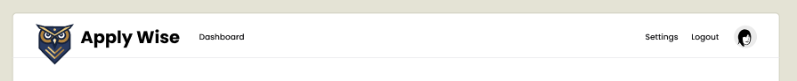
  <figcaption>Mockup from Figma</figcaption>
</figure>

Inside the left `div`, let's add the logo and "Apply Wize" text and wrap it in a link:

```tsx title="src/app/components/Header.tsx" startLineNumber=4
{/* left side */}
<div>
  <a href={link("/")}>
    
    <span>Apply Wize</span>
  </a>
</div>
```

- Pretty straightforward. We're using the same `logo.svg` that we used on the auth pages. It should already be in your `public/images` folder.
- Then, we're using the `link` helper to link to home page. At the top of your file, you'll need to import the `link` helper:
```tsx
import { link } from '@/app/shared/links'
```

Now, let's add the navigation. For now this is only one link that goes to the dashboard page.

```tsx title="src/app/components/Header.tsx" collapse={3-6} {7-11}
{/* left side */}
<div>
  <a href={link("/")}>
    
    <span>Apply Wize</span>
  </a>
  <nav>
    <ul>
      <li><a href={link("/applications")}>Dashboard</a></li>
    </ul>
  </nav>
</div>
```

For the right side, we want another unordered list and the Avatar component:

```tsx title="src/app/components/Header.tsx" startLineNumber=19
{/* right side */}
<nav>
  <ul>
    <li><a href="#">Settings</a></li>
    <li><a href={link("/user/logout")}>Logout</a></li>
    <li>
      <Avatar>
        <AvatarFallback>R</AvatarFallback>
      </Avatar>
    </li>
  </ul>
</nav>
```

- Notice, I replaced the right side `div` with a `nav` element, keeping things nice and semantic.
- Inside, I've included links for the settings and logout pages.
- For the `Avatar` component, you'll need to import it at the top of your file. This is a shadcn/ui component, so it should already be part of your project.

```tsx showLineNumbers=false
import { Avatar, AvatarFallback } from '@/app/components/ui/avatar'
```

Normally, when you're using the `Avatar` component, you'll also want to use the `AvatarImage` component. This is where you define the Avatar image:

```tsx title="src/app/components/Header.tsx" showLineNumbers=false "AvatarImage" {8}
import { Avatar, AvatarFallback, AvatarImage } from '@/app/components/ui/avatar'

...

<li>
  <Avatar>
    <AvatarFallback>R</AvatarFallback>
    <AvatarImage src="./images/avatar.png" />
  </Avatar>
</li>
```

If you want to go this route, you can download the [`avatar.png` placeholder image]() and hard code the image source. However, we're not going to cover file uploads and storage in this tutorial. So, we'll use the `AvatarFallback` component to display the first character of the username.

The shadcn/ui Avatar component uses client side interactivity. So, you'll need to add the `use client` directive to the top of the `Avatar.tsx` file:

```tsx title="src/app/components/ui/avatar.tsx" startLineNumber=1 ""use client""
"use client"

import * as React from "react"
import * as AvatarPrimitive from "@radix-ui/react-avatar"

import { cn } from "@/app/lib/utils"

function Avatar({
  ...
```

If you forget to add the `use client` directive, you'll see a "null reading `useState`" error in the browser:

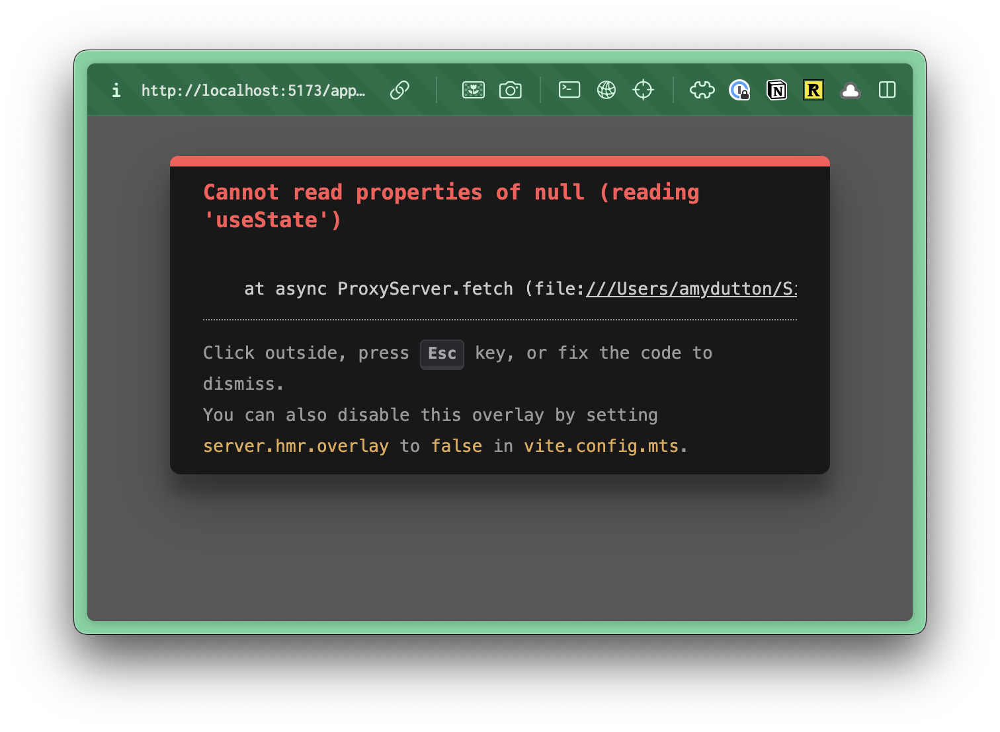

Now that we have all the elements, let's add some styling:

```tsx title="src/app/layouts/Header.tsx" startLineNumber=6
<header className="py-5 px-10 h-20 flex justify-between items-center border-b-1 border-border mb-12">
---
- `py-5` adds `20px` of padding to the top and bottom.
- `px-10` adds `40px` of padding to the left and right.
- `h-20` sets the height to `80px`.
- `flex` and `justify-between` are used to align the items inside the header, putting as much space between each of the elements as possible.
- `items-center` centers the items vertically.
- `border-border` and `border-b-1` adds a border to the bottom of the header with a color of `border` (defined as a custom color in the `@theme` block of our `styles.css` file).
- `mb-12` adds `48px` of margin to the bottom of the header.
---
```

We set the left and right padding to `40px` with `px-10`. We'll use this throughout our entire application. In order to maintain consistency, let's define it as a custom utility. This will make it easy to reference (and change, if necessary).

```css title="src/styles.css" startLineNumber=136
--spacing-page-side: 40px;
---
Inside the `@theme` block, below our color definitions, we'll add a new variable called `--spacing-page-side` and set it to `40px`. Now, we can use this variable with margin or padding: `mx-page-side` or `px-page-side` respectively.
---
```

Now, we can update our `header` element to use the new utility, replacing `px-10` with `px-page-side`:

```tsx title="src/app/layouts/Header.tsx" startLineNumber=6 "px-page-side"
<header className="py-5 px-page-side h-20 flex justify-between items-center border-b-1 border-border mb-12">
```

On the left side `div`, we want the logo and the Dashboard link to align vertically:

```tsx title="src/app/layouts/Header.tsx" startLineNumber=7 collapse={3-11} "flex items-center gap-8"
{/* left side */}
<div className="flex items-center gap-8">
  <a href={link("/")}>
    
    <span>Apply Wize</span>
  </a>
  <nav>
    <ul>
      <li><a href={link("/applications")}>Dashboard</a></li>
    </ul>
  </nav>
</div>
---
- We're using `flex` and `items-center` to align the items vertically.
- `gap-8` adds `32px` of space between the logo and the Dashboard link.
---
```

On the home page link, we want the logo and the "Apply Wize" text to align vertically too:

```tsx title="src/app/components/Header.tsx" startLineNumber=9 "flex items-center gap-3 font-display font-bold text-3xl"
<a href={link("/")} className="flex items-center gap-3 font-display font-bold text-3xl">
---
- `flex`, `items-center`, and `gap-3` aligns the logo and text and puts `12px` of space between them.
- `font-display` and `font-bold` are used to style the text, applying the font Poppins and making the text bold.
- `text-3xl` sets the font size to `30px`
---
```

If you look at the logo, it overlaps with the bottom border of the header.

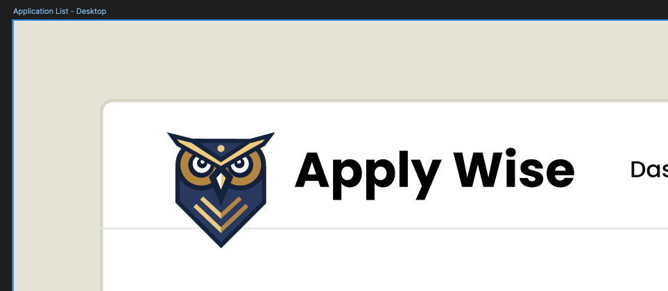

In order to achieve this, we also need to add some styles to the `img` tag:

```tsx title="src/app/components/Header.tsx" startLineNumber=10 "className="pt-5 -mb-3""

---
- `pt-5` adds `20px` of padding to the top.
- `-mb-3` removes `12px` of margin from the bottom and will make the bottom of the header shift up.
---
```

For the right side `ul`, we need to add a few styles to position the links properly:

```tsx title="src/app/components/Header.tsx" startLineNumber=20 "className="flex items-center gap-7"
{/* right side */}
<nav>
  <ul className="flex items-center gap-7">
  ...
---
- Similar to techniques we've used before, we're using `flex` and `items-center` to align the items vertically.
- `gap-7` adds `28px` of space between each of the links.
---
```

To style our nav links, I want these styles to apply to both the left and the right side. So, let's stick these inside the `styles.css` file, inside the `@layer base` block:

```css title="src/styles.css" startLineNumber=164
nav {
  @apply font-display font-medium text-sm;
}
```

That should be it! (for the header at least)

<details>
<summary>Finished `Header.tsx` component</summary>

```tsx title="src/app/components/Header.tsx"
import { link } from "@/app/shared/links";
import { Avatar, AvatarFallback } from "./ui/avatar";

const Header = () => {
  return (
    <header className="py-5 px-page-side h-20 flex justify-between items-center border-b-1 border-border mb-12">
      {/* left side */}
      <div className="flex items-center gap-8">
        <a
          href={link("/")}
          className="flex items-center gap-3 font-display font-bold text-3xl"
        >
          
          <span>Apply Wize</span>
        </a>
        <nav>
          <ul>
            <li>
              <a href={link("/applications")}>Dashboard</a>
            </li>
          </ul>
        </nav>
      </div>

      {/* right side */}
      <nav>
        <ul className="flex items-center gap-7">
          <li>
            <a href="#">Settings</a>
          </li>
          <li>
            <a href={link("/user/logout")}>Logout</a>
          </li>
          <li>
            <Avatar>
              <AvatarFallback>R</AvatarFallback>
            </Avatar>
          </li>
        </ul>
      </nav>
    </header>
  );
};

export { Header };
```
</details>

Now, let's stick our `Header` component into our `InteriorLayout.tsx` file:

```tsx title="src/app/layouts/InteriorLayout.tsx" {1, 7}
import { Header } from "@/app/components/Header";

const InteriorLayout = ({ children }: { children: React.ReactNode}) => {
  return (
    <div className="page-wrapper">
      <main className="page bg-white">
        <Header />
        <div>{children}</div>
      </main>
    </div>
  )
}

export { InteriorLayout }
```

Check it out in the browser!

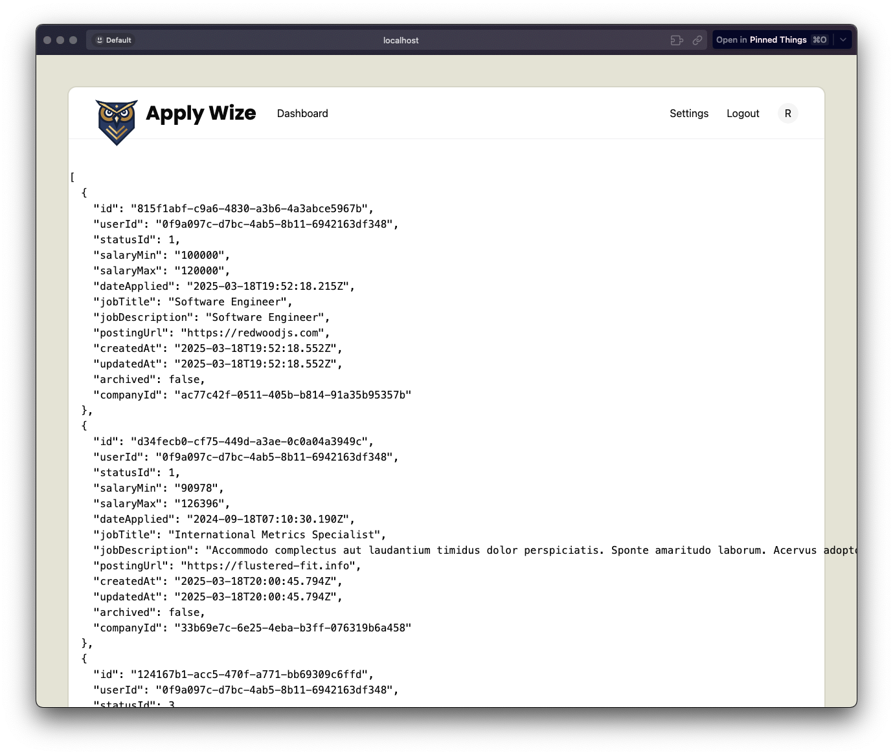

Moving on.

At the top of our file, let's add a page heading and a button/link to add a new application:

```tsx title="src/app/pages/applications/List.tsx" showLineNumbers=false
import { Button } from "@/app/components/ui/button";
...
return (
  <InteriorLayout>
    <>
      <div>
        <h1>All Applications</h1>
        <div>
          <Button asChild><a href="#">New Application</a></Button>
        </div>
      </div>
      <pre>{JSON.stringify(applications, null, 2)}</pre>
    </>
  </InteriorLayout>
)
```

- `InteriorLayout` can only have one react node, so we need to wrap everything with a React fragment (`<>`)
- Above our application content, I added a wrapping `div` with a `h1` heading for "All Applications".
- Then, I have another `div` that wraps a `<Button>` component. Inside, I have a link that points to the new application page. The `Button` component is coming from shadcn/ui. It should already be part of your project, but you'll need to import it at the top of your file.
- Since we're not triggering an event, we're _linking_ to another page, we have an `a` tag. Eventually, this will reference the `applications/new` route, but since we haven't set that up yet, I used a placeholder `#` instead.

<Aside type="tip" title="shadcn/ui Button">
  Admittedly, it does look a little strange having an `a` tag inside a `Button` component.

  In shadcn/ui, the ⁠Button component is designed to be flexible, allowing you to create buttons that can also act as links. This is a common pattern in modern web design where you want a consistent visual style for interactive elements.

  `asChild` is a special prop in shadcn/ui that tells the Button component to render its child element as-is. It allows you to keep the Button's styling while using a different underlying HTML element (like an ⁠`<a>` tag).

  [For reference: shadcn/ui Button Component Documentation](https://ui.shadcn.com/docs/components/button)
</Aside>

If you take a look at this within the browser, right now, you'll probably see an error:

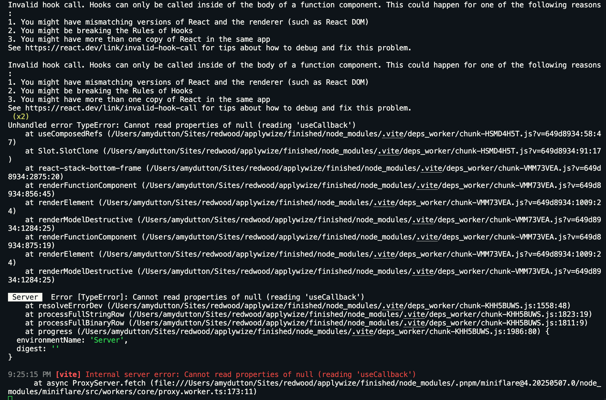

The error is happening because the Slot component from Radix UI (shadcn/ui is built on top of Radix UI) is trying to use hooks in a server component context.

To fix this, open the `src/app/components/ui/button.tsx` file and add the `use client` directive to the top of the file:

```tsx title="src/app/components/ui/button.tsx"
"use client";
```

You may need to restart the server for this to take effect.

Now, let's add some styling:

```tsx title="src/app/pages/applications/List.tsx" startLineNumber=12 "px-page-side flex justify-between items-center" "page-title"
<div className="px-page-side flex justify-between items-center">
  <h1 className="page-title">All Applications</h1>
```

- On the wrapping `div` we can use our custom `px-page-side` that adds `20px` of padding to the left and right.
- We can align the heading and the button with`flex`, `justify-between`, and `items-center`.
- We can use our `page-title` class to style the heading.

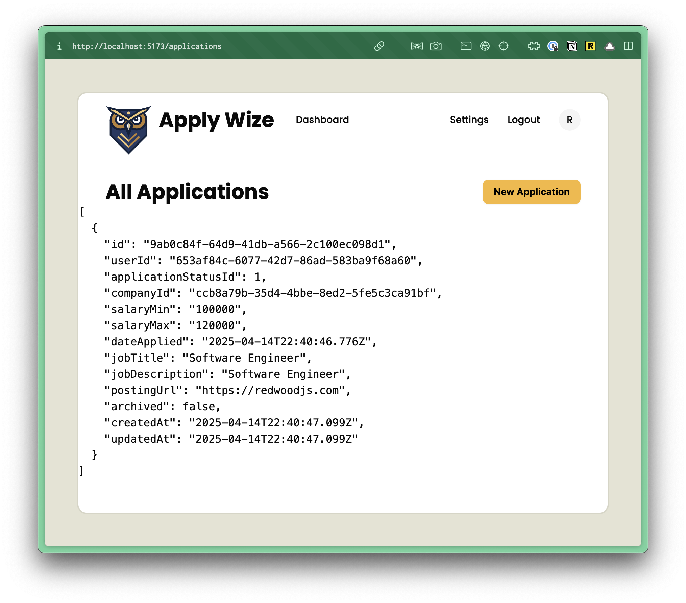

### Styling the Applications Table

Now, let's style the list of applications.

Inside our `components` directory, let's create a new file, called `ApplicationsTable.tsx`.

<FileTree>
- src/
  - app/
    - components/
      - ApplicationsTable.tsx
</FileTree>

I'm going to stub out a basic component:

```tsx title="src/app/components/ApplicationsTable.tsx"
const ApplicationsTable = () => {
  return (
    <div>ApplicationsTable</div>
  )
}

export { ApplicationsTable }
```

Let's go ahead and put this on our `ApplicationsList.tsx` page, so we can see the updates we're making in the browser:

```tsx title="src/app/pages/applications/List.tsx" {1} "<ApplicationsTable />"
import { ApplicationsTable } from "@/app/components/ApplicationsTable";
...
return (
  <InteriorLayout>
    <>
      <div className="px-page-side flex justify-between items-center">
        <h1 className="page-title">All Applications</h1>
        <div>
          <Button asChild><a href="#">New Application</a></Button>
        </div>
      </div>
      <ApplicationsTable />
      <pre>{JSON.stringify(applications, null, 2)}</pre>
    </>
  </InteriorLayout>
)
```

We've already added the [shadcn/ui Table component](https://ui.shadcn.com/docs/components/table) to our project, so let's go back to our `ApplicationsTable.tsx` file and use it. Just to start, I'm going to copy the example code from the shadcn/ui documentation and then we can rework it for our needs:

```tsx title="src/app/components/ApplicationsTable.tsx"
import { Table, TableBody, TableCaption, TableCell, TableHead, TableHeader, TableRow } from "./ui/table"

const ApplicationsTable = () => {
  return (
    <Table>
      <TableCaption>A list of your recent invoices.</TableCaption>
      <TableHeader>
        <TableRow>
          <TableHead className="w-[100px]">Invoice</TableHead>
          <TableHead>Status</TableHead>
          <TableHead>Method</TableHead>
          <TableHead className="text-right">Amount</TableHead>
        </TableRow>
      </TableHeader>
      <TableBody>
        <TableRow>
          <TableCell className="font-medium">INV001</TableCell>
          <TableCell>Paid</TableCell>
          <TableCell>Credit Card</TableCell>
          <TableCell className="text-right">$250.00</TableCell>
        </TableRow>
      </TableBody>
    </Table>
  )
}

export { ApplicationsTable }
```

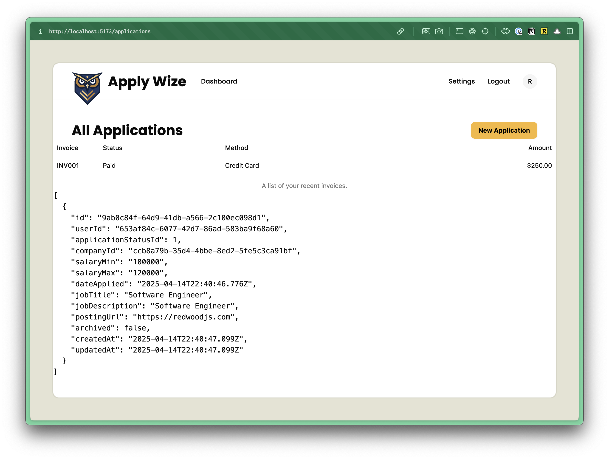

It looks pretty good, but we need to make a few changes to make it work for our data.

First, we can get rid of the `TableCaption`:

```tsx showLineNumbers=false
<TableCaption>A list of your recent invoices.</TableCaption>
```

Then, I'm going to change the `TableHeader` to match our design within Figma:

```tsx title="src/app/components/ApplicationsTable.tsx" startLineNumber=6
<TableHeader>
  <TableRow>
    <TableHead className="w-[100px]">Status</TableHead>
    <TableHead>Date Applied</TableHead>
    <TableHead>Job Title</TableHead>
    <TableHead>Company</TableHead>
    <TableHead>Contact</TableHead>
    <TableHead>Salary Range</TableHead>
    <TableHead></TableHead>
  </TableRow>
</TableHeader>
```

- We now have columns for status, date applied, job title, company, contact, and salary range.
- You'll notice that the last column is empty. `<TableHead></TableHead>` Within the table body, this will be our view icon, but this column doesn't have a header.

For our `TableBody`, we need our application data. First, let's set up our table row, statically. Then, we'll make it dynamic.

```tsx title="src/app/components/ApplicationsTable.tsx" startLineNumber=17
<TableBody>
  <TableRow>
    <TableCell>New</TableCell>
    <TableCell>April 15, 2025</TableCell>
    <TableCell>Software Engineer</TableCell>
    <TableCell>RedwoodJS</TableCell>
    <TableCell>John Doe</TableCell>
    <TableCell>$150,000-$250,000</TableCell>
    <TableCell><a href="#">View</a></TableCell>
  </TableRow>
</TableBody>
```

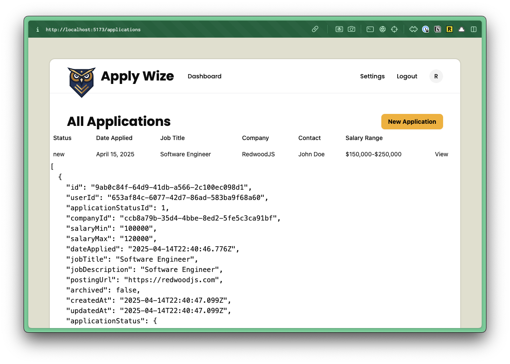

Cool. Let's make a few stylistic changes before we plug in the data.

### Adding Badges to the Status Column

The status column should be a badge. We can reach for the `Badge` component from shadcn/ui.

```tsx title="src/app/components/ApplicationsTable.tsx" showLineNumbers=false
import { Badge } from "./ui/badge"
...
<TableCell>
  <Badge>New</Badge>
</TableCell>
```

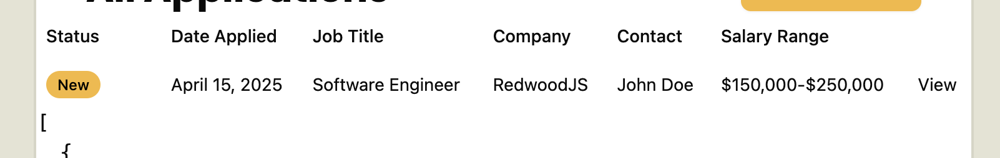

Let's add styles based on the application status. We've already added some custom colors to our `styles.css` file, so let's use those.

```css styles.css startLineNumber=229
  --color-tag-applied: #b1c7c0;
  --color-tag-interview: #da9b7c;
  --color-tag-new: #db9a9f;
  --color-tag-rejected: #e4e3d4;
  --color-tag-offer: #aae198;
```

Inside of our `badge.tsx` component, there's a section at the top of `variants`:

```tsx title="src/app/components/ui/badge.tsx" collapse={3-10} startLineNumber=10 {11-15}
variants: {
  variant: {
    default:
      "border-transparent bg-primary text-primary-foreground [a&]:hover:bg-primary/90",
    secondary:
      "border-transparent bg-secondary text-secondary-foreground [a&]:hover:bg-secondary/90",
    destructive:
      "border-transparent bg-destructive text-white [a&]:hover:bg-destructive/90 focus-visible:ring-destructive/20 dark:focus-visible:ring-destructive/40 dark:bg-destructive/60",
    outline:
      "text-foreground [a&]:hover:bg-accent [a&]:hover:text-accent-foreground",
    applied: "bg-tag-applied text-black",
    interview: "bg-tag-interview text-black",
    new: "bg-tag-new text-black",
    rejected: "bg-tag-rejected text-black",
    offer: "bg-tag-offer text-black",
  },
},
---
I added a custom variant for `applied`, `interview`, `new`, `rejected`, and `offer`.
---
```

While, we're here, I'm also going to add a few more classes to the default styling:

```tsx title="src/app/components/ui/badge.tsx" startLineNumber=7 ins="font-bold" ins="rounded-full" del="rounded-md" del="font-medium"
const badgeVariants = cva(
  "font-bold inline-flex items-center justify-center rounded-md rounded-full border px-2 py-0.5 text-xs font-medium w-fit whitespace-nowrap shrink-0 [&>svg]:size-3 gap-1 [&>svg]:pointer-events-none focus-visible:border-ring focus-visible:ring-ring/50 focus-visible:ring-[3px] aria-invalid:ring-destructive/20 dark:aria-invalid:ring-destructive/40 aria-invalid:border-destructive transition-[color,box-shadow] overflow-hidden",
---
- I added a font weight of `font-bold`
- I changed the rounded corners to `rounded-full`
---
```

Let's go back to our `ApplicationsTable.tsx` component and update our badge:

```tsx title="src/app/components/ApplicationsTable.tsx" startLineNumber=20
<TableCell><Badge variant="new">New</Badge></TableCell>
```

For the contact column, let's include an avatar:

```tsx title="src/app/components/ApplicationsTable.tsx" startLineNumber=24
<TableCell>
  <Avatar>
    <AvatarFallback>J</AvatarFallback>
  </Avatar>
  John Doe
</TableCell>
```

This is the same avatar component we used in the `Header` component.

Be sure to import the `Avatar` and `AvatarFallback` components at the top of your file:

```tsx title="src/app/components/ApplicationsTable.tsx" showLineNumbers=false
import { Avatar, AvatarFallback } from "./ui/avatar"
```

Let's add a few styles to fix the positioning:

```tsx title="src/app/components/ApplicationsTable.tsx" startLineNumber=34 "className="flex items-center gap-2""
<TableCell className="flex items-center gap-2">
  <Avatar>
    <AvatarFallback>J</AvatarFallback>
  </Avatar>
  John Doe
</TableCell>
---
- `flex` and `items-center` aligns the avatar and name vertically.
- `gap-2` adds `8px` of padding between the avatar and the name.
---
```

Next, let's replace the "View" text with an SVG icon.

### Using an SVG Icon

We have several icons we want to use throughout our application. You can export all the SVGs directly [from the Figma file](https://www.figma.com/design/nqBPIIfe0MO4W8zOfW4oae/RedwoodSDK---Applywize?node-id=403-957&t=Zzk0TlXBNIzih8ak-1), or you can [download all of them within this project's assets directory.](https://github.com/ahaywood/applywize/tree/main/assets)

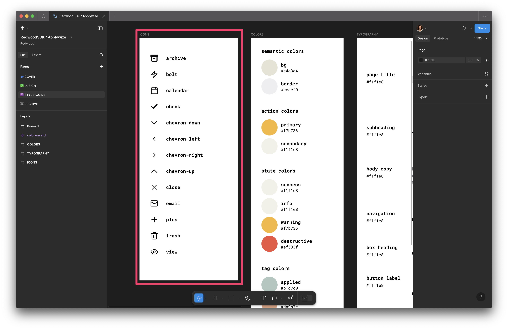

<Aside type="tip" title="SVG Icons">
If you're exporting the icons from Figma, make sure you're grabbing the **frame** for the actual icon. All the icons are `24px` by `24px`.

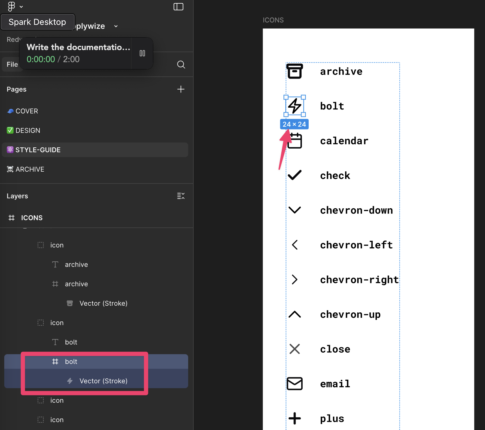
</Aside>

I'm going to create a new folder in the root of our our project called `other` and then a sub directory inside that called `svg-icons` and place all of the icons inside the `svg-icons` directory.

<FileTree>
- other/
  - svg-icons/
- src/
</FileTree>

My favorite way to implement SVG icons is through an SVG sprite. Basically, this combines all our SVG files into a single `sprite.svg` file. We can control which icon is displayed by setting the `id` attribute on the `use` element.

You could set all of this up, manually, but I do this on every single project I build, so I've built an npm package to do all the heavy lifting. It's called [Lemon Lime SVGs](https://www.npmjs.com/package/lemon-lime-svgs).

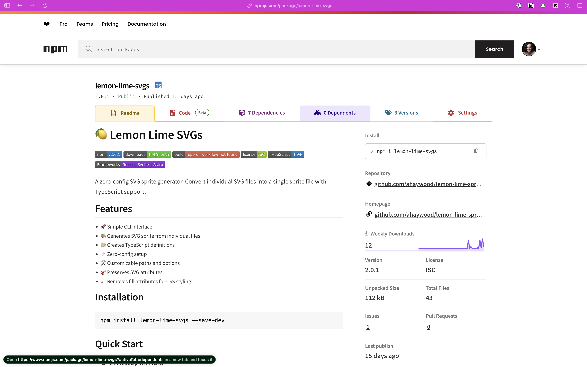

Within the Terminal run:

<PackageManagers
  pkg="lemon-lime-svgs"
  dev
/>

<Aside type="note" title="Save Dev">
The purpose of this package is to help with the development process. The code does not need to go to production, so we can add the `-D` flag.
</Aside>

Once installed, run the setup command:

```shell
npx lemon-lime-svgs setup
```

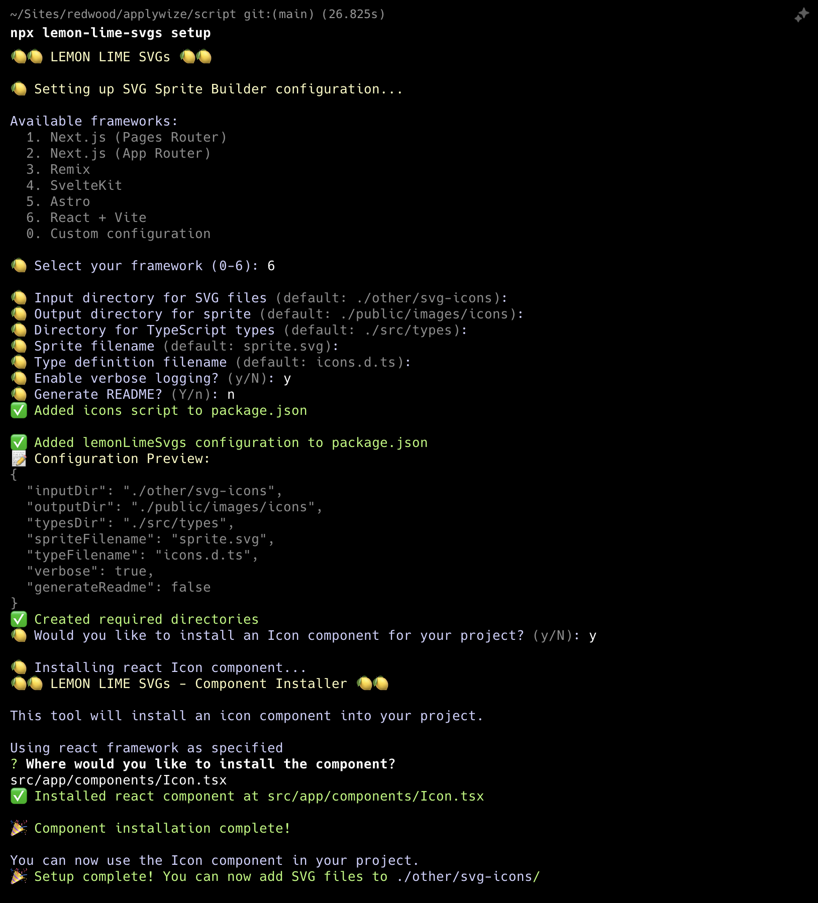

This will ask a series of questions:
- First, it will ask you what framework you're using. At it's core RedwoodSDK is React and Vite = 6
- Next, it will ask you about file names and folder paths. It will make recommendations based on the framework you're using. Most of the defaults, work:
  - Input directory for SVG files: `./other/svg-icons` -- we've already set this directory up!
  - Output directory for sprite: `./public/images/icons` This is the same location as the background and `logo.svg`
  - Directory for TypeScript types: `./types`
  - Sprite file name: `sprite.svg`
  - Type definition file name: `icons.d.ts`
  - Enable verbose logging: The default is set to "no", but I usually like to turn this on and get a little extra feedback.
  - Generate a README. The default is set to "yes", but I usually like to turn this off. The README lives inside the same directory as your sprite and tells future developers that this file was created programmatically. It also provides a list of all the SVG icons available.
  - The last prompt asks us if we want to add an Icon component to our project. Say `y`.
  - Then, it will ask us where we want to save our component. We need to veer from the recommendation slightly: `src/app/components/Icon.tsx`
- These settings are saved inside your `package.json` file, in its own section called, `lemonLimeSvgs`.
- This script will also create a new `script` command inside your `package.json` file, called `icons`. Once we add the icons to our `svg-icons` folder, we can generate the sprite using this command: `pnpm run icons`.

Now, if you look inside your `src/app/components` directory, you'll see a new `Icon.tsx` file.

```tsx title="src/app/components/Icon.tsx"
interface Props {
  size?: number;
  id: string;
  className?: string;
}

const Icon = ({ className, size = 24, id }: Props) => {
  return (
    <svg width={size} height={size} className={className}>
      <use href={`/images/icons/sprite.svg#${id}`}></use>
    </svg>
  );
};

export default Icon;
```

This component takes a `className`, if you want to add additional styles to the component, a `size` (the default is set to `24px`), and the `id` of the icon you want to display. The `id` matches the file name of the original icon SVG file.

Before we move on, I'm going to change this to a named export to be consistent with the other components we've created:

```tsx title="src/app/components/Icon.tsx" startLineNumber=15
export { Icon }
```

Now, let's take all our icon SVGs and dump them inside our `other/svg-icons` directory.

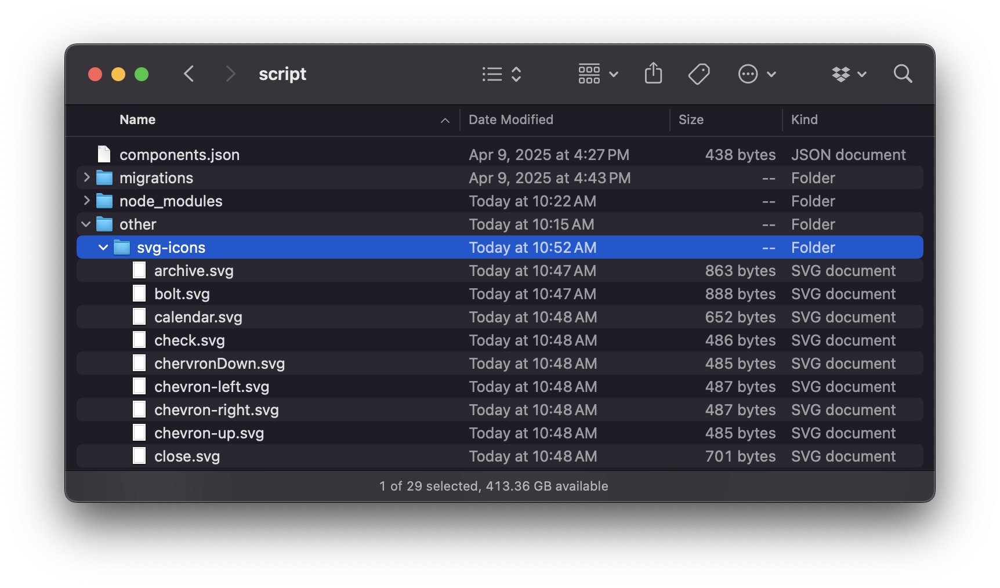

Inside the terminal, let's generate our sprite:

<PackageManagers
  type="exec"
  pkg="icons"
/>

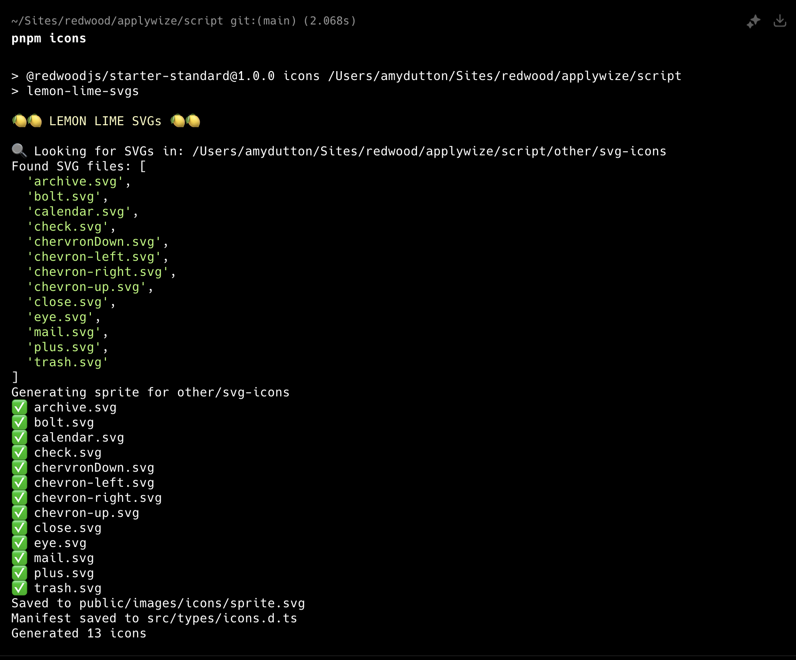

Sweet! Now we can use our `Icon` component.

Inside our `ApplicationsTable.tsx` file:

```diff title="src/app/components/ApplicationsTable.tsx" startLineNumber=25
+ import { Icon } from "./Icon"
...
<TableCell>
  <a href="#">
-    View
+    <Icon id="view" />
  </a>
</TableCell>
```

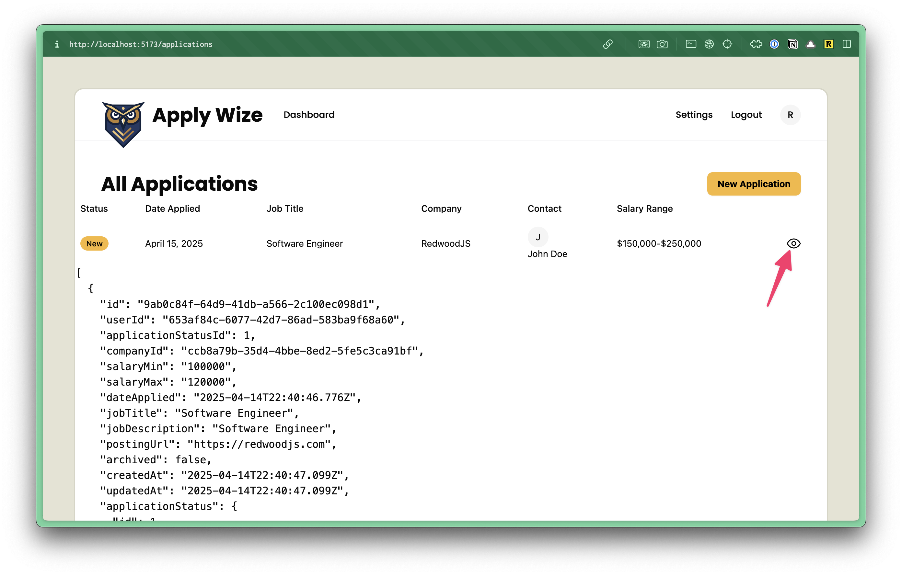

<Aside type="note" title="Caching">
Due to caching, sometimes the icon doesn't update immediately. Try opening a browser window in incognito to see if that makes a difference.
</Aside>

## Making our Table Dynamic

Awesome! Now, let's make it dynamic. Inside our `List.tsx` page, let's pass in all of our application data:

```tsx title="src/app/pages/applications/List.tsx" startLineNumber=17 "applications={applications}"
<ApplicationsTable applications={applications} />
```

We already have our applications saved inside a variable called `applications`, which makes passing in all our data, easy.

When you first set this up, you'll probably see an error

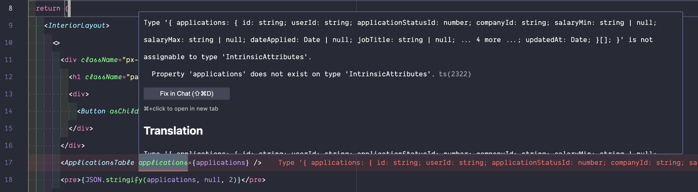

Our component isn't expecting the `applications` data we're passing it. Inside our `ApplicationsTable` component:

```tsx title="src/app/components/ApplicationsTable.tsx"
import { Application } from "@generated/prisma/client"
...
const ApplicationsTable = ({ applications }: { applications: Application[] }) => {
```

- We'll set it up to receive the `applications` data as a prop.
- Then, we need to set the type. Fortunate for us, Prisma generates these for us. So, we can use the `Application` type and since there's an array of them, we'll use square brackets `[]`.
- At the top of our, file we can import the `Application` type from `@generated/prisma/client`.

Now, let's go down to our `TableBody`. First we want to loop over all the applications within our `applications` array and display a row in the table for each:

```tsx title="src/app/components/ApplicationsTable.tsx" ins={2,21} startLineNumber=20
<TableBody>
  {applications.map(application => (
  <TableRow>
    <TableCell><Badge>New</Badge></TableCell>
    <TableCell>April 15, 2025</TableCell>
    <TableCell>Software Engineer</TableCell>
    <TableCell>RedwoodJS</TableCell>
    <TableCell className="flex items-center gap-2">
      <Avatar>
        <AvatarFallback>J</AvatarFallback>
      </Avatar>
      John Doe
    </TableCell>
    <TableCell>$150,000-$250,000</TableCell>
    <TableCell>
      <a href="#">
        <Icon id="view" />
      </a>
    </TableCell>
    </TableRow>
  ))}
</TableBody>
```

We also need to add a `key` to our `TableRow` component. This helps React identify which items have changed, been added, or been removed.

```tsx title="src/app/components/ApplicationsTable.tsx" ins={2,21} startLineNumber=22 "key={application.id}"
<TableRow key={application.id}>
```

Now, we can start replacing the static content with dynamic content.

For our application status and our `Badge` component, we can swap out the `new` text with `{application.status.status}`.

```tsx title="src/app/components/ApplicationsTable.tsx" startLineNumber=22 "{application.status.status}"
<TableCell>
    <Badge variant={application.status.status}>
      {application.status.status}
    </Badge>
</TableCell>
```

I'm starting to get an error within my code editor.

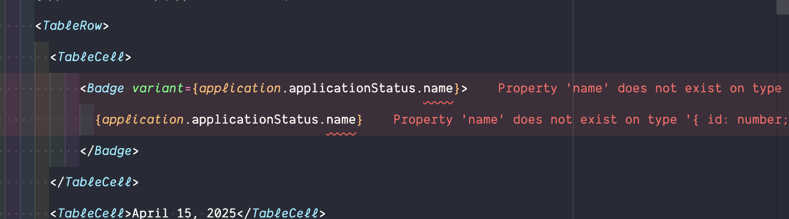

Basically, it's saying that it's not aware of the `status` relationship.

### Using Relationships

Let's go back to our `List.tsx` file. On **line 6**, we're getting all the applications from our table:

```tsx title="src/app/pages/applications/List.tsx" startLineNumber=6
const applications = await db.application.findMany();
```

But, we also need it to include the `applicationStatus`, `company`, and `contact` relationships. Prisma has an easy want to do this using `include`:

```tsx title="src/app/pages/applications/List.tsx" startLineNumber=6 {2-9}
const applications = await db.application.findMany({
  include: {
    status: true,
    company: {
      include: {
        contacts: true
      }
    }
  }
});
---
- **On line 8** we're telling it to include the `status` relationship.
- **On line 9** we're telling it to include the `company` relationship.
- The `contact` relationship is a little different because it's through the `company` relationship, but we can continue to drill down, including the `contacts` relationship on **line 11**.
---
```

You might need to temporarily comment out the `Badge` component inside the `ApplicationsTable.tsx` file, to avoid errors, but if you take a look at the result within the browser, you'll see the JSON data change shape:

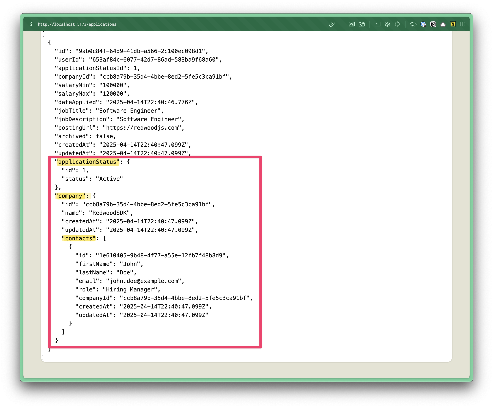

Now, if we go back to our `ApplicationsTable.tsx` file, the TypeScript error is still there. We're getting the `status` information now, but we need to make sure the type is updated to include it.

We're already getting the `Application` type from `@generated/prisma/client`. We need a way to also include the `ApplicationStatus`, `Company`, and `Contact` types.

We could use the `&` to create a new type that has `status` and `company`. Contacts is an array, nested inside the `company` object.

```tsx showLineNumbers=false
type ApplicationWithRelations = (Application & {
  status: ApplicationStatus;
  company: Company & {
    contacts: Contact[];
  };
})[];
```

However, Prisma has a special way to do this.

```tsx showLineNumbers=false
import { Prisma } from "@generated/prisma/client"
...
export type ApplicationWithRelations = Prisma.ApplicationGetPayload<{
  include: {
    status: true,
    company: {
      include: {
        contacts: true
      }
    }
  }
}>
---
- With `export type ApplicationWithRelations` we're creating a new type called `ApplicationWithRelations`, but you could name this whatever you want.
- We're `export`ing the type so that we can use it in other files. I like to to put this as close to my Prisma query as possible since the type is directly related to the data I'm getting back. Then, we can use this type in other components, like the `ApplicationsTable.tsx` file.
- `Prisma` is a utility object that we're using to create a new type. This is provided by the Prisma client.
- `ApplicationGetPayload` is a method that takes an object as an argument. The object uses the `include` property, to _include_ the data relationships.
  - Each model has it's own `GetPayload` method. Since we're referencing the `Application` model, we're using `ApplicationGetPayload`.
---
```

At first glance, this looks like more lines of code, but it's a lot easier to write. When trying to write it by hand with unions (`&`), you have to determine what the resulting shape of data is. In the second method, Prisma determines the shape of data for us and the `include` object looks similar our original Prisma call.

For reference, this was the original Prisma query. You can see that the `include` object matches the `ApplicationGetPayload` object:

```tsx title="src/app/pages/applications/List.tsx" showLineNumbers=false
const applications = await db.application.findMany({
  include: {
    status: true,
    company: {
      include: {
        contacts: true,
      },
    },
  },
});
```

<Aside type="tip" title="TypeScript">
If this starts to feel a little overwhelming, a few things that have helped me:
- This is a great use case for AI. It knows your database schema and query. Ask it!
- You know what the resulting data looks like.
    
    This is incredibly helpful when trying to create the type definition. You can also send the data to AI and ask it to help you create the type definition.
</Aside>

Awesome. Let's add our `ApplicationWithRelations` at the top of our `List.tsx` file. This goes _outside_ the component definition:

```tsx title="src/app/pages/applications/List.tsx" showLineNumbers=false
import { Prisma } from "@generated/prisma/client"
...
export type ApplicationWithRelations = Prisma.ApplicationGetPayload<{
  include: {
    status: true,
    company: {
      include: {
        contacts: true
      }
    }
  }
}>

const List = async () => {
  ...
```

Now, we can use it in our `ApplicationsTable.tsx` file:

```tsx title="src/app/components/ApplicationsTable.tsx" {1,6} startLineNumber=14
import { ApplicationWithRelations } from "../pages/applications/List";

const ApplicationsTable = ({
  applications,
}: {
  applications: ApplicationWithRelations[];
}) => {
```

If you look at the `TableCell` with the `status` again, you're probably _still_ seeing an error 🤯

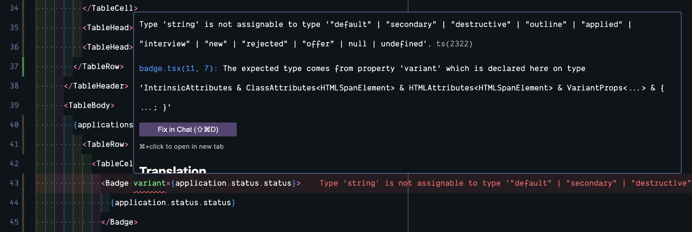

```tsx title="src/app/components/ApplicationsTable.tsx" startLineNumber=31
<TableCell>
    <Badge variant={application.status.status}>
      {application.status.status}
    </Badge>
</TableCell>
```

When we pass in the `variant` prop for our `Badge` component, it's not just looking for a string, it's looking for a specific string: ``"default" | "secondary" | "destructive" | "outline" | "applied" | "interview" | "new" | "rejected" | "offer" | null | undefined``

Inside our `badge` component, when we defined our `badgeVariants` for styles, it used our variant options to create a type definition. `badgeVariants` is exported from the `badge.tsx` component, making it easy to reuse and reference within our `ApplicationsTable.tsx`:

```tsx title="src/app/components/ApplicationsTable.tsx" startLineNumber=32 ".toLowerCase()" "as VariantProps<typeof badgeVariants>['variant']}"
<Badge variant={application.status.status.toLowerCase() as VariantProps<typeof badgeVariants>['variant']}>
  {application.status.status}
</Badge>
---
- On the `application.status.status`, we can append `.toLowerCase()` to make sure the status is formatted correctly and always lowercase.
- `typeof badgeVariants` - Gets the type of our `badgeVariants` configuration object, created with `cva()`. This includes all our variant definitions.
- `VariantProps<...>` - This is a utility type from [class-variance-authority](https://cva.style/docs) that extracts the prop types. It creates a type that includes all possible variants as properties.
- `['variant']` - This accesses the `variant` property type only from those props. In our case, it resolves to the union type: `"default" | "secondary" | "destructive" | "outline" | "applied" | "interview" | "new" | "rejected" | "offer" | null | undefined`
---
```

At the top of the `ApplicationsTable.tsx` file, be sure to update your imports:

```tsx showLineNumbers=false "badgeVariants" {2}
import { Badge, badgeVariants } from "./ui/badge";
import { VariantProps } from "class-variance-authority";
```

<Aside type="note" title="Class Variance Authority">
Class Variance Authority is a utility library, used within shadcn/ui, for creating and using CSS classes.

For further reading, you can read the [official Class Variance Authority documentation.](https://cva.style/docs)
</Aside>

Sweet! Now, all of our TypeScript errors should be taken care of.

Let's keep making our data dynamic.

```diff title="src/app/components/ApplicationsTable.tsx" startLineNumber=36
<TableCell>
-  April 15, 2025
+  {application.dateApplied?.toLocaleDateString('en-US', {
+    year: 'numeric',
+    month: 'long',
+    day: 'numeric'
+  })}
</TableCell>
---
For the date, we can use the `application.dateApplied` property. Then, we can format the date using the `toLocaleDateString` JavaScript method. For more options, see MDN's [Date.prototype.toLocaleDateString](https://developer.mozilla.org/en-US/docs/Web/JavaScript/Reference/Global_Objects/Date/toLocaleDateString) documentation.
---
```

For the job title:

```diff title="src/app/components/ApplicationsTable.tsx" startLineNumber=43
<TableCell>
-  Software Engineer
+  {application.jobTitle}
</TableCell>
```

For the company name:

```diff title="src/app/components/ApplicationsTable.tsx" startLineNumber=46
<TableCell>
-  RedwoodJS
+  {application.company.name}
</TableCell>
```

For the contact name, we're just going to reference the first name within our `contacts` array.

```diff title="src/app/components/ApplicationsTable.tsx" startLineNumber=49
<TableCell className="flex items-center gap-2">
  <Avatar>
-    <AvatarFallback>J</AvatarFallback>
+    <AvatarFallback>{application.company.contacts[0].firstName.charAt(0).toUpperCase()}</AvatarFallback>
  </Avatar>
-  John Doe
+  {application.company.contacts[0].firstName} {application.company.contacts[0].lastName}
</TableCell>
```

For the salary range:

```diff title="src/app/components/ApplicationsTable.tsx" startLineNumber=55
<TableCell>
-  $150,000-$250,000
+  {application.salaryMin}-{application.salaryMax}
</TableCell>
```

For the view link:

```diff title="src/app/components/ApplicationsTable.tsx" startLineNumber=58
<TableCell>
-  <a href="#">
+  <a href={link("/applications/:id", { id: application.id })}>
+   <Icon id="view" />
  </a>
</TableCell>
```

Be sure to import `link` at the top of the file:

```tsx title="src/app/components/ApplicationsTable.tsx" showLineNumbers={false}
import { link } from "../shared/links";
```

You'll probably see another error.

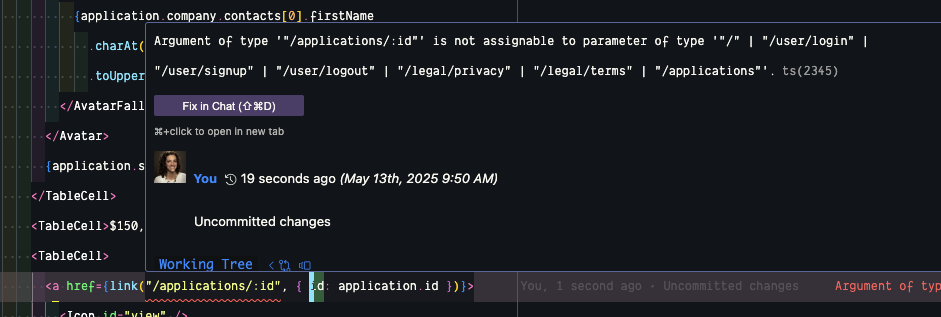

We need to do a little more setup to make this work.

In our `worker.tsx` file, let's add our route:

```tsx title="src/app/worker.tsx" startLineNumber=64 {3}
prefix("/applications", [
  route("/", [isAuthenticated, List]),
  route("/:id", [isAuthenticated, () => <h1>Application</h1>]),
]),
---
- We can nest our `route` definition within the applications `prefix`.
- The `:` designates that our route is dynamic and contains the `id` in the URL.
- We included `isAuthenticated` to ensure that the route is protected.
- Temporarily, we'll display an `<h1>` Application heading.
---
```

Now, let's jump over to `shared/links.ts` file and add `/applications/:id` to our array:

```tsx title="src/app/shared/links.ts" {9} collapse={2-8} startLineNumber=3
export const link = defineLinks([
  "/",
  "/user/login",
  "/user/signup",
  "/user/logout",
  "/legal/privacy",
  "/legal/terms",
  "/applications",
  "/applications/:id",
]);
```

Perfect. Everything should check out. Try clicking on the view icon in the browser. You should be redirected to a page with an "Application" heading.

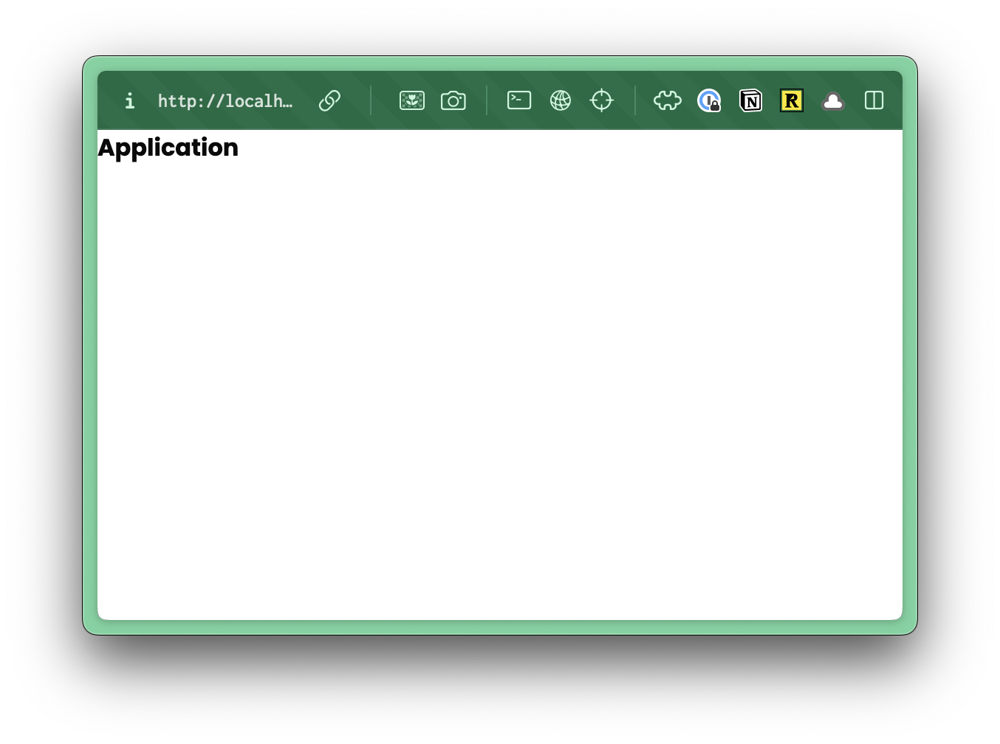

<details>
<summary>Final `ApplicationsTable.tsx` file</summary>

```tsx title="src/app/components/ApplicationsTable.tsx"
import { Icon } from "./Icon";
import { Avatar, AvatarFallback } from "./ui/avatar";
import { Badge, badgeVariants } from "./ui/badge";
import {
  Table,
  TableBody,
  TableCell,
  TableHead,
  TableHeader,
  TableRow,
} from "./ui/table";
import { ApplicationWithRelations } from "../pages/applications/List";
import { VariantProps } from "class-variance-authority";
import { link } from "../shared/links";

const ApplicationsTable = ({
  applications,
}: {
  applications: ApplicationWithRelations[];
}) => {
  return (
    <Table>
      <TableHeader>
        <TableRow>
          <TableHead className="w-[100px]">Status</TableHead>
          <TableHead>Date Applied</TableHead>
          <TableHead>Job Title</TableHead>
          <TableHead>Company</TableHead>
          <TableCell className="flex items-center gap-2">
            <Avatar>
              <AvatarFallback>J</AvatarFallback>
            </Avatar>
            John Doe
          </TableCell>
          <TableHead>Salary Range</TableHead>
          <TableHead></TableHead>
        </TableRow>
      </TableHeader>
      <TableBody>
        {applications.map((application) => (
          <TableRow>
            <TableCell>
              <Badge
                variant={
                  application.status.status.toLowerCase() as VariantProps<
                    typeof badgeVariants
                  >["variant"]
                }
              >
                {application.status.status}
              </Badge>
            </TableCell>
            <TableCell>
              {application.dateApplied?.toLocaleDateString("en-US", {
                year: "numeric",
                month: "long",
                day: "numeric",
              })}
            </TableCell>
            <TableCell>{application.jobTitle}</TableCell>
            <TableCell>{application.company.name}</TableCell>
            <TableCell className="flex items-center gap-2">
              <Avatar>
                <AvatarFallback>
                  {application.company.contacts[0].firstName
                    .charAt(0)
                    .toUpperCase()}
                </AvatarFallback>
              </Avatar>
              {application.salaryMin}-{application.salaryMax}
            </TableCell>
            <TableCell>
              <a href={link("/applications/:id", { id: application.id })}>
                <Icon id="view" />
              </a>
            </TableCell>
          </TableRow>
        ))}
      </TableBody>
    </Table>
  );
};

export { ApplicationsTable };
```
</details>

### Finalizing the List Page

Now, let's go back to our `List.tsx` and tidy up a few things.

On **line 42**, we can remove our `JSON.stringify` function:

```diff title="src/app/pages/applications/List.tsx" startLineNumber=27
- <pre>{JSON.stringify(applications, null, 2)}</pre>
```

Below our table, let's add a couple of buttons. An "Archive" button on the left and another "New Application" button on the right:

```tsx title="src/app/pages/applications/List.tsx" startLineNumber=42
<div className="flex justify-between items-center">
  <Button asChild variant="secondary">
    <a href="#">
      <Icon id="archive" />
      Archive
    </a>
  </Button>
  <Button asChild>
    <a href="#">
      <Icon id="plus" />
      New Application
    </a>
  </Button>
</div>
---
- The classes `flex justify-between items-center` on the wrapping `div` position our buttons.
- On the first button, I've added a `variant="secondary"` which will make the button a light beige.
- I also included the `archive` icon next to the archive text: `<Icon id="archive" />`
- On the "New Application" button, I added the `plus` icon: `<Icon id="plus" />`
---
```

You'll also need to import the `Icon` component at the top of the file:

```tsx title="src/app/pages/applications/List.tsx" showLineNumbers=false
import { Icon } from "@/app/components/Icon";
```

If you look at this within the browser, we're getting closer:

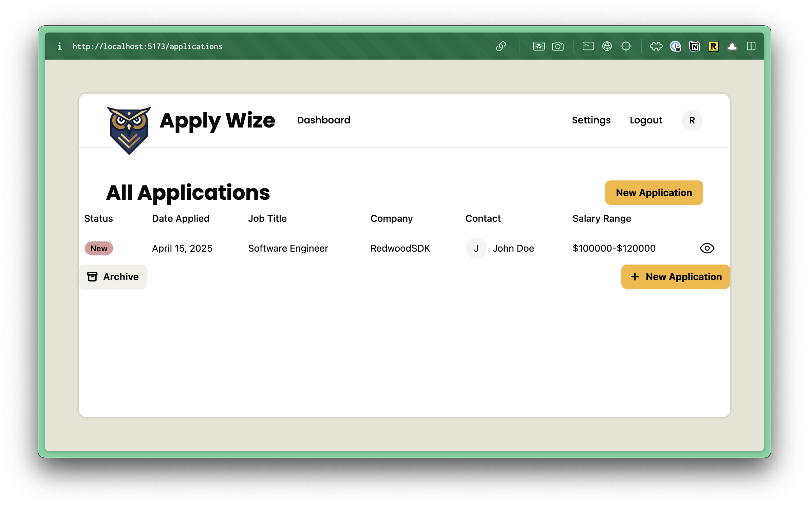

The `Archive` button should _link_ to a filtered view of all applications that have been archived. Let's update our link:

```tsx title="src/app/pages/applications/List.tsx" startLineNumber=45
<a href={`${link("/applications")}?status=archived`}>
  <Icon id="archive" />
  Archive
</a>
```

Be sure to import the `link` object at the top of the file:

```tsx title="src/app/pages/applications/List.tsx" showLineNumbers=false
import { link } from "@/app/shared/links";
```

This is really a filtered view of our existing `/applications` page, so we can use the existing `/applications` link. Then, we're attaching the query parameter: `?status=archived`. We don't need to do anything extra to make this link work, but we do need to adjust our List page to account for the `status` query parameter. We'll come back to this!

For the New Application button, let's update the `href`:

```tsx title="src/app/pages/applications/List.tsx" startLineNumber=31
<Button asChild>
  <a href={link("/applications/new")}>
    <Icon id="plus" />
    New Application
  </a>
</Button>
```

`/applications/new` doesn't exist yet. We need to set up this page. In our `worker.tsx` file, let's add a new route:

```tsx title="src/app/worker.tsx" startLineNumber=64 {3}
prefix("/applications", [
  route("/", [isAuthenticated, List]),
  route("/new", [isAuthenticated, () => <h1>New Application</h1>]),
  route("/:id", [isAuthenticated, () => <h1>Application</h1>]),
]),
---
- We can nest our `route` definition within the applications `prefix`.
- We included `isAuthenticated` to ensure that the route is protected.
- Temporarily, we'll display an `<h1>` New Application heading.
---
```

<Aside type="caution" title="Order of Routes">
  The order of the routes within your `worker.tsx` file is important. The code will work it's way down through each array, in order, looking for a match.

  If you list the `/applications/:id` route before the `/applications/new` route, it will match the `/applications/:id` route and display the application details page instead of the new application page.

  However, if you list the `/applications/new` route before the `/applications/:id` route, it will match the `/applications/new` route and display the new application page instead of the application details page.
</Aside>

Now, let's add our link to the `links.ts` file:

```tsx title="src/app/shared/links.ts" {9} collapse={2-8} startLineNumber=3
export const link = defineLinks([
  "/",
  "/user/login",
  "/user/signup",
  "/user/logout",
  "/legal/privacy",
  "/legal/terms",
  "/applications",
  "/applications/new",
  "/applications/:id",
]);
```

If we test this out within the browser, clicking on the "New Application" button at the bottom, you should see our temporary "New Application" page:

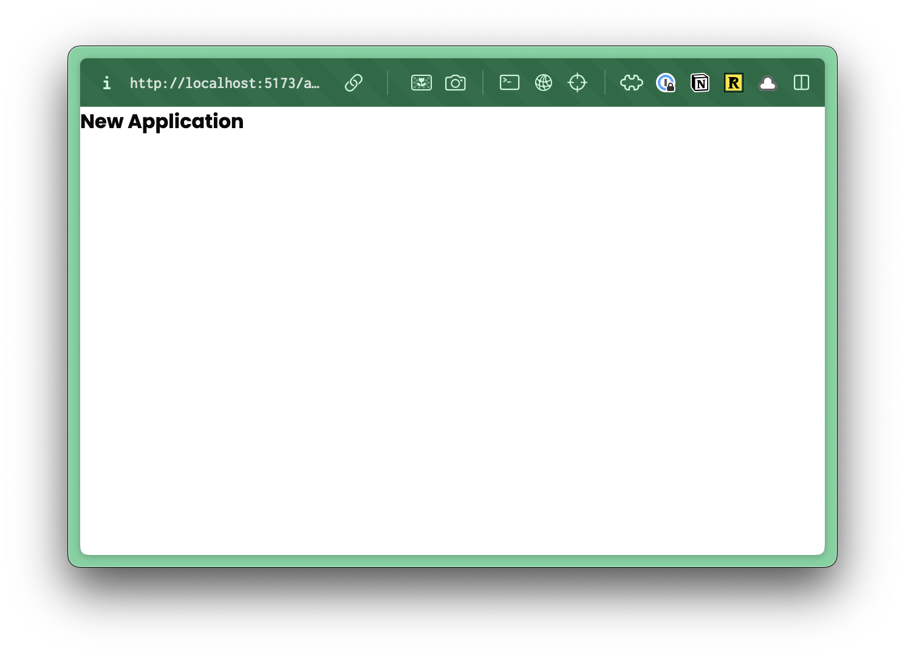

Let's make the "New Application" button at the top, match the button at the bottom.

```tsx title="src/app/pages/applications/List.tsx" collapse={14-22} {7-12, 23-28} startLineNumber=19
return (
  <InteriorLayout>
    <>
      <div className="px-page-side flex justify-between items-center">
        <h1 className="page-title">All Applications</h1>
        <div>
          <Button asChild>
            <a href={link("/applications/new")}>
              <Icon id="plus" />
              New Application
            </a>
          </Button>
        </div>
      </div>
      <ApplicationsTable applications={applications} />
      <div className="flex justify-between items-center">
        <Button asChild variant="secondary">
          <a href={`${link("/applications")}?status=archived`}>
          <Icon id="archive" />
            Archive
          </a>
        </Button>
        <Button asChild>
          <a href={link("/applications/new")}>
            <Icon id="plus" />
            New Application
          </a>
        </Button>
      </div>
    </>
  </InteriorLayout>
)
```

Now, let's adjust the spacing around our table. On **line 35**, we're using a class of `px-page-side` to add some padding to the left and right side.

```tsx title="src/app/pages/applications/List.tsx" startLineNumber=32 "px-page-side"
return (
  <InteriorLayout>
    <>
      <div className="px-page-side flex justify-between items-center">
```

Let's _remove_ this from the `div` and add it to a wrapping `div`.

```diff title="src/app/pages/applications/List.tsx" "px-page-side"
<InteriorLayout>
+  <div className="px-page-side">
-  <>
    <div className="flex justify-between items-center">
    ...
    </div>
+  </div>
- </>
</InteriorLayout>
---
- You'll notice, we converted the React Fragment `<>` to a `div` and added a class of `px-page-side` to it.
- Then, we removed `px-page-side` from nested `div` that contains our page title.
---
```

Before we preview this in the browser, let's adjust the vertical spacing.

<Aside type="tip" title="Vertical Spacing">
  Whenever I'm adjusting the vertical spacing with margins, I always use margin bottom, pushing everything down. A couple of reasons: (1) it adds consistency to my code, and (2) it's easier to troubleshoot.

  Plus, there's a feature within CSS called **collapsing margins**.

  > The top and bottom margins of blocks are sometimes combined (collapsed) into a single margin whose size is the largest of the individual margins (or just one of them, if they are equal), a behavior known as margin collapsing.

  <cite>Reference: [Mastering margin collapsing on MDN Docs](https://developer.mozilla.org/en-US/docs/Web/CSS/CSS_box_model/Mastering_margin_collapsing)</cite>

  This means that when you use a top and bottom margin, it can sometimes produce unexpected results. If you only use margin bottom, you can avoid this issue altogether.
</Aside>

```tsx title="src/app/pages/applications/List.tsx" "mb-5" "mb-8" "mb-10" collapse={4-13} startLineNumber=33 {14}
<InteriorLayout>
  <div className="px-page-side">
    <div className="flex justify-between items-center mb-5">
      <h1 className="page-title">All Applications</h1>
      <div>
        <Button asChild>
          <a href={link("/applications/new")}>
            <Icon id="plus" />
            New Application
          </a>
        </Button>
      </div>
    </div>
    <div className="mb-8"><ApplicationsTable applications={applications} /></div>
    <div className="flex justify-between items-center mb-10">
---
- **On line 22**, I added `mb-5` for `20px` of margin on the bottom.
- **On line 33**, I added `mb-8` for `32px` of margin on the bottom.
- **On line 44**, I added `mb-10` for `40px` of margin on the bottom.
---
```

Now, let's preview this in the browser:

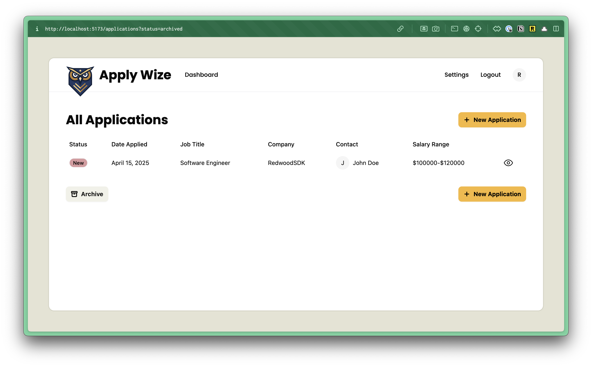

Before we call this done, make sure that our Archive filter is working.

### Using Query Params to Filter Applications

On every page we get an object that contains `ctx`, `request`, and `headers`. In our case, the `request` contains the query parameters that we're looking for.

On `List.tsx`, when we define our `List` function, let's accept `request` as a prop:

```tsx title="src/app/pages/applications/List.tsx" startLineNumber=20
const List = async ({ request }: { request: Request }) => {
---
You'll notice when I type the `request`, I'm using a standard `Request` type.
---
```

Now, at the top of our function, we can get the `status` query parameter using the `URLSearchParams` method from the standard WebAPI:

```tsx title="src/app/pages/applications/List.tsx" startLineNumber=21
const url = new URL(request.url);
const status = url.searchParams.get("status");

console.log({ status });
```

If you run this in the browser, you should see `{ status: 'archived' }` displayed.

<Aside type="note" title="Console">
  Since this code is running on the server, when you use `console.log` it will display the result in the Terminal.

  When code is running in the browser and use `console.log` it will display within dev tools.
</Aside>

Now, that we've checked that our query parameter is working, we can remove our `console.log` statement and adjust our Prisma `findMany` query.

After the `include` object, let's add a `where` object:

```tsx title="src/app/pages/applications/List.tsx" {10-12} startLineNumber=24
const applications = await db.application.findMany({
  include: {
    applicationStatus: true,
    company: {
      include: {
        contacts: true
      }
    }
  },
  where: {
    archived: status === "archived" ? true : false
  }
});
```

The `where` clause filters the results of our query based on whether `archived` is `true` or `false`. We can se it to `true` or `false` depending on whether `status` is set to `archived` or not.

You can test this in the browser, by clicking on the **Archive** button. You should see the URL change to include `/applications?status=archived` and the entry applications table should be empty.

Let's make this better by adding an empty state:

```tsx title="src/app/pages/applications/List.tsx" {2,5-7} startLineNumber=52
<div className="mb-8">
  {applications.length > 0 ? (
    <ApplicationsTable applications={applications} />
  ) : (
    <div className="text-center text-sm text-muted-foreground">
      No applications found
    </div>
  )}
</div>
---
- **On line 41**, we're checking if the `applications` array has more than one item. If it does, display the `ApplicationsTable`.
- If it doesn't, display a message that says "No applications were found."
- I also added a few styles to our message.
  - Centered with `text-center`
  - Reduced the text size with `text-sm`
  - Changed the text color to `text-muted-foreground`
---
```

Once we click on the "Archive" button, it's easy to feel "stuck".

Let's change the "Archive" button so that it toggles based on the query parameter.

```tsx title="src/app/pages/applications/List.tsx" {2-7, 12} startLineNumber=61
<Button asChild variant="secondary">
  {status === "archived" ? (
    <a href={`${link("/applications")}`}>
      <Icon id="archive" />
      Active
    </a>
  ) : (
    <a href={`${link("/applications")}?status=archived`}>
      <Icon id="archive" />
      Archive
    </a>
  )}
</Button>
---
- If the `status` is equal to `archived` then the link should go to `/applications` and the button label should be `Active`.
- Otherwise, display the `Archive` button, with the query parameter `?status=archived`
---
```

Test it out in the browser:

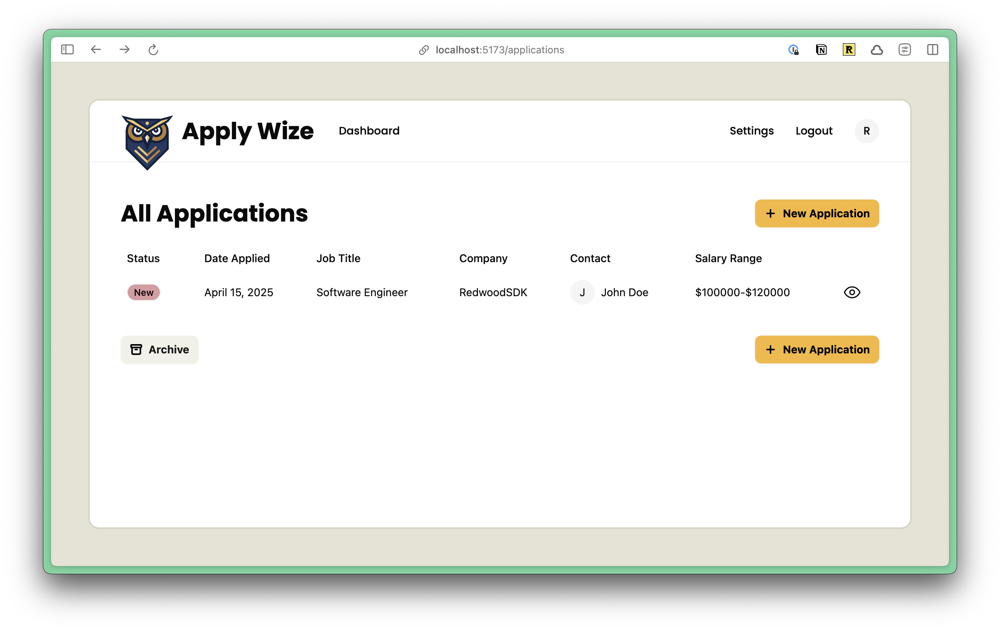

It looks and works great!

Remember, you can use [Prisma Studio](/tutorial/full-stack-app/database-setup#prisma-studio-recommended) to add more seed data, if you want to test various states.

<Aside type="tip" title="Code on GitHub">
You can find the final code for this step on [GitHub](https://github.com/redwoodjs/applywize/tree/main/end-of-5).
</Aside>
