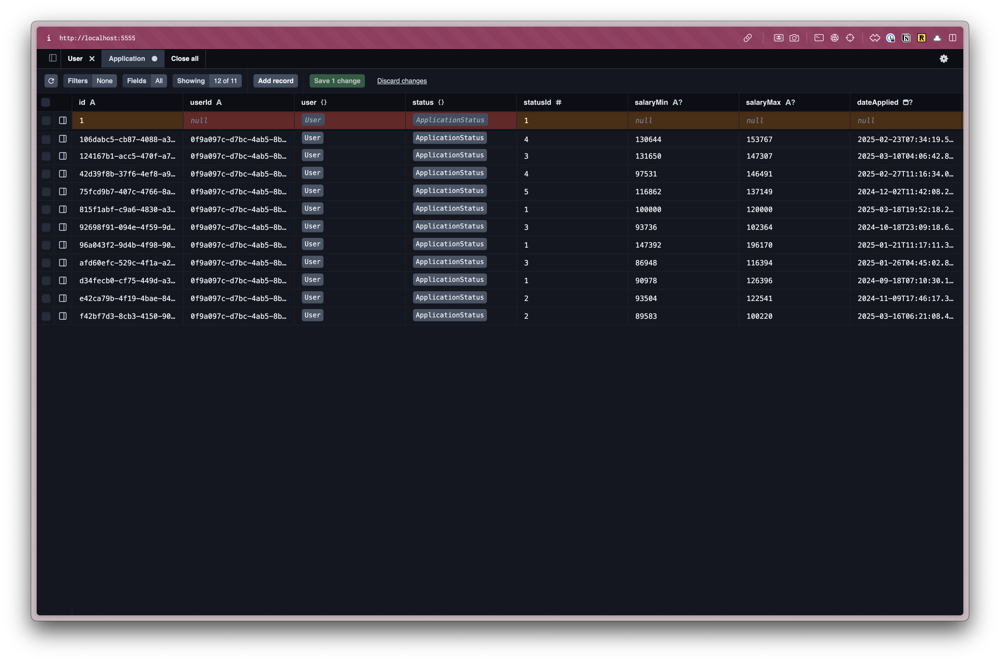

import { Aside, FileTree } from '@astrojs/starlight/components';

The jobs application list page lists all the jobs that we've applied for. For this tutorial, it will also serve as the Dashboard.

The finished page will look like this:


Let's start with the backend code and then make it look good.

But, first, we need a page and a route.

In the `pages` directory, create a new folder called `applications`. Inside, create a file called `ListPage.tsx`.

<FileTree>
- src/
  - app/
    - pages/
      - applications/
        - ListPage.tsx
      - auth/
      - Home.tsx
</FileTree>

We can stub out a basic page, just to make sure it's loading correctly.

```tsx title="src/app/pages/applications/ListPage.tsx"
const ListPage = () => {
  return (
    <div>ListPage</div>
  )
}

export { ListPage }
```

Now, within our `worker.tsx` file, we can add a route for our new page.

```tsx title="src/worker.tsx" showLineNumbers=false
import { ListPage } from "./app/pages/applications/ListPage";
...
prefix("/applications", [
  route("/", ListPage),
])
---
- We'll group all of our application routes (List, New, Detail, Update) under the `/applications` prefix.
- When the user visits `/applications`, they'll see our `ListPage` component.
---
```

Let's test this out in the browser. Go to `http://localhost:2332/applications` and you should see our stubbed out page.


Since we've already set up authentication, we can also protect this route.

```tsx
prefix("/applications", [
  route("/", [({ ctx }) => {
    if (!ctx.user) {
      return new Response(null, {
        status: 302,
        headers: { Location: "/user/login" },
      });
    }
  }, ListPage]),
])
```

This would get cumbersome (and annoying) if we have to do this for every.single.route we wanted to protect. Let's abstract this code into a reusable function.

```tsx
function isAuthenticated({ ctx }: { ctx: Context }) {
  if (!ctx.user) {
    return new Response(null, {
      status: 302,
      headers: { Location: "/user/login" },
    });
  }
}
```

Then, we can update our `/applications` route to use `isAuthenticated`:

```tsx
prefix("/applications", [
  route("/", [isAuthenticated, ListPage]),
])
```

Now, we can also update our home page route to use the `isAuthenticated` function, too:

```tsx
index([isAuthenticated, Home]),
```

Test it out. 👨‍🍳 Chef's kiss!

<Aside type="tip" title="Using multiple layers of Middleware">
  You can use multiple layers of middleware, by continuing to write functions and adding them to the array. For example:
  ```tsx
  prefix("/applications", [
    route("/", [isAuthenticated, isAdmin, ListPage]),
  ])
  ```
</Aside>

Now, let's get some data into the database.

We can do this one of two ways:

### Option 1: Create a Seed File
[Earlier, I mentioned that sometimes I'll create multiple seed files with various purposes.](/tutorial/full-stack-app/database-setup#seed-the-database). This is a perfect opportunity to create a separate file just for adding job applications to our database.

Inside the `src/scripts` directory, create a new file called `applicationSeed.ts`.

Let's stub it out:

```tsx title="src/scripts/applicationSeed.ts"
import { defineScript } from "redwoodsdk/worker";
import { db, setupDb } from "../db";

export default defineScript(async ({ env }) => {
  setupDb(env);

  console.log("🌱 Finished seeding");
});
---
- **On line 4**, we're setting up the Cloudflare Worker environment to run our script. By default, we get the `env` object.
- **On line 5**, we're setting up our database.
- **On line 7**, we're logging a message to the console to indicate that the script has finished running.
---
```

Inside our function, we can reach for a standard Prisma `create` function:

```tsx title="src/scripts/applicationSeed.ts" startLineNumber=7
const createApplication = async () => {
  await db.application.create({
    data: {
      salaryMin: "100000",
      salaryMax: "120000",
      jobTitle: "Software Engineer",
      jobDescription: "Software Engineer",
      postingUrl: "https://redwoodjs.com",
      dateApplied: new Date(),
    }
  }
};
---
- **On line 8,** we're referencing the `application` table. Then, using the Prisma `create` function to add all the data in our database object. You'll notice that these values match the columns we defined in `Prisma.schema` file.
---
```

If you run the script now, you'll hit a few errors because it's also looking for related `user`, `status`, and `company` entries. For the `user` and `status` connections, we already have entries within the database we can reference.

Let's start with the `user` connection. If you look at the `user` table, you'll see that their ID is `0f9a097c-d7bc-4ab5-8b11-6942163df348`. (Obviously, yours will be slightly different.) Copy that value.


Now, we can connect the entries, by setting `user` to an object with a `connect` key. Inside, we'll specify the `id` of the user we want to connect to.

```tsx title="src/scripts/applicationSeed.ts" {6-10}
export default defineScript(async ({ env }) => {
  setupDb(env);

  await db.application.create({
    data: {
      user: {
        connect: {
          id: "0f9a097c-d7bc-4ab5-8b11-6942163df348",
        },
      },
      ...
```

We want to do something similar for the `status`. If we look at the `ApplicationStatus` table, you'll notice that an `id` of `1` is associated with a New application.


We can connect the application record to the status record, by referencing an object with a `connect` key that contains an object with an `id` of `1`.

```tsx title="src/scripts/applicationSeed.ts" {7-11}
export default defineScript(async ({ env }) => {
  setupDb(env);

  await db.application.create({
    data: {
      ...
      status: {
        connect: {
          id: 1,
        },
      },
      ...
```

The company field is a little different because we haven't created any company records yet. However, we can create _and_ connect a company record at the same time:

```tsx title="src/scripts/applicationSeed.ts" {7-19}
export default defineScript(async ({ env }) => {
  setupDb(env);

  await db.application.create({
    data: {
      ...
      company: {
        create: {
          name: "RedwoodSDK",
          contacts: {
            create: {
              firstName: "John",
              lastName: "Doe",
              email: "john.doe@example.com",
              role: "Hiring Manager",
            },
          },
        },
      },
      ...
```

This time instead of using an object with a `connect` key, we'll use a `create` key inside. Then, we can list an object with all the company's data.

<details>
<summary>Complete applicationSeed.ts file</summary>

```tsx title="src/scripts/applicationSeed.ts" {6-10}
export default defineScript(async ({ env }) => {
  setupDb(env);

  await db.application.create({
    data: {
      user: {
        connect: {
          id: "0f9a097c-d7bc-4ab5-8b11-6942163df348",
        },
      },
      status: {
        connect: {
          id: 1,
        },
      },
      salaryMin: "100000",
      salaryMax: "120000",
      jobTitle: "Software Engineer",
      jobDescription: "Software Engineer",
      postingUrl: "https://redwoodjs.com",
      dateApplied: new Date(),
      company: {
        create: {
          name: "RedwoodSDK",
          contacts: {
            create: {
              firstName: "John",
              lastName: "Doe",
              email: "john.doe@example.com",
              role: "Hiring Manager",
            },
          },
        },
      },
    },
  });

  console.log("🌱 Finished seeding");
});
```

</details>

<Aside type="tip" title="Prisma createMany">
Prisma also has a `createMany` function where you can create multiple entries at the same time. However, there are a few limitations:

- It does not return the created records, only the count of inserted rows, which can be problematic for certain use cases.
- There's limited support for complex relational constraints and upsert operations.

For reference: [`createMany` on Prisma's Documentation](https://www.prisma.io/docs/orm/prisma-client/queries/crud#create-multiple-records)
</Aside>

<Aside type="note" title="`skipDuplicates` is not supported">
Since our database is a sqlite database, `skipDuplicates` is not supported.
</Aside>


To run the seed file, within the Terminal:

```shell
pnpm worker:run ./src/scripts/applicationSeed.ts
```

If this feels hard to remember, you can create a script in your `package.json` file. Inside the `scripts` block:

```json title="package.json" {16}
...
  "scripts": {
    "build": "vite build",
    "dev": "NODE_ENV=${NODE_ENV:-development} vite dev",
    "dev:init": "rw-scripts dev-init",
    "worker:run": "rw-scripts worker-run",
    "clean": "pnpm build && pnpm clean:vendor",
    "clean:vite": "rm -rf ./node_modules/.vite",
    "clean:vendor": "rm -rf ./vendor/dist",
    "release": "pnpm build && wrangler deploy",
    "format": "prettier --write ./src",
    "migrate:dev": "wrangler d1 migrations apply DB --local",
    "migrate:prd": "wrangler d1 migrations apply DB --remote",
    "migrate:new": "rw-scripts migrate-new",
    "seed": "pnpm worker:run ./src/scripts/seed.ts",
    "seed:applications": "pnpm worker:run ./src/scripts/applicationSeed.ts",
    "icons": "lemon-lime-svgs"
  },
...
```

Now, you can run the seed file by saying:

```shell
pnpm seed:applications
```

😅 Much more straight forward!

When you're creating custom seed files, this does take more time on the frontend to set up. _But,_ it makes it much easier in the long run.

### Option 2: Prisma Studio

Another option is to use Prisma Studio. This option is easier, but requires manual entry and can take more time in the long run.

Prisma Studio ships with Prisma, so there's nothing extra to install.

Let's start by opening the `schema.prisma` file.

```tsx title="src/schema.prisma" {3}
datasource db {
  provider = "sqlite"
  url      = env("DATABASE_URL")
}
```

You'll notice the `url` is referencing the `DATABASE_URL` environment variable.

We need this to set this up in the `.env` file so Prisma Studio can connect to the database.

First, let's go to our `d1` database. This is inside the `.wrangler/state/v3/d1/miniflare-D1DatabaseObject` directory.


Right click on the sqlite file and click `Copy Path`.

Inside your `.env` file, create a `DATABASE_URL` variable and paste in the database path:


Right now, the database url uses the absolute path, we need to make this path relative. Remove everything in front of `.wrangler` and replace it with `../`. We also need to specify that this is a `file`:

```
DATABASE_URL="file:../.wrangler/state/v3/d1/miniflare-D1DatabaseObject/84daca3a95ca09403c82fcd535a8a092abf9029357d742c62ecaab59bcc13d30.sqlite"
```

Now, within the Terminal, run:

```Terminal
npx prisma studio
```

This will open a new tab in your default browser at `http://localhost:5555`.



From here, you can create, read, update, and delete records.

Once you've added some data, let's go back to our application and display the data on the page.

On the Applications list page, let's `import` the `db` at the top of the file. Then, inside the `ListPage` function, let's use the `findMany` function to get all the applications:

```tsx title="src/app/pages/applications/ListPage.tsx"
import { db } from "src/db";

const ListPage = async () => {
  const applications = await db.application.findMany();

  return (
    <div>
      <pre>{JSON.stringify(applications, null, 2)}</pre>
    </div>
  )
}

export { ListPage }
```

<Aside type="note" title="Using `db`">
Note, it's `db` then the name of the table. In this case, `application`. But, this could just as easily be `company`, `contact`, `status`, or `user`.
</Aside>

All the data from the database is returned as an array and saved in a variable called `applications`. Then, we can display all the data by using the `JSON.stringify` function. Wrapping our code in `pre` tags, it makes it easier to read.

<Aside type="note" title="`JSON.stringify`">
`JSON.stringify` takes 3 arguments.
- The first is the object or value that we want to convert to a string. In our case the `applications` array.
- `null` means that there is no special replacement or filtering applied.
- `2` specifies the number of spaces to use for indentation.

[For reference: JSON.Stringify on MDN](https://developer.mozilla.org/en-US/docs/Web/JavaScript/Reference/Global_Objects/JSON/stringify)
</Aside>


Easy, right?! Since we're using React Server Components, this code runs on the server. We're able to make database calls directly from the page and don't need to worry about creating API routes. 🎉

Now that we know the content from our database is getting on the page, let's style it.

## Styling the Job Applications List Page

Similar to the auth pages, let's start by creating a layout that will wrap all of our interior pages.

### Creating an Interior Page Layout

Inside our `layouts` folder, let's create a new file called `InteriorLayout.tsx`.

<FileTree>
- src/
  - app/
    - layouts/
      - AuthLayout.tsx
      - InteriorLayout.tsx
</FileTree>

Inside, we need should use some of the same the same styles that we used within our `AuthLayout.tsx` file.

```tsx title="src/app/layouts/AuthLayout.tsx" {3-4}
const AuthLayout = ({ children }: { children: React.ReactNode }) => {
  return (
    <div className="bg-bg min-h-screen min-w-screen p-12">
      <div className="grid grid-cols-2 min-h-[calc(100vh-96px)] rounded-xl border-2 border-[#D6D5C5]">
      ...
---
- The wrapping `div` sets the background color, the minimum height and width of the page, and adds some padding.
- The child `div` sets up the grid, applies rounded corners, and adds a border.
---
```

We don't need to set up a grid, but we can abstract the styles and reuse them within our interior layout.

From the `AuthLayout.tsx` file, I'm going to copy the `bg-bg min-h-screen min-w-screen p-12` styles and create a class inside our `styles.css` file, inside the `@layer components` block:

```css title="src/styles.css" startLineNumber=164
.page-wrapper {
  @apply bg-bg min-h-screen min-w-screen p-12;
}
```

Then, let's do something similar with the child `div` from our `AuthLayout.tsx`. We don't need to the `grid`, but we can grab everything else: `min-h-[calc(100vh-96px)] rounded-xl border-2 border-[#D6D5C5]`

```css title="src/styles.css" startLineNumber=168
.page {
  @apply min-h-[calc(100vh-96px)] rounded-xl border-2 border-[#D6D5C5];
}
```

<details>
<summary>`@layer components` section of styles.css</summary>

```css title="src/styles.css" startLineNumber=163
@layer components {
  .page-wrapper {
      @apply bg-bg min-h-screen min-w-screen p-12;
    }

  .page {
    @apply min-h-[calc(100vh-96px)] rounded-xl border-2 border-[#D6D5C5];
  }

  .page-title {
    @apply text-3xl;
  }
}
```
</details>

Now, let's update the class list within our `AuthLayout.tsx` file:

```tsx title="src/app/layouts/AuthLayout.tsx" "page-wrapper" "page"
const AuthLayout = ({ children }: { children: React.ReactNode }) => {
  return (
    <div className="page-wrapper">
      <div className="grid grid-cols-2 page">
      ...
```

Now, let's jump over to our `InteriorLayout.tsx` file and use these classes there as well:

```tsx title="src/app/layouts/InteriorLayout.tsx" "page-wrapper" "page bg-white"
import { Header } from "@/app/components/Header";

const InteriorLayout = ({ children }: { children: React.ReactNode}) => {
  return (
    <div className="page-wrapper">
      <main className="page bg-white">
        {children}
      </main>
    </div>
  )
}

export { InteriorLayout }
---
You'll also notice I added a background of white with `bg-white`
---
```

To see how this looks, we need to add this to our `ListPage.tsx`:

```tsx title="src/app/pages/applications/ListPage.tsx" startLineNumber=13
return (
  <InteriorLayout>
    <pre>{JSON.stringify(applications, null, 2)}</pre>
  </InteriorLayout>
)
```


It's coming together! Across the top, let's add the logo and navigation. We may need to reuse this component in the future, so let's make it it's own component. Inside the `components` folder, let's create a new file called `Header.tsx`.

<FileTree>
- src/
  - app/
    - components/
      - Header.tsx
</FileTree>

```tsx title="src/app/components/Header.tsx"
const Header = () => {
  return (
    <header>
      {/* left side */}
      <div></div>

      {/* right side */}
      <div></div>
    </header>
  )
}
---
Here are the basic building blocks we need.
- I used a semantic HTML element `header` to wrap everything.
- Then, we'll have a left and right side. On the left, we'll display the logo and the navigation. On the right, we'll display a link the user's settings, the logout button, and  the user's avatar.
---
```

<figure>
  
  <figcaption>Mockup from Figma</figcaption>
</figure>

Inside the left `div`, let's add the logo and "Apply Wize" text and wrap it in a link:

```tsx title="src/app/components/Header.tsx" startLineNumber=5
{/* left side */}
<div>
  <a href={link("/")}>
    
    <span>Apply Wize</span>
  </a>
</div>
```

- Pretty straightforward. We're using the same `logo.svg` that we used on the auth pages. It should already be in your `public/images` folder.
- Then, we're using the `link` helper to link to home page. At the top of your file, you'll need to import the `link` helper:
```tsx
import { link } from '@/app/shared/links'
```

Now, let's add the navigation. For now this is only one link that goes to the dashboard page.

```tsx title="src/app/components/Header.tsx" startLineNumber=12
<nav>
  <ul>
    <li><a href={link("/applications")}>Dashboard</a></li>
  </ul>
</nav>
```

For the right side, we want another unordered list and the Avatar component:

```tsx title="src/app/components/Header.tsx" startLineNumber=15
{/* right side */}
<nav>
  <ul className="flex items-center gap-7">
    <li><a href={link("/user/settings")}>Settings</a></li>
    <li><a href={link("/user/logout")}>Logout</a></li>
    <li>
      <Avatar>
        <AvatarFallback>R</AvatarFallback>
      </Avatar>
    </li>
  </ul>
</nav>
```

- Notice, I replaced the right side `div` with a `nav` element, keeping things nice and semantic.
- Inside, I've included links for the settings and logout pages.
- For the `Avatar` component, you'll need to import it at the top of your file. This is a ShadCN component, so it should already be part of your project.

```tsx
import { Avatar, AvatarFallback } from '@/app/components/ui/avatar'
```

{/* TODO: Make sure these links have been added to the links.ts file. */}

Normally, when you're using the `Avatar` component, you'll also want to use the `AvatarImage` component. This is where you define the Avatar image:

```tsx title="src/app/components/Header.tsx" startLineNumber=25
import { Avatar, AvatarFallback, AvatarImage } from '@/app/components/ui/avatar'

...

<li>
  <Avatar>
    <AvatarFallback>R</AvatarFallback>
    <AvatarImage src="./images/avatar.png" />
  </Avatar>
</li>
```

If you want to go this route, you can download the [`avatar.png` placeholder image](). However, we're not going to cover file uploads and storage in this tutorial. So, we'll use the `AvatarFallback` component to display the first character of the username.

Now that we have all the elements, let's add some styling:

```tsx title="src/app/layouts/Header.tsx" startLineNumber=6
<header className="py-5 px-10 h-20 flex justify-between items-center border-b-1 border-border mb-12">
---
- `py-5` adds `20px` of padding to the top and bottom.
- `px-10` adds `40px` of padding to the left and right.
- `h-20` sets the height to `80px`.
- `flex` and `justify-between` are used to align the items inside the header, putting as much space between each of the elements as possible.
- `items-center` centers the items vertically.
- `border-border` and `border-b-1` adds a border to the bottom of the header with a color of `border` (defined as a custom color in the `@theme` block of our `styles.css` file).
---
```

We set the left and right padding to `40px` with `px-10`. We'll use this throughout our entire application. In order to maintain consistency, let's define it as a custom utility. This will make it easy to reference (and change, if necessary).

```css title="src/styles.css" startLineNumber=147
--spacing-page-side: 40px;
---
Inside the `@theme` block, below our color definitions, we'll add a new variable called `--spacing-page-side` and set it to `40px`. Now, we can use this variable with margin or padding: `mx-page-side` or `px-page-side` respectively.
---
```

Now, we can update our `header` element to use the new utility:

```tsx title="src/app/layouts/Header.tsx" startLineNumber=6
<header className="py-5 px-page-side h-20 flex justify-between items-center border-b-1 border-border mb-12">
```

On the left side `div`, we want the logo and the Dashboard link to align vertically:

```tsx title="src/app/layouts/Header.tsx" startLineNumber=8
{/* left side */}
<div className="flex items-center gap-8">
  ...
---
- We're using `flex` and `items-center` to align the items vertically.
- `gap-8` adds `32px` of space between the logo and the Dashboard link.
---
```

On the home page link, we want the logo and the "Apply Wize" text to align vertically too:

```tsx
<a href={link("/")} className="flex items-center gap-3 font-display font-bold text-3xl">
---
- `flex`, `items-center`, and `gap-3` aligns the logo and text and puts `12px` of space between them.
- `font-display` and `font-bold` are used to style the text, applying the font Poppins and making the text bold.
- `text-3xl` sets the font size to `30px`
---
```

If you look at the logo, it overlaps with the bottom border of the header.


In order to achieve this, we also need to add some styles to the `img` tag:

```tsx title="src/app/components/Header.tsx" startLineNumber=10

---
- `pt-5` adds `20px` of padding to the top.
- `-mb-3` removes `12px` of margin from the bottom and will make the bottom of the header shift up.
---
```

For the right side `ul`, we need to add a few styles to position the links properly:

```tsx title="src/app/components/Header.tsx" startLineNumber=20 {22}
{/* right side */}
<nav>
  <ul className="flex items-center gap-7">
  ...
---
- Similar to techniques we've used before, we're using `flex` and `items-center` to align the items vertically.
- `gap-7` adds `28px` of space between each of the links.
---
```

To style our nav links, I want these styles to apply to both the left and the right side. So, let's stick these inside the `styles.css` file, inside the `@layer base` block:

```css title="src/styles.css" startLineNumber=159
nav {
  @apply font-display font-medium text-sm;
}
```

That should be it! (for the header at least)

<details>
<summary>Finished `Header.tsx` component</summary>

```tsx title="src/app/components/Header.tsx"
import { Avatar, AvatarFallback } from '@/app/components/ui/avatar'
import { link } from '@/app/shared/links'

const Header = () => {
  return (
    <header className="py-5 px-page-side h-20 flex justify-between items-center border-b-1 border-border mb-12">
      {/* left side */}
      <div className="flex items-center gap-8">
        <a href={link("/")} className="flex items-center gap-3 font-display font-bold text-3xl">
          
          <span>Apply Wize</span>
        </a>
        <nav>
          <ul>
            <li><a href={link("/applications")}>Dashboard</a></li>
          </ul>
        </nav>
      </div>

      {/* right side */}
      <nav>
        <ul className="flex items-center gap-7">
          <li><a href={link("/user/settings")}>Settings</a></li>
          <li><a href={link("/user/logout")}>Logout</a></li>
          <li>
            <Avatar>
              <AvatarFallback>R</AvatarFallback>
            </Avatar>
          </li>
        </ul>
      </nav>
    </header>
  )
}

export { Header }
```
</details>

Now, let's stick our `Header` component into our `InteriorLayout.tsx` file:

```tsx title="src/app/layouts/InteriorLayout.tsx"
import { Header } from "@/app/components/Header";

const InteriorLayout = ({ children }: { children: React.ReactNode}) => {
  return (
    <div className="page-wrapper">
      <main className="page bg-white">
        <Header />
        <div>{children}</div>
      </main>
    </div>
  )
}

export { InteriorLayout }
```

Check it out in the browser!


Moving on.

At the top of our file, let's add a page heading and a button/link to add a new application:

```tsx title="src/app/pages/applications/ListPage.tsx" showLineNumbers=false
import { Button } from "@/app/components/ui/button";
import { link } from "@/app/shared/links";
...
return (
  <InteriorLayout>
    <>
      <div>
        <h1>All Applications</h1>
        <div>
          <Button asChild><a href={link("/applications/new")}>New Application</a></Button>
        </div>
      </div>
      <pre>{JSON.stringify(applications, null, 2)}</pre>
    </>
  </InteriorLayout>
)
```
- `InteriorLayout` can only have one react node, so we need to wrap everything with a React fragment (`<>`)
- Above our application content, I added a wrapping `div` with a `h1` heading for "All Applications".
- Then, I have another `div` that wraps a `<Button>` component. Inside, I have a link that points to the new application page. The `Button` component is coming from ShadCN. It should already be part of your project, but you'll need to import it at the top of your file.
- Since we're not triggering an event, we're _linking_ to another page, we have an `a` tag referencing the `applications/new` route via the `link` helper.

<Aside type="tip" title="ShadCN Button">
  Admittedly, it does look a little strange having an `a` tag inside a `Button` component. This is functionality provided by ShadCN, when you have an element that looks like a button, but should be a link.

  [For reference: ShadCN Button Component Documentation](https://ui.shadcn.com/docs/components/button)
</Aside>

Now, let's add some styling:

```
```

### Styling the Applications Table


```tsx
import React from 'react'
import { link } from "app/shared/links";
import { Badge } from "app/components/ui/badge";
import { Avatar, AvatarFallback, AvatarImage } from "app/components/ui/avatar";
import {
  Table,
  TableBody,
  TableCell,
  TableHead,
  TableHeader,
  TableRow,
} from "app/components/ui/table"
import { Icon } from "app/components/Icon";
import { Application } from "@prisma/client";

interface ApplicationsTableProps {
  applications: Application[]
}

const ApplicationsTable = ({ applications }: ApplicationsTableProps) => {
  return (
    <Table>
      <TableHeader>
        <TableRow>
          <TableHead className="w-[100px]">Status</TableHead>
          <TableHead>Date Applied</TableHead>
          <TableHead>Job Title</TableHead>
          <TableHead>Company</TableHead>
          <TableHead>Contact</TableHead>
          <TableHead>Salary Range</TableHead>
          <TableHead></TableHead>
        </TableRow>
      </TableHeader>
      <TableBody>
        {applications.map((application) => (
          <TableRow key={application.id}>
            <TableCell><Badge variant={application.status.status.toLowerCase()}>{application.status.status}</Badge></TableCell>
            <TableCell>{application.dateApplied.toLocaleDateString('en-US', {
              year: 'numeric',
              month: 'long',
              day: 'numeric'
            })}</TableCell>
            <TableCell>{application.jobTitle}</TableCell>
            <TableCell>{application.company.name}</TableCell>
            <TableCell className="flex gap-2 items-center">
              {application.company?.contacts && application.company?.contacts?.length > 0 && (
                <>
                  {/* <Avatar>
                    <AvatarImage src="https://github.com/shadcn.png" alt="@shadcn" />
                    <AvatarFallback>CN</AvatarFallback>
                  </Avatar> */}
                  {application.company.contacts[0].firstName} {application.company.contacts[0].lastName}
                </>
              )}
            </TableCell>
            <TableCell>${application.salaryMin}-${application.salaryMax}</TableCell>
            <TableCell><a href={link("/applications/:id", { id: application.id })}><Icon id="eye" /></a></TableCell>
          </TableRow>
        ))}
      </TableBody>
    </Table>
  )
}

export {  ApplicationsTable }
```


- Creating the main jobs page layout
- Building and styling the jobs table using ShadCN Table component
- Adding the "Create New Job" button with ShadCN Button component

<Aside type="tip" title="Code on GitHub">
You can find the final code for this step on [GitHub](https://github.com/redwoodjs/applywize).
</Aside>

## Further reading

- Read [about how-to guides](https://diataxis.fr/how-to-guides/) in the Diátaxis framework
