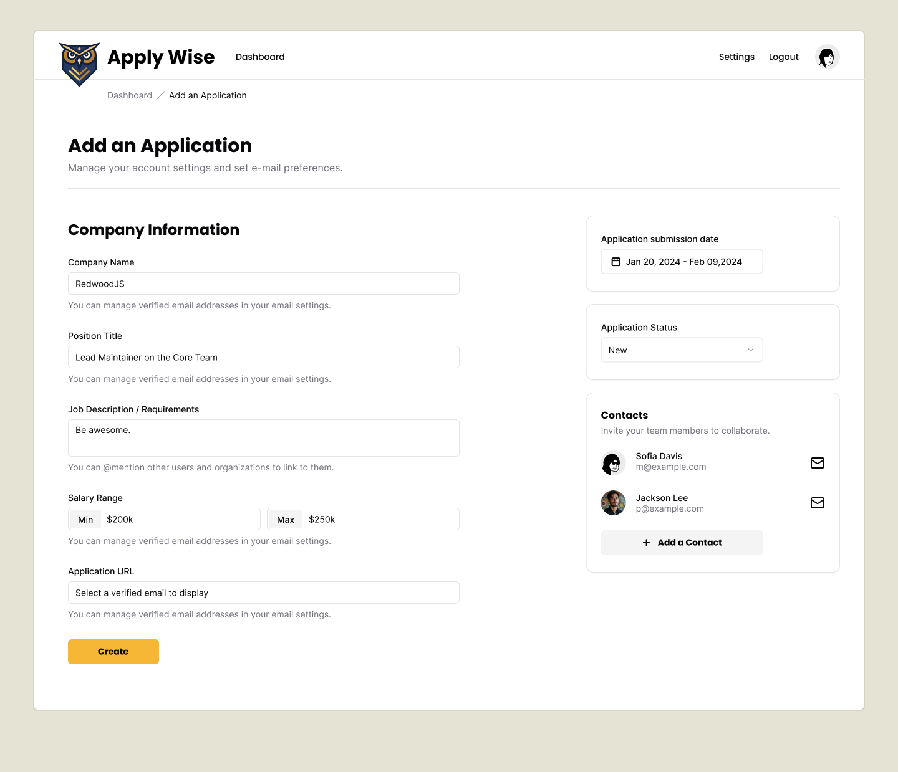
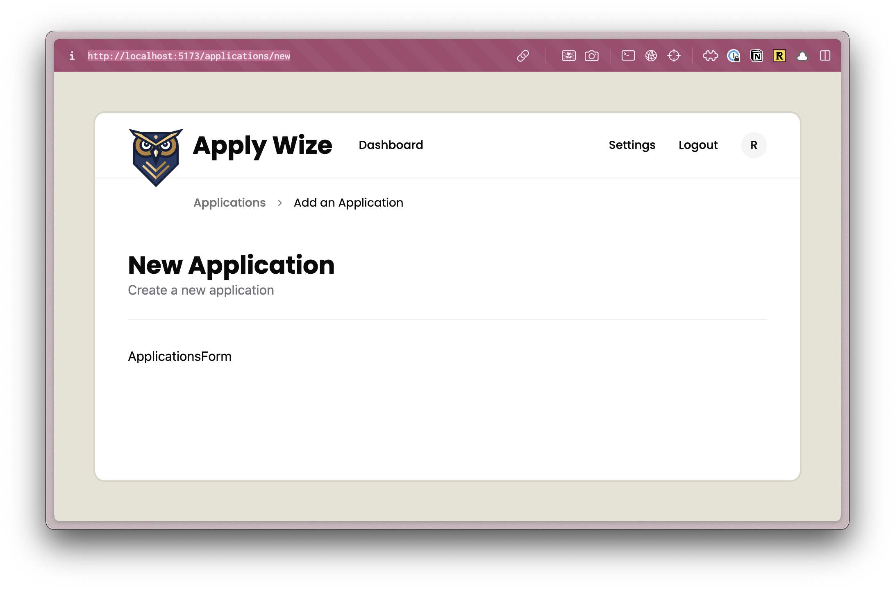
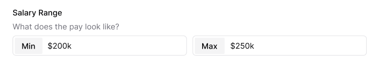
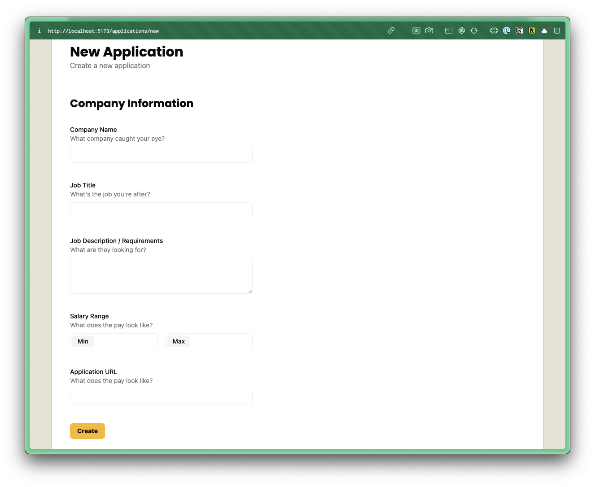
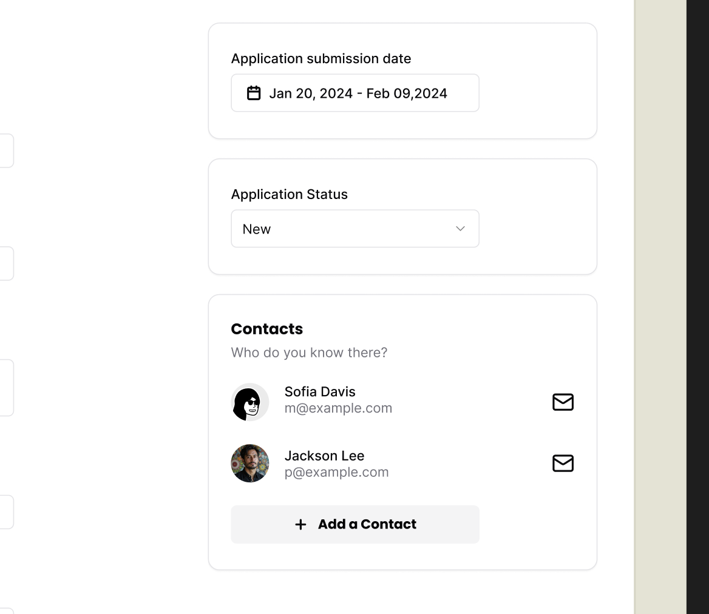
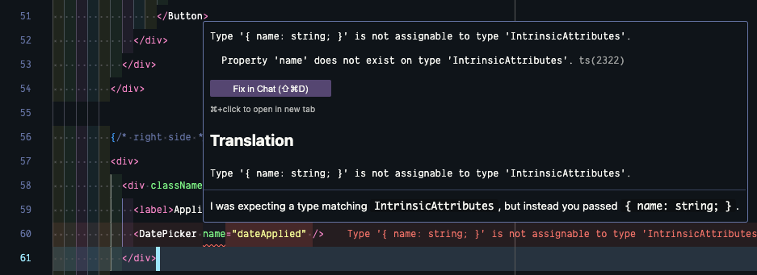
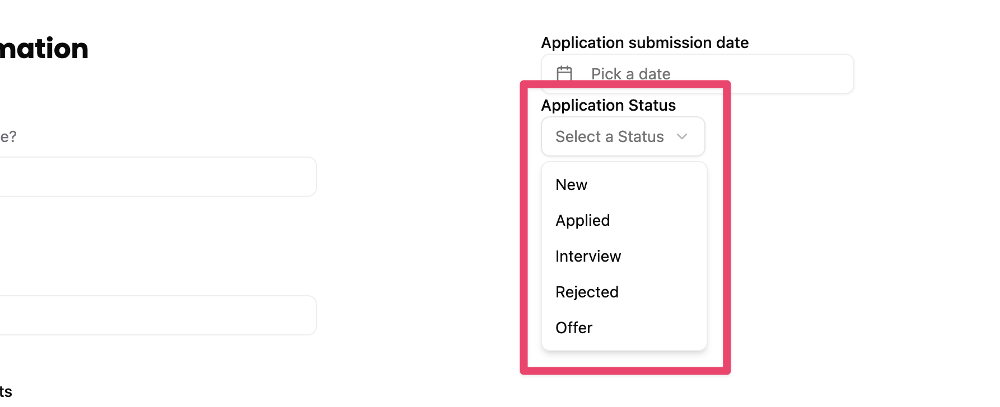
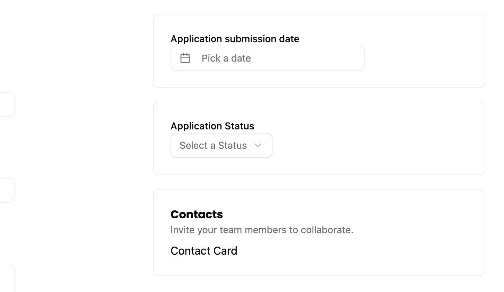
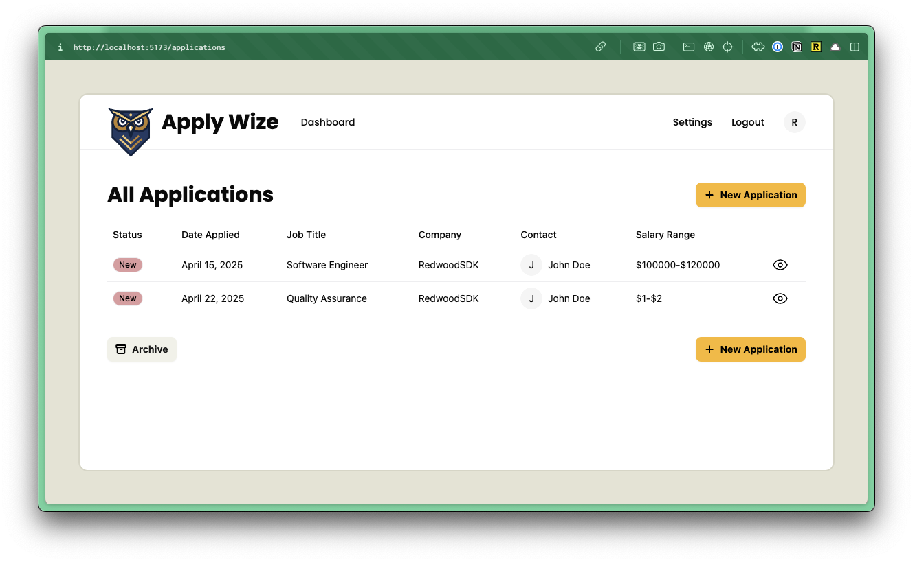

import { Aside, FileTree } from '@astrojs/starlight/components';

## Building the Form

Now, that we have a way of displaying our applications, we need a way of adding new ones.

First, let's take a look at our design, in Figma, and what we're building.



In the last section, we set up the `/applications/new` route, but we haven't created the page.

Inside the `src/app/pages/applications` folder, let's create a new file called `New.tsx`.

<FileTree>
- src/
  - app/
    - pages/
      - applications/
        - New.tsx
</FileTree>

We can stub out a basic component:

```tsx title="src/app/pages/applications/New.tsx"
import { InteriorLayout } from "@/app/layouts/InteriorLayout"

const New = () => {
  return (
    <InteriorLayout>
      <div>New</div>
    </InteriorLayout>
  )
}

export { New }
---
I went ahead and wrapped our component with the `InteriorLayout` component.
---
```

In order to see the changes that we're making in the browser, we need to update our worker.

```diff title="src/worker.tsx" collapse={4-7}
import { New } from "./app/pages/applications/New";
...
render(Document, [
  index([ isAuthenticated, Home ]),
  prefix("/user", userRoutes),
  route("/legal/privacy", () => <h1>Privacy Policy</h1>),
  route("/legal/terms", () => <h1>Terms of Service</h1>),
  prefix("/applications", [
    route("/", [isAuthenticated, List]),
-    route("/new", [isAuthenticated, () => <h1>New Application</h1>]),
+    route("/new", [isAuthenticated, New]),
    route("/:id", [isAuthenticated, () => <h1>Application</h1>]),
  ]),
]),
```

Originally, we defined our `/new` route, returning an `h1` element that said "New Application". Let's change that to return our `New` component instead.

Then, be sure to import the `New` component at the top of the file:

```tsx title="src/worker.tsx" collapse={4-7}
import { New } from "./app/pages/applications/New";
```

Inside our `New` component, let's start building our page.

### Left Side

At the top, we have breadcrumbs, helping the user know where they are and navigate back.

Conveniently, shadcn/ui has a `Breadcrumb` component that we can use.

Just like the Applications Table, let's start by copying and pasting the code directly from [shadcn/ui's documentation](https://ui.shadcn.com/docs/components/breadcrumb) into our component:

```tsx showLineNumbers={false}
import { Breadcrumb, BreadcrumbList, BreadcrumbItem, BreadcrumbLink, BreadcrumbPage, BreadcrumbSeparator } from "@/app/components/ui/breadcrumb"
...
<Breadcrumb>
  <BreadcrumbList>
    <BreadcrumbItem>
      <BreadcrumbLink href="/">Home</BreadcrumbLink>
    </BreadcrumbItem>
    <BreadcrumbSeparator />
    <BreadcrumbItem>
      <BreadcrumbLink href="/components">Components</BreadcrumbLink>
    </BreadcrumbItem>
    <BreadcrumbSeparator />
    <BreadcrumbItem>
      <BreadcrumbPage>Breadcrumb</BreadcrumbPage>
    </BreadcrumbItem>
  </BreadcrumbList>
</Breadcrumb>
```

Now, we an start modifying the code to fit our needs.

```diff title="src/app/pages/applications/New.tsx"
<InteriorLayout>
    <Breadcrumb>
      <BreadcrumbList>
        <BreadcrumbItem>
-         <BreadcrumbLink href="/">Home</BreadcrumbLink>
+         <BreadcrumbLink href="/applications">Applications</BreadcrumbLink>
        </BreadcrumbItem>
-         <BreadcrumbSeparator />
-         <BreadcrumbItem>
-           <BreadcrumbLink href="/components">Components</BreadcrumbLink>
-         </BreadcrumbItem>
        <BreadcrumbSeparator />
        <BreadcrumbItem>
-          <BreadcrumbPage>Breadcrumb</BreadcrumbPage>
+          <BreadcrumbPage>Add an Application</BreadcrumbPage>
        </BreadcrumbItem>
      </BreadcrumbList>
    </Breadcrumb>
</InteriorLayout>
```

- I've adjusted the first `BreadcrumbLink` to point to the Applications list page.
- We can get rid of the second `BreadcrumbItem`.
- For the third `BreadcrumbItem`, I've changed the label from `Breadcrumb` to `Add an Application`.

At the top of the `src/app/components/ui/breadcrumb.tsx` file, we need to add a `use client` directive, otherwise our page will error out.

```tsx title="src/app/components/ui/breadcrumb.tsx"
"use client"
```

Let's wrap our breadcrumbs with a `div` and add a few classes to adjust the spacing.

```tsx title="src/app/pages/applications/New.tsx" collapse={4-14} {3,15} startLineNumber=12 "mb-12 -mt-7 pl-[120px]"
return (
  <InteriorLayout>
    <div className="mb-12 -mt-7 pl-[120px]">
      <Breadcrumb>
        <BreadcrumbList>
          <BreadcrumbItem>
            <BreadcrumbLink href="/applications">Applications</BreadcrumbLink>
          </BreadcrumbItem>
          <BreadcrumbSeparator />
          <BreadcrumbItem>
            <BreadcrumbPage>Add an Application</BreadcrumbPage>
          </BreadcrumbItem>
        </BreadcrumbList>
      </Breadcrumb>
    </div>
  </InteriorLayout>
);
```

- I added `48px` of margin on the bottom with `mb-12`
- I put a negative margin of `28px` on the top to move the breadcrumbs up.
- I added `120px` of padding on the left.

Next up, let's add our page heading:

```tsx title="src/app/pages/applications/New.tsx" collapse={1-13} startLineNumber=15
<div className="mb-12 -mt-7 pl-[120px]">
  <Breadcrumb>
    <BreadcrumbList>
      <BreadcrumbItem>
        <BreadcrumbLink href="/applications">Applications</BreadcrumbLink>
      </BreadcrumbItem>
      <BreadcrumbSeparator />
      <BreadcrumbItem>
        <BreadcrumbPage>Add an Application</BreadcrumbPage>
      </BreadcrumbItem>
    </BreadcrumbList>
  </Breadcrumb>
</div>
<div className="mx-page-side pb-6 mb-8 border-b-1 border-border">
  <h1 className="page-title">New Application</h1>
  <p className="page-description">Create a new application</p>
</div>
```

- On the wrapping `div`, we have a few classes that adjusts the spacing and adds a border to the bottom.
  - `mx-page-side` uses our custom utility class to add `40px` of padding on the left and right.
  - `pb-6` adds `24px` of padding on the bottom.
  - `mb-8` adds `32px` of margin on the bottom.
  - `border-b-1 border-border` adds a border to the bottom of the `div`.
- Here, we've added an `h1` that says "New Application" and has a class called `page-title`
- Then, we have a `p` of text that says "Create a new application." I went ahead and added a class of `page-description` so that we can use this on multiple pages, but we'll need to add this class definition to the `@layer components` section of our `styles.css` file.

```css title="src/app/styles.css" startLineNumber={182}
.page-description {
  @apply text-zinc-500;
}
---
This sets the default color of our `page-description` to a light gray, using class provided by Tailwind.
---
```

Moving down the page, we have a two column form. There are parts of our form that will need state and interactivity, meaning our component will need to be a client component. Instead of making the entire page a client component, let's create a separate component, just for our form.

Inside the `src/app/components` folder, let's create a new file called `ApplicationForm.tsx`.

<FileTree>
- src/
  - app/
    - components/
      - ApplicationForm.tsx
</FileTree>

Stubbing out our component:

```tsx title="src/app/components/ApplicationForm.tsx"
"use client"

const ApplicationForm = () => {
  return (
    <div>ApplicationForm</div>
  )
}

export {ApplicationForm}
---
You'll notice I also placed the `use client` directive at the top of the file, converting this file to a client component.
---
```

Before we start building out our Application Form, let's add it to the `New.tsx` file.

```tsx title="src/app/pages/applications/New.tsx" showLineNumbers=false {7}
import { ApplicationsForm } from "@/app/components/ApplicationsForm"
...
<div className="mx-page-side pb-6 mb-8 border-b-1 border-border">
  <h1 className="page-title">New Application</h1>
  <p className="page-description">Create a new application</p>
</div>
<ApplicationsForm />
```

Now, let's go back to our `ApplicationForm` component and wrap our `<div>ApplicationForm</div>` with a `form` tag and add some styles:

```tsx title="src/app/components/ApplicationForm.tsx" startLineNumber=5
<form>
  <div className="grid grid-cols-2 gap-[200px] px-page-side mb-[75px]">
    ApplicationForm
  </div>
</form>
```

- On our `div`, I added a class of `grid` and gave it two columns, `grid-cols-2`. I also put a `200px` gap between the two columns.
- On the left and right side, I added `40px` of padding with our custom utility class, `px-page-side`.
- Finally, I added `75px` of margin on the bottom with `mb-[75px]`.

If you check the `/applications/new` route in the browser, you'll see our breadcrumbs and page heading:



Now, let's start building out our form.

```tsx title="src/app/components/ApplicationForm.tsx"
<form>
  <div className="grid grid-cols-2 gap-[200px] px-page-side mb-[75px]">
    {/* left side */}
    <div>
      <div>
        <h2>Company Information</h2>
        <div className="field">
          <label htmlFor="company">Company Name</label>
          <p className="input-description">What company caught your eye?</p>
          <input type="text" id="company" name="company" />
        </div>
        <div className="field">
          <label htmlFor="jobTitle">Job Title</label>
          <p className="input-description">What's the job you're after?</p>
          <input type="text" id="jobTitle" name="jobTitle" />
        </div>
        <div className="field">
          <label htmlFor="jobDescription">Job Description / Requirements</label>
          <p className="input-description">What are they looking for?</p>
          <textarea id="jobDescription" name="jobDescription" />
        </div>
        <div className="field">
          <div className="label">Salary Range</div>
          <p className="input-description">What does the pay look like?</p>
          <div>
            <div>
              <label htmlFor="salaryMin">Min</label>
              <input type="text" id="salaryMin" name="salaryMin" />
            </div>
            <div>
              <label htmlFor="salaryMax">Max</label>
              <input type="text" id="salaryMax" name="salaryMax" />
            </div>
          </div>
        </div>
        <div className="field">
          <label htmlFor="url">Application URL</label>
          <p className="input-description">What does the pay look like?</p>
          <input type="text" id="url" name="url" />
        </div>
        <div className="field">
          <Button role="submit">
            Create
          </Button>
        </div>
      </div>
    </div>

    {/* right side */}
    <div>

    </div>
  </div>
</form>
```

You'll also need to import the `Button` component from shadcn/ui at the top of the file:

```tsx title="src/app/components/ApplicationForm.tsx" showLineNumbers={false}
import { Button } from "./ui/button";
```

This is a big chunk of code, but it should be pretty straightforward. It's a standard form, using HTML labels and inputs with fields for:
- Company Name
- Job Title
- Job Description / Requirements
- Salary Range (min and max)
- Application URL
- Submit Button

One of the things that I like to do when building out my form components is to wrap each field (the label, description, and input) with a `div` that has a class of `field`. This makes it easy to control the layout and spacing of each field.

You'll also notice that on each `p` tag, I added a class of `input-description`. Since there are multiple input descriptions, this will make it easier to style since we can target the class name from `styles.css`.

If you look at this in the browser, it should look like this:


Now, let's add some basic styling.

Inside the `style.css` file, below the `h1, h2, h3` styles, let's add some more styles for `h2`:

```css title="src/app/styles.css" startLineNumber={159}
h2 {
  @apply text-2xl font-bold;
}
---
- `text-2xl` sets the font size to `24px`.
- `font-bold` sets the font weight to `bold`.
---
```

For our `.field` class, let's stick this inside the `@layer components`.

```css title="src/app/styles.css" startLineNumber={190}
.field {
  @apply pt-8;
}
---
- `pt-8` adds `32px` of padding to the top.
---
```

For our `label` and `.label` classes, let's stick this inside `@layer base`:

```css title="src/app/styles.css" startLineNumber={168}
label,
.label {
  @apply text-sm font-medium block;
}
---
- `text-sm` sets the font size to `14px`.
- `font-medium` sets the font weight to `medium`.
- `block` sets the display to `block`.
---
```

For our `textarea` and `input` classes, let's also add to this `@layer base`:

```css title="src/app/styles.css" startLineNumber={164}
textarea,
input[type="email"],
input[type="date"],
input[type="url"],
input[type="text"] {
  @apply border-border border-1 rounded-md px-3 h-9 block w-full mb-2 text-base;
}
---
- `border-border border-1` adds a `1px` border to the input.
- `rounded-md` adds a border radius of `4px`.
- `px-3` adds `12px` of padding on the left and right.
- `h-9` gives the input a height of `36px`.
- `block` sets the display to `block`.
- `w-full` makes the input take the full width of the container.
- `mb-2` adds `8px` of margin on the bottom.
- `text-base` sets the font size to `16px`.
---
```

Let's add a few more classes for our `textarea`:

```css title="src/app/styles.css" startLineNumber={172}
textarea {
  @apply h-[80px] py-3;
}
---
- `h-[80px]` gives the textarea a height of `80px`.
- `py-3` adds `12px` of padding on the top and bottom.
---
```

#### Minimum and Maximum

For the minimum and maximum salary fields, we have to add a few custom styles in order to get the "Min" and "Max" labels to appear inside the input.

<figure>

<figcaption>
  Salary min and max within Figma.
</figcaption>
</figure>

Let's revisit the JSX. This is what we have right now:

```tsx title="src/app/components/ApplicationForm.tsx" startLineNumber=28
<div className="field">
  <div className="label">Salary Range</div>
  <p className="input-description">What does the pay look like?</p>
  <div>
    <div>
      <label htmlFor="salaryMin">Min</label>
      <input type="text" id="salaryMin" name="salaryMin" />
    </div>
    <div>
      <label htmlFor="salaryMax">Max</label>
      <input type="text" id="salaryMax" name="salaryMax" />
    </div>
  </div>
</div>
```

We can add a class of `flex gap-4` to the `div` wrapping our inputs to get the minimum and maximum inputs aligned side by side:

```tsx title="src/app/components/ApplicationForm.tsx" startLineNumber=31 "flex gap-4"
<div className="flex gap-4">
  <div>
    <label htmlFor="salaryMin">Min</label>
    <input type="text" id="salaryMin" name="salaryMin" />
  </div>
  <div>
    <label htmlFor="salaryMax">Max</label>
    <input type="text" id="salaryMax" name="salaryMax" />
  </div>
</div>
```

For the `div` wrapping the label and input, let's add a class of `flex-1 label-inside`. This will make the minimum and maximum inputs an equal width. Then, the `label-inside` is a custom class that we can target within our CSS.

```tsx title="src/app/components/ApplicationForm.tsx" startLineNumber=31 "flex-1 label-inside"
<div className="flex gap-4">
  <div className="flex-1 label-inside">
    <label htmlFor="salaryMin">Min</label>
    <input type="text" id="salaryMin" name="salaryMin" />
  </div>
  <div className="flex-1 label-inside">
    <label htmlFor="salaryMax">Max</label>
    <input type="text" id="salaryMax" name="salaryMax" />
  </div>
</div>
```

In our `styles.css` file, inside the `@layer components` section, let's add the following:

```css title="src/app/styles.css" startLineNumber={211}
.label-inside {
  @apply relative flex border border-border outline-1 outline-white rounded-md mb-2 h-9;
}
---
- We can set the position to `relative` and the display to `flex`.
- `border border-border` will give the `div` a border that has a color of `border`, defined in the `@theme` section.
- `outline-1 outline-white` adds a white outline to the `div`. By using the `border` and `outline` classes together, we can almost make it look like there are two borders.
- `rounded-md` adds a border radius of `4px`.
- `mb-2` adds `8px` of margin on the bottom.
- `h-9` gives the `div` a height of `36px`.
---
```

We can use CSS nesting to target the `label` and `input` within the `label-inside` class.

```css title="src/app/styles.css" startLineNumber={211} {3-8}
.label-inside {
  @apply relative flex border outline-1 outline-white border-border rounded-md mb-2 h-9;
  label {
    @apply text-sm font-medium px-3 bg-[#f4f4f5] rounded-sm center my-1 ml-1;
  }
  input[type="text"] {
    @apply border-none flex-1 relative top-1 outline-none focus:border-none focus:outline-none h-auto;
  }
}
---
- On the `label` tag:
  - We've made the text small (`14px`) with `text-sm` and a medium font weight (`font-medium`).
  - `bg-[#f4f4f5]` makes the background a light gray
  - `rounded-sm` adds a border radius of `4px`
  - `center` is our custom utility that centers the text inside the `label`
  - `my-1` adds `8px` of margin on the top and bottom and `ml-1` adds `4px` of margin on the left.
- For the `input` tag:
  - `border-none` removes the border
  - `flex-1` makes the input take the full width of the container
  - `relative -top-[2px]` moves the input up `2px`, `relative` to its current position
  - `outline-none focus:border-none focus:outline-none` removes the border and border
---
```

The border around the wrapping `div` makes it look like the label is inside the input. But, really, it's just a `div` wrapping a `label` and an `input`. In order to maintain the illusion, we also have to remove the default border and outline from the `input`. But, it also means that we need to change the border color on the `div` when the `input` inside is focused.

```css title="src/app/styles.css" {9-11} startLineNumber={211} collapse={2-8}
.label-inside {
  @apply relative flex border border-border outline-1 outline-white rounded-md mb-2 h-9;
  label {
    @apply text-sm font-medium px-3 bg-[#f4f4f5] rounded-sm center my-1 ml-1;
  }
  input[type="text"] {
    @apply border-none flex-1 relative -top-[2px] outline-none focus:border-none focus:outline-none h-auto;
  }
  &:has(input[type="text"]:focus) {
    @apply outline-2 outline-[#919191];
  }
}
---
- The `&` allows us to "attach" the `:has` pseudo-class to the `label-inside` class. This is the same as writing `.label-inside:has(input[type="text"]:focus)`.
- The `:has` pseudo-class says when the input inside is focused, apply an `outline` of `2px` and a color of `#919191`.
---
```

Now, let's style the `input-description`. We can add this to the `@layer components` section:

```css title="src/app/styles.css" startLineNumber={224}
.input-description {
  @apply text-sm text-zinc-500 mb-2;
}
---
- `text-sm` sets the font size to `14px`.
- `text-zinc-500` sets the color to gray. This is a Tailwind color class.
- `mb-2` adds `8px` of margin on the bottom.
---
```

Awesome, this completes the left side of our form.



Now, let's write the code for the right side.

### Right Side

Looking at the design in Figma, we have 3 boxes.
1. Application submission date, with a date picker
2. Application status, with a dropdown
3. Contacts list



For most of these pieces, we can use existing shadcn/ui components.

I'm going to use a wrapping `div` with a class of `box` to wrap each of these sections.

```tsx title="src/app/components/ApplicationForm.tsx" startLineNumber=55
{/* right side */}
<div>
  <div className="box">
    <label>Application submission date</label>
    <DatePicker name="dateApplied" />
  </div>
</div>
```

Our `DatePicker` component is a shadcn/ui component, so we'll need to import it at the top of our file:

```tsx title="src/app/components/ApplicationForm.tsx" showLineNumbers={false}
import { DatePicker } from "./ui/datepicker";
```

Now, you may have noticed that we have a linting error on our `DatePicker` component.



We need a way of setting the `name` for our `input` element, but currently, this component doesn't accept any props. Let's change that!

Open your `src/app/components/ui/DatePicker.tsx` component and add a `name` prop. This is a type of `string`.

```tsx title="src/app/components/ui/datepicker.tsx" startLineNumber=16 "({ name }: { name: string })"
export function DatePicker({ name }: { name: string }) {
```

Now, we need to do something with it. If you skim through the code, it's saving the selected `date` in a piece of state, defined at the top of the component:

```tsx title="src/app/components/ui/DatePicker.tsx" startLineNumber=17
const [date, setDate] = React.useState<Date>()
```

We can use that in conjunction with our `name` prop! Scroll down to the bottom of the `DatePicker` component, right after our closing `</Popover>` tag. We'll create a hidden input. We can give our `input` the `name` that we passed in as a prop and set the value to the `date` that we're saving in state.

```tsx title="src/app/components/ui/datepicker.tsx" startLineNumber=42
<input type="hidden" name={name} value={date?.toISOString()} />
```

You probably noticed, we're formatting the `date` value.
- The `?` says, "if the `date` is defined, then format it".
- The `.toISOString()` method converts the `date` to a string in ISO 8601 format.

Now, our component is returning two children, so we'll need to wrap our entire return statement with a React Fragment:

```tsx title="src/app/components/ui/datepicker.tsx" "<>" "</>" startLineNumber=16 collapse={6-27}
export function DatePicker({ name }: { name: string }) {
  const [date, setDate] = React.useState<Date>()

  return (
    <>
      <Popover>
        <PopoverTrigger asChild>
          <Button
            variant={"outline"}
            className={cn(
              "w-[280px] justify-start text-left font-normal",
              !date && "text-muted-foreground"
            )}
          >
            <CalendarIcon className="mr-2 h-4 w-4" />
            {date ? format(date, "PPP") : <span>Pick a date</span>}
          </Button>
        </PopoverTrigger>
        <PopoverContent className="w-auto p-0">
          <Calendar
            mode="single"
            selected={date}
            onSelect={setDate}
            initialFocus
          />
        </PopoverContent>
      </Popover>
      <input type="hidden" name={name} value={date ? date.toISOString() : ""} />
    </>
  )
}
```

Moving on to the next box, we have the Application Status:

```tsx title="src/app/components/ApplicationForm.tsx" startLineNumber=63
<div className="box">
  <label htmlFor="application-status">Application Status</label>
  <Select name="status">
    <SelectTrigger>
      <SelectValue placeholder="Select a Status" />
    </SelectTrigger>
    <SelectContent>
      <SelectItem value="new">New</SelectItem>
    </SelectContent>
  </Select>
</div>
```

Here, we're using a shadcn/ui `Select` component. We'll need to import this at the top of our file:

```tsx title="src/app/components/ApplicationForm.tsx" showLineNumbers={false}
import {
  Select,
  SelectContent,
  SelectItem,
  SelectTrigger,
  SelectValue,
} from "./ui/select";
```

Let's look a little bit more at the shadcn/ui `Select` component. You can also [check out the official documentation](https://ui.shadcn.com/docs/components/select).

The `Select` component has a trigger (`SelectTrigger`). This is essentially a button that opens the dropdown. I'm using a `placeholder` here that says "Select a Status." Then, the content (`SelectContent`) is the dropdown menu. For now, I only have one item in the dropdown, for "new", but we want to make this dynamic so that it's pulling all our application statuses from our database.

Our `ApplicationForm` component is a client component, so the easiest way to get our application statuses is to go up a level to the parent component, also a server component, fetch the data there, and pass the data into the `ApplicationForm` through props.

Let's do that.

On our `New` page component, we want to import our database and use a Prisma query to get all the applications statuses:

```tsx title="/src/app/pages/applications/New.tsx" startLineNumber=11 {1,4}
import { db } from "@/db"

const New = async () => {
  const statuses = await db.applicationStatus.findMany()
```

Still in on our `New.tsx` file, we can scroll down to where we're calling our `ApplicationsForm` component and pass in our `statuses` as a prop.

```tsx title="/src/app/pages/applications/New.tsx" startLineNumber={28} "statuses={statuses}"
<ApplicationsForm statuses={statuses} />
```

Now, we need to set up our `ApplicationForm` to receive the data:

```tsx title="/src/app/components/ApplicationForm.tsx" startLineNumber=12 {1,3} "({ statuses }: { statuses: ApplicationStatus[] })"
import { ApplicationStatus } from "@prisma/client"

const ApplicationsForm = ({ statuses }: { statuses: ApplicationStatus[] }) => {
---
You'll notice for the status type, we can reference the `ApplicationStatus` tpe that `@prisma/client` generated for us. It's an array of statuses, so we'll also use square brackets `[]`
---
```

Scroll down to our `Select` component. We want to loop over all of our statuses and display a `SelectItem` for each:

```tsx title="/src/app/components/ApplicationForm.tsx" {6-10} startLineNumber={73}
<Select name="status">
  <SelectTrigger>
    <SelectValue placeholder="Select a Status" />
  </SelectTrigger>
  <SelectContent>
    {statuses && statuses.map(status => (
      <SelectItem key={status.id} value={status.id.toString()}>
        {status.status}
      </SelectItem>
    ))}
  </SelectContent>
</Select>
---
- Whenever you're using a `map` function within React, you'll need to provide a `key` prop.
- For the `value`, we need to convert the `id` to a string.
- Then, the user sees the status, `{status.status}`, but the value that's sent to the server is the `id`.
---
```

Test this out in the browser. If you click on the Application Status dropdown, you should see all the statuses that we seeded the database with. 😍



Now, let's set up the basics for our Contacts box. We'll set up the bare minimum now, and [revisit this in the next section](/tutorial/full-stack-app/contacts/).

```tsx title="/src/app/components/ApplicationForm.tsx" startLineNumber=88
<div className="box">
  <h3>Contacts</h3>
  <p className="input-description">Invite your team members to collaborate.</p>
  <div>
    Contact Card
  </div>
</div>
---
- Similar to what we've done before, we have a `div` with a `className` of `box`. Inside, we have a `h3` heading for Contacts and an `input-description` providing some additional information.
- Instead of displaying all our contacts, though, I'll just include some placeholder text: "Contact Card"
---
```

Now, let's work back through the right side content and add some styles. Head over to our `styles.css` file.

First, inside our `@layer components`, let's style our box.

```css title="/src/app/styles.css" startLineNumber="228"
.box {
  @apply border border-border rounded-md p-6 mb-5;
}
---
- We want a `border` with a color of `border`
- Give it rounded corners with `rounded-md`
- Put `24px` of padding on all sides with `p-6`
- Put `20px` of margin on the bottom, with `mb-5`.
---
```



This looks pretty good, but I want to add some spacing between the form label and its input. With the form fields on the left, we have an `input-description` to add space. So, when we're targeting our class within CSS, we want to target labels, but only labels that _don't_ have an `input-description`.

Inside the `@layer base` section, right below our `label, .label` selectors (keeping all our `label` styles together), let's add a new CSS block:

```css title="/src/app/styles.css" startLineNumber={185}
label:not(:has(+ .input-description)) {
  @apply mb-2;
}
---
- The `:has` block allows us to look for a label that _has_ an `input-description` right next to it (`+`). But, since we want the opposite, where it _doesn't_ have an `input-description`, we can use the `:not` pseudo-class.
- `mb-2` adds `8px` of margin on the bottom.
---
```

Now, that our form is in a good place, let's handle the form submission.

## Handling Form Submission

In React 19, several new hooks were introduced for handling form submission, especially with client and server side components.

You'll remember, our `AddApplicationForm` component is a client component, but we want to handle our form submission on the server.

In a traditional React application, we'd have to create an API endpoint, and then use a fetch request to handle the form submission. With React 19, we have a lot more options.

For this form, we're going to use a simple server action. The nice thing about this particular approach is that it degrades gracefully.

{/* TODO: Add a link to more options for form handling - See the Form Kitchen repo */}

First, within our `ApplicationForm` component, let's tell our `form` what to do.

```tsx title="/src/app/components/ApplicationForm.tsx" startLineNumber={16}
<form action={handleSubmit}>
```

Now, we need to write the `handleSubmit` function. Still within the `ApplicationForm` component, before our `return` statement:

```tsx title="/src/app/components/ApplicationForm.tsx" startLineNumber={15}
  const handleSubmit = async (formData: FormData) => {
    const result = await createApplication(formData);
    if (result.success) {
      window.location.href = `/applications`;
    } else {
      console.error(result.error);
    }
  }
---
- Since this is calling a server action, we can use `async` / `await`.
- This function will receive all the `formData` that the user entered.
- Then, we'll call the `createApplication` function (we still need to write this), passing in the `formData`. We can save the result in a variable called `result`.
- If the `createApplication` function returns `success` as `true`, we'll redirect the user to the applications page that lists all the applications.
- If there's an error, we'll log it to the console.
---
```

Now, let's set up the `createApplication` function. Create a file for our action. Inside, the `src/app/pages/applications` folder, let's create a new file called `functions.ts`.

<FileTree>
- src/
  - app/
    - pages/
      - applications/
        - functions.ts
        - List.tsx
        - New.tsx
</FileTree>

<Aside type="tip" title="functions.ts file">
This is personal preference, but I like co-locating my server actions and functions with the pages that need them.

If it's a shared action, you can put it in a folder like `src/app/lib/functions` and naming the file based on the action.
</Aside>

At the top of our `functions.ts` file, we need the `"use server"` directive to ensure our code runs on the server (see the [React documentation on this](https://react.dev/reference/rsc/use-server) for more info).

```tsx title="/src/app/pages/applications/functions.ts"
"use server"
```

Then, let's create a function called `createApplication`.

```tsx title="/src/app/pages/applications/functions.ts" startLineNumber={3}
export const createApplication = async (formData: FormData) => {
  try {

    return { success: true, error: null };
  } catch (error) {
    console.error(error);
    return { success: false, error: error as Error };
  }
}
---
- You'll notice we're `export`ing the function so that we can use it in our `ApplicationForm` component.
- Since this is a server action, we can use `async` / `await`. When the time comes, we'll want to `await` our database call.
- This function accepts all the `formData` we collected. -- Form Data is part of the Web API ([further documentation on MDN](https://developer.mozilla.org/en-US/docs/Web/API/FormData))
- We set up a `try` / `catch` block. Inside the `try` block we'll eventually add our database call. Assuming that works, we'll return an object with `success` as `true` and `error` as `null`.
- If there's an error, we'll `catch` it, log it to the console, and return an object with `success` as `false` and the error itself.
---
```

OK! Now, let's add that database call.

```tsx title="/src/app/pages/applications/functions.ts" startLineNumber={4}
try {
  await db.application.create({
    data: {
      user: {
        connect: {
          id: "f8886f0e-fa1a-485a-9239-e066c0672bf9",
        },
      },
      status: {
        connect: {
          id: parseInt(formData.get("status") as string),
        },
      },
      company: {
        create: {
          name: formData.get("company") as string,
          contacts: {
            create: {
              firstName: "John",
              lastName: "Doe",
              email: "john.doe@example.com",
              role: "Hiring Manager",
            },
          },
        },
      },
      salaryMin: formData.get("salaryMin") as string,
      salaryMax: formData.get("salaryMax") as string,
      jobTitle: formData.get("jobTitle") as string,
      jobDescription: formData.get("jobDescription") as string,
      postingUrl: formData.get("url") as string,
      dateApplied: formData.get("dateApplied") as string,
    }
  })

  return { success: true, error: null };
}
---
- You can use the `db.application.create` function from the `applicationSeed.ts` file as a starting point.
- We're getting all the data from the form and assigning it to the appropriate database field.
  - The only field that might be as straightforward is the `status`. We're getting the `status` value from the form, where it's a string. However, the database needs the `id` to be an integer. So, we're using `parseInt` to convert the string to an integer.
- We haven't set up `contacts` yet, but for everything else, you can use `formData.get("FIELD_NAME")` to get the value of any field. Then, assign it to the appropriate property on the `data` object.
---
```

You'll also need to import the `db` object at the top of your file:

```tsx title="/src/app/pages/applications/functions.ts" startLineNumber={3}
import { db } from "@/db"
```

Before looking at this within the browser, make sure that you go back to the `ApplicationsForm` component and import the `createApplication` function at the top of your file:

```tsx title="/src/app/components/ApplicationForm.tsx" startLineNumber={13}
import { createApplication } from "@/app/pages/applications/functions"
```

Now, let's test this out. Fill out the form, click the "Create" button, and you should be redirected to the applications page and see your new application in the list. 😎




Our user id is still hard coded in:

```tsx title="/src/app/components/ApplicationForm.tsx" startLineNumber={10}
user: {
  connect: {
    id: "f8886f0e-fa1a-485a-9239-e066c0672bf9",
  },
},
```

Let's update this to make it dynamic.

We can access the current user by importing the `requestInfo` object. This contains information about the current request, including our `ctx`, where we have a `user` object. (Further information within the [sdk/worker docs](/reference/sdk-worker/#requestinfo-requestinfo).)

```tsx title="/src/app/pages/applications/functions.ts" {"1. import package":3} {"2. Get the ctx from the requestInfo object": 9} {"3. If the user does not exist on the ctx, throw an error": 12} {"4. Replace the hard coded user id with the one from the ctx": 21} {4, 10, 13-15, 22} showLineNumbers=false
"use server"


import { requestInfo } from "rwsdk/worker";
import { db } from "@/db";

export const createApplication = async (formData: FormData) => {
  try {

    const { ctx } = requestInfo;


    if (!ctx.user) {
      throw new Error("User not found");
    }

    await db.application.create({
      data: {
        user: {
          connect: {

            id: ctx.user.id,
          },
        },
```

Test this out again and everything should still work. 🥳

<Aside type="note" title="Handling Forms in React 19">
If you're interested in reading more on handling forms in React 19, here are a few resources:
- [React v19](https://react.dev/blog/2024/12/05/react-19)
- [React Hook Form vs React 19](https://mattburgess.medium.com/react-hook-form-vs-react-19-1e28009e6557)
- [Exploring React 19 Features: New Hooks and Actions for Better Form Handling](https://curiosum.com/blog/react-19-features)
- [A deep dive on forms with modern React](https://www.epicreact.dev/react-forms)
</Aside>

<Aside type="tip" title="Code on GitHub">
You can find the final code for this step on [GitHub](https://github.com/ahaywood/applywize/tree/main/end-of-6).
</Aside>

## Further reading

- Read [about how-to guides](https://diataxis.fr/how-to-guides/) in the Diátaxis framework
