import { Aside, FileTree } from '@astrojs/starlight/components';

import { PackageManagers } from "starlight-package-managers";

Things are coming together nicely. But, we still hard coded contacts into the Job Application form. Let's make this dynamic.

If we look at the Figma file, you'll notice that we have a "Add a Contact" button on our sidebar:

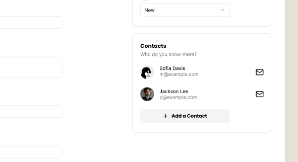

When the user clicks on this button, we want to open a side panel that contains the contact form:

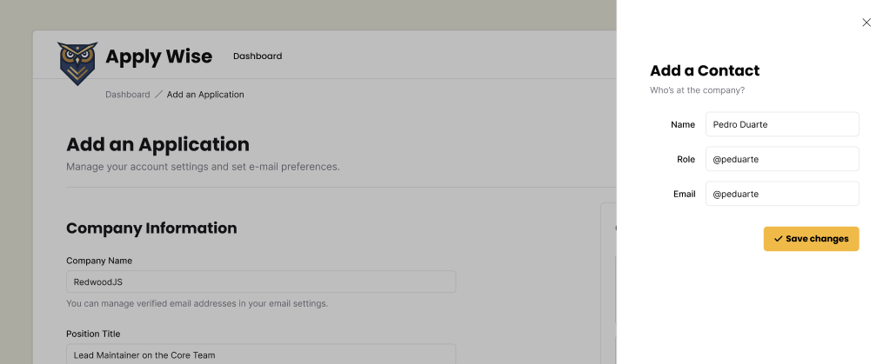

Let's start with the UI and then we can connect it the database.

## Adding a Contact

### Styling the Contact Form

Again, shadcn/ui components are great for this.

This time, we're going to reach for the `Sheet` component.

You can copy the boilerplate code from the [shadcn/ui docs](https://ui.shadcn.com/docs/components/sheet) and paste it at the top of our `ApplicationForm` component:

```tsx title="/src/app/components/ApplicationForm.tsx"
"use client";

import {
  Sheet,
  SheetContent,
  SheetDescription,
  SheetHeader,
  SheetTitle,
  SheetTrigger,
} from "@/app/components/ui/sheet"
```

<Aside type="tip" title="Sheet component">
If you copied and pasted the code directly from the shadcn/ui docs, you'll need to adjust the import path to include the `app` directory.

```tsx title="/src/app/components/ApplicationForm.tsx" startLineNumber={10} "/app"
} from "@/app/components/ui/sheet"
```

If you copied and pasted the code I provided, it's already correct. 😉
</Aside>

Then, for our side bar:

```tsx showLineNumbers=false
<Sheet>
  <SheetTrigger>Open</SheetTrigger>
  <SheetContent>
    <SheetHeader>
      <SheetTitle>Are you absolutely sure?</SheetTitle>
      <SheetDescription>
        This action cannot be undone. This will permanently delete your account
        and remove your data from our servers.
      </SheetDescription>
    </SheetHeader>
  </SheetContent>
</Sheet>
```

This code will go below our `<div>Contact Card</div>` placeholder:

```tsx title="/src/app/components/ApplicationForm.tsx" startLineNumber={106}
<div className="box">
  <h3>Contacts</h3>
  <p className="input-description">Invite your team members to collaborate.</p>
  <div>
    Contact Card
  </div>
  <Sheet>
    <SheetTrigger>Open</SheetTrigger>
    <SheetContent>
      <SheetHeader>
        <SheetTitle>Are you absolutely sure?</SheetTitle>
        <SheetDescription>
          This action cannot be undone. This will permanently delete your account
          and remove your data from our servers.
        </SheetDescription>
      </SheetHeader>
    </SheetContent>
  </Sheet>
</div>
```

If you take a look at this within the browser, you should see the "Open" trigger:

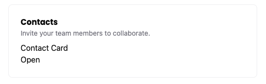

If you click on the trigger, the sheet should slide open:

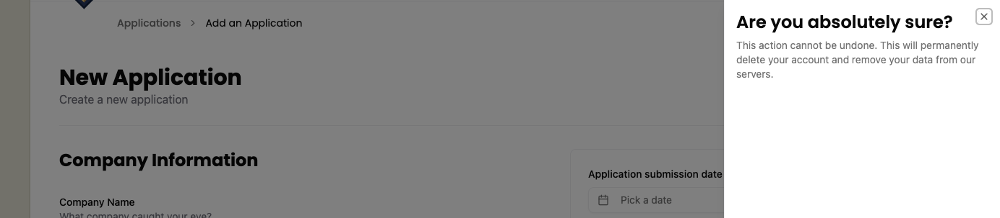

Now, let's replace the placeholder content with the real stuff.

You may have noticed that the Sheet code contains, a trigger, `SheetTrigger` and `SheetContent`. Inside, the content, there's a `SheetHeader` with a `SheetTitle` and `SheetDescription`.

First, let's adjust the `SheetTrigger`:

```tsx title="/src/app/components/ApplicationForm.tsx" startLineNumber={107}
<SheetTrigger className="flex items-center gap-2 font-poppins text-sm font-bold bg-secondary py-3 px-6 rounded-md cursor-pointer">
  <Icon id="plus" size={16} />Add a Contact
</SheetTrigger>
---
- I added an `Icon` component and gave it an `id` of `plus` and a size of `16`.
- I changed the text to `Add a Contact`.
- We can add some styling to the `SheetTrigger` to make it look like a button.
  - `flex items-center gap-2` will align the icon and text next to each other, putting `8px` of space between them.
  - `font-display font-bold text-sm` will use the font-family `Poppins`, make it bold, and set the font size to `14px`.
  - `bg-secondary` will make the background a beige color (defined in our `@theme`)
  - `py-3 px-6` will add `12px` of padding to the top and bottom, and `24px` of padding to the left and right.
  - `rounded-md` will round the corners of the button.
  - `cursor-pointer` will change the cursor to a pointer when hovering over the button.
---
```

You'll also need to import the `Icon` component at the top of our file:

```tsx title="/src/app/components/ApplicationForm.tsx" showLineNumbers=false
import { Icon } from "./Icon";
```

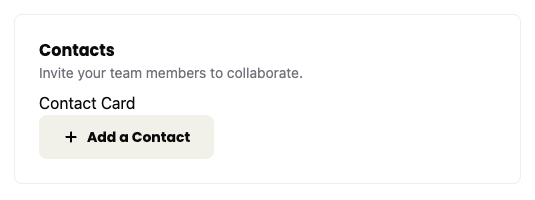

Much better! Then, for our `SheetContent`:

```tsx title="/src/app/components/ApplicationForm.tsx" startLineNumber={110}
<SheetContent className="pt-[100px] px-12">
  <SheetHeader>
    <SheetTitle>Add a Contact</SheetTitle>
    <SheetDescription>
      Add a Contact to this application.
    </SheetDescription>
    <ContactForm />
  </SheetHeader>
</SheetContent>
---
- Change the `SheetTitle` to `Add a Contact`.
- Change the `SheetDescription` to `Add a Contact to this application.`
- For the form, I'm referencing the `ContactForm` component. (We'll need to create this.)
- I added some styling to the `SheetContent` to our content some additional space. `100px` of padding to the top and `48px` of padding to the left and right.
---
```

Now, let's create our `ContactForm` component. Inside our `src/app/components` directory, create a new file called `ContactForm.tsx`.

<FileTree>
- src/
  - app/
    - components/
      - ContactForm.tsx
</FileTree>

Then, be sure to import the `ContactForm` component at the top of our `ApplicationForm` component:

```tsx title="/src/app/components/ApplicationForm.tsx" startLineNumber={10}
import { ContactForm } from "./ContactForm";
```

<Aside type="tip" title="Linting Error">
Chances are, you probably have a linting error on your `ContactForm` component.

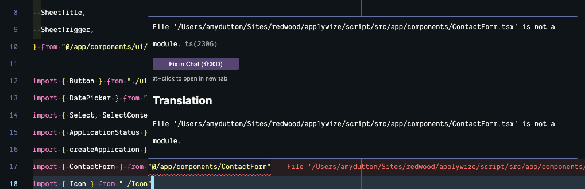

This is because our `ContactForm.tsx` file is empty and we're not exporting a `ContactForm` component yet.
</Aside>

Inside our `ContactForm.tsx` file, let's start with a basic component (you should also see your linting error go away):

```tsx title="/src/app/components/ContactForm.tsx"
const ContactForm = () => {
  return (
    <div>ContactForm</div>
  )
}

export { ContactForm }
```

Now let's replace our `<div>` with our form. It should contain fields for:

- first name
- last name
- role
- email

```tsx title="/src/app/components/ContactForm.tsx" startLineNumber={5}
return (
  <form>
    <div className="field">
      <label htmlFor="firstName">First Name</label>
      <input type="text" id="firstName" name="firstName" required />
    </div>
    <div className="field">
      <label htmlFor="lastName">Last Name</label>
      <input type="text" id="lastName" name="lastName" required />
    </div>
    <div className="field">
      <label htmlFor="role">Role</label>
      <input type="text" id="role" name="role" required />
    </div>
    <div className="field">
      <label htmlFor="email">Email</label>
      <input type="email" id="email" name="email" required />
    </div>
    <div className="field">
      <Button>
        <Icon id="check" size={24} />
        Create a Contact
      </Button>
    </div>
  </form>
)
---
- This form should be pretty straightforward. It's mostly vanilla HTML. I wrapped each `label` and `input` pairing with a `div` that has a class of `field`. Conveniently, we've already defined these styles within our `styles.css` file.
- At the bottom of the form, I'm using a shadcn/ui `Button` component, similar to what we've done before. I have a check `Icon` inside with the text "Create a Contact".
- I've also made every field required, using the HTML `required` attribute.
---
```

At the top of our file, we need to import our `Button` and `Icon` components:

```tsx title="/src/app/components/ContactForm.tsx" startLineNumber={1}
import { Icon } from "./Icon"
import { Button } from "./ui/button"
```

Now, let's test this out, again, within the browser. When you click on the "Add a Contact" button, you should see the styled form slide in:

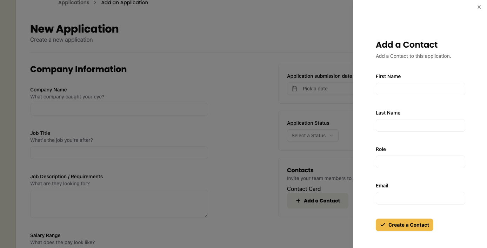

Great! Now, let's hotwire this together. We'll follow a similar approach to what we did with the Job Application form.

### Adding a Contact to the Database

On the `ContactForm` component, let's set an `action` on the `form` element:

```tsx title="/src/app/components/ContactForm.tsx" startLineNumber={6} "action={handleSubmit}"
<form action={handleSubmit}>
```

Now, we need to write the `handleSubmit` function. We can add this code right above our `return` statement:

```tsx title="/src/app/components/ContactForm.tsx" startLineNumber={5}
const handleSubmit = async (formData: FormData) => {
  const result = await createContact(formData);
  if (result.success) {
    console.log("Contact created successfully");
  } else {
    console.error("Error creating contact");
  }
}
---
- This function will take our form data and pass it to the `createContact` function.
- The `createContact` function is a server action (we still need to write this). Since it's a server action, we can use `async` and `await` to wait for the result.
- If the result is successful, we'll log a message to the console.
- If the result is not successful, we'll log an error to the console.
---
```

Now, inside our `src/app/pages/applications/functions.ts` file, let's create a new function at the very bottom of our file:

```tsx title="/src/app/pages/applications/functions.ts" startLineNumber={56}
export const createContact = async (formData: FormData) => {
  try {
    await db.contact.create({
      data: {
        firstName: formData.get("firstName") as string,
        lastName: formData.get("lastName") as string,
        email: formData.get("email") as string,
        role: formData.get("role") as string,
      },
    })
    return { success: true, error: null }
  } catch (error) {
    console.error(error)
    return { success: false, error: error as Error }
  }
}
---
- We're exporting our `createContact` function so we can import it into our `ContactForm` component.
- The function takes a single argument, `formData`.
- Inside, we have a `try` / `catch` block. With the `try` block, we make a call to our database and `await` the result.
  - We're already importing our `db` at the top of our file.
  - Since we're working with the `Contact` table, we can reference it with `db.contact`. Then, we can invoke the `create` method and pass it an object with all of our form data.
- Assuming, we were successful, we return an object with `success` set to `true` and `error` set to `null`.
- If there's an error, we log it to the console and return an object with `success` set to `false` and the error.
---
```

Let's go back to our `ContactForm` component and import the `createContact` function at the top of our file:

```tsx title="/src/app/components/ContactForm.tsx" startLineNumber={3}
import { createContact } from "../pages/applications/functions";
```

Let's test it out! But, before you do, open up your developer tools and go to the console tab. If everything goes through successfully, you should see a success message in the console:

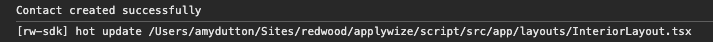

You can also check Prisma Studio (`npx prisma studio`) to see the new contact in the database:

<figure>
  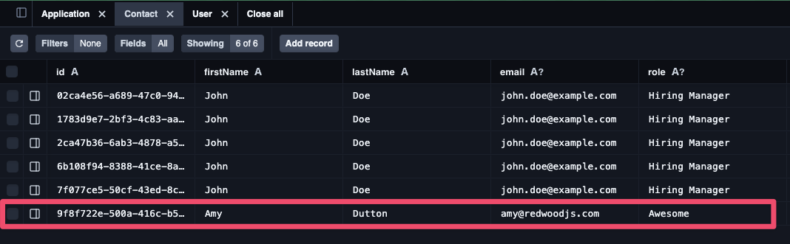
  <figcaption>
    All the **John Doe** entries are from when we hardcoded the data in.
  </figcaption>
</figure>

This _works_, kind of. -- It works, but it's not the best user experience. It would be better if we could see a success (or error) message in browser.

Fortunate for us, [shadcn/ui has a toast component](https://ui.shadcn.com/docs/components/sonner) that we can use. This component works a little differently than the other components we've used. It has two parts — a `Toaster` and the `Toast`:

- The `Toaster` handles where the message is displayed. We can also cue up or show several messages at once. So, the `Toaster` "holds" the `Toast`.
- The `Toaster` typically lives in a layout component.
- Then, child components can send `Toast` messages.

This might make more sense as we build it out.

Within our `InteriorLayout` component, let's add the `Toaster` component:

```tsx title="/src/app/components/InteriorLayout.tsx" {2, 10}
import { Header } from "../components/Header"
import { Toaster } from "@/app/components/ui/sonner"

const InteriorLayout = ({ children }: { children: React.ReactNode}) => {
  return (
    <div className="page-wrapper">
      <main className="page bg-white">
        <Header />
        {children}
        <Toaster position="top-right" richColors />
      </main>
    </div>
  )
}

export { InteriorLayout }
```

- We've imported our Toaster component at the top of our file (notice the import path is `@/app/components/ui/sonner`, this is slightly different than the official shadcn/ui documentation)
- Then, we added the `Toaster` component below the `{children}`
- I positioned the `Toaster` to the top right of the screen using the `position` prop and applied `richColors`

Even though we already added the `sonner.tsx` file through the shadcn/ui CLI, we need to make sure that our project knows it's a client component. At the top of `sonner.tsx`, let's add the `use client` directive:

```tsx title="/src/app/components/ui/sonner.tsx" startLineNumber={1}
"use client"
```

Now, on our `ContactForm` component, let's import our `toast` at the top of our file:

```tsx title="/src/app/components/ContactForm.tsx" startLineNumber={3}
import { toast } from "sonner"
```

Then, we can update our conditional statement, inside our `handleSubmit` function:

```tsx title="/src/app/components/ContactForm.tsx" startLineNumber={11}
if (result.success) {
  toast.success("Contact created successfully")
} else {
  toast.error("Error creating contact")
}
```

If you test te form again, within the browser, you should see a successful toast message in top right of the screen.

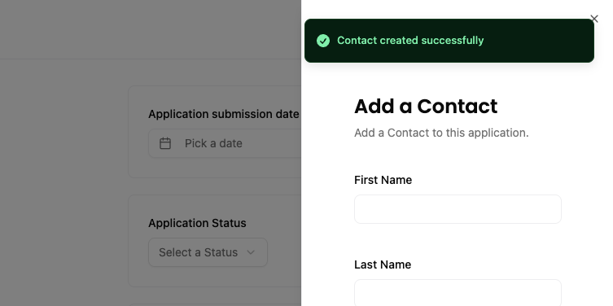

Sweet! Now, we could leave our "Create Contact" form the way it is:

1. Click "Add a Contact" button. It triggers the `Sheet` component, with our `ContactForm` nested inside.
2. Fill out the form and click "Create a Contact".
3. A success message is shown in the browser.
4. Our `Sheet` component stays open and you can keep adding as many contacts as you'd like.
5. When you've finished adding contacts, you can close the `Sheet` component by clicking the "X" in the top right corner.

_OR_ we could close the `Sheet` component after the form is submitted.

Let's do that.

### Enhancing the User Experience

At first glance, this might seem a little tricky because it doesn't look like this functionality exists. But, if you click on the "Docs" or "API" button at the top of the [`Sheet` documentation](https://ui.shadcn.com/docs/components/sheet):

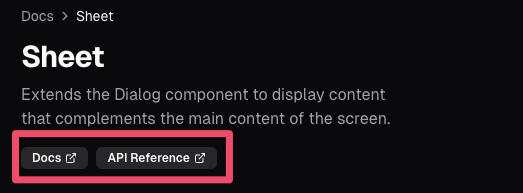

You'll notice that this component is built on top of the Radix UI [`Dialog` component](https://www.radix-ui.com/primitives/docs/components/dialog#api-reference). There's a prop called `open` and `onOpenChange` that we can leverage.

First, at the top of our `ApplicationsForm` component, let's add a piece of state that keeps track of whether the `Sheet` is open or not:

```tsx title="/src/app/components/ApplicationForm.tsx" startLineNumber={26}
const [isContactSheetOpen, setIsContactSheetOpen] = useState(false);
```

Then, be sure to import `useState` at the top of our file:

```tsx title="/src/app/components/ApplicationForm.tsx" showLineNumbers=false
import { useState } from "react"
```

Now, scroll down to the bottom of the `ApplicationForm` component, to our `Sheet` component:

```tsx title="/src/app/components/ApplicationForm.tsx" startLineNumber={117} {1, 11} "open={isContactSheetOpen}" "onOpenChange={setIsContactSheetOpen}" "callback={() => setIsContactSheetOpen(false)}"
<Sheet open={isContactSheetOpen} onOpenChange={setIsContactSheetOpen}>
  <SheetTrigger className="flex items-center gap-2 font-display text-sm font-bold bg-secondary py-3 px-6 rounded-md cursor-pointer">
    <Icon id="plus" size={16} />Add a Contact
  </SheetTrigger>
  <SheetContent className="pt-[100px] px-12">
    <SheetHeader>
      <SheetTitle>Add a Contact</SheetTitle>
      <SheetDescription>
        Add a Contact to this application.
      </SheetDescription>
      <ContactForm callback={() => setIsContactSheetOpen(false)} />
    </SheetHeader>
  </SheetContent>
</Sheet>
---
- We'll set `open` to `isContactSheetOpen`. -- This is the piece of state that keeps track of whether the `Sheet` is open or not.
- We'll set `onOpenChange` to `setIsContactSheetOpen`. -- This updates our state when the `Sheet` is opened or closed.
- Then, on our `ContactForm`, we'll pass in a callback function. This function will set our state to `false`, closing the `Sheet`.
---
```

Now, head over to our `ContactForm` component and update the `handleSubmit` function.

```tsx title="/src/app/components/ContactForm.tsx" showLineNumbers=false {"1. Updated the props we're passing in.": 1} {"2. If we're successful, we'll call the callback function.": 8} {2,9}
.
const ContactForm = ({ callback }: { callback: () => void }) => {

  const handleSubmit = async (formData: FormData) => {
    const result = await createContact(formData);
    if (result.success) {
      toast.success("Contact created successfully");

      callback();
    } else {
      toast.error("Error creating contact");
    }
  }
```

If you test everything in the browser, you should still see the successful toast message and the `Sheet` will close. 😎

Now, we need a way to see the contacts we've added.

## Displaying Contacts

If we look at the design within Figma, we have a list of all the contacts, associated with the job application:


First things first, we need to get a list of all our contacts from the database. We don't want _ALL_ the contacts, we only want the ones associated with this job application. We haven't submitted the form yet and any contacts we've created so far, aren't associated with a company. Meaning, we can use the following flow:

1. Grab any contacts that aren't associated with a company.
2. When we submit the form, we'll associate the contact with the company and the job application.

This does create an interesting loop hole. If:

1. The user creates some new contacts
2. The user doesn't submit the form and navigates away from the page
3. The user comes back to the page, those contacts are still there.

That should be OK, as long as we have a way to remove any contacts in the list. _But_, we need make sure they're only seeing contacts they've added.

Let's start by displaying all contacts that aren't associated with a company.

### Getting the Contacts from the Database

Even though our contacts will be displayed in the `ApplicationForm` component, the `ApplicationForm` is a client component. It'd be better if we could grab the data inside a server component and then pass it in. (You'll remember, we did the same thing with our application statuses).

Inside our `New` page, let's get all of our contacts, where the `companyId` is `null`:

```tsx title="/src/app/pages/applications/New.tsx" {4-8} startLineNumber={13}
const New = async () => {
  const statuses = await db.applicationStatus.findMany()

  const contacts = await db.contact.findMany({
    where: {
      companyId: null
    }
  })

  return (
```

Now, we can pass this data into our `ApplicationForm` component:

```tsx title="/src/app/pages/applications/New.tsx" startLineNumber={35} "contacts={contacts}"
<ApplicationsForm statuses={statuses} contacts={contacts} />
```

Inside our `ApplicationForm` component, let's add `contacts` to our list of props:

```tsx title="/src/app/components/ApplicationForm.tsx" "contacts" "contacts: Contact[]" startLineNumber={20}
const ApplicationsForm = ({ statuses, contacts }:
  { statuses: ApplicationStatus[], contacts: Contact[] }) => {
```

We also need to import the `Contact` type at the top of our file from `@prisma/client`. We're already importing `ApplicationStatus` from `@prisma/client`, so simply need to add it our list:

```tsx title="/src/app/components/ApplicationForm.tsx" "Contact" startLineNumber={15}
import { ApplicationStatus, Contact } from "@prisma/client"
```

Scroll down to our `<div>Contact Card</div>` placeholder and replace it with a `ul` element:

```tsx title="/src/app/components/ApplicationForm.tsx" startLineNumber={106} {"1. Check to see if any contacts exist.": 1} {"2. Map over the contacts and display them in a list.": 4} {"3. Temporarily display all the contact details": 6} {2, 5, 7-9}
.
{contacts && (
  <ul>

    {contacts.map((contact) => (

      <li key={contact.id}>
        {contact.firstName} {contact.lastName}
      </li>
    ))}
  </ul>
)}
```

If you take a look at this within the browser, you'll see our contact list:

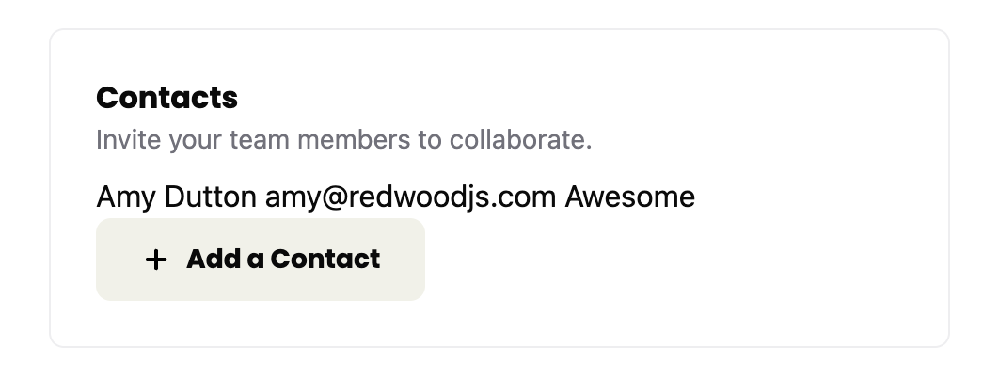

Let's style our contact card.

### Styling the Contact Card

Within the `src/app/components` directory, create a new file called `ContactCard.tsx`.

Inside our file, let's start with a basic component structure:

```tsx title="/src/app/components/ContactCard.tsx"
const ContactCard = () => {
  return (
    <div>ContactCard</div>
  )
}

export { ContactCard }
```

We want to the contact object in as a prop:

```tsx title="/src/app/components/ContactCard.tsx"
import { Contact } from "@prisma/client"

const ContactCard = ({ contact }: { contact: Contact }) => {
```

Then, inside the `return` statement:

```tsx title="/src/app/components/ContactCard.tsx" startLineNumber={4}
return (
  <div>
    <div>
      <Avatar>
        <AvatarFallback>
          {contact.firstName.charAt(0)}
        </AvatarFallback>
      </Avatar>
    </div>
    <div>
      <p>{contact.firstName} {contact.lastName}</p>
      <p>{contact.role}</p>
    </div>
    <div>
      <a href={`mailto:${contact.email}`}><Icon id="email" size={24} /></a>
    </div>
  </div>
)
```

Then, at the top the file, import the `Avatar` and `Icon` components:

```tsx title="/src/app/components/ContactCard.tsx" startLineNumber={2}
import { Avatar, AvatarFallback } from "./ui/avatar"
import { Icon } from "./Icon"
```

Let's go back through and add some styles:

```tsx title="/src/app/components/ContactCard.tsx" startLineNumber={6}
return (
  <div className="flex items-center gap-4 mb-6">
    <div>
      <Avatar className="size-10">
        <AvatarFallback>
          {contact.firstName.charAt(0)}
        </AvatarFallback>
      </Avatar>
    </div>
    <div className="flex-1">
      <p className="text-sm font-medium">{contact.firstName} {contact.lastName}</p>
      <p className="text-sm text-zinc-500">{contact.role}</p>
    </div>
    <div>
      <a href={`mailto:${contact.email}`}><Icon id="email" size={24} /></a>
    </div>
  </div>
)
---
- **On line 7**, we added a class of `flex items-center gap-4` to align the avatar, name, and email icon vertically. We also put `16px` of space between each element. Then, we also added `24px` of margin to the bottom of the card.
- **On line 9**, a class of `size-10` makes the avatar `40px` wide and `40px` tall.
- **On line 15**, the `flex-1 class ensure that the name and role take up as much horizontal space as possible.
- **On line 16**, `text-sm font-medium` will make the name `14px` and have a font weight of medium.
- **On line 17**, the text role will be `14px` with `text-sm` and gray with `text-zinc-500`.
---
```

Let's swap out our placeholder content with our component. Inside the `ApplicationsForm`:

```tsx title="/src/app/components/ApplicationForm.tsx" startLineNumber={125}
{contacts.map((contact) => (
  <li key={contact.id}>
    <ContactCard contact={contact} />
  </li>
))}
```

<Aside title="Managing the User ID" type="tip">
If you have several places within your seeds that reference a specific `userId`, you can always save this value in a variable at the top of your file, making it easier to update.

Or, you could even make the `userId` dynamic. At the top of your seed file, you can grab a user from the database and use their ID:

```tsx title="/src/app/seed.ts" startLineNumber={10}
const user = await db.user.findFirst()
if (!user) {
  throw new Error("User not found");
}
```

Now, you can reference `user.id` within your seed file (assuming at least one user exists).
</Aside>

At the top our file:

```tsx title="/src/app/components/ApplicationForm.tsx" startLineNumber={19}
import { ContactCard } from "./ContactCard"
```

If you take a look at this within the browser, you'll see our styled contact list:

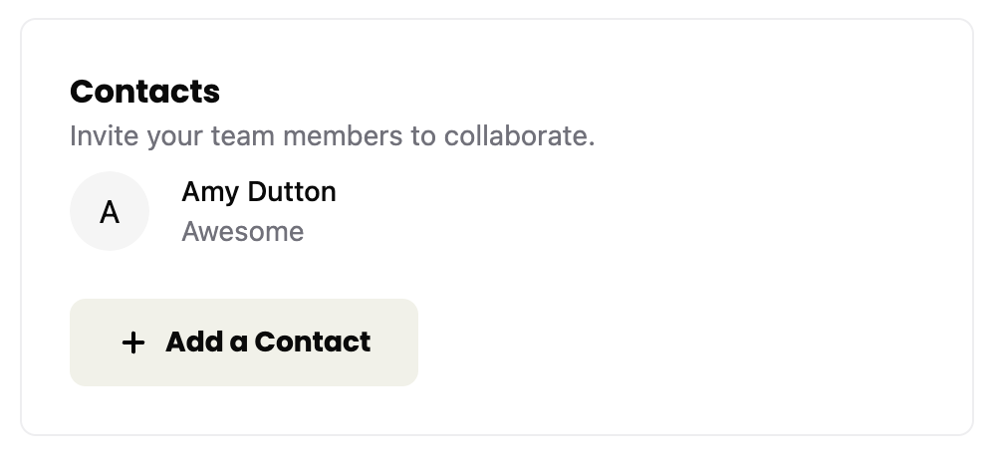

😍 Lovely!

Now, we need to ensure that the user will only see the contacts that they've added.

### Limiting the Contacts to the Current User

First, we'll need to modify our `schema.prisma` file so that we can keep track of who authored the contact.

```prisma title="/prisma/schema.prisma" collapse={2-8, 11-14, 18-20, 22-23}
model Contact {
  id        String   @id @default(uuid()) // Contact ID (UUID-based)
  firstName String
  lastName  String
  email     String?
  role      String?
  companyId String?
  company   Company? @relation(fields: [companyId], references: [id])
  userId    String
  user      User     @relation(fields: [userId], references: [id])
  createdAt DateTime @default(now())
  updatedAt DateTime @updatedAt

  @@index([id])
}
...
model User {
  id           String        @id @default(uuid()) // User ID (UUID-based)
  username     String        @unique
  createdAt    DateTime      @default(now())
  contacts     Contact[]
  applications Application[]
  credentials  Credential[] // Relationship: One user can have many credentials
}
```

On the `Contact` model, we need to add a `userId` column. Then, we need to establish the relationship between the `Contact` and `User` models, saying that the `user` column is a type of `User`. The relationship is connected through the `userId` column on the `Contact` model and references the `id` column on the `User` model.

Then, we need to set up the inverse relationship on the `User` model establishing there are `contacts` with a type `Contact`. Since this is an array, we'll also include square brackets `[]`.

Now, we need to create our migration. Within the terminal:

<PackageManagers frame={false}
  type="run"
  pkg='migrate:new "associate contacts with users"'
/>

When you run this, you'll probably get an error:

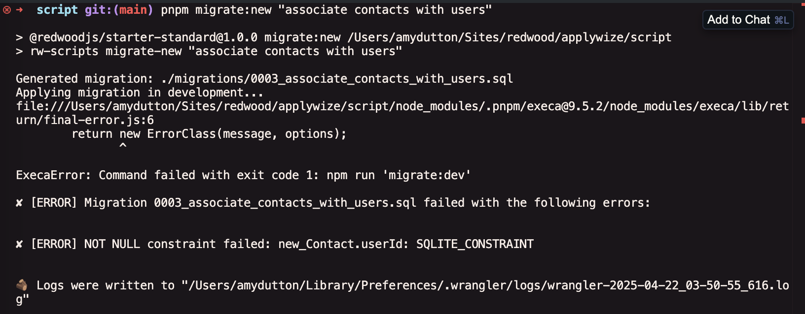

The problem is that we already have contacts in our database. When we added the `userId` column to the `Contact` model, we said that it was a required field. This creates a problem for all existing contact entries that don't have a user associated with them.

If you read the error message, the migration file was created, but not applied.

To fix this, you can try manually removing the existing contacts, or you can run the seed command:

<PackageManagers frame={false}
  type="run"
  pkg='seed'
/>

The seed command will also reset the database because we also clear all the tables at the top of the script:

```ts title="/src/app/seed.ts" startLineNumber={7}
await db.$executeRawUnsafe(`\
  DELETE FROM Application;
  DELETE FROM ApplicationStatus;
  DELETE FROM Contact;
  DELETE FROM Company;
  DELETE FROM Credential;
  DELETE FROM User;
  DELETE FROM sqlite_sequence;
`);
```

Now, try running `migrate:dev`.

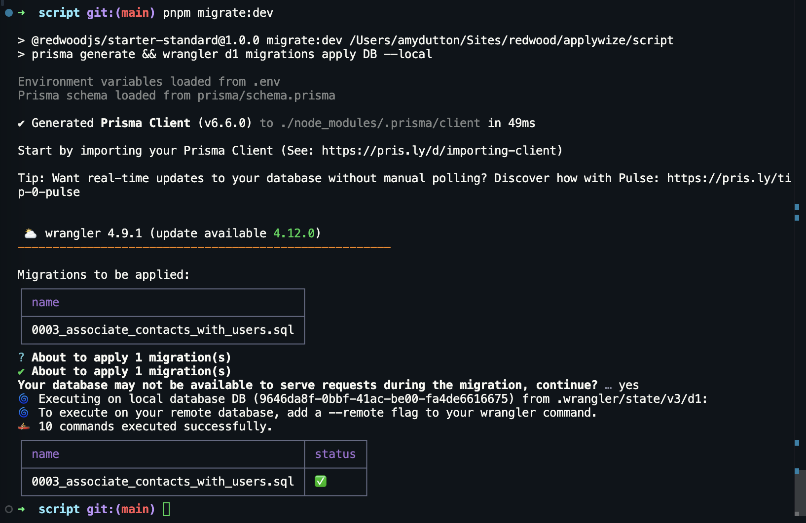

The only downside is you'll need to create a new user account, by visiting http://localhost:5173/user/signup to register.

Then, you can run the application seed command to add a new application, but first, you'll need to update the user ID within the `applicationSeed.ts` file:

```ts title="/src/app/seed/applicationSeed.ts" startLineNumber={10} "c4f35853-8909-4139-98bb-c08663e4230c"
user: {
  connect: {
    id: "c4f35853-8909-4139-98bb-c08663e4230c",
  },
},
```

If you scroll down within the `applicationSeed.ts` file, you'll notice there's an error when creating a contact:

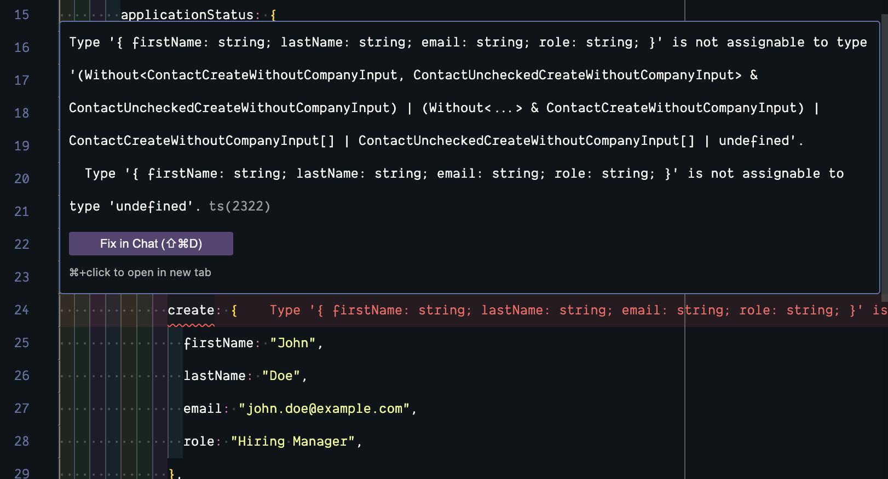

It's looking for the `userId` column. This is a quick fix. We can use `userId` we just updated the application entry with:

```ts title="/src/app/seed/applicationSeed.ts" startLineNumber={23} "userId: "c4f35853-8909-4139-98bb-c08663e4230c""
contacts: {
  create: {
    firstName: "John",
    lastName: "Doe",
    email: "john.doe@example.com",
    role: "Hiring Manager",
    userId: "c4f35853-8909-4139-98bb-c08663e4230c"
  },
},
```

Now, you can run:

<PackageManagers frame={false}
  type="run"
  pkg='seed:applications'
/>

We also need to update our `createContact` function, inside our `functions.ts` file, to include the `userId` column:

```tsx title="/src/app/pages/applications/functions.ts" collapse={11-14} startLineNumber={56} {3, 5-7, 15-18}
export const createContact = async (formData: FormData) => {
  try {
    const { ctx } = requestInfo;

    if (!ctx.user) {
      throw new Error("User not found");
    }

    await db.contact.create({
      data: {
        firstName: formData.get("firstName") as string,
        lastName: formData.get("lastName") as string,
        email: formData.get("email") as string,
        role: formData.get("role") as string,
        user: {
          connect: {
            id: ctx.user?.id || "",
          },
        },
      },
    })
---
- In order to get the current user ID, we can get the `ctx` from the `requestInfo` object (line 58). (We already imported `requestInfo` for the `createApplication` function.)
- **On lines 60-62**, we can check to see if the `ctx.user` exists. If not, we'll throw an error.
- If it does, we can connect the `contact` to the `user` using the `connect` method (lines 70-73)
---
```


Now, we need to update our database query on the `New` page.

```tsx title="/src/app/pages/applications/New.tsx" startLineNumber={5} "{ ctx }: { ctx: AppContext }" "ctx.user?.id" {3,9}
import { RequestInfo } from "rwsdk/worker";

const New = async ({ ctx }: RequestInfo) => {
  const statuses = await db.applicationStatus.findMany()

  const contacts = await db.contact.findMany({
    where: {
      companyId: null,
      userId: ctx.user?.id || ""
    }
  })
---
- On each page, we have access to the `ctx` object. This has a type of `RequestInfo`, defined in `rwsdk/worker`.
- From `ctx`, we can access the `user` object and the user's ID.
- On our database call, we can add another property to our `where` clause, saying that the `userId` should match the logged in user's ID.
---
```

If you try adding contacts using our form, the display will look the same as before. But, you can confirm the new functionality is working by using Prisma Studio to modify a contact's `userId` property. If the `userId` doesn't match the logged in user's ID, the contact will not be displayed.

### Associating the Contact with a Company

Now, when we add a job application, we need to associate the contact with the company. We'll need to adjust our `createApplication` function within the `src/app/pages/applications/functions.ts` file slightly.

First, let's ensure that we're passing our contacts into our `createApplication` function properly.

Within the `ApplicationForm` component, go to the `handleSubmit` function:

```tsx title="/src/app/components/ApplicationForm.tsx" startLineNumber={27} {11}
const ApplicationForm = ({
  statuses,
  contacts,
}: {
  statuses: ApplicationStatus[];
  contacts: Contact[];
}) => {
  const [isContactSheetOpen, setIsContactSheetOpen] = useState(false);

  const handleSubmit = async (formData: FormData) => {
    formData.append("contacts", JSON.stringify(contacts));
    const result = await createApplication(formData);
---
- **On line 21**, we're already passing all of our `contacts` into our `ApplicationForm` component.
- Within our `handleSubmit` function, we can `append` the `contacts` to our `formData`. The only "catch" is that our `contacts` will need to be converted into a JSON string.
---
```

Now, within our `src/app/pages/applications/functions.ts` file, inside our `createApplication` function, we need to parse our `JSON` string:

```tsx title="/src/app/pages/applications/functions.ts" collapse={2-8} startLineNumber={6} {9-11}
export const createApplication = async (formData: FormData) => {
  try {
    const { ctx } = requestInfo;

    if (!ctx.user) {
      throw new Error("User not found");
    }

    const contacts = JSON.parse(
      formData.get("contacts") as string
    ) as Contact[];
---
- We get the `contacts` off the `formData` which is a string: `formData.get("contacts") as string`
- Then, we use `JSON.parse` to convert the string into an array of `Contact` objects.
---
```

Be sure to import the `Contact` type at the top of the file from `@prisma/client`:

```tsx title="/src/app/pages/applications/functions.ts" showLineNumbers=false
import { Contact } from "@prisma/client"
```

Then, when we're creating our company, inside the Prisma `create` method, we can connect our `contacts` to the company:

```diff title="/src/app/pages/applications/functions.ts" startLineNumber={29}
company: {
  create: {
    name: formData.get("company") as string,
    contacts: {
-      create: {
-        firstName: "John",
-        lastName: "Doe",
-        email: "john.doe@example.com",
-        role: "Hiring Manager",
-        userId: ctx.user.id,
-      }
+      connect: contacts,
    },
  },
},
```

Now, when you create a new job application, any contacts you've listed will be associated with the company and job application you created.

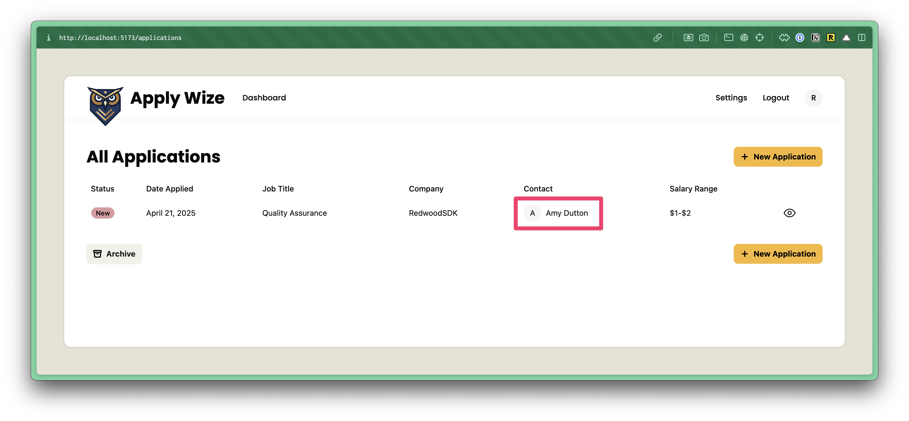

And, if you try to add a New Job Application, the contacts list will be empty:

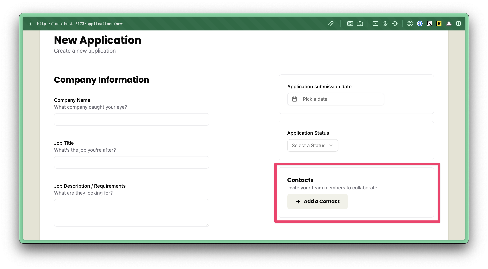

One step remains: removing a contact from the list.

## Removing Contacts

### Styling the Delete Button

First, we need to modify the `ContactCard` component to include a delete button:

```tsx title="/src/app/components/ContactCard.tsx" {3-7} startLineNumber={6}
return (
  <div className="flex items-center gap-4 mb-6">
    <div>
      <button role="button">
        <Icon id="close" size={16} />
      </button>
    </div>
    <div>
      <Avatar className="size-10">
        <AvatarFallback>
          {contact.firstName.charAt(0)}
        </AvatarFallback>
      </Avatar>
    </div>
)
---
- On lines **3-7**, we added an `Icon` component with an `id` of `close` and a size of `16px`. Then, we wrapped the `icon` with a `button` and a `div`.
---
```

Now, we need to add some styles.

```tsx title="/src/app/components/ContactCard.tsx" startLineNumber={6} "relative" "className="absolute top-2 -left-[37px]"" "className="rounded-full bg-destructive p-1""
return (
  <div className="relative flex items-center gap-4 mb-6">
    <div className="absolute top-2 -left-[37px]">
      <button role="button"
        className="rounded-full bg-destructive p-1">
        <Icon id="close" size={16} />
      </button>
    </div>
---
- **On line 8**, I'm using the wrapping `div` to position the `button` absolutely. It will appear `8px` from the top and `-37px` over from the left. In order for it to be positioned, relative to the parent container, we need to set the `div` to `relative` on line 7.
- **On line 9**, I'm using a regular `button` tag, instead of the shadcn/ui `Button` component because this button won't look like any of the other primary action buttons we've created so far.
  - I have a class of `rounded-full` to turn the button into a circle.
  - `bg-destructive` to make the background color red.
  - `p-1` to add `4px` of padding on all sides.
---
```

If you look at this in the browser, you should see our red X next to the contact card:

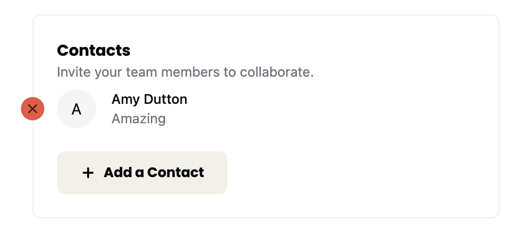

I think it'd look better if we made the X white. One of my favorite ways to do this is to make the svg fill match the current text color. We can do that by adding a class to our `button` of `text-white` and `fill-current`.

```tsx title="/src/app/components/ContactCard.tsx" startLineNumber={9} "text-white fill-current"
<button role="button" className="text-white fill-current rounded-full bg-destructive p-1">
  <Icon id="close" size={16} />
</button>
```

<Aside type="note" title="What if the icon color doesn't change?">
In order for the icon color to change, the SVG can not have a `fill` attribute. If it does, this inline attribute will override any class names we add due to CSS specificity rules.

To resolve this, go to your `other/svg-icons/` folder and find the `close.svg` icon. Look for `fill="black"` and delete it altogether.

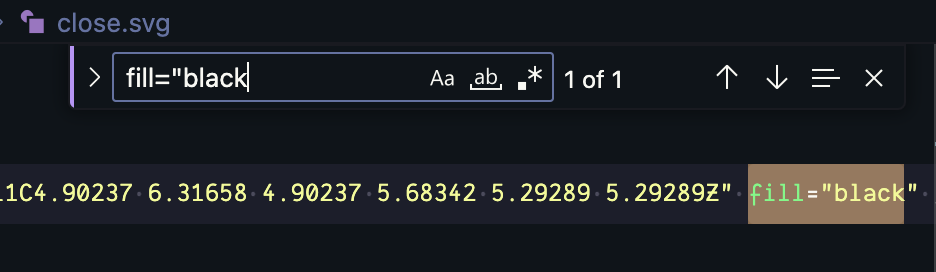

Then, you'll need to re-run the icon script file in order to regenerate the `sprite.svg` with the updated icon:

<PackageManagers frame={false}
  type="exec"
  pkg='icons'
/>

💥
</Aside>

<Aside type="tip" title="SVG fill color">
The Tailwind `fill-current` class, gets rendered as:

```css
fill: currentColor;
```

Generally, I like to apply this style, globally, to all SVGs. Within my `styles.css` file:

```css
svg {
  fill: currentColor;
}
```

or

```css
svg {
  @apply fill-current;
}
```

However, we're _NOT_ doing that this in project because the shadcn/ui components are using the [Lucide React icon set](https://lucide.dev/guide/packages/lucide-react) and some of the icons are using strokes instead of fills. Meaning, when `fill-current` is applied, this


becomes this:

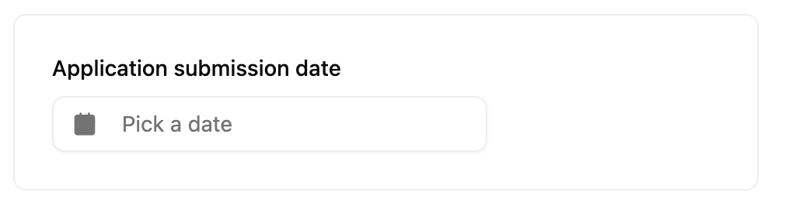


</Aside>

Let's also change the hover color so that the user has some visual feedback when rolling over the button. We can change the background to black and ensure the cursor is a pointer:

```tsx title="/src/app/components/ContactCard.tsx" startLineNumber={9} "hover:bg-black cursor-pointer"
<button role="button" className="hover:bg-black cursor-pointer text-white fill-current rounded-full bg-destructive p-1">
  <Icon id="close" size={16} />
</button>
```

I don't want a bunch of red circles lined up. If you have a bunch of contact cards, these will be eye catching and distracting from the main form. Let's make it so that the button only appears when hovering over each respective contact card.

To do this, we'll need to add a `group` to the `ContactCard` component.

```tsx title="/src/app/components/ContactCard.tsx" startLineNumber={7} "group/card"
<div className="relative group/card flex items-center gap-4 mb-6">
```

On the `div` wrapping the button:

```tsx title="/src/app/components/ContactCard.tsx" startLineNumber={8} "hidden group-hover/card:block"
<div className="hidden group-hover/card:block absolute top-1 -left-[37px]">
  <button
    role="button"
    className="hover:bg-black cursor-pointer text-white fill-current rounded-full bg-destructive p-1">
    <Icon id="close" size={16} />
  </button>
</div>
---
- We can set the `div` to `hidden` by default. But, when the user hovers over the `group/card` it applies a display of `block` with `group-hover/card:block`
---
```

Now, if you test this in the browser, you might feel like you're chasing the button. There's a gap between the where the `div` ends and the `button` begins. We can resolve this by adding some additional padding to the `div` wrapping the `button`:

```tsx title="/src/app/components/ContactCard.tsx" startLineNumber={8} "pr-5"
<div className="pr-5 hidden group-hover/card:block pr-10 absolute top-1 -left-[37px]">
  <button
    role="button"
    className="hover:bg-black cursor-pointer text-white fill-current rounded-full bg-destructive p-1">
    <Icon id="close" size={16} />
  </button>
</div>
```

Perfect! With the styling applied, let's give this button the functionality it needs.

### Adding the Delete Functionality

On the `button`, let's add an `onClick` handler:

```tsx title="/src/app/components/ContactCard.tsx" startLineNumber={9} "onClick={handleDelete}"
<button
    onClick={handleDelete}
    role="button"
    className="hover:bg-black cursor-pointer text-white fill-current rounded-full bg-destructive p-1">
  <Icon id="close" size={16} />
</button>
```

Now that we've introduced interactivity, this component needs to be a client component. At the top of the file, let's add:

```tsx title="/src/app/components/ContactCard.tsx"
"use client"
```

Now, let's create the `handleDelete` function that we referenced in the `onClick` handler. Right above our `return` statement:

```tsx title="/src/app/components/ContactCard.tsx" startLineNumber={8}
const handleDelete = async () => {
  const result = await deleteContact(contact.id);
  if (result.error) {
    toast.error("Yikes! Couldn't delete.");
  } else {
    toast.success("Contact deleted");
  }
}
---
- Since we're calling a server function, we can use `async` and `await` to wait for the `deleteContact` function to complete (we still need to write this function).
- We'll pass over the contact's id, so that we know which contact to delete.
- We can store the result in a variable called `result`.
- If there's an error, we'll display a toast error.
- If it works, we'll display a toast success message.
---
```

Now, we need to import `toast` and `deleteContact` at the top of our file:

```tsx title="/src/app/components/ContactCard.tsx" startLineNumber={6}
import { toast } from "sonner"
import { deleteContact } from "../pages/applications/functions"
```

Now, let's head over to our `functions.ts` file and create the `deleteContact` function.

```tsx title="/src/app/pages/applications/functions.ts" startLineNumber={82}
export const deleteContact = async (contactId: string) => {
  try {
    await db.contact.delete({
      where: {
        id: contactId,
      },
    })
    return { success: true, error: null }
  } catch (error) {
    console.error(error)
    return { success: false, error: error as Error }
  }
}
---
Hopefully, this workflow is starting to feel familiar.
- **On line 82**, we're accepting the `contactId`, which is a string.
- We have a `try` / `catch` block where we try to delete our contact. If it runs into any problems, it will catch our error (on line 90), console the error, and return `success` as `false` and the error itself.
- **On lines 84-88**, we're using the Prisma API to delete the contact, where the `id` is equal to the `contactId` that we passed in.
---
```

Now, if you try running this in the browser, you'll probably run into an error:

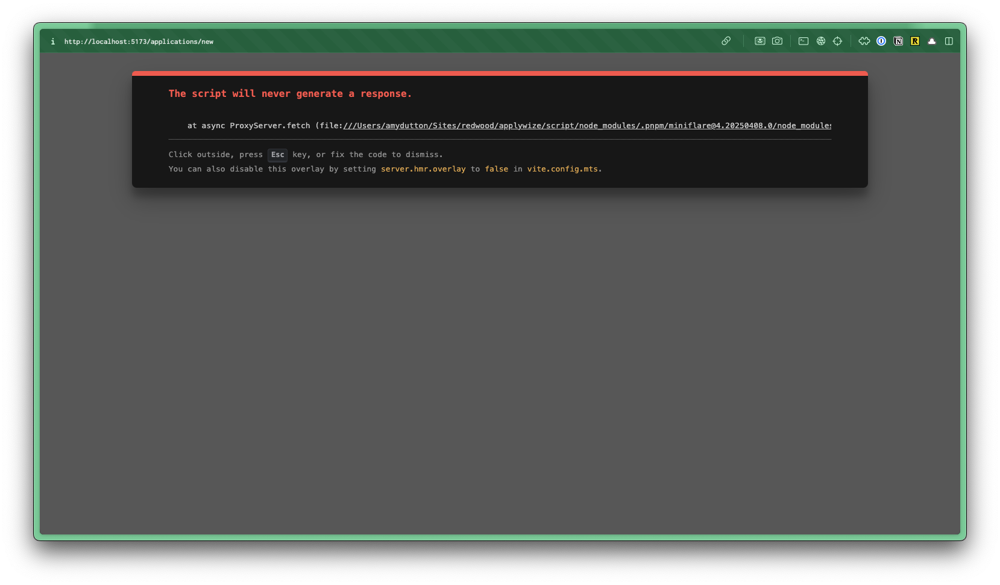

This is because when the use clicks on the button, the page tries to submit the form. To prevent the default browser behavior, we can update the `onClick` handler to capture the event:

```tsx title="/src/app/components/ContactCard.tsx" startLineNumber={22} "onClick={(e) => handleDelete(e)}" {2}
<button
  onClick={(e) => handleDelete(e)}
  role="button"
  className="hover:bg-black cursor-pointer text-white fill-current rounded-full bg-destructive p-1"
>
  <Icon id="close" size={16} />
</button>
```

Now, let's update the `handleDelete` function to accept the event and prevent the form from submitting:

```tsx title="/src/app/components/ContactCard.tsx" startLineNumber={10} "e: React.MouseEvent<HTMLButtonElement>" "e.preventDefault();" {2}
const handleDelete = async (e: React.MouseEvent<HTMLButtonElement>) => {
    e.preventDefault();
```

<Aside type="note" title="Event Handlers">
When you're working with events (including `onClick`, `onKeyDown`, `onMouseEnter`, etc.), React automatically passes an event object to the handler function. You can name this parameter anything (`event` or `e` are common choices).

`e.preventDefault()` prevents the default browser behavior from happening. In this case, it prevents the form from being submitted.
</Aside>

Now, try running this in the browser again. You should see the contact deleted and a successful toast message:

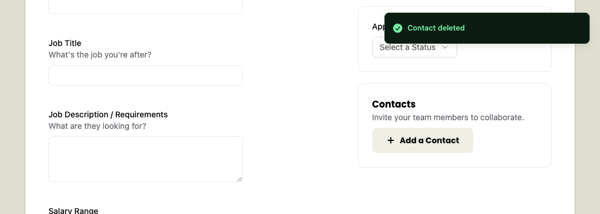

Lovely!

<Aside type="tip" title="Code on GitHub">
You can find the final code for this step on [GitHub](https://github.com/ahaywood/applywize/tree/main/end-of-7).
</Aside>

