import { Aside, FileTree } from '@astrojs/starlight/components';

Can you believe it?! This is the last piece we need before deploying our application.

We've already done the bulk of our set up, so this part should be easy...er? 🙃

First, let's take a look at [what we're building in Figma](https://www.figma.com/design/nqBPIIfe0MO4W8zOfW4oae/RedwoodSDK---Applywize?node-id=12-327&t=OsDs4uB62Y6faUen-1).

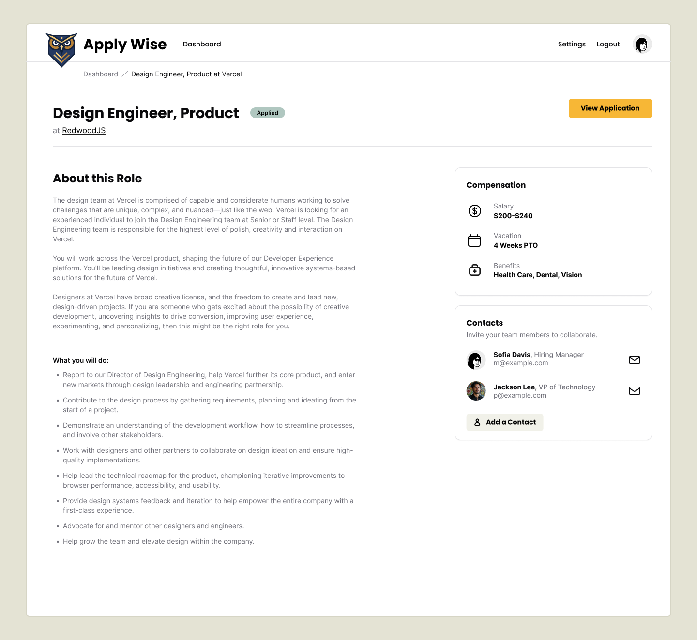

Pretty simple, right?

## Styling the Jobs Details Page

Let's start by creating a new file in our `src/app/pages/applications` folder called `Details.tsx`.

<FileTree>
- src
  - app
    - pages
      - applications
        - functions.ts
        - Details.tsx
        - List.tsx
        - New.tsx
</FileTree>

We can start with the basics:

```tsx title="/src/app/pages/applications/Details.tsx"
const Details = () => {
  return (
    <div>Details</div>
  )
}

export { Details }
```

Now, let's jump over to our `worker.tsx` file and update the route for our details page.

```diff title="/src/worker.tsx" collapse={4-7} showLineNumbers=false
+ import { Details } from "./app/pages/applications/Details";

render(Document, [
  index([ isAuthenticated, Home ]),
  prefix("/user", userRoutes),
  route("/legal/privacy", () => <h1>Privacy Policy</h1>),
  route("/legal/terms", () => <h1>Terms of Service</h1>),
  prefix("/applications", [
    route("/", [isAuthenticated, List]),
    route("/new", [isAuthenticated, New]),
-    route("/:id", [isAuthenticated, () => <h1>Application</h1>]),
+    route("/:id", [isAuthenticated, Details]),
  ]),
]),
---
We replaced our placeholder `h1` with our `Details` component and imported it at the top of our file.
---
```

If run go to our Applications list view and click on the eye icon, next to any application, it should take us to the detail page:

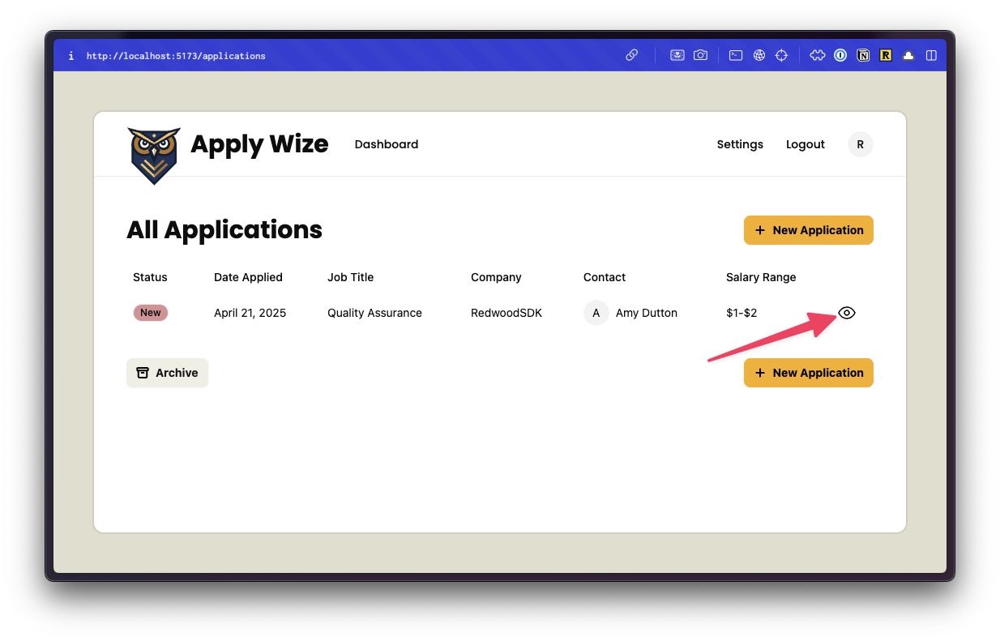

Right now, it's pretty sparse:

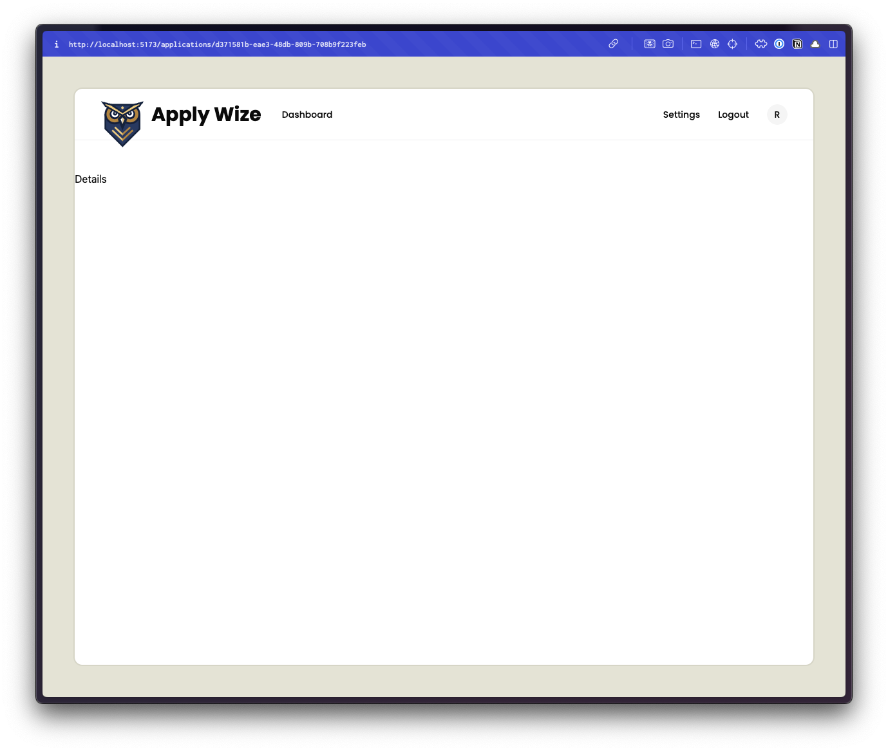

Let's go back to our `Details.tsx` file and add our `InteriorLayout`.

```tsx title="/src/app/pages/applications/Details.tsx"
return (
  <InteriorLayout>
    <p>Details</p>
  </InteriorLayout>
)
```

Be sure to import `InteriorLayout` at the top of our file:

```tsx title="/src/app/pages/applications/Details.tsx"
import { InteriorLayout } from "@/app/layouts/InteriorLayout"
```

Already, that makes a huge difference:

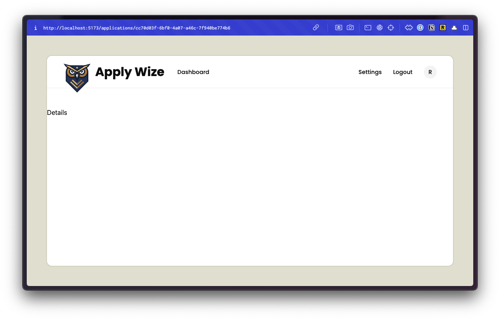

Let's start at the top of our page and work our way down. Up first, we'll add our breadcrumbs. We already used the shadcn/ui Breadcrumb component on the New page. Let's take a second and look at the implementation there:

```tsx title="/src/app/pages/applications/New.tsx" startLineNumber={26}
<div className="mb-12 -mt-7 pl-[120px]">
  <Breadcrumb>
    <BreadcrumbList>
      <BreadcrumbItem>
        <BreadcrumbLink href="/applications">Applications</BreadcrumbLink>
      </BreadcrumbItem>
      <BreadcrumbSeparator />
      <BreadcrumbItem>
        <BreadcrumbPage>Add an Application</BreadcrumbPage>
      </BreadcrumbItem>
    </BreadcrumbList>
  </Breadcrumb>
</div>
```

It's pretty standard, but we have a wrapping `div` with styles applied for placement. Let's abstract that out into a CSS class so that we can use it on both pages. In our `styles.css` file, at the bottom of the `@layer components` section:

```css title="/src/styles.css" startLineNumber={236}
.breadcrumbs {
  @apply mb-12 -mt-7 pl-[120px];
}
```

Now, let's update the styles on the New page:

```tsx title="/src/app/pages/applications/New.tsx" startLineNumber={19} "breadcrumbs
<div className="breadcrumbs">
  <Breadcrumb>
    <BreadcrumbList>
      <BreadcrumbItem>
        <BreadcrumbLink href="/applications">Applications</BreadcrumbLink>
      </BreadcrumbItem>
      <BreadcrumbSeparator />
      <BreadcrumbItem>
        <BreadcrumbPage>Add an Application</BreadcrumbPage>
      </BreadcrumbItem>
    </BreadcrumbList>
  </Breadcrumb>
</div>
```

Then, let's copy this code and past it into our `Details.tsx` file:

```tsx title="/src/app/pages/applications/Details.tsx" startLineNumber={5}
return (
  <InteriorLayout>
    <div className="breadcrumbs">
      <Breadcrumb>
        <BreadcrumbList>
          <BreadcrumbItem>
            <BreadcrumbLink href="/applications">Applications</BreadcrumbLink>
          </BreadcrumbItem>
          <BreadcrumbSeparator />
          <BreadcrumbItem>
            <BreadcrumbPage>Add an Application</BreadcrumbPage>
          </BreadcrumbItem>
        </BreadcrumbList>
      </Breadcrumb>
    </div>
    <p>Details</p>
  </InteriorLayout>
)
```

Make sure you import the `Breadcrumb` component at the top of your file:

```tsx title="/src/app/pages/applications/Details.tsx"
import {
  Breadcrumb,
  BreadcrumbItem,
  BreadcrumbLink,
  BreadcrumbList,
  BreadcrumbPage,
  BreadcrumbSeparator,
} from "@/app/components/ui/breadcrumb";
```

We need to update the breadcrumb links. The first link is for our Dashboard:

```tsx title="/src/app/pages/applications/Details.tsx" startLineNumber={17}
<BreadcrumbItem>
  <BreadcrumbLink href="/applications">Dashboard</BreadcrumbLink>
</BreadcrumbItem>
```

The second page should contain the job title and company name.

We need to get that data dynamically, based on the URL, where the application id is being passed in as a parameter.

### Getting the Content Based on the URL

The URL for your page should look something like this: http://localhost:5173/applications/cc70d03f-6bf0-4a07-a46c-7f940be774b6

Everything after `applications/` is the application id.

We can get all the details we need based on the `RequestInfo` object that gets passed into all pages by default.

```tsx title="/src/app/pages/applications/Details.tsx" startLineNumber={3} {1} "{ params }: RequestInfo"
import { RequestInfo } from "rwsdk/worker"

const Details = async ({ params }: RequestInfo) => {
```

<Aside type="tip" title="RequestInfo">
The `RequestInfo` object contains:
- `request`: The incoming HTTP [Request](https://developer.mozilla.org/en-US/docs/Web/API/Request) object
- `response`: A [ResponseInit](https://fetch.spec.whatwg.org/#responseinit) object used to configure the status and headers of the response
- `ctx`: The app context

[You can find more information here.](/reference/sdk-worker/#requestinfo-requestinfo)
</Aside>

Let's `console.log` the `params`, right before our `return` statement:

```tsx title="/src/app/pages/applications/Details.tsx" startLineNumber={6}
console.log({ params })
```

Since this code is running on the server, this will get logged to the terminal, _not_ the browser.

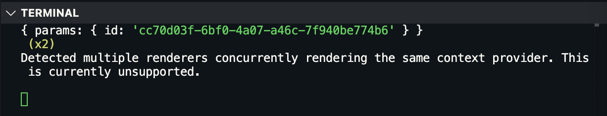

Perfect! We can get the application ID by referencing `params.id`.

Now, we can remove our `console.log({ params })` and  make our database call:

```tsx title="/src/app/pages/applications/Details.tsx" startLineNumber={11} {1, 4-8, 10} "async"
import { db } from "@/db"

const Details = async ({ params }: RequestInfo) => {
  const application = await db.application.findUnique({
    where: {
      id: params.id,
    },
  })

  console.log({ application })
---
- We're using the Prisma API to find the unique application by based on its ID. Then, we're logging the result to the terminal.
- Since we're `await`ing the database call, we need to make this function `async`.
---
```

If you check the terminal again, you should see the application data:

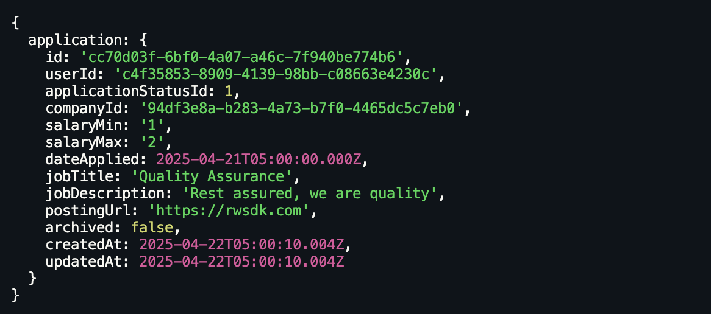

Now, that we know we're getting the right application back, let's update our `<BreadcrumbPage>` to display the job title and company name.

```diff title="/src/app/pages/applications/Details.tsx" startLineNumber={30}
- <BreadcrumbPage>Add an Application</BreadcrumbPage>
+ <BreadcrumbPage>{application?.jobTitle} at {application?.company?.name}</BreadcrumbPage>
```

We're using the Elvis operator (`?.`) or optional chaining to ensure that we don't throw an error if the application object is `null`.

When you preview this in the browser, you might be surprised to see that the company information is not showing up.

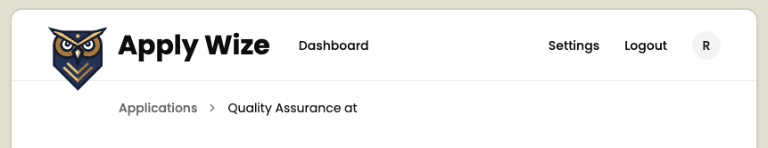

We need to include the `company` relationship in our database call:.

```tsx title="/src/app/pages/applications/Details.tsx" {5-7} startLineNumber={7}
const application = await db.application.findUnique({
  where: {
    id: params.id,
  },
  include: {
    company: true,
  },
})
```

and actually, while we're here, let's go ahead and include our `status` and `contact` relationships as well. Since the `contact` relationship is through our `company` object, we need to go another level deeper:

```tsx title="/src/app/pages/applications/Details.tsx"  {6-10}
const application = await db.application.findUnique({
  where: {
    id: params.id,
  },
  include: {
    status: true,
    company: {
      include: {
        contacts: true,
      },
    },
  },
})
```

We can get rid of our `console.log` statement and move down the page.

### Building the Page Header

Next, we have a page header:

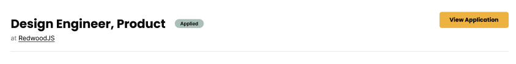

Below our bread crumbs, let's start with our JSX and then we can come back and style it.

```tsx title="/src/app/pages/applications/Details.tsx" startLineNumber={50}
<header>
  <div>
    <h1>{application?.jobTitle}</h1>
    <Badge
      variant={
        application?.status?.status.toLowerCase() as VariantProps<
          typeof badgeVariants
        >["variant"]
      }
    >
      {application?.status?.status}
    </Badge>
    <p>at {application?.company?.name}</p>
  </div>
  <div>
    <Button asChild>
      <a href={application?.postingUrl as string} target="_blank">
        View Application <Icon id="external-link" size={16} />
      </a>
    </Button>
  </div>
</header>
---
- We're using a semantic `header` HTML tag.
- Inside, we have 2 `div`s to separate the content that will appear on the left and right side.
- On the left side
  - We have an `h1` for our job title.
  - A `Badge` that contains our application status. Similar to what we did on the `ApplicationTable`, we're using the shadcn/ui `Badge` component. The "tricky" part is the button variant types. We can use the application status to get the name of the type: `application?.status?.status.toLowerCase()` but we have to cast it to the correct type: `VariantProps<typeof badgeVariants>['variant']`. [If you'll remember](/tutorial/full-stack-app/jobs-list/#adding-badges-to-the-status-column) `VariantProps` is a utility that we're getting from the `cva` library that shadcn/ui uses under the hood.
  - A `p` tag that contains the company name.
- On the right side, we have a `Button` that contains a link to the application posting URL. Inside, we have a label **View Application** and an `Icon` component with an `id` of `external-link` and a size of `16px`. The icon will help communicate that this is an external link.
- On our `Button` component, we have an `asChild` prop that allows our `Button` to render as an `a` tag.
---
```

At the top of our file, we need to add a few imports:

```tsx title="/src/app/pages/applications/Details.tsx" showLineNumbers=false
import { Badge, badgeVariants } from "@/app/components/ui/badge"
import { Button } from "@/app/components/ui/button"
import { VariantProps } from "class-variance-authority"
import { Icon } from "@/app/components/Icon";
```

Now, let's do another pass, this time adding our styles.

```tsx title="/src/app/pages/applications/Details.tsx" startLineNumber={49}
<header className="flex justify-between border-b-1 border-border pb-6 mb-12">
---
- We can position the items on the left and right side with `flex justify-between`.
- Then, we can add a `1px` border to the bottom with `border-b-1` and give it a light gray color with `border-border`.
- We also add some padding (`24px` on the bottom with `pb-6` and `48px` of margin on the bottom with `mb-12`).
---
```

I want the heading and the badge to appear next to each other, so I'll wrap those elements with an additional `div`.

```tsx title="/src/app/pages/applications/Details.tsx" startLineNumber={50}
<div>
  <div className="flex items-center gap-5 mb-1">
    <h1 className="page-title">{application?.jobTitle}</h1>
    <Badge
      variant={
        application?.status?.status.toLowerCase() as VariantProps<
          typeof badgeVariants
        >["variant"]
      }
    >
      {application?.status?.status}
    </Badge>
  </div>
  <p>
    <span className="text-zinc-500">at</span>{" "}
    {application?.company?.name}
  </p>
</div>
---
- **On line 51**, I'll use `flex items-center gap-5` to center the heading and badge vertically and add `20px` of space between them. Then, I'll add some `8px` of space to the bottom with `mb-1`.
- **On line 52** we can apply the `page-title` class to the `h1`.
- Then, let's wrap "at" with a `span` and give it a lighter gray color with `text-zinc-500`.
---
```

For the button on the right, we need to add some styles to get the icon and label to align vertically:

```tsx title="/src/app/pages/applications/Details.tsx" startLineNumber={69} "className="flex items-center gap-2"""
<Button>
  <a
    href={application?.postingUrl as string}
    target="_blank"
    className="flex items-center gap-2"
  >
    View Application <Icon id="external-link" size={16} />
  </a>
</Button>
---
- `flex` and `items-center` will center the icon and text vertically.
- `gap-2` will add `8px` of space between the icon and text.
---
```

I want to add some space to the left and right side. But, this will also need to be applied to the content below our page heading. So, let's wrap, both, our page header and the placeholder `<p>Details</p>` with a `div` and add our `px-page-side` class.

```tsx title="/src/app/pages/applications/Details.tsx" collapse={3-12} {1, 16} startLineNumber={49} "px-page-side"
<div className="px-page-side">
  <header className="flex justify-between border-b-1 border-border pb-6 mb-12">
    <div>
      <div className="flex items-center gap-5 mb-1">
        <h1 className="page-title">{application?.jobTitle}</h1>
        <Badge variant={application?.status?.status.toLowerCase() as VariantProps<typeof badgeVariants>['variant']}>{application?.status?.status}</Badge>
      </div>
      <p><span className="text-zinc-500">at</span> {application?.company?.name}</p>
    </div>
    <div>
      <Button><a href={application?.postingUrl as string} target="_blank">View Application</a></Button>
    </div>
  </header>

  <p>Details</p>
</div>
```

### Build the Main Content Area

Our main content area is a two column grid. This spacing should match the two column grid we set up on our new Application page. We can pull up our `ApplicationForm` component and abstract those styles into a reusable CSS class:

```tsx title="/src/app/components/ApplicationForm.tsx" startLineNumber={46} del="grid grid-cols-2 gap-[200px]" del="mb-[75px]"
return (
  <form action={handleSubmit}>
    <div className="grid grid-cols-2 gap-[200px] px-page-side mb-[75px]">
```

I'm going to replace all of our classes, except for `px-page-side`, with `two-column-grid`:

```tsx title="/src/app/components/ApplicationForm.tsx" startLineNumber={46} ins="two-column-grid"
return (
  <form action={handleSubmit}>
    <div className="px-page-side two-column-grid">
```

Now, within our CSS file, inside the `@layer components` section, let's add our new `two-column-grid` class:

```css title="/src/styles.css" startLineNumber={240}
.two-column-grid {
  @apply grid grid-cols-2 gap-[200px] mb-[75px]
}
```

Back in our `Details.tsx` file, we can use our new class:

```tsx title="/src/app/pages/applications/Details.tsx" startLineNumber={81}
<div className="two-column-grid">
  <p>Details</p>
  <aside>
    <p>Sidebar</p>
  </aside>
</div>
```

Notice, I also added an `aside` placeholder so that when you preview this within the browser, the two column layout is obvious.

{/* TODO: Replace this screenshot - View Application button has changed */}

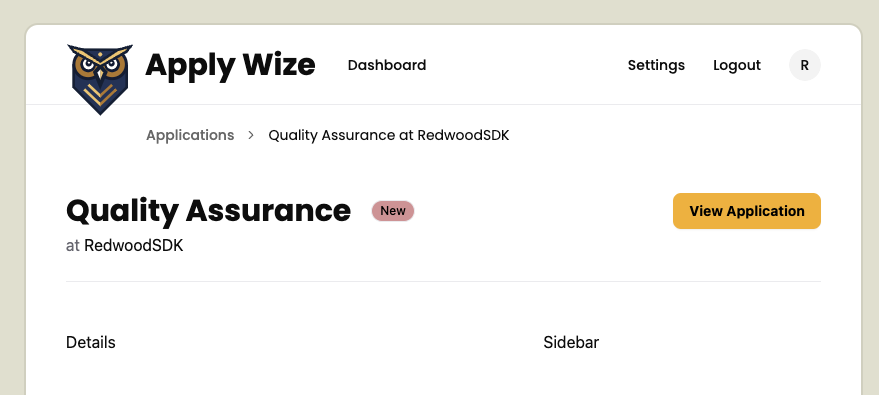

For the content on the left, we can replace the `<p>Details</p>` with the content from the database:

```diff title="/src/app/pages/applications/Details.tsx" startLineNumber={54} {2-4}
<div className="two-column-grid">
-  <p>Details</p>
+  <div>
+    {application?.jobDescription}
+  </div>
  <aside>
    <p>Sidebar</p>
  </aside>
</div>
```

Now, we want to put a couple of buttons below our content. I'm going to use a couple more `divs`, one to wrap our job description and another to wrap our buttons.

```tsx title="/src/app/pages/applications/Details.tsx" {2, 4-12} startLineNumber={81}
<div className="two-column-grid">
  <div>
    <div>{application?.jobDescription}</div>
    <div>
      <Button variant="secondary">
        <Icon id="edit" size={16} /> Edit
      </Button>
      <Button variant="link">
        <Icon id="trash" size={16} /> Delete
      </Button>
    </div>
  </div>
  <aside>
    <p>Sidebar</p>
  </aside>
</div>
---
- **On line 85** we have our edit button. I'm using the shadcn/ui `Button` component and applied the `secondary` variant to give it a beige color. Inside, I'm using our `Icon` component. I set the `id` to `edit` and the size to `16px`.
- **On line 88** we have our delete button. I'm using the shadcn/ui `Button` component again, bu this time I applied the `link` variant to remove the background color. There is a `destructive` variant, but it turns the background color red and you can only apply one variant at a time. We'll account for the difference through styling. Inside, I'm using our `Icon` component. I set the `id` to `trash` and the size to `16px`.
---
```

Let's add some polish through CSS.

```tsx title="/src/app/pages/applications/Details.tsx" collapse={13-15} startLineNumber={81} "mb-12" "flex items-center gap-5"
<div className="two-column-grid">
  <div>
    <div className="mb-12">{application?.jobDescription}</div>
    <div className="flex items-center gap-5">
      <Button variant="secondary">
        <Icon id="edit" size={16} /> Edit
      </Button>
      <Button variant="link">
        <Icon id="trash" size={16} /> Delete
      </Button>
    </div>
  </div>
  <aside>
    <p>Sidebar</p>
  </aside>
</div>
---
- **On line 83** I added `48px` of margin below our content with `mb-12`
- **On line 84** I adjusted the alignment for the buttons by adding a class of `flex items-center gap-5`. This forces this buttons to align vertically and puts `20px` of spacing between them.
- **On line 88** we can make our delete button red by adding a class of `text-destructive`. Then, to change the color of our svg to match the text color, we can add a class of `fill-current`.
---
```

Excellent! Now, for our sidebar.

We can reuse a lot of the styles that we created for our new application form. Let's start with the basic JSX:

```tsx title="/src/app/pages/applications/Details.tsx" startLineNumber={93}
<aside>
  <div className="box">
    <h3>Compensation</h3>
    <div>
      <Icon id="salary" size={32} />
      <div>
        <p>Salary</p>
        <p>
          {application?.salaryMin} - {application?.salaryMax}
        </p>
      </div>
    </div>
  </div>
</aside>
---
- **On line 94**, I used the `box` class we've already created.
- We already have some existing styles for `h3`s inside of the `box` class.
- **On line 97** I added an `Icon` component with an `id` of `salary` and a size of `32px`.
- **On line 99-102**, we have a "Salary" label and a `p` tag that contains the salary range. I placed this content in a wrapping `div` so that we can eventually align it vertically with the icon.
---
```

Let's go back through and add some more styles:

```tsx title="/src/app/pages/applications/Details.tsx" startLineNumber={93} "mb-4" "flex items-center gap-6" "text-sm" "text-zinc-500" "font-bold"
<aside>
  <div className="box">
    <h3 className="mb-4">Compensation</h3>
    <div className="flex items-center gap-6">
      <Icon id="salary" size={32} />
      <div className="text-sm">
        <p className="text-zinc-500">Salary</p>
        <p className="font-bold">{application?.salaryMin} - {application?.salaryMax}</p>
      </div>
    </div>
  </div>
</aside>
---
- **On line 95** I added `16px` of margin below the heading with `mb-4`
- **On line 96**, I aligned the icon and salary information with `flex items-center`. I also added `24px` of padding between with `gap-6`.
- **On line 98** I added a class of `text-sm` to make the salary information `14px`.
- **On line 99** I made the text gray with `text-zinc-500`.
- **On line 100** I added a class of `font-bold` to the salary range to make it bold.
---
```

Now, let's add the contact box. The only difference between this contact box and the one on the new application form is we don't need the "Add a Contact" button.

In fact, let's go over to our `ApplicationForm` component and copy paste.

```tsx title="/src/app/components/ApplicationForm.tsx" startLineNumber={119}
<div className="box">
  <h3>Contacts</h3>
  <p className="input-description">
    Invite your team members to collaborate.
  </p>
  {contacts && (
    <ul>
      {contacts.map((contact) => (
        <li key={contact.id}>
          <ContactCard contact={contact} />
        </li>
      ))}
    </ul>
  )}
---
Notice I stopped right before our `Sheet` component. We won't need it, but when we paste our code, we need to be sure to close our `<div>` tag.
---
```

Now, let's paste our code into our `Details.tsx` file.

```tsx title="/src/app/pages/applications/Details.tsx" startLineNumber={108}
<div className="box">
  <h3>Contacts</h3>
  <p className="input-description">Invite your team members to collaborate.</p>
  {contacts && (
    <ul>
      {contacts.map((contact) => (
        <li key={contact.id}><ContactCard contact={contact} /></li>
      ))}
    </ul>
  )}
</div>
```

At the top of our file, import the `ContactCard` component:

```tsx title="/src/app/pages/applications/Details.tsx" showLineNumbers=false
import { ContactCard } from "@/app/components/ContactCard"
```

On our Contact box, we have some linting errors because it cannot find our `contacts`.

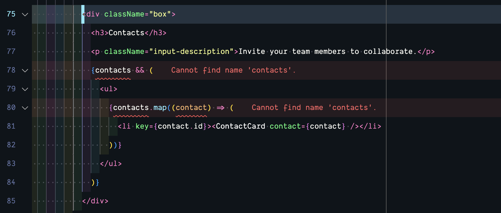

We have this data, but it's nested inside our `application.company` object. We can adjust our conditional statement and the object we're mapping over to get rid of the error:

```tsx title="/src/app/pages/applications/Details.tsx" startLineNumber={113} "application?.company?.contacts"
{application?.company?.contacts && (
  <ul>
    {application?.company?.contacts.map((contact) => (
      <li key={contact.id}><ContactCard contact={contact} /></li>
    ))}
  </ul>
)}
```

Amazing!

The only problem is when you hover over a contact card, the delete button appears.

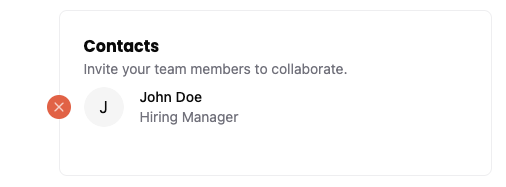

I don't want to be able to modify the contact information here.

Let's change the `ContactCard` component to take a new prop: `isEditable`.

```tsx title="/src/app/components/ContactCard.tsx" startLineNumber={9}
const ContactCard = ({
  contact,
  isEditable = true,
}: {
  contact: Contact;
  isEditable?: boolean;
}) => {
---
I made the `isEditable` prop optional and set it to `true` by default. This way, it won't effect our existing code.
---
```

Now, I'm going to wrap our Delete button with a conditional statement that checks if `isEditable` is `true`:

```tsx title="/src/app/components/ContactCard.tsx" startLineNumber={28} {1, 11}
{isEditable && (
  <div className="pr-5 hidden group-hover/card:block absolute top-2 -left-[37px]">
    <button
      onClick={(e) => handleDelete(e)}
      role="button"
      className="hover:bg-black cursor-pointer text-white fill-current rounded-full bg-destructive p-1"
    >
      <Icon id="close" size={16} />
    </button>
  </div>
)}
```

Back on our `Details` page, where we're looping over the `ContactCard` component, we can pass in `false` for the `isEditable` prop:

```tsx title="/src/app/pages/applications/Details.tsx" startLineNumber={113} ins="isEditable={false}"
{application?.company?.contacts && (
  <ul>
    {application?.company?.contacts.map((contact) => (
      <li key={contact.id}>
        <ContactCard contact={contact} isEditable={false} />
      </li>
    ))}
  </ul>
)}
```

If you test this out in the browser, you'll see that the delete button doesn't appear when you hover over a contact card on the `Details` page, but it still appears on the `New Application` page.

Next up, let's hot wire the delete button.

## Deleting a Job Application

The functionality for the delete button will be similar to how we set up the delete contacts button, but this time let's use a confirmation dialog or modal window to confirm the user really wants to delete the application.

For this, let's reach for another [shadcn/ui component: the dialog box.](https://ui.shadcn.com/docs/components/dialog)

### Styling the Dialog Component

Looking at the documentation, the code for this component resembles the `Sheet` component code:

```tsx showLineNumbers=false
<Dialog>
  <DialogTrigger>Open</DialogTrigger>
  <DialogContent>
    <DialogHeader>
      <DialogTitle>Are you absolutely sure?</DialogTitle>
      <DialogDescription>
        This action cannot be undone. This will permanently delete your account
        and remove your data from our servers.
      </DialogDescription>
    </DialogHeader>
  </DialogContent>
</Dialog>
```

There's a trigger and a content section, with a nested title and description. If you look at some of the additional examples within the shadcn/ui documentation, you'll notice we also have access to a `<DialogFooter>` component, perfect for buttons.

The `Dialog` component requires button clicks and maintaining state, so we'll need to be sure we're using a client component. Since the `Details.tsx` page is a server component, let's create a new component specifically for this feature. As an added benefit, we can reuse this component throughout our application.

Inside our `src/app/components`, let's create a new file and name it `DeleteApplicationButton.tsx`

<FileTree>
- src/
  - app/
    - components/
      - DeleteApplicationButton.tsx
</FileTree>

Let's start with a bare bones component:

```tsx title="/src/app/components/DeleteApplicationButton.tsx"
const DeleteApplicationButton = () => {
  return (
    <div>DeleteApplicationButton</div>
  )
}

export { DeleteApplicationButton }
```

Then, we can replace the placeholder `<div>DeleteApplicationButton</div>` with the Dialog code from shadcn/ui:

```tsx title="/src/app/components/DeleteApplicationButton.tsx"
"use client";

import {
  Dialog,
  DialogContent,
  DialogDescription,
  DialogFooter,
  DialogHeader,
  DialogTitle,
  DialogTrigger,
} from "@/app/components/ui/dialog"

const DeleteApplicationButton = () => {
  return (
    <Dialog>
      <DialogTrigger>Open</DialogTrigger>
      <DialogContent>
        <DialogHeader>
          <DialogTitle>Are you absolutely sure?</DialogTitle>
          <DialogDescription>
            This action cannot be undone. This will permanently delete your account
            and remove your data from our servers.
          </DialogDescription>
        </DialogHeader>
      </DialogContent>
    </Dialog>
  )
}

export { DeleteApplicationButton }
---
- You'll notice I included the `use client` directive at the top of our file, as well as our imports. If you copied the `import` statement directly [from shadcn/ui](https://ui.shadcn.com/docs/components/dialog), the path will vary slightly.
---
```

Before, I forget, we also need to go into our `app/components/ui/dialog.tsx` component and add a `use client` directive to the top of our shadcn/ui component as well:

```tsx title="/src/app/components/ui/dialog.tsx"
"use client";
```

Back inside our `DeleteApplicationButton` component, let's start customizing it, to meet our needs.

Let's replace `Open` inside the `DialogTrigger` component with the `Delete` button we've already styled:

```diff title="/src/app/components/DeleteApplicationButton.tsx" showLineNumbers=false
<DialogTrigger>
-  Open
+  <Button variant="link" className="text-destructive fill-current">
+    <Icon id="trash" size={16} /> Delete
+  </Button>
</DialogTrigger>
```

You'lll also need to import the `Button` and `Icon` components at the top of your file:

```tsx title="/src/app/components/DeleteApplicationButton.tsx" showLineNumbers=false
import { Button } from "./ui/button";
import { Icon } from "./Icon";
```

Before we finish the `DeleteApplicationButton` functionality. It's get onto the `Details` page. Let's replace the placeholder button with our component:

```tsx title="/src/app/pages/applications/Details.tsx" startLineNumber={89} del={1-3} ins={4}
<Button variant="link">
  <Icon id="trash" size={16} /> Delete
</Button>
<DeleteApplicationButton />
```

Of course, we'll also need to import the `DeleteApplicationButton` component at the top of our file:

```tsx title="/src/app/pages/applications/Details.tsx" showLineNumbers=false
import { DeleteApplicationButton } from "@/app/components/DeleteApplicationButton";
```

If you look at the DOM that's rendered in the browser, `DialogTrigger` renders as a `button`. Then, we have another `button` nested inside (from the `Button` component).

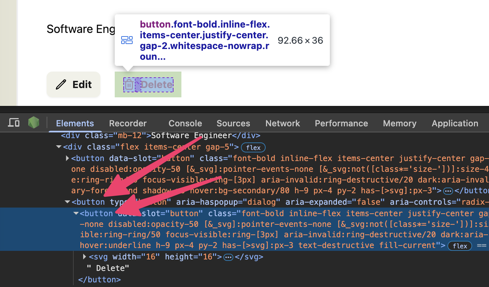

To prevent this from happening, we can use the `asChild` prop on the `DialogTrigger`.

```tsx title="/src/app/components/DeleteApplicationButton.tsx" startLineNumber={18} "asChild"
<DialogTrigger asChild>
  <Button variant="link" className="text-destructive fill-current">
    <Icon id="trash" size={16} /> Delete
  </Button>
</DialogTrigger>
```

Inside the `DialogTitle` we can use the text: "Are you absolutely sure?"

```tsx title="/src/app/components/DeleteApplicationButton.tsx" startLineNumber={25} "Are you absolutely sure?"
<DialogTitle>Are you absolutely sure?</DialogTitle>
```

For the `DialogDescription`, we can use the text: "This will permanently delete the application and any related companies and contacts. This action cannot be undone."

```tsx title="/src/app/components/DeleteApplicationButton.tsx" startLineNumber={25}
<DialogDescription>
  This will permanently delete the application and any related companies and contacts. This action cannot be undone.
</DialogDescription>
```

Below the `DialogHeader`, let's add a `DialogFooter` with two buttons: `Nevermind` and `Yes, Delete It`.

```tsx title="/src/app/components/DeleteApplicationButton.tsx" startLineNumber={31}
<DialogFooter>
  <Button variant="secondary">Nevermind</Button>
  <Button variant="destructive">
    <Icon id="check" />
    Yes, Delete It
  </Button>
</DialogFooter>
---
- For the "Nevermind" button, I'm using the `secondary` variant, applying a beige background color.
- For the "Yes, Delete It" button, I set the `variant` to `destructive`. Inside, I added an `Icon` component with an `id` of `check`.
---
```

Let's go back through and add a little more styling:

```tsx title="/src/app/components/DeleteApplicationButton.tsx" startLineNumber={23} "py-12 px-14" "mb-4" "text-destructive text-3xl font-bold mb-2" "fill-current"
<DialogContent className="py-12 px-14">
  <DialogHeader className="mb-4">
    <DialogTitle className="text-destructive text-3xl font-bold mb-2">Are you absolutely sure?</DialogTitle>
    <DialogDescription>
      This will permanently delete the application and any related companies and contacts. This action cannot be undone.
    </DialogDescription>
  </DialogHeader>
  <DialogFooter>
    <Button variant="secondary">Nevermind</Button>
    <Button variant="destructive" className="fill-current">
      <Icon id="check" />
      Yes, Delete It
    </Button>
  </DialogFooter>
</DialogContent>
---
- **On line 23**, I added `48px` of padding to the top and bottom, with `py-12` and `56px` to the left and right with `px-14`.
- **On line 24**, I added `16px` of margin below the header with `mb-4`.
- **On line 25**, I made the heading red with `text-destructive`, `30px` big with `text-3xl`, and added `8px` of margin below with `mb-2`.
- **On line 32**, I added a class of `fill-current` so that the check icon would match the text color of the button.
---
```

Now, let's connect the delete application functionality.

### Delete Application Functionality

On our "Yes, Delete It" button, we can add an `onClick` handler that will call our `deleteApplication` function.

```tsx title="/src/app/components/DeleteApplicationButton.tsx" startLineNumber={35} "onClick={(e) => handleDelete(e)}"
<Button variant="destructive" className="fill-current" onClick={(e) => handleDelete(e)}>
  <Icon id="check" />
  Yes, Delete It
</Button>
---
- We're passing in the `e` event object to the `handleDelete` function. This will allow us to prevent the default action of the button.
---
```

Now, let's create the `handleDelete` function, right above the `return` statement:

```tsx title="/src/app/components/DeleteApplicationButton.tsx" startLineNumber={16}
const handleDelete = async (e: React.MouseEvent<HTMLButtonElement>) => {
  e.preventDefault();
  const result = await deleteApplication();
  if (result.success) {
    toast.success("Application deleted successfully");
    window.location.href = "/applications";
  } else {
    console.error(result.error)
    toast.error("Failed to delete application");
  }
}
---
- **On line 17**, we're using the event (`e`) object to prevent the default action of the button.
- **On line 18**, we're calling the `deleteApplication` function (we still need to write this function). This is a server function, we can use `async` / `await`. We'll save the result in a variable called `result`.
- **On line 19**, we're checking to see if the result was successful. If it was, we'll display a successful toast message and redirect the user to the applications list page.
- **On line 22**, otherwise, if we ran into an error, we'll `console.error` the result and display a toast error message.
---
```

At the top of our file, we need to import `toast` and `deleteApplication` function:

```tsx title="/src/app/components/DeleteApplicationButton.tsx" showLineNumbers=false
import { toast } from "sonner";
import { deleteApplication } from "@/app/pages/applications/functions";
```

We also need a way of knowing what application we need to delete. We can pass the `applicationId` into the `DeleteApplicationButton` component and then on to the `deleteApplication` function.

```tsx title="/src/app/components/DeleteApplicationButton.tsx" showLineNumbers=false "applicationId"
const DeleteApplicationButton = ({ applicationId }: { applicationId: string }) => {
  const [isOpen, setIsOpen] = useState(false);

  const handleDelete = async (e: React.MouseEvent<HTMLButtonElement>) => {
    e.preventDefault();
    const result = await deleteApplication(applicationId);
```

Within our `functions.ts` file, we need to create the `deleteApplication` function.

```tsx title="/src/app/functions.ts" startLineNumber={97}
export const deleteApplication = async (applicationId: string) => {
  try {
    await db.application.delete({
      where: {
        id: applicationId,
      },
    });
    return { success: true, error: null }
  } catch (error) {
    console.error(error)
    return { success: false, error: error as Error }
  }
}
---
- **On line 97**, we're `export`ing the `deleteApplication` function so that we can use it in our `DeleteApplicationButton` component. This is an `async` function, so we can use `await` to wait for the database call to complete.
- We using a `try` / `catch` block to run the Prisma API call.
- **On line 99**, we're running the calling the `delete` method, `where` the `id` matches the `applicationId` that we passed in.
- If we're successful, we'll return `success` as `true` and `error` as `null`.
- If there are any errors, they'll be caught on **line 106**, `console.error` out. Then, we'll return `success` as `false` and include the `error` in the response.
---
```

Real quick, let's go back to the `Details` page and ensure we're passing the `applicationId` into the `DeleteApplicationButton` component:

```tsx title="/src/app/pages/applications/Details.tsx" startLineNumber={90} "applicationId={application?.id || ""}"
<DeleteApplicationButton applicationId={application?.id || ""} />
```

Let's test this out in the browser.

🙌 Looks like everything is working.

Before we can move on, we need to set up the "Nevermind" button for closing the dialog box.

### Closing the Dialog Box

This is a similar problem to the one we ran into with our `Sheet` component. [If you'll remember,](/tutorial/full-stack-app/contacts/#enhancing-the-user-experience) the `Sheet` component is built on top of the Radix UI `Dialog` component and _this is_ the `Dialog` component.

Within our `DeleteApplicationButton` component, we need to create a piece of state to keep track of whether the dialog box is open or not.

```tsx title="/src/app/components/DeleteApplicationButton.tsx" startLineNumber={22}
const [isOpen, setIsOpen] = useState(false);
```

You'll also need to import `useState` at the top of your file:

```tsx title="/src/app/components/DeleteApplicationButton.tsx" showLineNumbers=false
import { useState } from "react";
```

Then, we can use the `Dialog`'s props, `open` and `onOpenChange`, to control the dialog box, referencing our state variable. (For more information, check out [the official Radix UI documentation for the Dialog component](https://www.radix-ui.com/primitives/docs/components/dialog).)

```tsx title="/src/app/components/DeleteApplicationButton.tsx" startLineNumber={33}
<Dialog open={isOpen} onOpenChange={setIsOpen}>
```

Now, we can update the "Nevermind" button to close the dialog box, by updating the `isOpen` state:

```tsx title="/src/app/components/DeleteApplicationButton.tsx" startLineNumber={34}
<Button variant="secondary" onClick={ () => setIsOpen(false) }>Nevermind</Button>
```

If you test this in the browser, the "Nevermind" button should close the dialog box, without deleting the application. 😎

## Implementing Edit Functionality

Our application is looking great, but we're missing one thing: the ability to edit the application.

### Setting up the Edit Page and Components

Let's take the smarter, not harder approach and start with our `New` application form page and modify it. Let's duplicate the `New.tsx` file and name the new file `Edit.tsx`.

<FileTree>
- src/
  - app/
    - pages/
      - applications/
        - functions.ts
        - Details.tsx
        - Edit.tsx
        - List.tsx
        - New.tsx
</FileTree>

Inside, we need to rename our component to `Edit`

```diff title="/src/app/pages/applications/Edit.tsx"
- const New = async ({ ctx }: RequestInfo) => {
+ const Edit = async ({ ctx }: RequestInfo) => {
...
- export { New }
+ export { Edit }
```

Within our `worker.tsx`, let's add the new route:

```tsx title="/src/worker.tsx" startLineNumber={66} ins={5}
prefix("/applications", [
  route("/", [isAuthenticated, List]),
  route("/new", [isAuthenticated, New]),
  route("/:id", [isAuthenticated, Details]),
  route("/:id/edit", [isAuthenticated, Edit]),
]),
```

Be sure to import the `Edit` component at the top of our `worker.tsx` file:

```tsx title="/src/worker.tsx" showLineNumbers=false
import { Edit } from "@/app/pages/applications/Edit";
```

Then, let's add our new edit page to the list of routes inside our `src/app/shared/links.ts` file:

```tsx title="/src/app/shared/links.ts" {3} collapse={2-10} startLineNumber={10}
export const link = defineLinks([
  "/",
  "/user/login",
  "/user/signup",
  "/user/logout",
  "/legal/privacy",
  "/legal/terms",
  "/applications",
  "/applications/new",
  "/applications/:id",
  "/applications/:id/edit",
]);
```

Now, let's update the **Edit** button on the **Details** page so that we can easily navigate to our new page:

```tsx title="/src/app/pages/applications/Details.tsx" startLineNumber={87}
<Button variant="secondary" asChild>
  <a
    href={link("/applications/:id/edit", {
      id: application?.id || "",
    })}
  >
    <Icon id="edit" size={16} /> Edit
  </a>
</Button>
---
- I changed the `Button` component to include the `asChild` prop. This allows us to maintain the button styles, but render a link instead.
- Inside the `Button` component, I added a link, that uses the `link` function to reference the `Edit` page. The first parameter is the route and the second parameter contains an object with the parameters we're passing in. Here, the `application?.id`
---
```

You'll also need to import the `links` function at the top of our file:

```tsx title="/src/app/pages/applications/Details.tsx" showLineNumbers=false
import { link } from "@/app/shared/links"
```

If you look at this in the browser and click on the **Edit** button, it should take you to a page that looks like the new application form. But, the URL is different.

### Loading the Application from the Database

Let's get our job application content from the database and pass it into the form:

```tsx title="/src/app/pages/applications/Edit.tsx" startLineNumber={14}
const Edit = async ({ params, ctx }: RequestInfo) => {
  const application = await db.application.findUnique({
    where: {
      id: params.id,
    },
    include: {
      status: true,
      company: {
        include: {
          contacts: true,
        },
      },
    },
  })
---
- This code is similar to what we're already doing on the `Details.tsx` page. By default, our page gets a `RequestInfo` object, which contains the `params` and `ctx`.
- We can access the `id` in the URL through the `params` object with `params.id`.
- **On lines 15-27** we're using the Prisma API to find the unique application, `where` the `id` is equal to `param.id`.
- We're also including the `applicationStatus`, `company`, and `contacts` in the response, with `include`.
---
```

Be sure to import `RequestInfo` at the top of our file:

```tsx title="/src/app/pages/applications/Edit.tsx" showLineNumbers=false
import { RequestInfo } from "rwsdk/worker"
```

If we work our way down the file, we still need to grab _all_ the application statuses to populate the dropdown menu:

```tsx title="/src/app/pages/applications/Edit.tsx" startLineNumber={29}
const statuses = await db.applicationStatus.findMany()
```

But, we can _delete_ the block of code where we get all the contacts that aren't related to a company:

```tsx title="/src/app/pages/applications/Edit.tsx" startLineNumber={31} del={1-6}
const contacts = await db.contact.findMany({
  where: {
    companyId: null,
    userId: ctx.user?.id || ""
  }
})
```

We already have all the contact information we need through the `application` database call.

Let's keep moving down the file. We can change our `BreadcrumbPage` to display the Job Title:

```tsx title="/src/app/pages/applications/Edit.tsx" {6-14} collapse={2-5} startLineNumber={35}
<BreadcrumbList>
  <BreadcrumbItem>
    <BreadcrumbLink href="/applications">Applications</BreadcrumbLink>
  </BreadcrumbItem>
  <BreadcrumbItem>
    <BreadcrumbLink href={link('/applications/:id', { id: application?.id ?? '' })}>
      {application?.jobTitle} at {application?.company?.name}
    </BreadcrumbLink>
  </BreadcrumbItem>
  <BreadcrumbSeparator />
  <BreadcrumbItem>
    <BreadcrumbPage>Edit Application</BreadcrumbPage>
  </BreadcrumbItem>
</BreadcrumbList>
---
- I injected a `BreadcrumbItem` and a `BreadcrumbSeparator` after the Applications link to include the job details page.
- On the `BreadcrumbLink`, I used our `link` function to reference the job details page.
- I used the content from our database to dynamically display the job title and company name.
- Then, I changed the `BreadcrumbPage` to `Edit Application`.
---
```
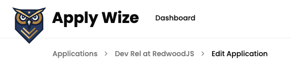

Looking at the next section:

```tsx title="/src/app/pages/applications/Edit.tsx" startLineNumber={46}
<div className="mx-page-side pb-6 mb-8 border-b-1 border-border">
  <h1 className="page-title">New Application</h1>
  <p className="page-description">Create a new application</p>
</div>
```

We can change the contents of our page title and description:

```tsx title="/src/app/pages/applications/Edit.tsx" startLineNumber={47} "Edit {application?.jobTitle}" "Edit your application" "Edit the details of this job application."
<h1 className="page-title">Edit {application?.jobTitle}</h1>
<p className="page-description">Edit the details of this job application.</p>
```

For the form, I'm going to duplicate the `src/app/components/ApplicationsForm.tsx` file and name the new file `EditApplicationForm.tsx`.

Inside, we need to change the name of the component to match the name of the file:

```diff title="/src/app/components/EditApplicationForm.tsx" showLineNumbers=false
- const ApplicationsForm = ({ statuses, contacts }:
+ const EditApplicationForm = ({ statuses, contacts }:
...
- export {ApplicationsForm}
+ export {EditApplicationForm}
```

Then, on the `Edit` page, let's swap out the `ApplicationsForm` component with our `EditApplicationForm` component:

```diff title="/src/app/pages/applications/Edit.tsx" showLineNumbers=false
- import { ApplicationsForm } from "@/app/components/ApplicationsForm"
+ import { EditApplicationForm } from "@/app/components/EditApplicationForm"
...
- <ApplicationsForm statuses={statuses} contacts={contacts} />
+ <EditApplicationForm statuses={statuses} contacts={contacts} />
```

While we're here, let's modify the props that we're passing into our component. We no longer need the `contacts` prop, but we do need to pass in the application:

```diff title="/src/app/pages/applications/Edit.tsx" showLineNumbers=false "contacts={contacts}" "application={application}"
- <EditApplicationForm statuses={statuses} contacts={contacts} />
+ <EditApplicationForm statuses={statuses} application={application} />
```

Now, let's move over to our `EditApplicationForm.tsx` file and update the props, there, to match:

```diff title="/src/app/components/EditApplicationForm.tsx" showLineNumbers=false
- import { ApplicationStatus, Contact } from "@prisma/client"
+ import { ApplicationStatus, Application } from "@prisma/client"
+ import { ApplicationWithRelations } from "../pages/applications/List";
...
- const EditApplicationForm = ({ statuses, contacts }:
-   { statuses: ApplicationStatus[], contacts: Contact[] }) => {
+ const EditApplicationForm = ({
+   statuses,
+   application,
+ }: {
+   statuses: ApplicationStatus[];
+   application: ApplicationWithRelations;
+ }) => {
```

We updated the types that we're importing from Prisma to remove `Contact` and include `Application`. Then, we made similar changes to the props that we're passing into our component.

You'll notice that we imported `ApplicationWithRelations` from our `List` page. This is a type that we created to include the `company` and `contacts` details.

Now, let's work our way through the form, for each input field, we want to set a `defaultValue`, referencing the application details.

```tsx title="/src/app/components/EditApplicationForm.tsx" showLineNumbers=false {"Company Name": 1} "defaultValue={application?.company?.name ?? ''}" {"Job Title": 3} "defaultValue={application?.jobTitle ?? ''}" {"Job Description": 5} "defaultValue={application?.jobDescription ?? ''}" {"Salary Min": 7} "defaultValue={application?.salaryMin ?? ''}" {"Salary Max": 9} "defaultValue={application?.salaryMax ?? ''}" {"Posting URL": 11} "defaultValue={application?.postingUrl ?? ''}"
.
<input type="text" id="company" name="company" defaultValue={application?.company?.name ?? ''} />

<input type="text" id="jobTitle" name="jobTitle" defaultValue={application?.jobTitle ?? ''} />

<textarea id="jobDescription" name="jobDescription" defaultValue={application?.jobDescription ?? ''} />

<input type="text" id="salaryMin" name="salaryMin" defaultValue={application?.salaryMin ?? ''} />

<input type="text" id="salaryMax" name="salaryMax" defaultValue={application?.salaryMax ?? ''} />

<input type="text" id="postingUrl" name="postingUrl" defaultValue={application?.postingUrl ?? ''} />
```

Then, for the submit button, change the label from "Create" to "Update":

```tsx title="/src/app/components/EditApplicationForm.tsx" startLineNumber={77} "Update"
<Button role="submit">
  Update
</Button>
```

Let's add a second button, to cancel:

```tsx title="/src/app/components/EditApplicationForm.tsx" {5-7} startLineNumber={120} "field flex items-center gap-4" "asChild"
<div className="field flex items-center gap-4">
  <Button role="submit">
    Update
  </Button>
  <Button variant="secondary" asChild>
    <a href={link('/applications/:id', { id: application?.id ?? '' })}>Cancel</a>
  </Button>
</div>
---
- On the wrapping `field` `div`, I added a few classes to align the buttons vertically and add `16px` of space between them with `flex items-center gap-4`.
- **On line 124**, I gave the Cancel button a `variant` of `secondary` to give it a `beige` color. The `asChild` prop allows us to use the `a` tag inside.
- **On line 125**, I used our `link` function to reference the job details page and pass in the `application?.id` as the `id` parameter.
---
```

You'll also need to import the `link` function at the top of our file:

```tsx title="/src/app/components/EditApplicationForm.tsx" showLineNumbers=false
import { link } from "../shared/links";
```

For the Date Picker, we need to adjust the component slightly. If you try to pass in a `defaultValue`:

```tsx title="/src/app/components/EditApplicationForm.tsx" showLineNumbers=false
<DatePicker name="dateApplied" defaultValue={application?.dateApplied?.toISOString() ?? ''} />
```

It will show a linting error because it's not prepared to accept that prop:

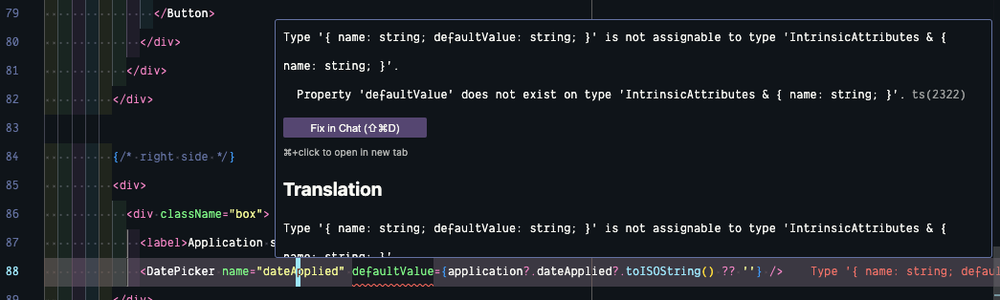

Within the `DatePicker` component, let's update the list of props we're passing in, to include the `defaultValue` prop:

```tsx title="/src/app/components/ui/DatePicker.tsx" startLineNumber={16} "defaultValue = ''" "defaultValue?: string }"
export function DatePicker({ name, defaultValue = '' }: { name: string, defaultValue?: string }) {
---
- The `defaultValue` isn't required, so we used a `?` to make it optional.
- If the `defaultValue` isn't passed in, `defaultValue` will be an empty string.
---
```

We're already saving the selected date in a piece of state, let's set the default value of our state to `defaultValue` we passed in:

```diff lang="tsx" title="/src/app/components/ui/DatePicker.tsx" showLineNumbers=false "defaultValue ? new Date(defaultValue) : new Date()"
- const [date, setDate] = React.useState<Date>()
+ const [date, setDate] = React.useState<Date>(defaultValue ? new Date(defaultValue) : new Date())
```

Excellent! Now, let's go back to our `EditApplicationForm.tsx` file and update the Application Status. Just like our standard inputs, we can pass in a `defaultValue` prop:

```tsx title="/src/app/components/EditApplicationForm.tsx" startLineNumber={147}
<Select
  name="statusId"
  defaultValue={application?.status?.id.toString() ?? ""}
>
```

For the Contacts section, we just need to adjust the contact array its referencing:

```diff title="/src/app/components/EditApplicationForm.tsx" showLineNumbers=false
- {contacts && (
+ {application?.company?.contacts && (
  <ul>
-      {contacts.map((contact) => (
+      {application?.company?.contacts.map((contact) => (
      <li key={contact.id}><ContactCard contact={contact} /></li>
    ))}
  </ul>
)}
```

If you check out the page within the browser, you should see all our application details loaded in:

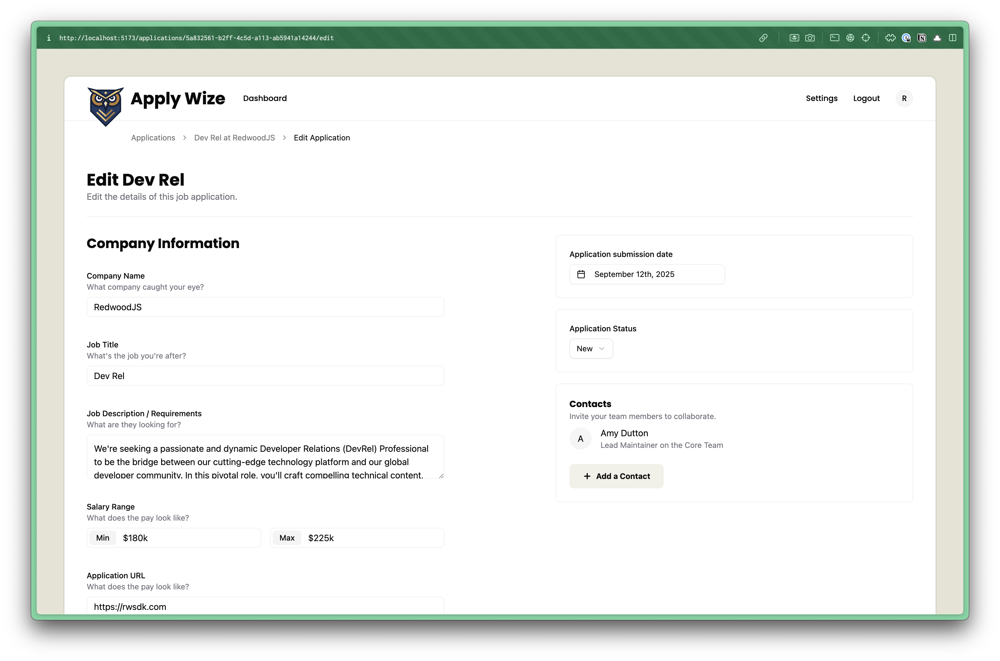

#### Updating the Application

Now, we just need to handle the form updates.

Let's start with the contact form. If you'll remember, we set the contact form up so that when a new contact is created, it's not assigned to a company. Here, though, we have a company.

Instead of duplicating the `ContactForm` component, let's make it "smart" enough to handle both use cases.

Inside our `EditApplicationForm` component, where we're using our `ContactForm` component, let's pass in the `companyId`:

```tsx title="/src/app/components/EditApplicationForm.tsx" startLineNumber={193} "companyId={application?.company?.id ?? ''}"
<ContactForm
  callback={() => setIsContactSheetOpen(false)}
  companyId={application?.company?.id ?? ""}
/>
```

Right away, you will see an error because our `ContactForm` isn't expecting a `companyId` prop. Let's fix that:

```tsx title="/src/app/components/ContactForm.tsx" startLineNumber={6} "companyId = ""," "companyId?: string" startLineNumber={8}
const ContactForm = ({
  callback,
  companyId = "",
}: {
  callback: () => void;
  companyId?: string;
}) => {
---
- I set the default value to an empty string: `companyId = ''`
- I also made the `companyId` prop optional with a question mark `?`
- The beauty in this approach is that it won't break or change our existing implementation on the `New` job application page.
---
```

Inside the `handleSubmit` function, let's `append` the `companyId` to our `formData`:

```tsx title="/src/app/components/ContactForm.tsx" startLineNumber={13} {2}
const handleSubmit = async (formData: FormData) => {
  formData.append("companyId", companyId);
  const result = await createContact(formData);
}
```

Now, let's jump over to our `createContact` function, inside our `src/app/pages/applications/functions.tsx` file and get the `companyId` from the form data:

```tsx title="/src/app/pages/applications/functions.tsx" collapse={2-8} startLineNumber={55} {9}
export const createContact = async (formData: FormData) => {
  try {
    const { ctx } = requestInfo;

    if (!ctx.user) {
      throw new Error("User not found");
    }

    const companyId = formData.get("companyId") as string;
```

On our database call, we can conditionally `connect` the company, if the `companyId` exists:

```tsx title="/src/app/pages/applications/actions.ts" collapse={2-11} {12-18} startLineNumber={65}
await db.contact.create({
  data: {
    firstName: formData.get("firstName") as string,
    lastName: formData.get("lastName") as string,
    email: formData.get("email") as string,
    role: formData.get("role") as string,
    user: {
      connect: {
        id: ctx.user?.id || "",
      },
    },
    ...(companyId ? {
      company: {
        connect: {
          id: companyId,
        },
      }
    } : {})
  },
})
---
- **On line 74**, we're using a spread operator to say if the `companyId` exists, then connect the company to the contact. Otherwise, we'll use an empty object.
---
```

You can test this out in the browser, ensuring it works on both the **New** and **Edit** pages.

The only remaining task is to update the `handleSubmit` function on the `EditApplicationForm`. This is what we currently have.

```tsx title="/src/app/components/EditApplicationForm.tsx" startLineNumber={38}
const handleSubmit = async (formData: FormData) => {
  formData.append("contacts", JSON.stringify(contacts));
  const result = await createApplication(formData);
  if (result.success) {
    window.location.href = `/applications`;
  } else {
    console.error(result.error);
  }
}
```

We can remove line `26`, where we're appending the `contacts` to the `formData`.

Instead of calling `createApplication`, let's call `updateApplication` instead (we still need to write this function):

```tsx title="/src/app/pages/applications/actions.ts" collapse={3-7} startLineNumber={126} {2} "updateApplication"
const handleSubmit = async (formData: FormData) => {
  const result = await updateApplication(formData);
  if (result.success) {
    window.location.href = `/applications`;
  } else {
    console.error(result.error);
  }
}
```

Be sure to update the import statement at the top of your file:

```diff title="/src/app/components/EditApplicationForm.tsx" showLineNumbers=false
- import { createApplication } from "@/app/pages/applications/functions"
+ import { updateApplication } from "@/app/pages/applications/functions"
```

Inside our `src/app/pages/applications/functions.ts` file, let's write the `updateApplication` function:

```tsx title="/src/app/pages/applications/functions.ts" startLineNumber={122}
export const updateApplication = async (formData: FormData) => {
  try {
    await db.application.update({
      where: {
        id: formData.get("id") as string,
      },
      data: {
        salaryMin: formData.get("salaryMin") as string,
        salaryMax: formData.get("salaryMax") as string,
        jobTitle: formData.get("jobTitle") as string,
        jobDescription: formData.get("jobDescription") as string,
        postingUrl: formData.get("url") as string,
        dateApplied: formData.get("dateApplied") as string,
        company: {
          update: {
            name: formData.get("company") as string,
          },
        },
        status: {
          connect: {
            id: parseInt(formData.get("statusId") as string),
          },
        },
      }
    })

    return { success: true, error: null }
  } catch (error) {
    console.error(error)
    return { success: false, error: error as Error }
  }
}
---
- This is basic `try` / `catch` block. We `try` and run our database method an if it encounters an error, then we'll `catch` it and return an error object.
- **On line 122** - Our database call is similar to the `createApplication` function, but instead of `create`, we're using `update`.
- **On lines 125-127** - We're using a `where` clause to specify which application we want to update.
- **On lines 135-139** - We're using an `update` method to update the company name (instead of `connect`)
- **On lines 140-144** - We're using the `update` method to update the application status (instead of `connect`).
- **On line 142** - the Application Status ID is a number, but the `statusId` on the `formData` is a `number`, so we're casting it from a string into a number with `parseInt`.
---
```

{/* TODO: Can I get a number off of the formData? */}

This is great, the only problem is that the application `id` does not exist in our form data.

Let's go back to our `EditApplicationForm` and add a `hidden` input field to our form:

```tsx title="/src/app/components/EditApplicationForm.tsx" startLineNumber={120} "id={application?.id ?? ''}"
<input
  type="hidden"
  id="id"
  name="id"
  defaultValue={application?.id ?? ""}
/>
```

<Aside type="tip" title="Hidden Input Field">
This is personal preference, but I like to list any `hidden` inputs next to the submit button, making them easy to find.
</Aside>

Perfect! Now test the update form within the browser. You should be able to edit and save changes to our application.

💥 We did it! Now, we just need to get our application online where people can use it!

<Aside type="tip" title="Code on GitHub">
You can find the final code for this step on [GitHub](https://github.com/ahaywood/applywize/tree/main).
</Aside>
