import { Aside } from '@astrojs/starlight/components';

import { PackageManagers } from "starlight-package-managers";

Now that our application is complete 🥳, let's deploy it! This is the _easiest_ step in the whole process.

Within the Terminal, run:

<PackageManagers
  type="run"
  pkg="release"
/>

<Aside type="note" title="Deploying your D1 Database">
When you run `pnpm run release`, Redwood will automatically create a D1 database for you, within your Cloudflare account and update your `wrangler.jsonc` file for you. However, if you want to run these commands manually, you can do so by running:

```bash
pnpm wrangler d1 create DATABASE-NAME
```

Then, use the provided output to update the `database_name` and `database_id` within your `wrangler.jsonc` file:

```json showLineNumbers=false title="wrangler.jsonc"
"d1_databases": [
  {
    "binding": "DB",
    "database_name": "__change_me__",
    "database_id": "__change_me__"
  }
]
```
</Aside>

Within the Terminal, it will ask you: **Do you want to proceed with deployment? (y/N):** Type `y` and press Enter.

Everything should just work! 🙌

Go to your dashboard in Cloudflare, on the left side navigation click on **Workers & Pages**. You should see your application in the list. Then, you can click on the **Visit** link to see your application online.

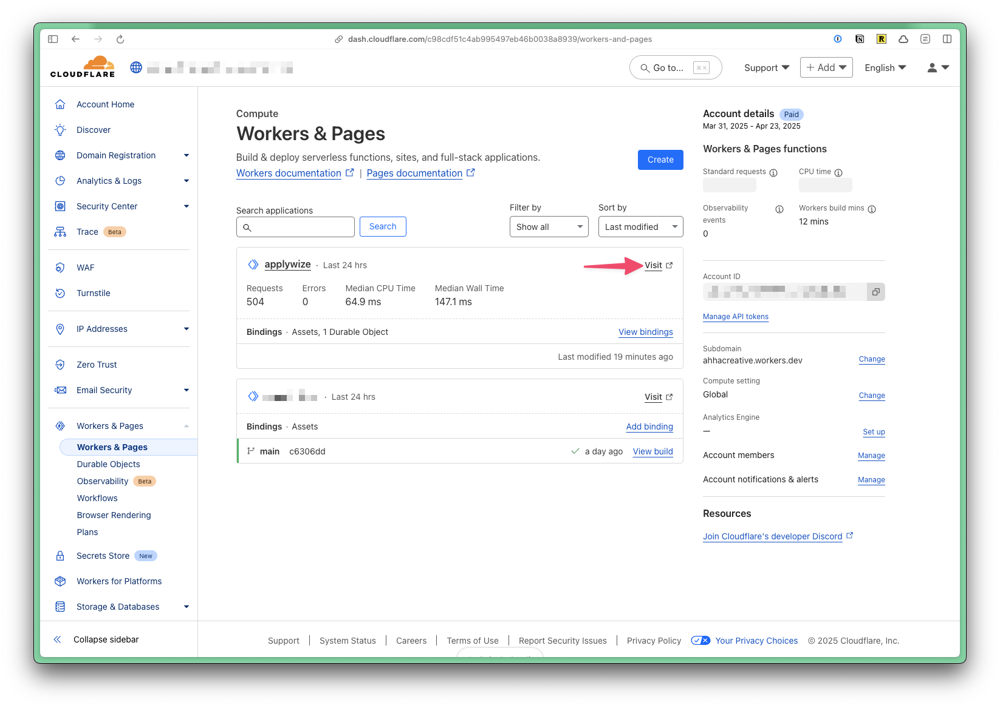

## Deleting Your Project

If for whatever reason, you need to delete your project through Cloudflare, go to **Workers & Pages** in the left side navigation. Then, click on the name of your project. Click on the **Settings** tab, then scroll to the bottom of the page. Click on the **Delete** button.

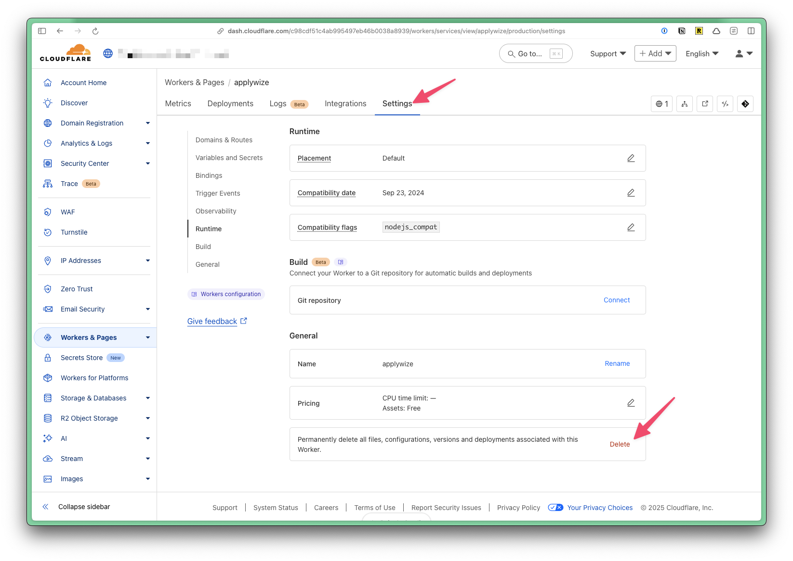

A confirmation modal will appear, asking you to type the name of your project, then click on the **Delete** button.

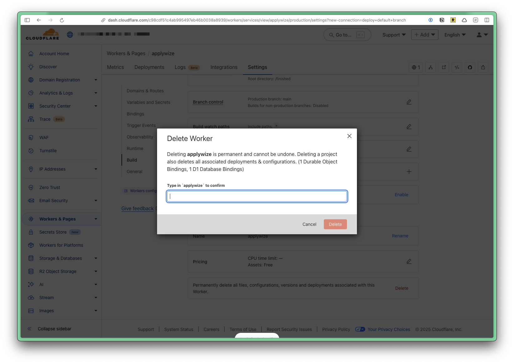

## Using a Custom Domain Name

To use a custom domain name, go to **Workers & Pages** in the left side navigation. Then, click on the name of your project. Click on the **Settings** tab. At the top, you'll see the domains associated with your project.

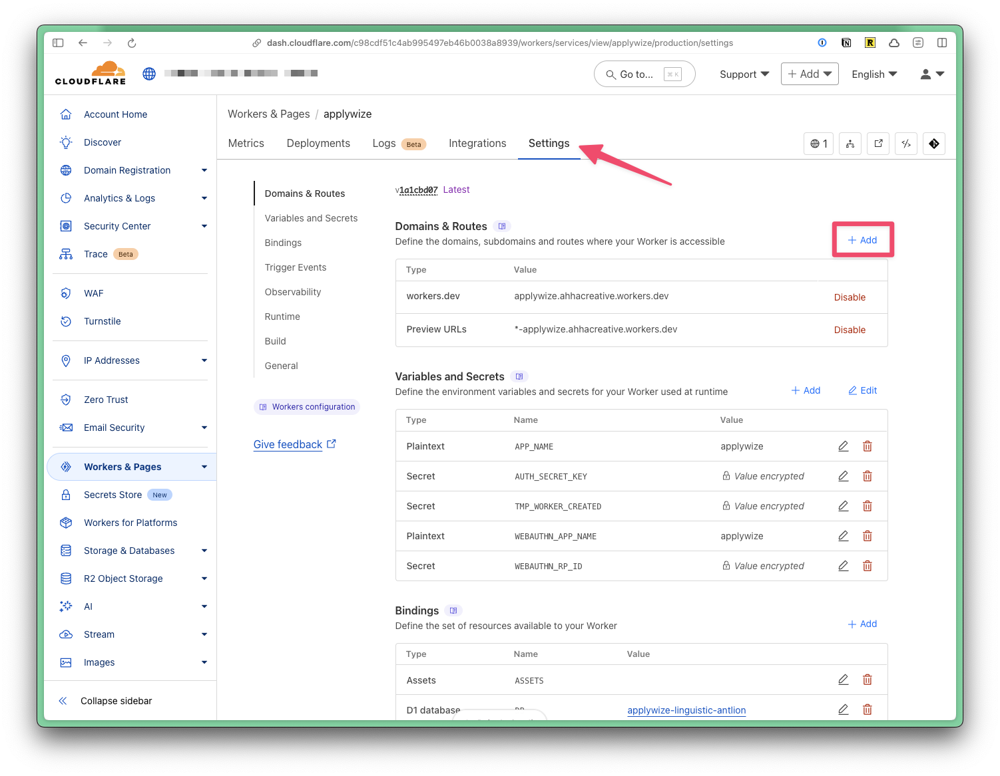

Click on the **+ Add** button at the top of the **Domains & Routes** table. A side panel will appear:

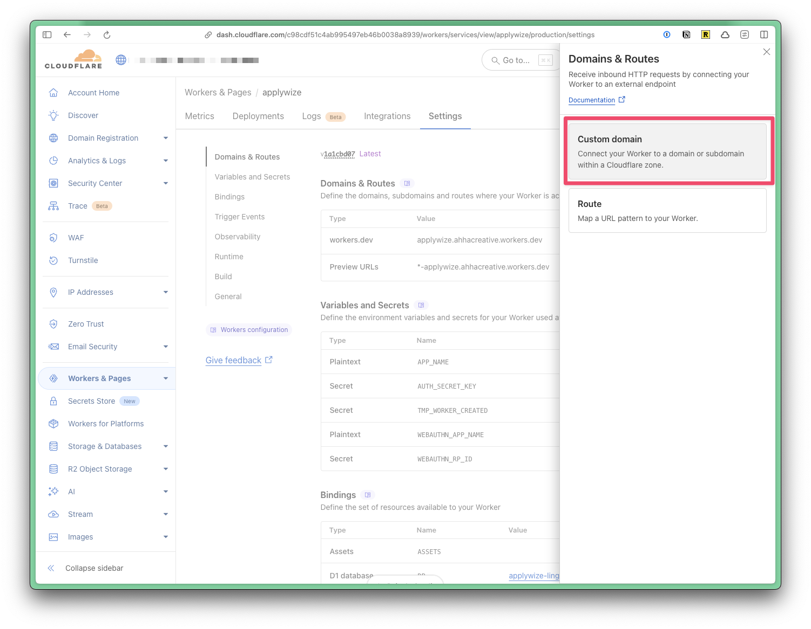

Click on the **Custom Domain** option. Then, it will ask you enter the domain name you want to use.

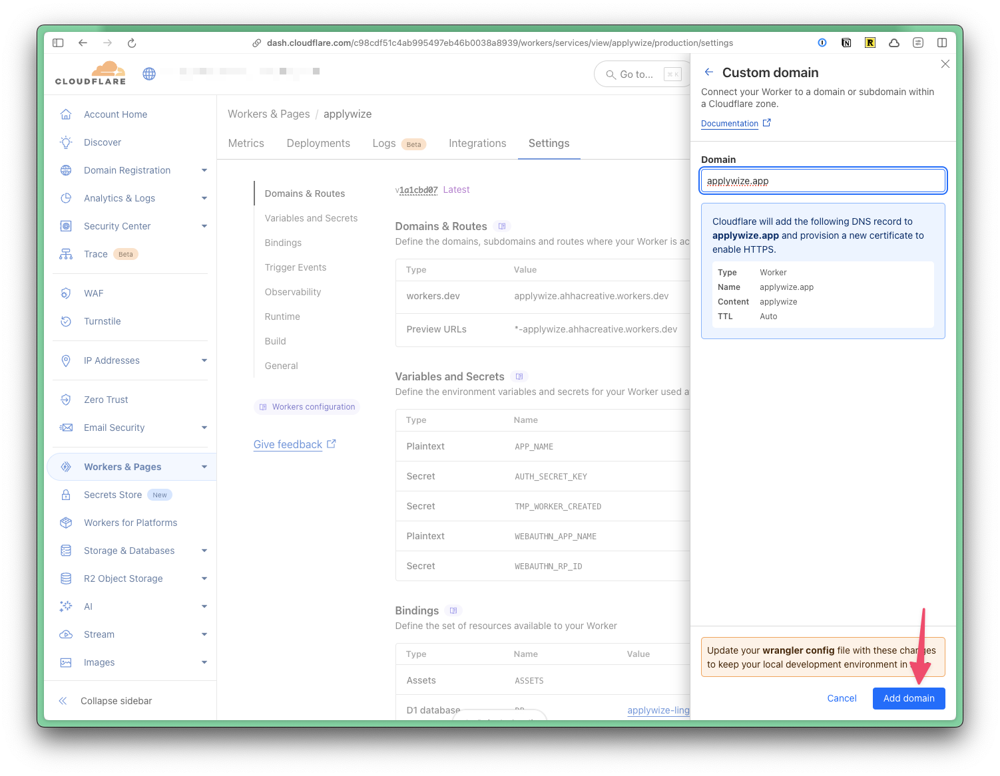

I had already purchased `applywize.app` through Cloudflare, so there was nothing else I needed to do. Cloudflare was able to resolve the domain and assign SSL certificates.

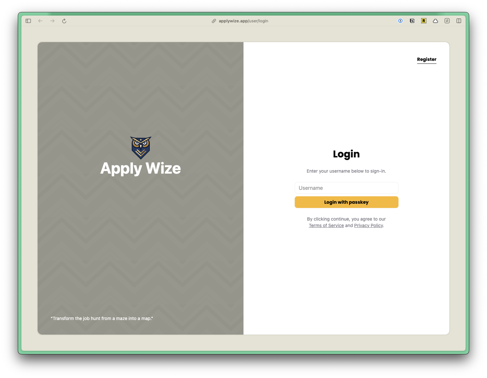

## Connecting our Application to GitHub

You can connect your application to GitHub, so that anytime you push a commit to a given branch, it will automatically deploy your application. Go to **Workers & Pages** in the left side navigation. Then, click on the name of your project. Click on the **Settings** tab. Near the bottom of the page, you'll find a section called **Build** where you can connect GitHub.

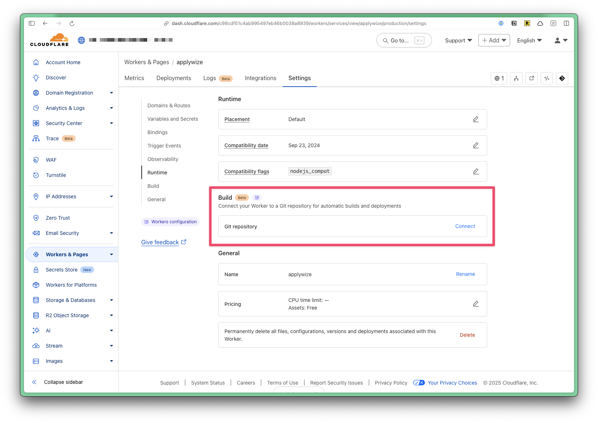

Click on the **Connect** button. A side panel will appear and ask you to configure the connection.

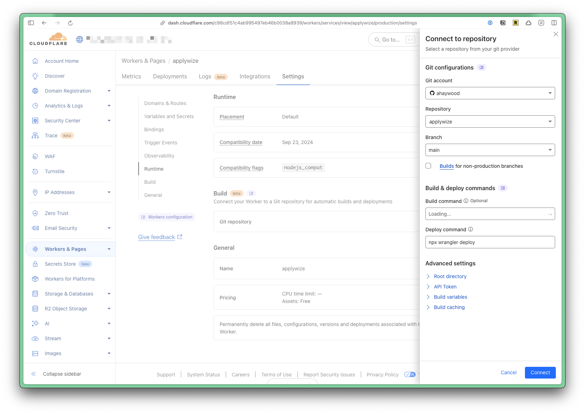

In most cases the default settings will work. However, the [Applywize repository](https://github.com/ahaywood/applywize) is a monorepo. It contains different checkpoints for the tutorial, as well as folders for the application's assets. The finished application is inside the `finished` folder.

Under the **Advanced Settings** section, I expanded the **Root Directory** section and changed the **Path** to `/finished/`.

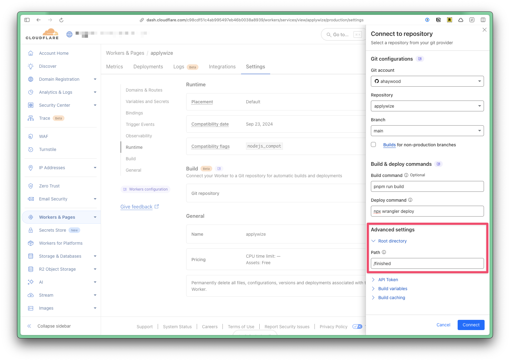

Once your repository is successfully connected, the **Build** section will update to show the connection.

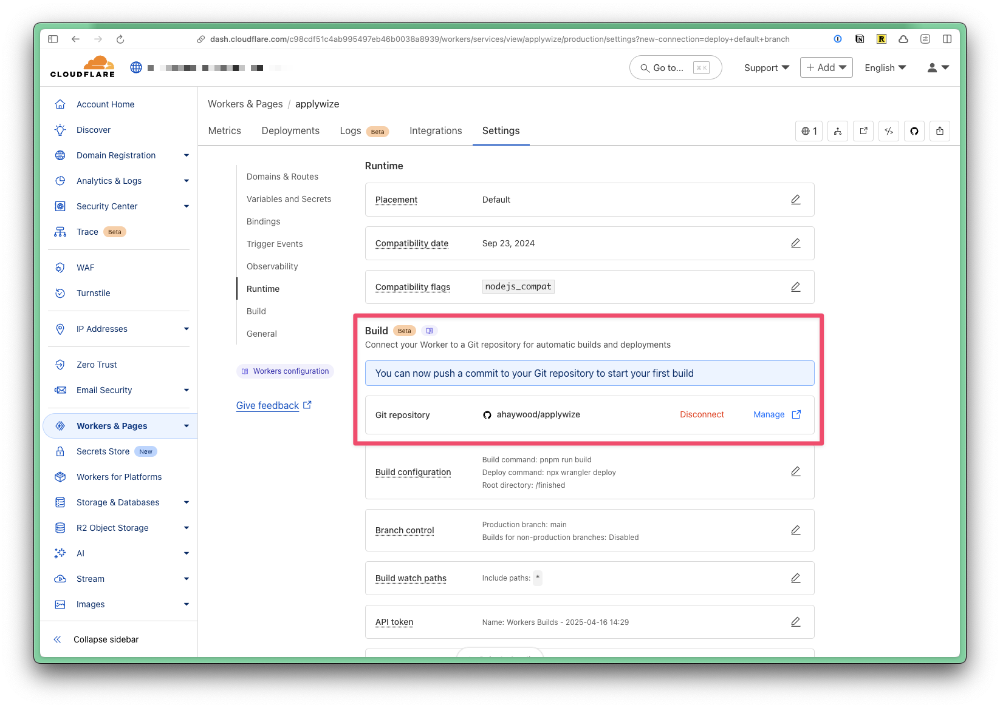

Try pushing a commit to the `main` branch and your application should deploy automatically. While it's building, you'll see a yellow dot next to the repository name in GitHub:

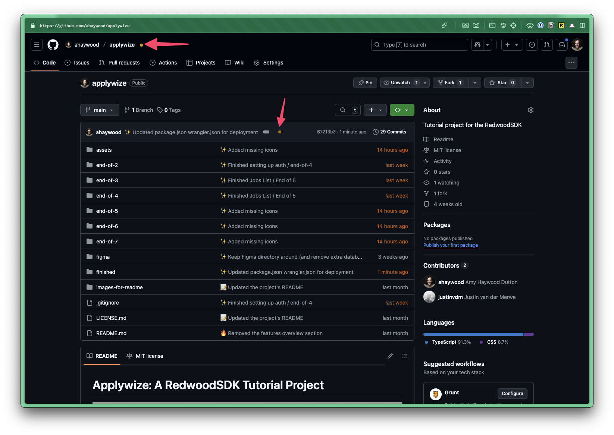

Once the checks have passed and the build is successful, the yellow dot will change to a green checkmark.

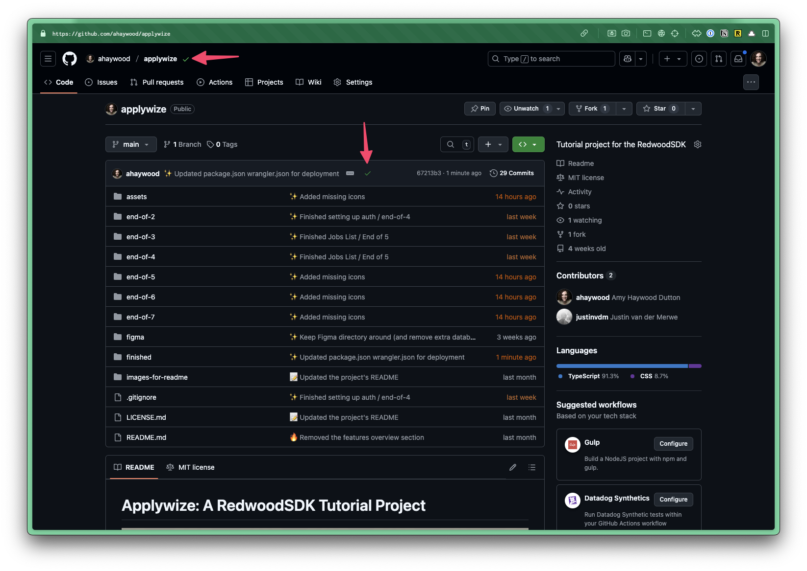

You can click on the checkmark to see additional details:

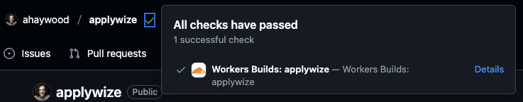

If you click on the **Details** link, it will take you to a dedicated page within GitHub:


Congrats! You should know everything you need to know to build your own application, using RedwoodSDK. We'd love to see what you build. Please share your work and stay in touch by registering for our [newsletter](https://rwsdk.com).

<Aside type="tip" title="Code on GitHub">
You can find the final code for this step on [GitHub](https://github.com/ahaywood/applywize/tree/main/finished).
</Aside>