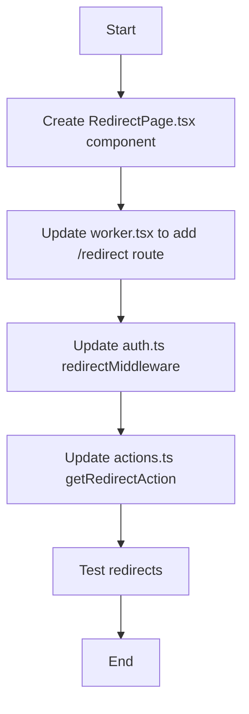

# Plan: Change All Redirects to New Page

## Overview
Change all redirects in the `playground/server-functions` project to go to a new dedicated redirect page instead of the existing `/error` page. The new page will simply return a string message.

## Current State Analysis

### Existing Redirects Found
1. **`auth.ts:17-18`** - `redirectMiddleware` function
   - Currently redirects to: `/error?source=redirect-middleware`
   - Uses: `Response.redirect(url.toString(), 303)`

2. **`actions.ts:54-58`** - `getRedirectAction` function
   - Currently redirects to: `/error?source=redirect-action`
   - Uses: `Response.redirect(location.toString(), 303)`

### Current Route Structure
- `/` - Home page
- `/error` - ErrorPage component (currently used as redirect target)
- `/debug/throw` - Test error route

## Proposed Changes

### 1. Create New Redirect Page Component
**File**: `playground/server-functions/src/app/pages/RedirectPage.tsx`

Create a simple page component that:
- Accepts optional query parameters to identify the redirect source
- Returns a simple string/text message indicating successful redirect
- Can display the source of the redirect for debugging purposes

Example structure:
```tsx
export function RedirectPage({ ctx }: RequestInfo) {
  const url = new URL(ctx.request.url);
  const source = url.searchParams.get('source');

  return (
    <div>
      <h1>Redirect Successful</h1>
      <p>You have been redirected{source ? ` from: ${source}` : ''}.</p>
    </div>
  );
}
```

### 2. Update Worker Routes
**File**: `playground/server-functions/src/worker.tsx`

- Import the new `RedirectPage` component
- Add a new route: `route("/redirect", RedirectPage)`

### 3. Update Redirect Middleware
**File**: `playground/server-functions/src/app/auth.ts`

Change line 17 from:
```typescript
const url = new URL("/error?source=redirect-middleware", request.url);
```

To:
```typescript
const url = new URL("/redirect?source=redirect-middleware", request.url);
```

### 4. Update Redirect Action
**File**: `playground/server-functions/src/app/actions.ts`

Change lines 54-56 from:
```typescript
const location = new URL(
  "/error?source=redirect-action",
  requestInfo.request.url,
);
```

To:
```typescript
const location = new URL(
  "/redirect?source=redirect-action",
  requestInfo.request.url,
);
```

## Implementation Flow



## Testing Strategy

After implementation, verify:
1. Navigate to a URL that triggers `redirectMiddleware` - should redirect to `/redirect?source=redirect-middleware`
2. Trigger `getRedirectAction` - should redirect to `/redirect?source=redirect-action`
3. Verify the new redirect page displays correctly with source information
4. Ensure `/error` page still works for actual errors

## Files to Modify

1. ✅ **CREATE**: `playground/server-functions/src/app/pages/RedirectPage.tsx`
2. ✅ **MODIFY**: `playground/server-functions/src/worker.tsx`
3. ✅ **MODIFY**: `playground/server-functions/src/app/auth.ts`
4. ✅ **MODIFY**: `playground/server-functions/src/app/actions.ts`
5. ✅ **MODIFY**: `playground/server-functions/__tests__/e2e.test.mts`

## Test Updates Required

The e2e test file contains two tests that verify redirect behavior:

### Test 1: `serverQuery redirect middleware returns redirect metadata` (lines 136-174)
- Currently checks for redirect to `/error?source=redirect-middleware`
- Expects to see "Error Page" heading
- **Needs update**: Change URL check from `/error?source=redirect-middleware` to `/redirect?source=redirect-middleware`
- **Needs update**: Change expected heading from "Error Page" to "Redirect Successful" (or whatever heading we use)

### Test 2: `serverAction redirect middleware navigates to error page` (lines 176-214)
- Currently checks for redirect to `/error?source=redirect-action`
- Expects to see "Error Page" heading
- **Needs update**: Change URL check from `/error?source=redirect-action` to `/redirect?source=redirect-action`
- **Needs update**: Change expected heading from "Error Page" to "Redirect Successful"
- **Needs update**: Update test name to reflect redirect to new page instead of error page

## Notes

- The new redirect page keeps the query parameter pattern (`?source=...`) to maintain debugging capability
- The `/error` page remains unchanged and continues to handle actual errors
- All redirects use HTTP 303 status code (See Other) which is appropriate for POST-redirect-GET pattern
- Tests verify both the redirect URL and the page content after redirect
