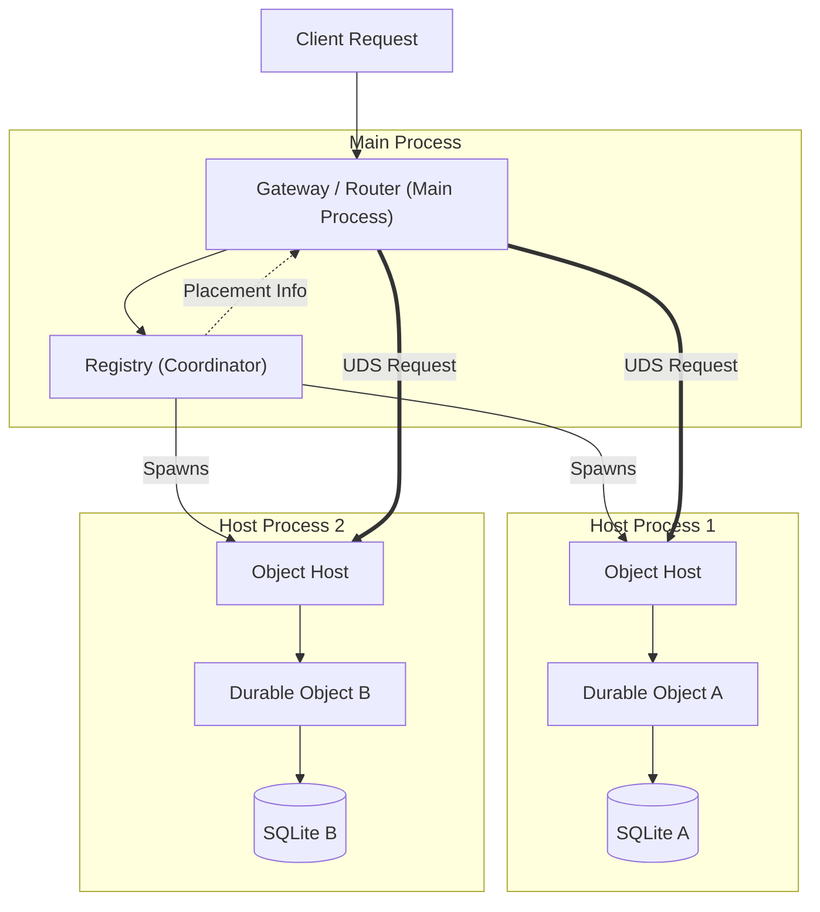
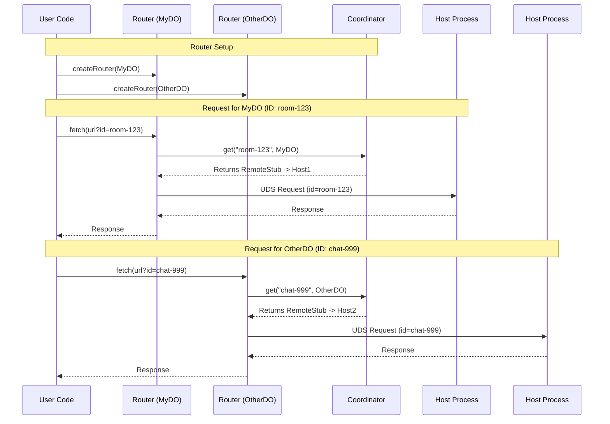

We have refactored the Open Durable Objects library to support a robust "Single Machine" process model. This architecture splits the monolithic runtime into a **Coordinator (Registry)** and a pool of **Host Processes**.

## Architecture Overview

### 1. Process Split
Instead of running everything in one process, we now have:
- **Registry**: Manages host processes and routes requests.
- **Host Processes**: Independent processes that host the actual Durable Objects.
- **UDS Transport**: Communication happens over Unix Domain Sockets for high performance and process isolation.

### Architecture Diagram



### Why Multiple Host Processes?

Even on a single machine, a multi-process architecture provides critical benefits:
1.  **Fault Isolation**: If a Durable Object causes a crash (e.g., segfault, OOM), it only kills that single Host Process. Other hosts (and the Main Process) remain alive. The Registry can restart the crashed host transparently.
2.  **Concurrency**: JavaScript is single-threaded. By running `N` host processes, you can utilize `N` CPU cores for executing Durable Object code parallel to the Gateway.
3.  **Memory Limits**: Splitting objects across multiple V8 heaps avoids hitting the memory limit of a single process.

> [!NOTE]
> **Many Objects per Host**: A single Host Process hosts **many** Durable Object instances, potentially of different classes. The Coordinator distributes thousands of DO instances across your pool of `N` hosts (sharding). The diagram above simplifies this to show just one object per host for clarity.

### Modes of Operation

1.  **Multi-Process (Standard)**: As shown above. The Registry spawns separate processes. The Router connects to them via UDS.
2.  **Local Fallback (Development)**: If `hostCount: 0`, the Registry acts as the host. It instantiates `MsSqliteStorage` and `InstanceContainer` directly in the Main Process. This creates a unified "monolith" useful for simple testing or development without managing child processes.

- `src/worker/`: Contains the Runtime code (`runtime.ts`, `storage.ts`) and the Worker Entry Point (`process.ts`).
- `src/registry.ts`: Updated to manage remote workers and placement logic.

## Usage

### Starting the Coordinator

The class is named `ClusterCoordinator`. It manages the lifecycle of the worker processes.

```typescript
import { ClusterCoordinator } from "@redwoodjs/sourdough";

// Starts the Coordinator and spawns 2 host processes
const registry = new ClusterCoordinator({
  hostCount: 2,
  storageDir: "./.storage"
});
```

### Routing Requests

You don't need to know *which* host process handles a specific object. The **Router** handles that lookup automatically.

```typescript
import { route } from "@redwoodjs/sourdough";
import { MyDO } from "./my-do.js";

// Create a specific router for the 'MyDO' class.
// The 3rd argument is an optional 'idExtractor' function.
// This defines how the ID is exposed to the outside world.
const myDoRouter = route(
  registry, 
  MyDO, 
  (req) => {
     // Example: Extract ID from URL query param (Default behavior)
     // Client calls: http://api.com/chat?room=123
     return new URL(req.url).searchParams.get("room");
  }
);

// Usage:
// The client request contains the ID. The router extracts it using your function
// and routes it to the correct host process.
const response = await myDoRouter(new Request("http://localhost/chat?room=123"));
```

### Integration with a Server

You can use the `serve` helper to run your code in a Cloudflare-compatible way. This automatically sets up the Coordinator and handles the host processes.

**Example: Using `serve()`**

```typescript
import { serve } from "@redwoodjs/sourdough";
import { ChatDO } from "./chat-do.js";
import { CounterDO } from "./counter-do.js";

export default serve({
  async fetch(req, env) {
    const url = new URL(req.url);
    
    // Use the bindings exactly like in Cloudflare
    if (url.pathname.startsWith("/chat")) {
       const id = env.CHAT.idFromName("room-1");
       return env.CHAT.get(id).fetch(req);
    }
    
    return new Response("Not Found", { status: 404 });
  }
}, {
  durableObjects: {
    CHAT: ChatDO,
    COUNTER: CounterDO
  }
});
```

Alternatively, you can manually mount routers if you prefer `Bun.serve` directly (see previous examples).

```typescript
// 1. Create routers for your different classes
const chatRouter = route(registry, ChatDO);
const counterRouter = route(registry, CounterDO);

Bun.serve({
  port: 3000,
  fetch: async (req) => {
    const url = new URL(req.url);
    
    // 2. Dispatch based on path
    if (url.pathname.startsWith("/chat")) {
      return chatRouter(req);
    }
    
    if (url.pathname.startsWith("/counter")) {
      return counterRouter(req);
    }
    
    return new Response("Not Found", { status: 404 });
  }
});
```

### Configuration Examples

**Scenario: Single Host Process for Everything**

You might want a single host process (like a standard Node.js/Bun server) handling all your Durable Objects to minimize overhead, while still keeping them separate from your HTTP gateway.

```typescript
import { serve } from "@redwoodjs/sourdough";
import { ChatDO } from "./chat.js";
import { CounterDO } from "./counter.js";

export default serve({
  async fetch(req, env) {
      // Your routing logic...
  }
}, {
  // 1. Force ONE host process.
  // ALL instances of 'ChatDO' and 'CounterDO' (even if you have millions of 'IDs')
  // will be hosted inside this ONE OS process.
  hostCount: 1, 
  
  // 2. Register multiple classes
  durableObjects: {
    CHAT: ChatDO,
    COUNTER: CounterDO
  }
});
```

## Internal Mechanics

1.  **Spawn**: The Registry spawns `host/process.ts` using `bun` or `npx tsx`.
2.  **Placement**: The Registry hashes the Object ID to select a host.
3.  **Proxy**: `registry.get()` returns a `RemoteStub` which serializes the request logic.
4.  **Transport**: The `RemoteStub` connects to the Host's UDS and sends the request.
5.  **Execution**: The Host Process receives the request, loads the class (dynamically), instantiates the object (with SQLite storage), and executes the fetch.

### Request Flow Diagram

This diagram illustrates how a request finds the correct Host Process when using multiple classes (`MyDO` vs `OtherDO`) and instances.



We verified the implementation with a new integration test `src/single-machine.test.ts` which:
1.  Starts a Registry with 1 host process.
2.  Routes a request to a `SimpleDO` fixture.
3.  Verifies the response comes back correctly from the host process.

```bash
npm test src/single-machine.test.ts
```
