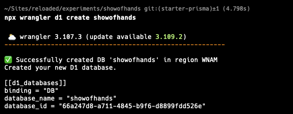
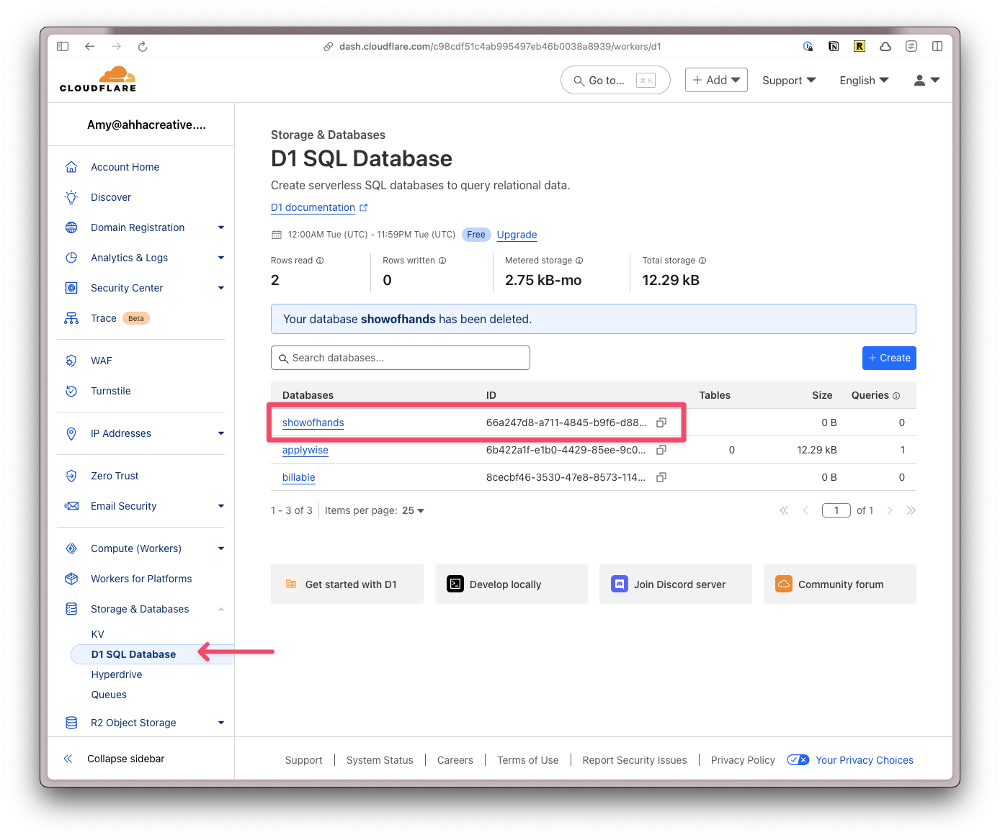

# Starter with Prisma

This starter will make it easy to start up a project with database using Prisma

If video is your thing:

https://www.loom.com/embed/019f4a52e47e4bb28dbfc1a98847e3a3?sid=3efd61df-413b-4e37-8947-1c6605c54479

Clone the repo

```shell
git clone https://github.com/redwoodjs/sdk.git
```

Run

```shell
pnpm install
```

Go into the `sdk` directory and build the project

```shell
cd sdk
pnpm build
```

Duplicate the `starters/prisma` directory.

Rename the folder and move into the `experiments` directory

Add your new project to the `pnpm-workspace.yaml` file:

```yaml
packages:
  - "sdk"
  - "experiments/billable"
  - "experiments/yt-dos"
  - "experiments/showofhands"
  - "starters/minimal"
  - "starters/prisma"
```

```shell
pnpm i
```

Change the name of your experiment’s `package.json`. For example:

```json
"name": "@redwoodjs/showofhands",
```

Update the path in this script:

```json
"__reset:reinstall": "(cd ../../ && rm -rf node_modules && rm -rf sdk/node_modules && rm -rf experiments/showofhands/node_modules && pnpm install)",
```

- [ ] Update path in starter

Within your experiment’s `wrangler.toml` file, change every instance of `__change_me__`

For example:

```toml
#:schema node_modules/wrangler/config-schema.json
name = "showofhands"
main = "src/worker.tsx"
compatibility_date = "2024-09-23"
compatibility_flags = ["nodejs_compat"]
assets = { binding = "ASSETS", directory = "public" }

workers_dev = false
routes = [
  { pattern = "showofhands.app", custom_domain = true }
]

[observability]
enabled = true

[[d1_databases]]
binding = "DB"
database_name = "showofhands"
database_id = "showofhands"

[[r2_buckets]]
bucket_name = "showofhands"
binding = "R2"

[durable_objects]
bindings = [
  { name = "SESSION_DO", class_name = "SessionDO" }
]

[[migrations]]
tag = "v1"
new_classes = [ "SessionDO" ]

[vars]
SECRET_KEY = "secret"
APP_URL="https://showofhands.app"

```

You’ll need a Cloudflare account. We’re using their d1 service to handle the database.

Now, generate a new db:

```shell
npx wrangler d1 create NAME_OF_DB
```



Copy the `database_id` and paste it into your project’s `database_id` inside `wrangler.toml`:

```toml
[[d1_databases]]
binding = "DB"
database_name = "showofhands"
database_id = "66a247d8-a711-4845-b9f6-d8899fdd526e"
```

If you ever need to find this value, you can log into your Cloudflare account



Under `prisma/schema.prisma` we started a user model:

```prisma
model User {
  id                String    @id @default(uuid())
  email             String    @unique
  authToken         String?
  authTokenExpiresAt DateTime?
  createdAt         DateTime  @default(now())
  updatedAt         DateTime? @updatedAt
}
```

You can adjust as needed.

Within the Terminal:

```shell
npx prisma generate
pnpm migrate:dev
pnpm migrate:new "initial migration"
pnpm migrate:dev
pnpm seed
```

Preview SQL lite Database within VS Code

[](https://marketplace.cursorapi.com/items?itemName=qwtel.sqlite-viewer)
